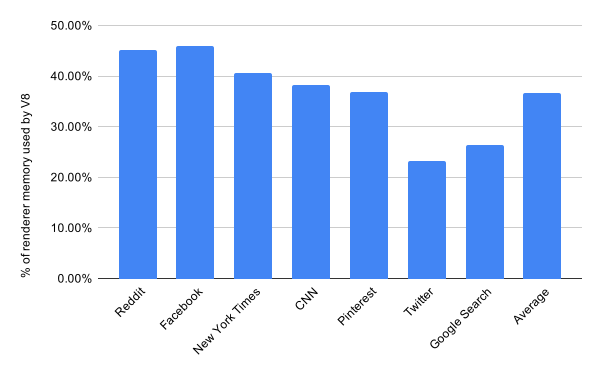
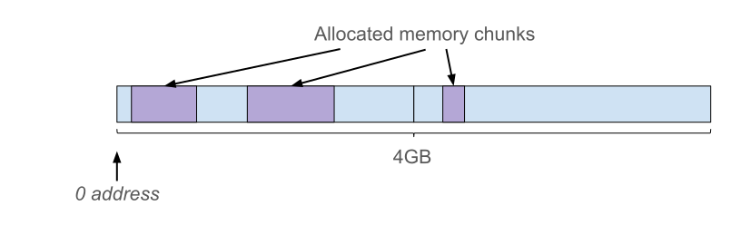
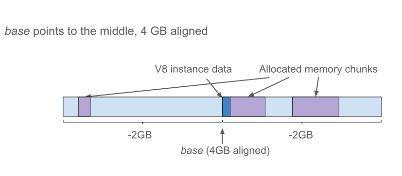
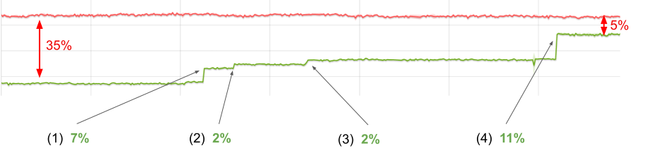
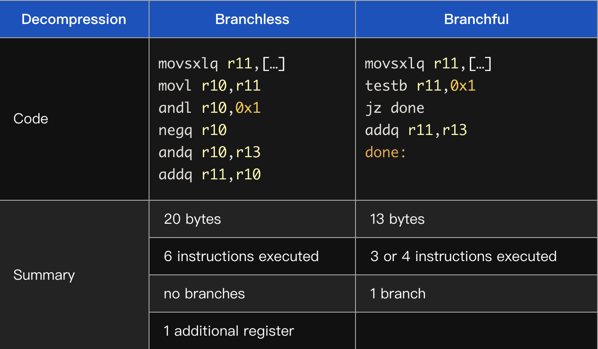
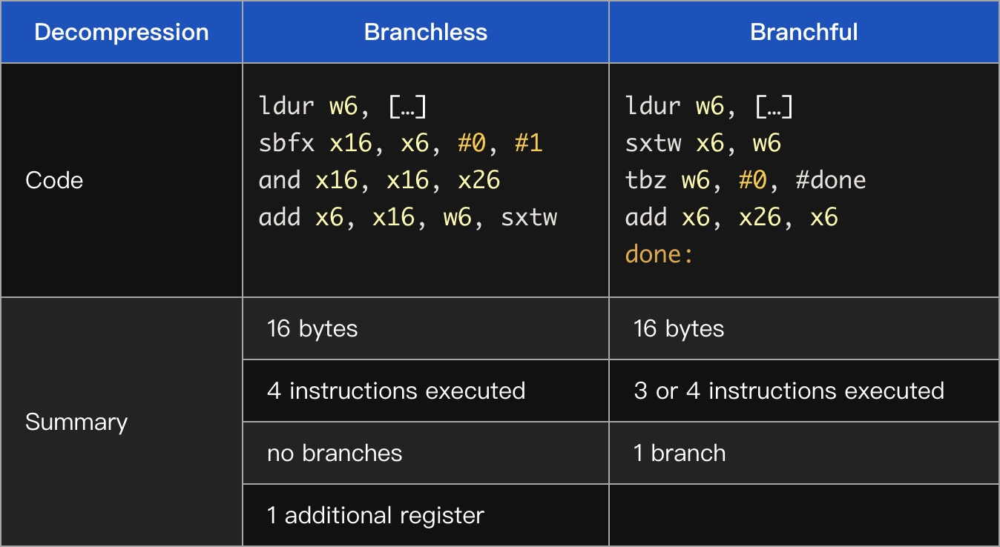
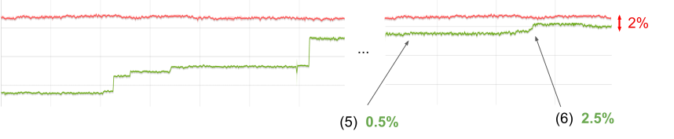
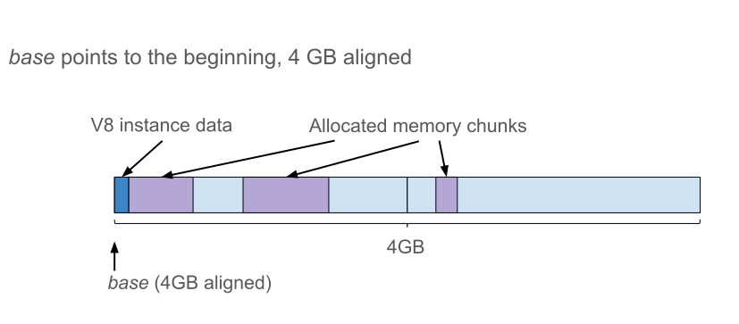
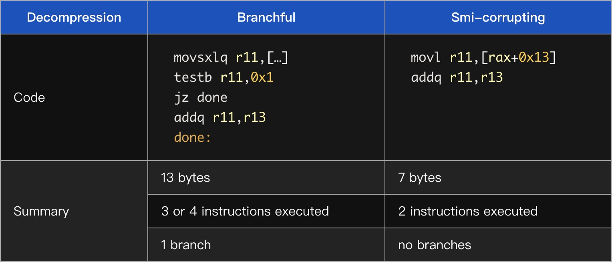
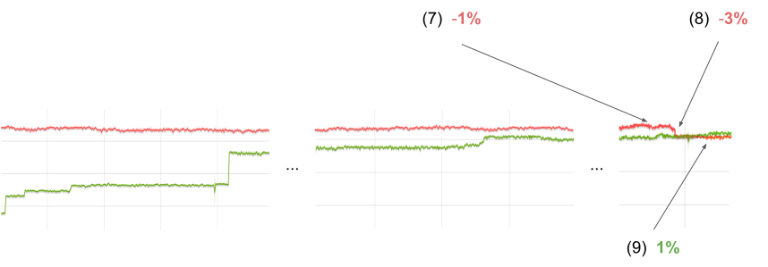

原文链接：https://v8.dev/blog/pointer-compression

内存和性能之间始终存在着斗争。作为用户，我们希望速度又快占用内存又少。不幸的是，通常情况下，提高性能需要消耗更多的内存（反之亦然）。

时间回到2014年，那时Chrome从32位切换到64位。这个变化带给了Chrome更好的[安全性、稳定性和性能](https://blog.chromium.org/2014/08/64-bits-of-awesome-64-bit-windows_26.html)，但同时也带来了更多内存的消耗，因为之前每个指针占用4个字节而现在占用是8个字节。我们面临在V8中尽可能减少这种多出来4个字节开销的挑战。


在实施改进之前，我们需要知道我们目前的状况以正确的评估如何改进。为了测量当前的内存和性能，我们使用一组可以代表目前流行站点的[页面](https://v8.dev/blog/optimizing-v8-memory)。数据显示在桌面端Chrome[渲染进程](https://www.chromium.org/developers/design-documents/multi-process-architecture)内存占用中V8贡献了60%的占用，平均为40%。



指针压缩是改进V8内存占用的多项工作之一。想法很简单：我们可以存储一些“基”地址的32位偏移量而不是存储64位指针。如此简单的想法，在V8中这种压缩可以给我们带来多少收益？

V8的堆包含大量的项目（items），例如浮点值（floating point values），字符串字符（string characters），解析器字节码（interpreter bytecode）和标记值（tagged values）。在检查堆时，我们发现在现实使用网站中，这些标记值占了V8堆的70%！

下面我们具体看看这些标记值是什么。

## V8中的标记值

在V8中JavaScript的的对象，数组，数字或者字符串都都用对象表示，分配在V8堆上。这使得我们可以用一个指向对象的指针表示任何值。

许多JavaScript程序都会对整数进行计算，例如在循环中增加索引。为了避免每次整数递增的时候重新分配一个新的number对象，V8使用著名的[指针标记技术(pointer tagging)](https://en.wikipedia.org/wiki/Tagged_pointer)在V8的堆指针中存储附加的或替代的数据。（V8 uses the well-known pointer tagging technique to store additional or alternative data in V8 heap pointers.）

标签位（tag bits）有双重作用：它用信号指示位于V8堆中的对象的强弱指针或一个小整数（they signal either strong/weak pointers to objects located in V8 heap, or a small integer）。因此，整数能够直接存储在标记值中，而需要为其分配额外的存储空间。

V8按字对齐地址将对象分配在堆上，这使得它可以使用2（或3，取决于机器字大小）最低有效位进行标记。在32位架构中，V8使用最低有效位去区分Smis和堆对象指针。堆对象指针使用第二最低有效位去区分强引用和弱引用：

```
                        |----- 32 bits -----|
Pointer:                |_____address_____w1|
Smi:                    |___int31_value____0|
```

这里的 *w* 用来区分强指针和弱指针。

*注意：*一个Smi只能携带一个31bit有效载荷（payload），包括符号位。对于指针，我们有30bit用来作为堆对象地址有效载荷（payload）。由于字对齐，分配粒度为4个字节，这给了我们4GB的寻址空间。

在64位架构中，V8的值看起来像这样：

```
            |----- 32 bits -----|----- 32 bits -----|
Pointer:    |________________address______________w1|
Smi:        |____int32_value____|0000000000000000000|
```
不同于32位架构，在64位架构中V8可以将32位用于Smi值有效载荷（payload）。以下各节将讨论32位Smis对指针压缩的影响。

## 压缩标记值（tagged values）和新的堆布局

使用指针压缩，我们的目标是以某种方式在64位架构中将两种标记值转换为32位。我们通过以下方式将指针调整位32位：

* 确保所有V8对象在4GB范围内分配
* 将指针表示位在这个范围的偏移量

这样严格的限制是非常不幸的，但是Chrome中的V8即使在64位架构上也已经将堆限制到2GB或4GB大小（具体限制到多少取决于设备）。其他V8嵌入程序，例如Node.js可能需要更大的堆。**如果我们强加最大4GB的限制，就会让那些嵌入V8的程序无法使用指针压缩。**

现在的问题是如何更新堆布局才能让32位指针唯一标识V8对象。

### 简单的堆内存布局（Trivial heap layout）

简单的压缩方案是在前4GB的地址空间分配对象。



但是很可惜V8不能这样做，因为Chrome的渲染进程可能需要在同一渲染器进程中创建多个V8的实例，例如对于Web/Service Workers。除此之外，用这个方案会导致所有的V8实例竞争相同的4GB地址空间从而导致所有的V8实例都受到4GB内存的限制。

### 堆内存布局，v1

如果我们将V8堆（heap）放在一个连续的4GB地址空间的其他地方，那么一个从base开始的无符号32位偏移量将唯一标识一个指针。（If we arrange V8’s heap in a contiguous 4-GB region of address space somewhere else, then an unsigned 32-bit offset from the base uniquely identifies the pointer.）


如果我们确保base是4GB对齐（4-GB-aligned）则所有指针的高位32bits都是相同的。

```
            |----- 32 bits -----|----- 32 bits -----|
Pointer:    |________base_______|______offset_____w1|
```

通过将Smi的有效负载（payload）限制为31位并将其放在低32位，我们还可以压缩Smis。基本上，使它类似于32位架构中的Smis。

```
         |----- 32 bits -----|----- 32 bits -----|
Smi:     |sssssssssssssssssss|____int31_value___0|
```

这里 *s* 是Smi有效负载的符号值。如果再有一个[符号扩展](https://zh.wikipedia.org/wiki/%E7%AC%A6%E5%8F%B7%E6%89%A9%E5%85%85)的表示，我们就可以仅用64位字的一位算数位移来压缩和解压Smis。

现在，我们可以看到指针和Smis的上半字（upper half-word）完全由下半字定义。这样，我们就可以在内存中仅存储下半部分，从而将存储标记值的内存减少一半。

```
                    |----- 32 bits -----|----- 32 bits -----|
Compressed pointer:                     |______offset_____w1|
Compressed Smi:                         |____int31_value___0|
```

假设base是4GB对齐的，则压缩就仅仅是截断：

```cpp
uint64_t uncompressed_tagged;
uint32_t compressed_tagged = uint32_t(uncompressed_tagged);
```

但是解压代码要复杂一些。我们需要区分符号扩展（sign-extending）Smi和零扩展（zero-extending）指针，以及是否要添加base。

```cpp
uint32_t compressed_tagged;

uint64_t uncompressed_tagged;
if (compressed_tagged & 1) {
  // pointer case
  uncompressed_tagged = base + uint64_t(compressed_tagged);
} else {
  // Smi case
  uncompressed_tagged = int64_t(compressed_tagged);
}
```

尝试改变压缩方案来简化解压代码。

### 堆内存布局，v2

如果将base放在4GB的中间而不是开头，就可以将压缩值视为从base开始的一个有符号32位偏移量。注意，整个保留不再是4GB对齐（4-GB-aligned），但是base依然是对齐的。



在这个新的布局中，压缩代码和堆内存布局v1是相同的.

然而解压代码变得更好。现在对Smi和指针来说，扩展符号是相同的，唯一的分支在于如果是指针，需要添加base。（Sign-extension is now common for both Smi and pointer cases and the only branch is on whether to add the base in the pointer case.）

```cpp
int32_t compressed_tagged;

// Common code for both pointer and Smi cases
int64_t uncompressed_tagged = int64_t(compressed_tagged);
if (uncompressed_tagged & 1) {
  // pointer case
  uncompressed_tagged += base;
}
```

代码中分支的性能取决于CPU中的[分支预测单元](https://zh.wikipedia.org/zh-cn/%E5%88%86%E6%94%AF%E9%A0%90%E6%B8%AC%E5%99%A8)。如果我们以无分支的方式执行解压，我们可以得到更好的性能。通过一个小的魔术，我们可以写出一个无分支版本的代码：

```cpp
int32_t compressed_tagged;

// Same code for both pointer and Smi cases
int64_t sign_extended_tagged = int64_t(compressed_tagged);
int64_t selector_mask = -(sign_extended_tagged & 1);
// Mask is 0 in case of Smi or all 1s in case of pointer
int64_t uncompressed_tagged =
    sign_extended_tagged + (base & selector_mask);
```

然后，我们决定从无分支实现开始。

## 性能演化

### 初始性能

我们使用[Octane](https://v8.dev/blog/retiring-octane#the-genesis-of-octane)测试性能，Octane是我们过去使用的性能基准测试。尽管我们在日常工作中不再专注于改进最高性能（improving peak performance），但我们也不希望降低最高性能，特别是一些像指针这样对性能敏感的东西（particularly for something as performance-sensitive as all pointers. ）。Octane依然是完成这个任务的好的基准测试。

图形显示了Octane在指针压缩实施时在x64架构上的得分。在图中，越高越好。红色的线是未压缩指针的x64构建，绿色的线是指针压缩的版本。



在第一个方案中，我们的回归差约为35%。

### Bump(1), +7%

首先我们通过比较无分支解压和有一个分支解压的验证了“无分支会更快”的假设。我们的假设是错误的，在x64上有分支版本的速度提高了7%。这是非常大的不同！

下面看一下x64汇编



r13是base值的专用寄存器。注意，无分支代码在这里更多且需要的寄存器也更多。

在Arm64，我们观察到相同的现象——在强大的CPU上，有分支版本明显更快（尽管这两种情况的代码大小是一样的）。



在低端Arm64设备上我们发现在任一方向上几乎没什么性能差异。

我们的收获是：在现代CPU中分支预测器非常的好，代码的大小（code size）（尤其是执行路径的长度）对性能影响更大。

### Bump(2), +2%

[TurboFan](https://v8.dev/docs/turbofan)是V8的优化编译器，围绕“Sea of Nodes”概念构建。简单来说就是每一个操作在graph中用一个Node表示（更详细的解释可以查看[这篇博客](https://v8.dev/blog/turbofan-jit)。这些节点有各种依赖，包括数据流和控制流。

有两个对指针压缩至关重要的操作：加载和存储，因为它们将V8堆内存和其余管道（pipeline）连起来。如果我们每次从堆内存加载压缩值的时候都解压，并且在存储之前对其压缩，那么管道（pipeline）就可以像在全指针模式（full-pointer mode）下工作了。因此我们在节点图中添加了新的显式操作——压缩和解压。

在某些情况下解压是不必要的，例如，如果一个压缩值仅仅是从某个位置被加载然后存储到新的位置。

为了优化不必要的操作，我们在TurboFan中实施了一个新的“消除解压”阶段。它的工作就是消除直接压缩后的解压。由于这些节点可能不会直接相连，因此它会尝试通过graph传播解压，以期遇到压缩问题并消除。这给使我们的Octane的值提高了2%。

### Bump(3), +2%

在查看生成代码时，我们注意到解压一个刚刚被加载的值会导致代码的冗长：

```cpp
movl rax, <mem>   // load
movlsxlq rax, rax // sign extend
```

Once we fixed that to sign extend the value loaded from memory directly:

```cpp
movlsxlq rax, <mem>
```

我们得到了另外2%的改善。

### Bump(4), +11%

TurboFan优化阶段通过在graph上使用模式匹配工作：一旦一个sub-garph与一个特定模式匹配，就会被替换为语义上等效（但是更好）的sub-graph或指令（instruction）。

尝试匹配不成功并不会有明确的失败提示。在graph中显式的压缩 / 解压操作的存在导致之前尝试匹配成功的不再成功，从而导致优化失败且没有提示。（The presence of explicit Decompress/Compress operations in the graph caused previously successful pattern matching attempts to no longer succeed, resulting in optimizations silently failing.）

“中断”优化的其中一个例子是[分配预配置（allocation preternuring）](https://static.googleusercontent.com/media/research.google.com/en//pubs/archive/43823.pdf)。一旦我们更新匹配模式（pattern matching）使其能够匹配到新的压缩 / 解压 node，我们就可以得到另外11%的改进。



### Bump(5), +0.5%

在TurboFan中使用解压去除（Decompression Elimination）我们学到了很多。显式的解压 / 压缩node方法具有以下特性：

优点：

* 很明显我们通过对sub-graphs的规范模式匹配可以优化不必要的解压。

但是，随着我们进一步的优化，我们发现缺点：

* 新的内部值的表示可能会导致转换操作变的难以管理。除了现有的表示集（tagged Smi, [tagged pointer](https://en.wikipedia.org/wiki/Tagged_pointer), tagged any, word8, word16, word32, float32, float64, simd128），我们还有压缩指针，压缩Smi，压缩任何值（压缩值可以是指针或Smi）。

* 现有的基于graph的模式匹配（pattern-matching）的优化并没有生效，这导致了一些地方的回退（regressions）。虽然我们找到并修复其中的问题，但TurboFan的复杂性仍在不断增加。

* 寄存器分配器（register allocator）对graph中的node数量越来越不满意，并且经常生成错误的代码。（The register allocator was increasingly unhappy about the amount of nodes in the graph, and quite often generated bad code.）

* 较大的node graph会减缓TurboFan优化阶段，并增加编译期间的内存消耗。

我们决定回退一步，考虑在TurboFan中实现一种更简单的指针压缩方式。新的方法是删除压缩指针 / Smi / 任何表示，然后让所有显式的压缩 / 解压 node 隐藏在存储和加载中，并假设我们始终在加载之前压缩，在存储之前解压。

我们还在TurboFan中添加新的阶段，该阶段将替代“解压消除（Decompression Elimination”。这个新的阶段能够识别我们什么时候实际上不需要压缩或解压并相应地更新“加载和存储”。这种方法显著降低了TurboFan中指针压缩的复杂性并且提高了生成代码的质量。

新的操作和初始时候一样有效，并且又提高了0.5%的性能。

### Bump(6), +2.5%

我们已经接近平均性能，但是依然还有差距。我们必须有更好的想法。其中一个想法是：如果我们确保任何处理Smi值的代码都不“看”高32位，结果会怎么样？

之前的解压实现：

```cpp
// Old decompression implementation
int64_t uncompressed_tagged = int64_t(compressed_tagged);
if (uncompressed_tagged & 1) {
  // pointer case
  uncompressed_tagged += base;
}
```

如果我们忽略一个Smi的高32位就可以假定它是`undefined`。然后，我们就可以避免指针和Smi之间的特殊case并且可以在解压的时候无条件的添加base，即使是对Smis也可以！我们称这个方法为“Smi-corrupting”。

```cpp
// New decompression implementation
int64_t uncompressed_tagged = base + int64_t(compressed_tagged);
```

由于我们不关注Smi的符号扩展（sign extending），因此这个改变允许我们回到堆内存布局v1。这是一个base指向4GB预留空间的开始位置。（This is the one with the base pointing to the beginning of the 4GB reservation.）



就解压代码而言，这个改变将符号扩展（sign-extension）变为零扩展（zero-extension），这也同样简单。（In terms of the decompression code, it changes a sign-extension operation to a zero-extension, which is just as cheap.）但是，这简化了运行时（C++）方面的工作。例如，例如地址空间区域保留代码（the address space region reservation code）（查看[一些细节实现](https://v8.dev/blog/pointer-compression#some-implementation-details)部分）。

这是用于比较的汇编：



因此我们更改V8中所有的Smi使用（Smi-using）代码块为新的压缩方案，这给我们另外2.5%的性能提升。

### 剩余差距（Remaining gap）

剩余的性能差距可以用对64位构建的两个优化来解释，这些优化由于与指针压缩不兼容而禁用。



#### 32-bit Smi优化(7), -1%

我们回顾一下，Smis在64位架构全指针模式中看起来是这样：

```cpp
        |----- 32 bits -----|----- 32 bits -----|
Smi:    |____int32_value____|0000000000000000000|
```

32-bit Smi有如下好处：

* 它可以有更大的整数范围且不需要封装成整数对象
* 这样的形式可以在读 / 写时直接访问32位值（such a shape provides direct access to the 32-bit value when reading/writing.）

由于使用指针压缩后会具有区分指针和Smis的bit导致在32-bit压缩指针中没有空间，所以导致该优化无法使用。如果我们在64-bit版本中禁用32-bit smis，将会看到Octane值下降1%。

#### Double field unboxing (8), -3%

这种优化尝试在某些假设下尝试直接将浮点值存储在对象的字段中。这样做的目的是减少数字对象分配的数量，这比单独用Smis减少的更多。

想象一下下面这段代码：

```js
function Point(x, y) {
  this.x = x;
  this.y = y;
}
const p = new Point(3.1, 5.3);
```

一般来说，对象p在内存中的样子如下：


关于更多存储中的隐藏类，属性和元素可以[阅读此文](https://v8.dev/blog/fast-properties)

在64位架构中，double值和指针的大小相同。所以**如果我们假设指针字段总是包含number值**，我们可以存储直接在对象字段存储它们。


如果某个字段导致假设不成立，例如执行下面这段代码：

```js
const q = new Point(2, 'ab');
```

y属性的number值必须封装存储（store boxed instead）。另外，如果某处的优化的代码依赖此假设，则该优化必须舍弃，不再被使用。进行这些“字段类型”归纳的原因是为了尽量减少通过同一构造函数创建的对象的形状数量，反过来这对于拥有稳定的性能是很必要的。