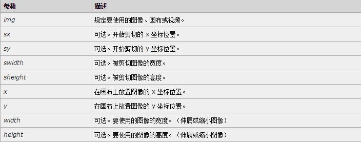

最近公司让调研关于webUploader的图片上传中能否压缩，能否实现图片的格式转换，如果能如何实现，经过调研，这个插件可以实现文件的压缩，但是不能实现图片的格式转换，同时在调研过程中，知道了很多新的东西，H5 file API，canvas，等等，所以有了自己写一个文件上传来熟悉这些东西，所以有了本篇文章。

<!--more-->

## 一.做好HTML，CSS样式
这里很简单，就是写一个HTML+CSS的文件，让我们的上传看起来像那么回事儿，这里不细说，代码如下：
### html
```html
<!DOCTYPE html>
<html lang="en">
<head>
    <meta charset="UTF-8">
    <title>fileUploader</title>
    <link rel="stylesheet" href="./index.css">
</head>
<body>
    <div class="upbox">
        <h1>测试</h1>
        <input id="uploader" type="file" multiple="multiple" name="file" accept="image/*">
    </div>    
    <a id="test" href="">点击选择上传图片</a>
    <button type="button" id="button">上传</button>
    <script src="./index.js"></script>
</body>
</html>
```
### index.css
```css
.upbox{width: 100%;height: 500px;border: 3px dashed #000;position: relative;}
#uploader{display: block;width: 100%;height: 100%;opacity: 0;position: absolute;left: 0;top: 0;cursor: pointer;}
h1{position: absolute;left: 45%;top: 40%;}
button{width: 100px;height: 50px;float: right;}
.img-content{width: 120px;height: 120px;border: 1px solid #000;margin: 20px;float: left;position: relative; z-index: 5;}
.img-box{width: 100%;height: 100%;}
.img-box img{display: block; width: 100%;height: 100%;}
```
## 二.用户多选文件并读取用户选择的文件
### 1.让input实现多文件选择
用户在点击input区域后，可以选择文件，H5支持多文件选择，只需要像下面这样写就可以：
```html
<input id="uploader" type="file" multiple="multiple" name="file" accept="image/*">
```
在上面代码中，设置multiple可以让input实现文件多选，accept则是允许用户选择什么文件，这里我们要写图片上传，所以接受所有的图片的类型，也为后文的转换上传图片的文件格式奠定基础。
### 2.利用FileReader对象读取源文件
H5的File接口提供了文件的信息以及文件内容的存取的方法。File对象是用户在input元素上选择文件后返回的FileList对象，所以，通过File对象可以获得用户选择的文件。代码如下：
```javascript
var uploader=document.querySelectorAll('#uploader')[0];
uploader.addEventListener('change',function (event) {
    var e=event||window.event;
    var target=e.target;
    var files=target.files;
});
```
这里可以获得用户选择的文件，但是因为我们要利用用户选择的源文件生成缩略图，所以需要需要读取的是用户在计算机上存储的源文件，H5提供了FileReader对象，该对象允许web应用程序异步读取存储在用户计算机上的文件（或者元素数据缓冲）内容。
#### FileReader对象提供了readAsDataURL()方法：
#### readAsDataURL()
开始读取指定的Blob对象或File对象中的内容. 当读取操作完成时,readyState属性的值会成为DONE,如果设置了onloadend事件处理程序,则调用之.同时,result属性中将包含一个data: URL格式的字符串以表示所读取文件的内容.参数file为将要读取的Blob对象或者File对象.
所以拿到用户选择的源文件的代码如下：
```javascript
var filesLen;
var uploader=document.querySelectorAll('#uploader')[0];
uploader.addEventListener('change',function (event) {
    var e=event||window.event;
    var target=e.target;
    var files=target.files;
    filesLen=files.length;
    for(let i=0;i<filesLen;i++){
        var reader=new FileReader();
        //文件读取结束后要做的事
        reader.onload=function (event) {
            //读取用户选择的文件
            var fileURL=event.target.result;
        }
        reader.readAsDataURL(files[i]);
    }
});

```
因为是读取多个文件，所以需要使用for循环去读取每一个文件（这意味着FileReader一次只读取一个文件，异步读取），这样就拿到了用户选择的图片的源文件，该源文件被读取为base64编码，这位下一步，生成缩略图做了基础。
## 三.利用canvas生成缩略图
H5的canvas提供了drawImage和toDataURL两个方法
### 1.drawImage()
drawImage()方法在画布上绘制图像，画布或视频，同时也能绘制图像的某个部分或者增加减少图像的尺寸。在javascript中有三种语法，分别如下：
#### 在画布上定位图像
```javascript
context.drawImage(img,x,y);
```
#### 在画布上定位图像并规定图像的宽度和高度
```javascript
context.drawImage(img,x,y,width,height);
```
正是这一点儿让利用canvas压缩图片成为可能（本身生成缩略图也是在更改图片大小）
#### 剪切图像并在画布上定位被剪切部分
```javascript
context.drawImage(img,sx,sy,swidth,sheight,x,y,width,height);
```
以上参数值对应如下：

### 2.toDataURL()
toDataURL()方法回传含有图像和参数设置特定格式的dataURLs，回传的图像解析度为96dpi。同样通过toDataURL()可以方便的将图片转换为base64编码，但是这里需要注意两点：

- 如果canvas的高度或者宽度为0，则回传的字符串为`data:,`。
- 如果要求图像类型并非image/png，但是回传的类型却是data:image/png，表示要求的图像类型并不支持。

表达式如下：
```javascript
canvas.toDataURL(type,encoderOptions);
```
type：图片的格式，预设为image/png
encoderOptions：生成的图片的品质，为0~1之间的数字，如果只不在该范围内，则使用默认值，其他会忽略
### 生成缩略图代码实现
基于以上两个canvas方法，可以写出生成缩略图的方法，代码如下：
```javascript
//创建缩略图样式
function createThumbnailFromUrl(context,fileURL) {
     //创建元素
     var img=document.createElement('img'),
         imgBox=document.createElement('div'),
         imgContent=document.createElement('div');
     //添加Class    
     imgBox.classList.add('img-box');
     imgContent.classList.add('img-content');
     //动态插入创建的元素 
     context.appendChild(imgContent);
     imgContent.appendChild(imgBox);
     imgBox.appendChild(img);
     
     //创建canvas重绘缩略图    
     var canvas=document.createElement('canvas');
     var context=canvas.getContext('2d'); 
     // 创建image图片对象
     var image=new Image();
     image.src=fileURL;
     image.onload=function () {
        canvas.width=120;
        canvas.height=120*(image.height/image.width);
        context.drawImage(image,0,0,canvas.width,canvas.height);
        img.src=canvas.toDataURL('image/png',0.5);  
     }  
}
```
这里，为了拿到图片对象，也就是拿到要转换的图片，我们新建一个图片对象，<font color="red">然后将图片对象的src赋值为FileReader拿到的FileURL，这样就拿到了用户选择上传的图片，这就将用户选择的文件与canvas联系起来</font>，接下来就进行处理，等图片读取完成后，进行cnavas操作，最后把生成的base64图片编码直接赋值给动态创建的缩略图img，这样就实现了用户在选择完要上传的图片后生成缩略图。
## 四.将要上传的图片利用canvas进行压缩，改变格式---遇到js中的异步执行
canvas压缩，更改图片格式的实现就是上面生成缩略图的方法，但是我在写这里的时候遇到了一个问题，就是javascript中异步执行机制。
我在javascript中写了一个函数，代码如下：
```javascript
function changeImg(fileURL) {
     //创建canvas重绘缩略图    
     var canvas=document.createElement('canvas');
     var context=canvas.getContext('2d'); 
     // 创建image对象
     var image=new Image();
     //这里把fileURL赋值给src，就可以拿到用户选择的图片，此时可以获取到图片的宽高
     image.src=fileURL;
     image.onload=function () {
        canvas.width=image.width;
        canvas.height=image.height;
        context.drawImage(image,0,0,canvas.width,canvas.height);
        newFile=canvas.toDataURL('image/png',0.5);
        //这里的return就是问题的所在
        return newFile
     }
}
```
本来我的想法是通过写一个changeImg函数，在文件读取完成后，进行图片压缩，然后再将转换后的图片利用return返回回来，然后继续操作。但是在执行的时候，发现浏览器一直报错，var newFile=changeImg(newFile)返回的是undefined的。经过询问高手，得知这里遇到了js中异步执行索带来的结果。关于js异步执行机制，我会在接下来做细致研究，并记录，现在说一下通过这个问题知道的一些东西。
### 什么时候就会出现异步执行机制
当在js中出现回调，ajax，FileReader(暂时知道这三个)的时候，就会出现异步执行机制，简单举例：
```javascript
var a;
a=ajax();//这里代表经过ajax执行后返回的值给a
console.log(a);//undefined
```
以上代码运行结果并不是ajax返回的值，而是undefined。ajax是 JavaScript和XML，这里我对异步的简单理解就是在代码执行的同时，ajax执行，可以想象，在浏览器中js代码执行的速度与通过ajax返回服务器回传的数据的速度，当ajax返回数据时，浏览器中代码早已执行完成console，所以输入的是undefined，同时这也解释了为什么ajax会存在当ajax调用成功后，再执行一个XXX。
所以在这里不能写return newFile，因为image.onload=function(){}也是异步的，我这里想到的办法就是在文件读取完成后，继续创建canvas，转换压缩图片（我感觉这个方法一点儿不好，暂时这么写）。
所以正确的代码如下：
```javascript
//input选框change事件，取得文件，创建缩略图
uploader.addEventListener('change',function (event) {
    var e=event||window.event;
    var target=e.target;
    files=target.files;
    filesLen=files.length;
    for(let i=0;i<filesLen;i++){
        var reader=new FileReader();
        //文件读取结束后要做的事
        reader.onload=function (event) {
            //读取用户选择的文件
            var fileURL=event.target.result;
            //根据读取的文件创建缩略图
            createThumbnailFromUrl(upbox,fileURL); 
            //上传前改变图片的格式
            //创建canvas重绘缩略图    
            var canvas=document.createElement('canvas');
            var context=canvas.getContext('2d'); 
            // 创建image对象
            var image=new Image();
            //这里把fileURL赋值给src，就可以拿到用户选择的图片，此时可以获取到图片的宽高
            image.src=fileURL;
            image.onload=function () {
                canvas.width=image.width/2;
                canvas.height=image.width/2*(image.height/image.width);
                context.drawImage(image,0,0,canvas.width,canvas.height);
                newURL=canvas.toDataURL('image/jpeg',0.5);
                var base=newURL.substr(23); 
                newFile=atob(base);
            } 
        }
        reader.readAsDataURL(files[i]);
        filesArray.push(newURL);
    }
},false);
```
上面的代码实现了将经过转换的图片的base64编码放入一个数组中，将这些代码传给后台。
这里有一点，本身base64可以利用javascript的window.atob()实现base64的转码，但是简单利用该函数进行转码不能转回图片，还需要blob对象中的一些东西，关于这个对象我并没有深入研究，只是知道，对于该对象的研究我会在接下来继续研究。后台可以解析base64，所以直接把base64传给后台也可以，关于base64转码的实现可以参考稀土掘金中的文章[@用Canvas技术压缩要上传的图片](http://gold.xitu.io/entry/560a726960b2ad8a22a538fc)。
## 五.利用XMLHttpRequest,FormData实现文件上传
### 1.FormData对象
利用`FormData`对象可以创建一系列键值对来模拟一个完整的表单，然后再使用XMLHttpRequest发送这个表单，这样就不用像传统的表单那样写form。所以在新建一个FormData对象：
```javascript
var data=new FormData();
```
然后就可以使用append()方法向该对象里添加字段，形成可以发送给后台的键值对。
### 2.XMLHttpRequest对象
通过XMLHttpRequest可以很容易取回URL上的数据资源，可以取回的数据不仅仅是XML，除了支持HTTP还支持file，ftp协议。
通过下列代码可以获得一个XMLHttpRequest()实例。 然后利用open()初始化请求。
```javascript
var xhr=new XMLHttpRequest();
xhr.open('post','uploader.php',true);
xhr.send(data);
```
### 3.open方法

open可以写入的参数如下：

```javascript
void open(
   DOMString method,
   DOMString url,
   optional boolean async,
   optional DOMString user,
   optional DOMString password
);
```

- method：请求所使用的HTTP方法：例如'GET'，'POST'，'PUT'，'DELETE'等，但是如果下个参数是非HTTP(S)的URL，则忽略该参数。
- url：该请求所要访问的URL
- async：一个可选的布尔值参数，默认为true,意味着是否执行异步操作，如果值为false,则send()方法不会返回任何东西，直到接受到了服务器的返回数据。如果为值为true，一个对开发者透明的通知会发送到相关的事件监听者。这个值必须是true,如果multipart 属性是true，否则将会出现一个意外。
- user：用户名,可选参数,为授权使用;默认参数为空string.
- password：密码,可选参数,为授权使用;默认参数为空string.

### 4.send()方法
发送请求. 如果该请求是异步模式(默认),该方法会立刻返回. 相反,如果请求是同步模式,则直到请求的响应完全接受以后,该方法才会返回.
## 综合以上，简单的一个上传图片代码实现如下：
```javascript
//创建缩略图样式
function createThumbnailFromUrl(context,fileURL) {
     //创建元素
     var img=document.createElement('img'),
         imgBox=document.createElement('div'),
         imgContent=document.createElement('div');
     //添加Class    
     imgBox.classList.add('img-box');
     imgContent.classList.add('img-content');
     //动态插入创建的元素 
     context.appendChild(imgContent);
     imgContent.appendChild(imgBox);
     imgBox.appendChild(img);
     //创建canvas重绘缩略图    
     var canvas=document.createElement('canvas');
     var context=canvas.getContext('2d'); 
     // 创建image对象
     var image=new Image();
     image.src=fileURL;
     image.onload=function () {
        canvas.width=120;
        canvas.height=120*(image.height/image.width);
        context.drawImage(image,0,0,canvas.width,canvas.height);
        img.src=canvas.toDataURL('image/png',0.5);  
     }  
}

window.addEventListener('load',function () {
    var uploader=document.querySelectorAll('#uploader')[0];
    var button=document.querySelectorAll('#button')[0];
    var upbox=document.querySelectorAll('.upbox')[0];
    var files,filesLen,newFileURL,newFile;
    var filesArray=[],newURL;
    var test=document.querySelectorAll('#test')[0];
    //input选框change事件，取得文件，创建缩略图
    uploader.addEventListener('change',function (event) {
        var e=event||window.event;
        var target=e.target;
        files=target.files;
        filesLen=files.length;
        for(let i=0;i<filesLen;i++){
            var reader=new FileReader();
            //文件读取结束后要做的事
            reader.onload=function (event) {
                //读取用户选择的文件
                var fileURL=event.target.result;
                //根据读取的文件创建缩略图
                createThumbnailFromUrl(upbox,fileURL);
                //上传前改变图片的格式
                //创建canvas重绘缩略图    
                var canvas=document.createElement('canvas');
                var context=canvas.getContext('2d'); 
                // 创建image对象
                var image=new Image();//这里把fileURL赋值给src，就可以拿到用户选择的图片，此时可以获取到图片的宽高
                image.src=fileURL;
                image.onload=function () {
                    canvas.width=image.width/2;
                    canvas.height=image.width/2*(image.height/image.width);
                    context.drawImage(image,0,0,canvas.width,canvas.height);
                    newURL=canvas.toDataURL('image/jpeg',0.5);
                    var base=newURL.substr(23); 
                    newFile=atob(base);
                } 
            }
            reader.readAsDataURL(files[i]);
            filesArray.push(newURL);
        }
    },false);
    //button按钮点击上传
    button.addEventListener('click',function () {
        if(filesLen.length!=0){
            var data=new FormData();
            var i=0;
            //将所有的经过转码后的base64组成的数组传给后台
            while(i<filesLen){
                data.append('file'+i,filesArray[i]);
                i++;
            }
            var xhr = new XMLHttpRequest();
            xhr.open('post','uploader.php',true);
            xhr.onreadystatechange=function () {
                if(xhr.readyState==4){
                    console.log(xhr.responseText);
                }
            };
            xhr.send(data);
        }
    })
},false);
```