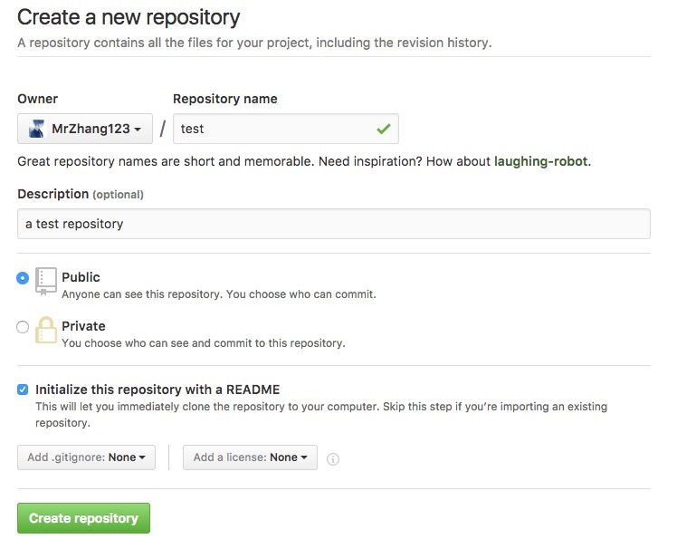

> 好长时间不写东西了， 因为换了工作，所以在忙着熟悉公司的项目代码，所以没什么时间搞自己的东西，回想了一下，在计划中要总结一下关于如何使用终端的git连接github，所以写一下这个。

<!--more-->

## 创建github仓库

在注册了账号后登陆点击头像旁边的+选择New repository创建一个个人的仓库。填写仓库名称，如图所示：



## 安装git客户端

如果是windows，建议安装[gitbash](https://git-for-windows.github.io/)

如果是mac，先安装[Homebrew](http://brew.sh/index_zh-cn.html)，然后再使用homebrew安装git。

```shell
$ brew install git 
```

如果是linux直接在终端使用`apt-get`安装：

```shell
sudo apt-get install git
```

## 配置git

### 1.初始化git

一般我们是要将自己的本地项目上传到github，实现开源共享，那么就首先需要让git知道它需要跟踪这个项目，所以，我们首先在终端进入项目，初始化git(以mac为例，假设项目在桌面)：

```shell
//进入项目

$ cd Desktop/myproject

//初始化git

$ git init
```

#### 2.创建ssh key

为了让github能够识别是我们自己上传文件，需要创建ssh key

```shell
$ ssh-keygen -t rsa -C "your_email@youremail.com"
```

这里的**your_email@youremail.com**是你的**邮箱地址**，在输入后会询问你是否保存创建的ssh key，点回车就好，然后要求输入你要设置的密码，如果直接回车表示不设密码。然后会提示你ssh key已经创建好。

#### 3.将ssh可以写入github

创建好本地的ssh key后，我们需要让github知道这个ssh key是我们自己，所以需要将生成的ssh key复制出来，写入github，在mac下在终端输入

```shell 
cat ~/.ssh/id_rsa.pub
```

此时在终端会显示出刚刚创建好的ssh key，复制出来，在github在点击头像，然后点击setting，在找到SSH and GPG keys，创建一个new ssh key，然后将刚刚复制的ssh key填入即可。

#### 4.验证是否连接成功

在终端输入

```shell
$ ssh -T git@github.com
```

如果回车看到：**You’ve successfully authenticated, but GitHub does not provide shell access** 。表示已成功连上github。

#### 5.设置username和email

在把本项目上传到github之前还需要分别输入设置username和email，因为github每次commit都会记录他们。所以分别输入如下命令：

```shell
$ git config --global user.name "your name"
$ git config --global user.email "your_email@youremail.com"
```

#### 6.添加远程地址

在与github连接成功后，如何才能让相应的项目上传到对应的仓库呢？这里就需要添加远程地址，从而让我们的本地项目顺利到达对应的仓库。

打开终端，输入

```shell
$ git remote add origin git@github.com:yourName/yourRepo.git
```

后面的yourName和yourRepo分别是你的github的用户名和刚才新建的仓库名。

## 上传项目

进入项目，在终端运行

```shell
$ git status
```
查看要上传的文件是否正确，然后将项目下的所有文件添加到git跟踪范围。

```shell
$ git add .
```
记录此次提交并上传

```shell
$ git commit -m 'my project push'
$ git push origin master
```

这里的**master**指的是主分支名，如果是其他分支，则填写相应的分支名。

这样我们就将我们的项目上传到github仓库。

