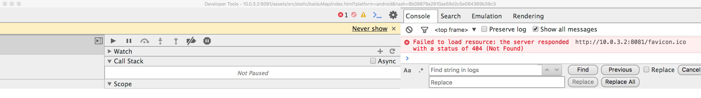

> React Native Version:0.51

RN 在 0.37 版本中加入了`WebView`功能，所以想要在使用`WebView`,版本必须>=0.37，发送的 message 只能是字符串，所以需要将其他格式的数据转换成字符串，在接收到后再转换回去，其实直接用`JSON.stringify`和`JSON.parse`就可以

<!--more-->

## 加载 html

`source`属性用于指定加载的 html，可以加载在线的页面，也可以加载本地的页面，代码如下：

```js
// 加载线上页面
<Webview
	source={{uri: 'http://www.mi.com'}}
/>
// 加载本地html文件
<WebView
	source={require('../src/html/index.html')}
/>
```

#### 注意 ⚠️

在 RN 中可以加载 WebView，但是**无法调试，也不能使用 alert 来验证代码 js 代码是否运行成功**，只能通过往 html 写入东西（innerHTML）来验证 js 是否运行成功

## WebView 与 html 的通信

#### webview 发送信息到 html

WebView 给 html 发送信息需要使用`postMessage`，而 html 接收 RN 发过来的信息需要监听`message`事件，代码如下：

```js
// RN
class WebViewExample extends Component {
  onLoadEnd = () => {
    this.refs.webview.postMessage = 'this is RN msg'
  }
  render() {
    return (
      <WebView
        ref="webview"
        source={require('../html/index.html')}
        onLoadEnd={this.onLoadEnd}
      />
    )
  }
}
export default WebViewExample
// web
window.document.addEventListener('message', function(e) {
  const message = e.data
})
```

**这里需要注意一点**

`postMessage`需要在 webview 加载完成之后再去 post，如果放在`commponentWillMount`里由于页面没有加载完成就 post 信息，会导致 html 端无法监听到 message 事件。

#### html 发送信息到 webview

```js
// RN
class WebViewExample extends Component {
  handleMessage = e => {
    const message = e.nativeEvent.data
  }
  render() {
    return (
      <WebView
        ref="webview"
        source={require('../html/index.html')}
        onMessage={e => this.handleMessage(e)}
      />
    )
  }
}
export default WebViewExample

// web
window.postMessage('this is html msg')
```

## debug

RN 中 debug webview 和安卓开发中看起来是差不多的，连接好设备后，在 chrome 中输入

```sh
chrome://inspect
```

就可以看到安卓设备上正在运行的 webview 了，点击**inspect**就会开启一个调试页面，就可以进行 debug 了，RN 似乎默认开启了 debug 调试，直接就可以看到 webview 中输出的信息。


但是我发现我打开的调试界面是一个错乱的界面，不知道为什么，无奈--！



### 注意 ⚠️

这里需要注意一点的，由于安卓版本的差异，所以内部的 webview 对 js 的支持程度也不同，**为了保证兼容性，如果使用了 ES6，请转成 ES5，否则会报错**

