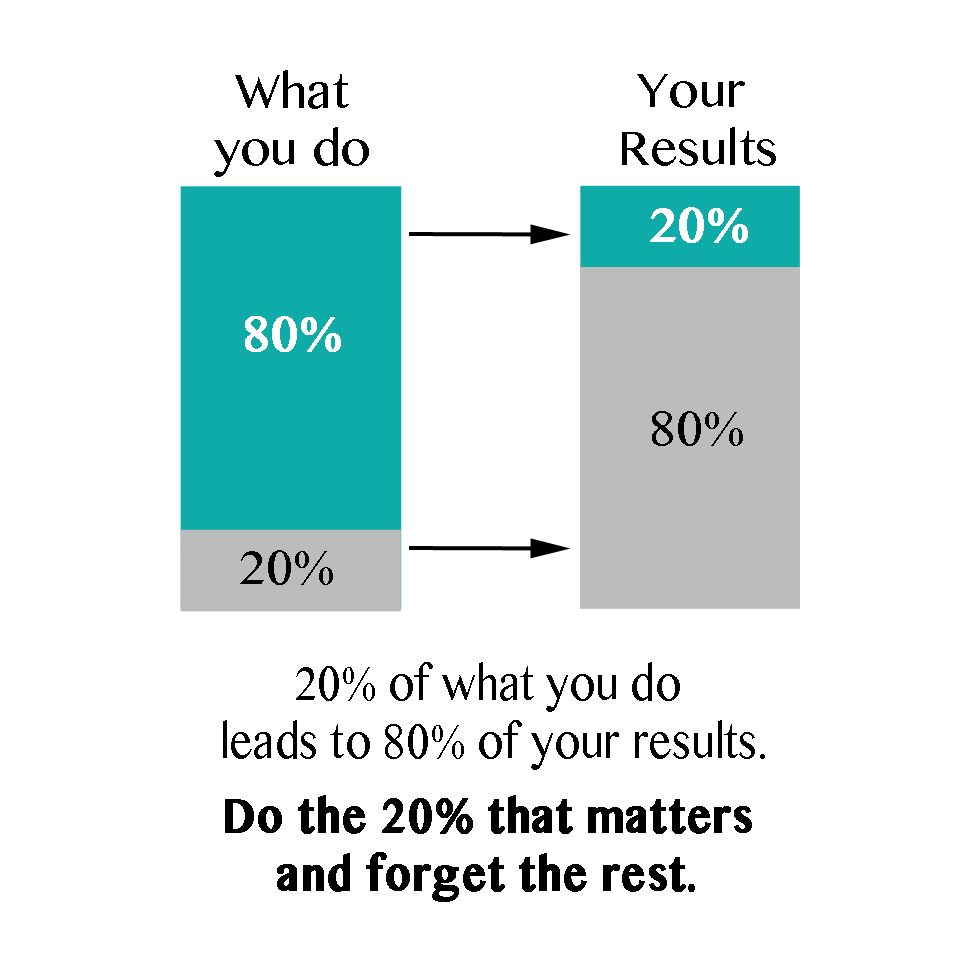
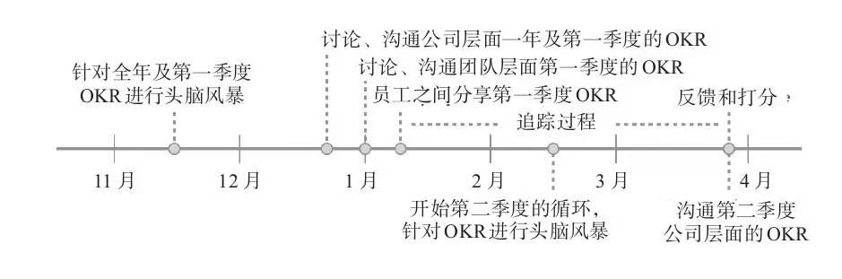

```
尽管很多人都很努力地工作，但是他们却没能取得什么成就感。
                                                ----安迪·格鲁夫
```

第一次听说OKR是一年前刚来新公司要定制试用期目标，那时候也没有太在意OKR是什么，只是觉得就是绩效，跟KPI一样。直到后来转正，每隔一段时间都要定制自己的OKR，同时在吴军老师的书[《见识》](https://book.douban.com/subject/30144978/)中也提到关于OKR的使用，如何用OKR管理自己的时间等等。这时候开始觉得有必要了解一下OKR到底是什么，该如何写，如何用OKR帮助自己管理工作 / 生活中的时间。本文是在阅读了[《这就是OKR》](https://book.douban.com/subject/30396635/)之后的一些总结以及自己对OKR的理解。
<!--more-->
OKR全称**Objectives and Key Results**即目标与关键成果法，是一套定义和追踪目标及其结果的框架，由英特尔公司的前CEO安迪·格鲁夫发明，旨在明确公司和团队**最重要**的“目标”（Objectives）以及达成每个目标的可衡量的“关键结果”（Key Results）。OKR可以在整个组织中共享，这样各个团队可以明确自身的目标，集中精力完成。

OKR的四大利器

* 优先事项的聚焦和承诺
* 团队工作的协同和联系
* 持续追踪，改进
* 充分延展进而挑战不可能

## 优先事项的聚焦和承诺

大部分成功人士超越常人的地方不在于智力，而在于时间管理。**查理·芒格说：这辈子我遇见的所有成功人士，没有一个是不读书的，没有，一个都没有！**沃伦·巴菲特也将自己大量的时间花费在读书上面。提起读书，很多人都会说自己很忙，没时间。但是谁又能比巴菲特需要做的事情多呢？为什么巴菲特有那么多时间去阅读？这就要提到巴菲特对事情优先级冷酷的排序。

按照优先级列出你想做的那些事情，然后取前20%，然后集中精力去完成。为什么是20%呢？这里要提到一个基本事实：

>*20%的优先级任务会占据我们结果的80%，即[二八法则](https://zh.wikipedia.org/zh-sg/%E5%B8%95%E7%B4%AF%E6%89%98%E6%B3%95%E5%88%99)*



**集中精力，聚焦优先事项，少即是多**，这是OKR的核心要点之一。短时间内做太多的事情注定会以痛苦收尾。

衡量一件事情的重要性时，应该先考虑这样的问题：**在接下来的周期里（一般是3个月或6个月或12个月），什么事情最重要？**将重要的事情列到清单，这就是我们的Objectives（目标）。**每个周期最多定制3到5个目标，就能帮助公司、团队和个人明确什么是最重要的。**

关键性结果是实现目标过程的一个个节点。如果目标设定较为科学的话，通常**3到5个关键结果**足以确保目标的达成。太多的目标会淡化焦点，对于预期的进展形成阻碍。**关键结果应该是明确的、具体的、可衡量的**，完成了所有关键结果的也就实现了目标，如果完成了所有关键结果而没实现目标，那就不是OKR了。

**双线并行**是目标设定的最佳方式，既有短期的OKR来支持年度OKR的实现，也有长期的战略规划。尽管推动实际工作的是短期目标，但是年度计划需要依据实际情况指定，并确保这一计划可以实施。

## 团队工作的协同和联系

OKR充分发挥员工的主动性，鼓励**目标自下而上**的涌现，同时为了适应企业和员工双方需求的波动，领导者对自上而下和自下而上这两种目标设定的选择往往各占一半。这使得全公司整体目标更加一致，除此之外还有更深层的含义，即始终保持员工的目标与公司的核心价值一致。也就是说，**员工目标必须对公司的核心价值作出实质性的贡献。**

## 持续追踪，改进

在定制OKR的过程中，为了促进沟通，管理者可以向员工提出以下问题：

* 你打算把精力集中在哪些OKR上，以便为你的角色、团队或公司发挥最大的价值？
* 这些OKR中，哪些指标与组织中的关键计划保持一致？
* 你的OKR进展如何？
* 你需要什么样的关键能力来获得成功？
* 是不是有一些因素阻碍你实现目标？
* 考虑到优先级的变化，需要调整、增加或删除哪些OKR？

OKR在定制之后并不是一成不变的，要定期检查（一般是每周检查一次），不断调整，为了达到最好的效果，员工和管理者每个周期都要对OKR进行几次详细的检查，包括报告进展情况、识别障碍、改进关键结果等。当一个关键结果或者目标变得过时或不切实际时，应该从OKR列表中删除它，然后继续前进。记住：目标是为目的服务的，而不是为其他事项服务的。

每个周期结束之后，要对OKR进行评分，评分计量标准如下：

* 0.7 ～ 1.0分 = 绿色（目标完成）
* 0.4 ～ 0.6分 = 黄色（目标取得了进展，但是没有完成）
* 0 ～ 0.3分 = 红色（目标失败）

评分之后要对OKR进行反思。OKR是以行动为导向的，但是如果只是一直努力完成而没有停下来反思，这就跟在“仓鼠轮”中的仓鼠一样。要想用OKR达到满意的效果，关键在于定制出目标，努力实现大部分，在适当的时候停下来对取得结果进行反思，并不断改进，一直重复这个过程。

当一个OKR结束之后，我们应该反思：

* 我是否完成了所有目标？
  * 如果是，是什么促使我成功？
  * 如果没有，我遇到了什么阻碍？
* 如果我要重新写一个完整的目标，我要作出什么改变？
* 我学到了哪些经验，可以帮助我更有效的定制下一个周期的OKR？

## 充分延展进而挑战不可能

目标设定越具有挑战性，所产生的结果越好。虽然高难度的目标预期产出与结果之间的差距会大于低难度目标与其产出结果之间的差距，但是前者达到的最终结果往往要比后者好。就像拉里佩奇说的：“当你设定的是一个疯狂而富有挑战性的目标时，即使没有实现它，你也会取得一些不小的成就。假如你的目标是去一颗恒星，也许你永远无法达到，但是在这个过程中，你可能已经飞到了月球。”

我们可以在设定OKR时，可以设定两类：

* 承诺型OKR
* 愿景型OKR

承诺型OKR也就是一定可以完成的目标，是能够通过调整工作时间和资源配置确保其得以实现的目标，这类OKR得分应该是1.0。如果小于1.0，就需要想想为什么没有完成，因为这表明团队在定制计划或执行的过程中存在某种失误。

愿景型OKR表达我们对变化的预期，我们可能并不清楚如何实现以及实现这一OKR所必须的资源，愿景型OKR的平均得分是0.7分。

## 设计有效OKR的基本准则

在OKR的定制过程中应该注意以下几个基本准则：

* 首先目标是“什么”
  * 明确目标和意图。
  * 有进取心但要认清现实。
  * 目标必须是有形的、客观的、明确的。
  * 目标的成功实现，必须为公司带来明确的价值。
* 其次，关键的结果意味着“怎么做”
  * 设置可衡量的里程碑事件，如果得以实现，将以一种高效的方式推进目标。
  * 一定要描述结果，而不是行为（活动）。如果OKR中包含有诸如“咨询”、“帮助”、“分析”或“参与”等词汇，这类描述是指行为（活动）。
  * 必须包含完整的证据。这些证据必须是可用的、可信的和易观察的。例如，证据应当包括：变更列表、文档链接、注释和发布的测试报告等。

## OKR（目标管理方法）与KPI（关键绩效指标）的区别

OKR是目标管理方法，而不仅仅是绩效管理方法。和OKR相比，KPI更注重绩效结果考核，更关心绩效与考核的结果与薪酬的结合。而OKR有很大的不同，OKR有助于确保公司上下一齐聚焦解决重要的难题。

## 我的OKR表格


## OKR制定流程例子




## OKR例子


