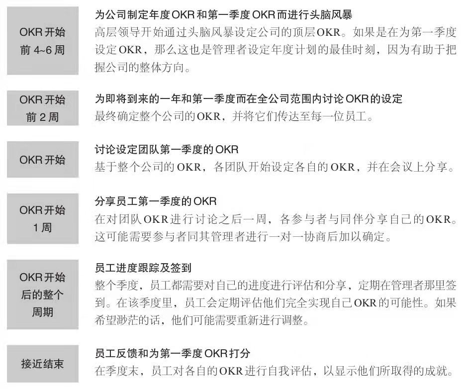
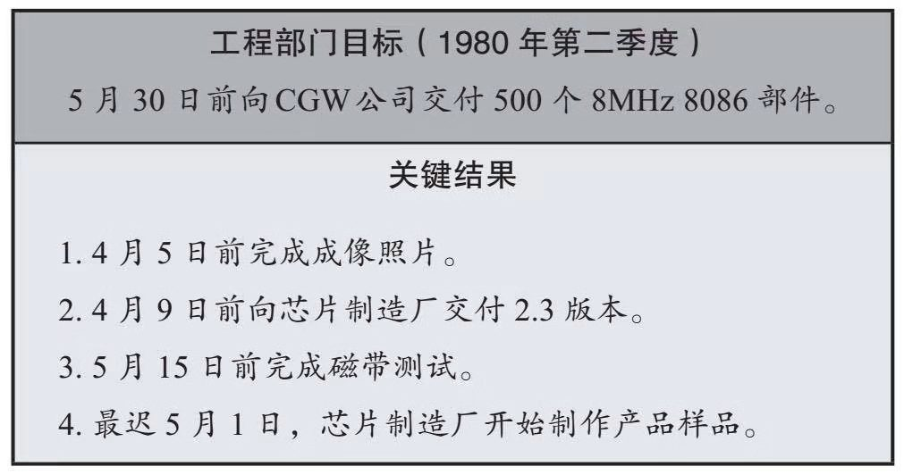

```
尽管很多人都很努力地工作，但是他们却没能取得什么成就感。                
                                          ----安迪 格鲁夫
```
<!--more-->
### 第一部分

* 有效的关键结果应该是具体的，有时限的且具有挑战性的，但又必须是能够实现的。最重要的是，它们必须是可衡量、可验证的。
* OKR体现的是公司最主要的目标，能引导员工共同努力和协作，将不同的业务联系在一起，为整个组织提供明确的目标和凝聚力
* 目标就像是“一种需要谨慎使用和严密监管的处方药。”作者甚至还提出这样的警告：“由于聚焦过度，出现不道德行为、冒险行为增多，以及合作意愿和工作积极性下降等原因，目标会在组织内引发系统性问题”。
* 埃德温 洛克指出：首先，“困难目标”往往比简单目标更能有效提升绩效；其次，具体的、困难的目标往往比含糊其次的目标“带来更高的产出”。
* 实验证明，明确的、具有挑战性的目标确实能够提升生产效率。
* 管理和领导力咨询公司德勤的一项调查结果显示：“留住员工和提升员工敬业度是公司领导者第二关心的问题，其重要性仅次于如何迎接构建全球领导力的挑战”
* 如果目标的优先级有冲突、不明确、毫无意义或被随意改变，那么员工就会变得沮丧、愤世嫉俗，并失去动力
* 在过去连续75个季度中，谷歌公司都是这么做的。11月和12月，各个团队和产品部门都会分别制定未来一年的计划，并将其凝练为OKR。次年1月，正如首席执行官桑达尔 皮查伊 告诉我的那样：“我们将回过头来反思，并在公司层面明确这就是我们的最高战略，下面则是我们为今年制定的OKR。”按照公司传统，高管团队还会对公司OKR进行评分，进而明确找到那些没有达标的地方
* OKR的几大利器：
    1. 对优先事项的聚焦和承诺
    2. 团队工作的协同和联系
    3. 责任追踪
    4. 充分延展进而挑战不可能
    5. 持续改进
    6. 文化的重要性

### 第二部分

* 当这些企业**把注意力集中到少数几件优先事项上时**，取得的结果也相当令人震撼
* OKR总在提醒团队需要做些什么，明白无误地告诉我们做到了什么，没做什么
* 格鲁夫明确地**知道自己想要什么，以及如何实现**。从这个意义上说，他有点儿像行走的OKR
* 解决管理问题的最好方法就是“以创造性思维去面对问题”——坦诚、直接、不带歉意地面对他人
* 健康的OKR文化的本质是绝对诚实、摒弃个人利益和忠于团队，**健康的OKR包括以下几点（OKR的几个标准）**
    * **少即是多。**每个周期最多只需制定3到5个OKR，就能够帮助公司、团队和个人明确什么是最重要的。一般而言，每个目标都应该与5个或更少的关键结果对应**
    * **自下而上设定目标。**为了促进员工参与，应该鼓励团队和个人与管理人员进行协商。通过这种方式制定的OKR，应该占到各自OKR的一半左右。如果所有目标都是自上而下制定的，那么员工的工作动机就会受挫
    * **共同参与。**OKR旨在通过协作确定优先事项，并规定如何衡量进展情况。即使在公司目标已经确定的情况下，关键结果仍然是可以商讨和调整的。集体达成一致，对最大限度实现目标来讲至关重要
    * **保持灵活性。**如果大环境发生了变化，既定目标看起来不切实际或难以实现，则可以在执行期间修改甚至放弃某些关键性结果
    * **敢于失败。**格鲁夫写到：“如果每个人都把目标定得比自己轻而易举就能完成的目标高一些，那么结果往往会更好。如果你想要自己和下属都有最佳表现，那么这样的目标制定方式是非常重要的。”某些操作性目标必须要全部实现，但激励性OKR会让人倍感压力，甚至让人觉得可能无法实现。格鲁夫将这种目标称为：“挑战性目标”，它能将组织推向新的高度
    * **OKR是工具，而非武器。**OKR系统“就好比给你一块秒表，让你随时诊断自己的表现。它不是一份基于绩效评估的法律文本”。为了鼓励员工承担风险，防止消极参与，最好将OKR和奖金分离开来
    * **耐心、坚定。**每个过程都需要反复试验。格鲁夫告诉iOPDE的学员，英特尔公司在采用OKR之后“翻了很多错误”：“我们并没有完全理解OKR的主要目的，但是随着时间的推移，我们将它运用的越来越好。”

### 第三部分

* 对于低层级员工来说，他们的OKR就是他们的全部工作产出，但经理们会有额外的日常管理责任
* 英特尔公司删除制定战略，并将其转化为可实现、可写作的项目
* 能够激励员工，并让他们充满热情，但他们却不知道该怎么做，这是很糟糕的
* 员工可以表达自己的观点而不担心会遭受惩罚，这种想法和文化至关重要

### 第四部分

* 衡量一件事情的重要性时，应该先考虑这样的问题：在接下来的3个月（6个月或12个月）里，什么事最重要的事？**成功的组织聚焦于少数能产生实质性差异的举措，并推迟那些不怎么紧迫的事项**
* 虽然消减目标清单总是富有挑战性，但却是值得的。正如经验丰富的领导者会告诉你：**没有一个人或公司可以“做所有的事情”**
* 领导者必须说清楚为什么做某件事，以及怎样做。员工不仅仅需要通过里程碑式的成功来获取动力，他们还渴望理解辛勤工作的意义，同时了解自己的目标与公司使命之间的关联。这一过程不能只是在全体员工季度会议上宣布OKR之后就结束。正如领英公司首席执行官杰夫 韦纳喜欢说饿的：“当你不厌其烦地多次强调的时候，团队成员可能菜真正开始听你话”
* 关键性结果是拉动目标实现的杠杆和实现目标过程的一个个节点。如果目标设定较为科学的话，通常有**3到5个关键结果**足以确保目标的达成。如果目标太多，常常会淡化焦点，对于预期的进展形成阻碍。此外，每个关键结果对于个人来说应该是一项挑战。如果你有足够的信心做好这件事，那么你所设立的目标就不够宏大
* 双线并行可能是目标设定的最佳方式，既有短期的OKR来支持年度OKR的实现，也有长期的战略规划。请牢记，尽管能够推动实际工作的是短期目标，但是年度计划需要依据实际情况来制定，并确保这一计划是可以实施的
* 请记住，在OKR周期的任何时间点，都可以修改甚至完全抛弃之前的设定
* 目标设定也有一些基本规则：**关键结果应该是明确的、具体的、可衡量的，产出和投入的组合（匹配）对其有所帮助。最后，完成所有关键结果的关键和前提是实现目标。如果目标没有实现，那就不是OKR了**
* 大多数情况下，季度OKR的理想数往往介于3到5个之间。太多的目标可能会模糊我们对重要事物的关注，或者使我们分心去追逐下一个更为闪亮的东西
* OKR系统应该为企业提供最卓越的东西，即“聚焦”。只有当我们将目标的数量保持在很小时，才会真正聚焦于此。每次作出承诺时，都会丧失投身其他事项的机会。当然，这是任何有限资源分配中都不可避免的结果。因此，做计划的人必须要有勇气、诚实且遵守纪律。只有这样，才能放弃某个项目的同时启动新的项目。摇头说“不”和微笑着说“行”一样重要。**我们必须意识到关注所有事项和意见都不关注的结果是一样的，并且能够践行这个原则**
* OKR既不是一个什么都要完成的愿望清单，也不是团队日常任务的总和。它们是一系列精心策划的目标，值得特别关注，并将推动人们在此时此地努力前行。同时，它与我们期望实现的更大目标相关联

### 第五部分

* 对于选择正确的目标来说，聚焦是至关重要的，这对区分OKR的优劣也是至关重要的
* 在我看来，你一次只能做好一件大事，所以你最好知道那件大事到底是什么
* 总体来说，OKR还是很简单的，但是人们一般不会立刻就掌握这种方法。早些时候，我们公司的目标总是无法完成，原因就在于目标定的太过宏大。以我们的能力最多只能达成两个目标，可我们设定了七八个

### 第六部分

* 除了聚焦之外，承诺也是OKR第一利器中的核心元素。在实施OKR时，管理者必须公开对其目标作出的承诺，并一以贯之。
* 我从为跑马拉松而设定的OKR中认识到，短时间内做太多的事情，注定会以痛苦收尾

### 第七部分

* 研究表明，与保持隐秘相比，组织中公开的目标往往更容易实现，而只需简单的按下“开放”按钮，就可以全面提升目标达成的可能性
* 在现实中，过度的目标协同也可能会在组织中产生强迫性，进而给组织成员带来精神上的伤害，为了避免这种现象的出现，健康的组织往往会鼓励某些目标自下而上的涌现
* 理想的OKR系统往往允许员工自主设置部分目标及大部分或者全部的关键结果。OKR能引导组织成员向更高、更远的范围拓展，设定更宏伟的目标并为之付出，以遍实现更多：**“目标越高，绩效越高”。知道要去哪里的人，往往会更加清晰如何到达目的地**
* 为了适应企业和员工双方的需求波动，领导者对自上而下和自下而上这两种目标设定的选择往往各占一半。在我看来，这是正确的选择

### 第八部分

* 除了使公司内部目标更加一致之外，协同还包含着更深层的含义，那就是始终保持你的目标相对于“北极星”（公司最重要的核心价值）的真实性和正确性。也就是说，你的目标必须对公司的核心价值作出实质性的贡献

### 第九部分

* 领导者不能只关注团队成员的日常工作，更应该把精力集中在更有价值、更长远的计划上
* 在我所在的部门，每一个员工每季度都有3到5个团队层面的业务目标，同时还有一两个个人业务目标
* 当对一个新项目进行讨论时，他们会相互询问该如何使用OKR模版来评价这个项目，如果项目没有得到积极的评价，他们马上会对这个项目亮起“红旗”，并会问一个问题：“我们为什么要做这个项目？”
* 研究表明，当一线员工能看到他们的工作如何和公司的目标保持一致时，他们就能发挥能动性

### 第十部分

* OKR系统有一个优点常常被低估，这就是它的可追踪性，这一特性使得我们可以**根据实际情况对OKR系统不断进行修改**
* 研究表明，取得可量化的进步相比公众的认可、金钱刺激或实现目标本身，对人更有驱动力
* **OKR系统不需要进行每日跟踪，但是需要定期检查——最好是每周一次，这是防止绩效下滑的必要措施**
* 当你跟踪你的OKR以获得持续的反馈时，你在目标管理方面就不会出现时好时坏的结果，也不回经常出现一些令人惊奇的事
* 当一个关键结果或目标变得过时或不切实际时，就要当机立断地结束它。没必要顽固的坚持一个过时的预测——从你的列表中删除它，然后继续前进。目标是为目的服务的，而不是为其他事项服务的
* **为了达到最好的效果，下属和管理者每个季度都要对OKR进行几次详细的检查，包括报告进展情况、识别障碍、改进关键结果等**
* OKR不会因工作完成而过期。在任何数据驱动的系统中，事后的评估和分析都可以挖掘出巨大的价值。不管是一对一的沟通还是团队会议，这些总结都包括三个部分：客观评估，主观自我评估和反思
* OKR评分计量标准：
    * **0.7~1.0分 = 绿色（目标完成）**
    * **0.4～0.6分 = 黄色（目标取得了进展，但是没有完成）**
    * **0～0.3分 = 红色（目标失败）**
* **OKR之反思**
    * **OKR是以行动为导向的，但是，如果只是不懈努力而没有停下来反思，这跟永远不停止的“仓鼠轮”没什么区别。在我看来，若想达到令人满意的结果，关键是制定出野心勃勃的目标，并努力实现大部分目标，在适当的时候要停下来对取得的成就进行反思，并不断地重复这个过程**
    * **要有意识的去总结、提炼、和阐明关键的经验教训**
* **以下是OKR结束时的反思：**
    * **我是否完成了所有的目标？如果是，是什么促使我成功？**
    * **如果没有，我遇到了什么障碍？**
    * **如果我要重新写一个完整的目标，我需要作出什么改变？**
    * **我学到了哪些经验，可以帮助我更有效制定下一个周期的OKR？**

### 第十一部分

* 人们将目标与使命相混淆。使命是具有方向性的，而目标则包含一系列具体步骤，需要个体真正的参与其中并为之不懈奋斗。有一个宏伟目标是必要的，但你必须要知道如何控制它们的规模，以及如何对它们进行衡量
* 设定宏大的目标相对容易，但是达到目标却不容易。我们需要时时刻刻追问：需要克服哪些困难才能实现目标？

### 第十二部分

* 目标设定越具有挑战性，所产生的结果越佳。虽然高难度的目标预期产出结果之间的差距，通常会大雨低难度目标与其产出结果之间的差距，但是前者达到的最终结果仍比后者要好
* 我对创业者的定义是，哪些不仅仅思考各种可能性，而且将各种可能性付诸实践的人
* 谷歌将OKR分为两类，一类称为承诺型目标，另一类称为愿景型（或挑战性）目标，二者有着本质的区别
* 领导必须要思考：未来一年我们要成为什么类型的公司？是迅速而果断地开拓一个新的市场，还是采取保守稳健的战略去巩固我们现有的市场地位？我们是采取生存第一的保守投资模式，还是进行风险投资以获得高额回报？我们当前业务到底需要什么？
* 拉里佩奇指出：“大多数人倾向于认为某件事是不可能的，而不是回归现实世界的本源去寻找可能实现它们的机会”。
* 正如佩奇所说，10%的改进意味着你和其他人一样，你们在做着同样的事情。你可能不会失败，但是你也绝不会太成功
* 领导者必须给员工传达两件事：结果的重要性和结果能够被实现的坚定信念

### 第十三部分

* 就像拉里佩奇说的：“当你设定的是一个疯狂而富有挑战性的目标时，即使没有实现它，你也仍然会取得一些不小的成就。”假如你的目标是去一颗恒星，也许你永远无法到达，但是在这个过程中，你却可能飞到了月球
* 作为团队的领导者，你的作用之一就是激励团队让他们觉得目标可以实现
* 但我同样认为，尽可能把我们的能力推向极限甚至超越极限是非常重要的
* 我尝试着用深入且系统性的思考方式，来取代情绪化的思考方式，我认为前者更有助于问题的解决

### 第十四部分

* 有两个原因影响了工程师们设定目标的准确性，一方面他们讨厌放弃自己认为好的想法，另一方面他们习惯性地低估了完成任务所需要花费的时间
* 我们需要依靠明确的规则迫使人们将其团队的目标清单缩减到3至4个
* **巨石理论：**
    * 假设你有几块石头，一对鹅卵石和一些沙子，你的任务是尽可能地把所有东西都装进一个一加仑的广口瓶中。如果你先放沙子，再放入鹅卵石，那么在最后放石头的时候你会发现瓶子已经没有空间留给他们了。然而当你先放石头，再放鹅卵石，最后放沙子，你会发现一切如你所愿——沙子将石头之间的缝隙填满了。**这就是我们要善于抓住主要矛盾，重要的事情先做，否则可能永远都没机会去做了**
    * 如果人们不相信挑战性目标是可以实现的，那么它真的无法实现，这就是设定目标的艺术所在

### 第十五部分

* 在德鲁克看来，管理者的“首要角色”是“自己本身”，管理者需要和他人建立有效的人际关系，激发共同的信心，构建命运共同体
* **年度绩效管理是回顾性的评估**，通常在年底举行。而持续性绩效管理是领导同员工之间持续跟进的前瞻性对话，**通常以五个问题为中心：**
    * 你正在做什么？
    * 你做的怎么样？你的OKR进展如何？
    * 你的工作有什么阻碍吗？
    * 你需要我提供什么来帮助你实现目标？
    * 你需要什么帮助来实现你的职业目标？
* 根据安迪格鲁夫的测算，管理者与下属的谈话“将提升下属的工作质量，90分钟的谈话可以影响下属两周的工作效率”
* **管理者与员工之间的对话通常出现在五个关键领域：**
    * 目标设定与反思：员工的OKR计划是为即将到来的周期设定的，讨论的重点应当是如何将个人目标和关键结果与组织的当务之急进行最有效的结合
    * 持续进度更新：依托数据对员工工作的实时进度进行快捷监督，并随时待命准备解决问题
    * 双向辅导：帮助员工发挥他们的潜能，并帮助管理者更上一层楼
    * 职业发展：帮助员工提升技能，发现成长的机会，并让其看到未来在公司的升职空间
    * 轻量级的绩效评估：这是一种以组织需求为基准，将上次会议以来的组织投入与员工产出进行总结比较的反馈

### 第十六部分

* 绩效管理不是进行事后管理，而是参与整个过程并进行实时把控
* 想要云作好一个持续性绩效管理系统，需要做到如下三点：
    * 管理层支持
    * 明确公司的目标，以及它们如何与个人目标匹配——正如我们在“目标与期望”中所说的那样，其实就相当于OKR
    * 正对高层管理者和领导者的效率进行适当培训和投资
* 成功并不是通过表格、排名和评级来体现的，也不是由那些使人们陷入困境或阻碍他们前行的政策和程序驱动的。真正的成功机制是构筑能力，并激发员工真心为公司服务的东西

### 第十七部分

* OKR管理方法最巧妙的一点就是它能“反思”程序化。每个季度，至少保证有一次为员工提供一个安静的地方，让他们思考该如何决策才能与公司的利益保持一致，于是员工学会了站在宏观的角度思考问题，学会如何更加直接而具体地执行目标

### 第十八部分

* 团队的绩效表现与以下五个问题息息相关：
    1. 结构和清晰度：我们团队的目标、角色和执行计划是清晰而明确的吗？
    2. 心理安全：我们能够感到安全而且从容地在这个团队中承担风险吗？
    3. 工作的意义：我们是否在做一些对我们每个人都很重要的事情？
    4. 可靠性：我们能彼此信赖并按时完成高质量的工作吗？
    5. 工作的影响：我们是否发自内心的认为我们做的工作是真正有意义的？
* 最佳绩效往往是团队高度合作和对产品高度负责的结果

### 第十九部分

* 人们关注你做了什么，而不是你说了什么
* 讨论如何让这些目标回到正轨上来。在跨部门协作精神的鼓舞下，每个高级主管都需要主动帮助同事完成目标。正如阿特所说：“我们在一起时为了相互帮助，我们应当同心协力。”据我所知，“推销”未完成的目标时OKR的运用中独一无二的环节，并且非常值得推广
* OKR能让你从整体业务的角度来关注自己的工作，而不是仅仅将眼光放在自己的工作上

### 第二十部分

* 在用OKR的这几年里，我也经常说：“这就像是攀登珠穆朗玛峰，我们先想象一下登顶后的成就感，然后再想象一下登顶后的成就感，然后再想象一下攀登的难度，最后再思考我们该如何到达峰顶”
* OKR让我们保持让我们保持了激情，但又给了我们一个思考和执行的框架，这个框架时非常必要的，没有它，思考就过于抽象
* OKR让每一个人思考：你对什么充满激情？这些激情江湖让你做些什么？
* 如果所有目标都是绿色的，那么你们就失败了。这对很多人来说是违反直觉的，因为，“绿色”表明我们完成了所有的目标。但约翰坚持认为：“你们需要更深的红色”

### 第二十一部分

* 有想法很容易，但关键是执行，没有执行，一切都是空中楼阁
* 你永远不会发现“教练”（比尔 坎贝尔）会分心查看他的手机。他特别投入，在那个环境中总能“闪闪发光”
* 我们可以使用OKR让人们专注于最重要的目标，避免其被紧急的次要目标分心，OKR很宏大，它不是渐进式的——我们并不是非要全部实现不可。（这样的话，我们就没有表现出足够的进取性。）我们利用猜测进度来衡量我们的业绩：
    * 0～0.3分是红色
    * 0.4～0.6分是黄色
    * 0.7～1.0分是绿色

### 设计有效OKR

* 设计OKR过程中应该注意以下几个基本规则：
    * 首先目标是“什么”
        * 明确目标和意图
        * 有进取心，但要认清现实
        * 目标必须是有形的、客观的、明确的。对一位理性观察者而言，目标是否已实现应当是显而易见的
        * 目标的成功实现，必须为公司带来明确的价值
    * 其次，关键的结果意味着“怎么做”
        * 设置可衡量的里程碑事件，如果得以实现，将以一种高效的方式推进目标
        * 一定要描述结果，而不是行为（活动）。如果OKR中包含有诸如“咨询”、“帮助”、“分析”或“参与”等词汇，这类描述是指行为（活动）。
        * 必须包含完整的证据。这些证据必须是可用的、可信的和易观察的。例如，证据应当包括：变更列表、文档链接、注释和发布的测量报告等

### OKR分类

* OKR主要分承诺型OKR和愿景型OKR
    * 承诺型OKR是指我们一定会实现的OKR，是我们甘愿通过调整工作时间和资源配置以确保其得以实现的目标，承诺型OKR的得分应该是1.0分。若得分小于1.0分，则需要解释未完成部分的原因，因为它表明团队在制定计划或执行计划时存在着某种失误
    * 愿景型OKR表达了我们对世界变化的预期。不过，我们可能并不清楚如何到达那里，以及实现这一OKR所必须的资源，愿景型OKR指标的平均分是0.7分，且方差较大

### OKR流程




### OKR沟通反馈

* 持续改进的绩效管理是互相交织的两个过程：第一过程是设定OKR，第二过程是定期和持续沟通，并根据需求不断进行调整
* 为了促进沟通，管理者可能会向相关员工提出以下问题：
    * 你打算把精力集中在哪些OKR上，以便为你的角色、团队或公司发挥最大的价值？
    * 这些OKR中，哪些指标与组织中的关键计划保持一致？
    * 你的OKR进展如何？
    * 你需要什么样的关键能力来获得成功？
    * 是不是有一些因素阻碍你实现目标？
    * 考虑到优先级的变化，需要调整、增加或删除哪些OKR？
* 员工也可以自己提问自己：
    * 我的目标实现了吗？
    * 我是否发现了机会所在？
    * 我是否理解自己的工作与重大里程碑之间的联系？
    * 我能给我的管理者反馈什么？

### 总结

* 为自己的OKR循环设定合适的节奏。我推荐双重追踪，即季度OKR（用于短期目标）和年度OKR（用于长期策略）并进行部署
* 在每个循环周期，**需要承诺3～5个最高目标**，太多的目标会分散注意力
* **每个目标的关键结果都不要超过5个**，而且这些关键结果是可以衡量的、明确的以及有时间限制的。关键结果也即目标如何实现？根据定义，完成了所有关键结果等于实现了目标
* 要想在生产力或创新上取得飞跃，请遵循谷歌公司的“10倍”原则，并且用指数级来替换增量式的OKR。这就是企业被颠覆、品类被推新的原因
* 在管理者和员工之间的绩效沟通中，允许员工设置工作计划，而管理者的角色则是学习和指导

### 后记

* **OKR（目标管理方法）与KPI（关键绩效指标）**OKR是目标管理方法，而不仅仅是绩效管理方法。和目标管理方法相比，KPI更注重绩效结果考核，更关心绩效考核的结果与薪酬的结合。而OKR则有很大的不同，OKR有助于确保公司上下一起聚焦解决重要的难题
* 我们通常以为人区别于其他物种的首要特征是智商，但真正的首要特征是社会智商。人类之所以能够取得伟大的成就，理解和合作能力是首要因素

### 附OKR例子




