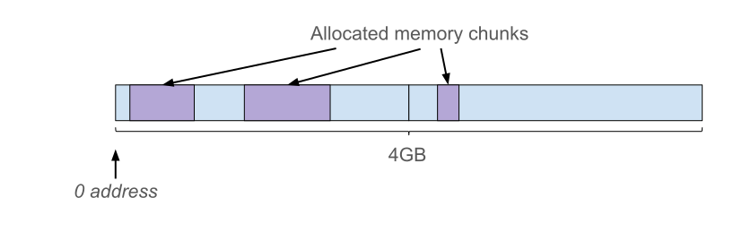
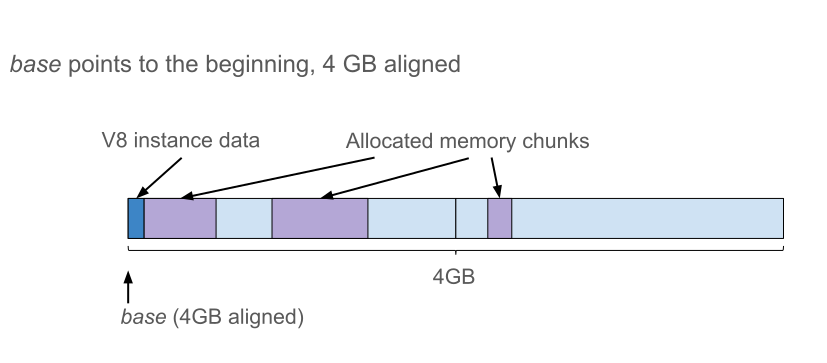
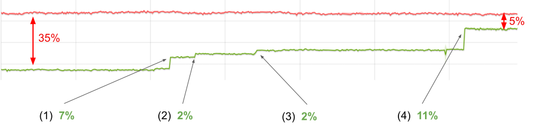
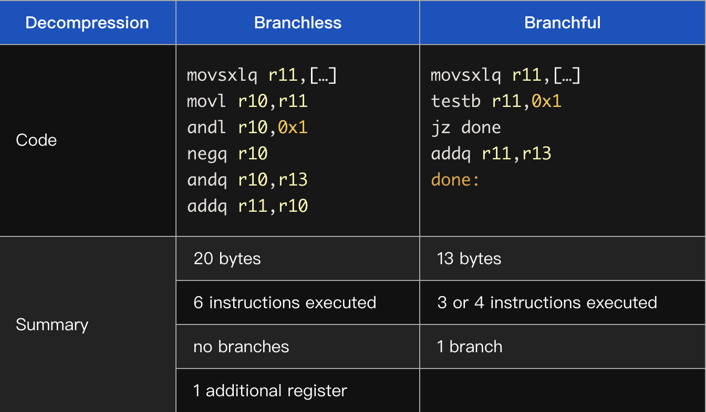
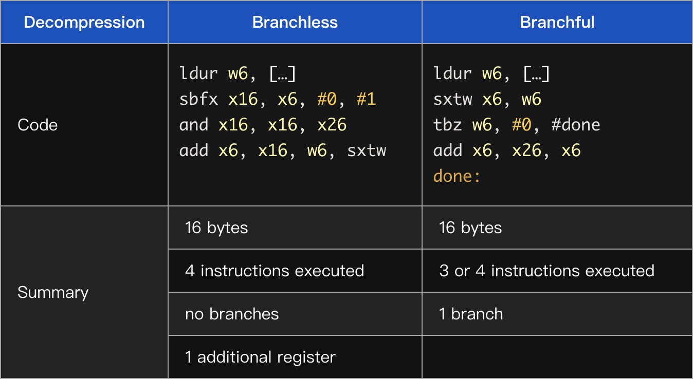
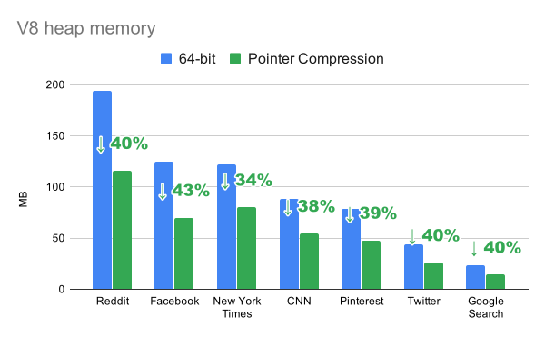

原文链接：https://v8.dev/blog/pointer-compression

内存和性能之间的斗争始终存在。作为用户，我们希望速度又快占用内存又少。然而通常情况下，提高性能需要消耗更多的内存（反之亦然）。
<!--more-->
时间回到2014年，那时Chrome从32位切换到64位。这个变化带给了Chrome更好的[安全性、稳定性和性能](https://blog.chromium.org/2014/08/64-bits-of-awesome-64-bit-windows_26.html)，但同时也带来了更多内存的消耗，因为之前每个指针占用4个字节而现在占用是8个字节。我们面临在V8中尽可能减少这种多出来4个字节开销的挑战。

在实施改进之前，我们需要知道我们目前的状况，从而正确的评估如何改进。为了测量当前的内存和性能，我们使用一组可以代表目前流行站点的[页面](https://v8.dev/blog/optimizing-v8-memory)。数据显示在桌面端Chrome[渲染进程](https://www.chromium.org/developers/design-documents/multi-process-architecture)内存占用中V8占用了60%，平均为40%。


指针压缩是改进V8内存占用的多项工作之一。想法很简单：我们可以存储一些“基”地址的32位偏移量而不是存储64位指针。这样一个简单的想法，我们可以从V8中的这种压缩获得多少收益？

V8的堆区包含大量的项目（items），例如浮点值（floating point values），字符串字符（string characters），解析器字节码（interpreter bytecode）和标记值（tagged values）。在检查堆区时，我们发现在现实使用的网站中，这些标记值占了V8堆区的70%！

下面我们具体看看这些标记值是什么。

## V8中的标记值

在V8中JavaScript的对象，数组，数字或者字符串都用对象表示，分配在V8堆区。这使得我们可以用一个指向对象的指针表示任何值。

许多JavaScript程序都会对整数进行计算，例如在循环中增加索引。为了避免每次整数递增时重新分配一个新的number对象，V8使用著名的[指针标记技术(pointer tagging)](https://en.wikipedia.org/wiki/Tagged_pointer)在V8的堆指针中存储其他或替代数据。

标记位（tag bits）有双重作用：用于指示位于V8堆中对象的强/弱指针或一个小整数的信号。因此，整数能够直接存储在标记值中，而不必为其分配额外的存储空间。

V8在堆中按字对齐的地址分配对象，这使得它可以使用2（或3，取决于机器字大小）最低有效位进行标记。在32位架构中，V8使用最低有效位去区分Smis和堆对象指针。对于堆指针，它使用第二个最低有效位去区分强引用和弱引用：

```
                        |----- 32 bits -----|
Pointer:                |_____address_____w1|
Smi:                    |___int31_value____0|
```

这里的 *w* 用来区分强指针和弱指针。

*注意：*一个Smi值只能携带一个31bit有效载荷（payload），包括符号位。对于指针，我们有30bit用来作为堆对象地址有效载荷（payload）。由于字对齐，分配粒度为4个字节，这给了我们4GB的寻址空间。

在64位架构中，V8的值看起来像这样：

```
            |----- 32 bits -----|----- 32 bits -----|
Pointer:    |________________address______________w1|
Smi:        |____int32_value____|0000000000000000000|
```
不同于32位架构，在64位架构中V8可以将32位用于Smi值有效载荷（payload）。以下各节将讨论32位Smis对指针压缩的影响。

## 压缩标记值（tagged values）和新的堆布局

使用指针压缩，我们的目标是以某种方式在64位架构中将两种标记值转换为32位。我们通过以下方式将指针调整为32位：

* 确保所有V8对象分配在4GB范围内
* 将指针表示为这个范围内的偏移量

这样严格的限制是非常不幸的，但是Chrome中的V8已经将堆限制到2GB或4GB大小（具体限制到多少取决于设备），即使在64位架构上也是如此。其他V8嵌入程序，例如Node.js可能需要更大的堆。**如果我们添加最大4GB的限制，就会让这些嵌入V8的程序无法使用指针压缩。**

现在的问题是如何更新堆布局才能让32位指针唯一标识V8对象。

### 简单的堆内存布局（Trivial heap layout）

简单的压缩方案是在前4GB的地址空间分配对象。



但是很可惜V8不能这样做，因为Chrome的渲染进程可能需要在同一渲染器进程中创建多个V8的实例，例如对于Web/Service Workers。除此之外，用这个方案会导致所有的V8实例竞争相同的4GB地址空间从而导致所有的V8实例都受到4GB内存的限制。

### 堆内存布局，v1

如果我们将V8堆（heap）放在其他地方的连续4GB地址空间，那么一个从base开始的无符号32位偏移量将唯一标识一个指针。



如果我们确保base是4GB对齐（4-GB-aligned），则所有指针的高位32位都相同。

```
            |----- 32 bits -----|----- 32 bits -----|
Pointer:    |________base_______|______offset_____w1|
```

通过将Smi的有效载荷（payload）限制为31位并将其放在低32位，我们还可以压缩Smis。基本上，使它和在32位架构中类似。

```
         |----- 32 bits -----|----- 32 bits -----|
Smi:     |sssssssssssssssssss|____int31_value___0|
```

这里 *s* 是Smi有效载荷的符号值。如果再有使用[符号扩展](https://zh.wikipedia.org/wiki/%E7%AC%A6%E5%8F%B7%E6%89%A9%E5%85%85)表示，我们就可以仅用64位字的一位算数移位来压缩和解压Smis。

现在，我们可以看到指针和Smis的上半字（upper half-word）完全由下半字定义。这样，我们就可以只将后者存储在内存中，从而将存储标记值所需的内存减少一半。

```
                    |----- 32 bits -----|----- 32 bits -----|
Compressed pointer:                     |______offset_____w1|
Compressed Smi:                         |____int31_value___0|
```

假设base是4GB对齐的，则压缩就是截断：

```cpp
uint64_t uncompressed_tagged;
uint32_t compressed_tagged = uint32_t(uncompressed_tagged);
```

但是解压代码要复杂一些。我们需要区分符号扩展（sign-extending）Smi和零扩展（zero-extending）指针，以及是否要添加base。

```cpp
uint32_t compressed_tagged;

uint64_t uncompressed_tagged;
if (compressed_tagged & 1) {
  // pointer case
  uncompressed_tagged = base + uint64_t(compressed_tagged);
} else {
  // Smi case
  uncompressed_tagged = int64_t(compressed_tagged);
}
```

尝试改变压缩方案来简化解压代码。

### 堆内存布局，v2

如果将base不是放在4GB的开头，而是中间，就可以将压缩值视为从base开始的一个有符号32位偏移量。注意，整个保留不再是4GB对齐（4-GB-aligned），但是base依然是对齐的。


在这个新的布局中，压缩代码和上面堆内存布局v1中的相同。

然而解压代码变得更好了。现在对Smi和指针来说，符号扩展是相同的，唯一的分支在于如果是指针，需要添加base。

```cpp
int32_t compressed_tagged;

// Common code for both pointer and Smi cases
int64_t uncompressed_tagged = int64_t(compressed_tagged);
if (uncompressed_tagged & 1) {
  // pointer case
  uncompressed_tagged += base;
}
```

代码中分支的性能取决于CPU中的[分支预测单元](https://zh.wikipedia.org/zh-cn/%E5%88%86%E6%94%AF%E9%A0%90%E6%B8%AC%E5%99%A8)。如果我们以无分支的方式执行解压，我们可以得到更好的性能。通过少量魔术，我们可以写出一个无分支版本的代码：

```cpp
int32_t compressed_tagged;

// Same code for both pointer and Smi cases
int64_t sign_extended_tagged = int64_t(compressed_tagged);
int64_t selector_mask = -(sign_extended_tagged & 1);
// Mask is 0 in case of Smi or all 1s in case of pointer
int64_t uncompressed_tagged =
    sign_extended_tagged + (base & selector_mask);
```

然后，我们决定从无分支实现开始。

## 性能演化

### 初始性能

我们使用[Octane](https://v8.dev/blog/retiring-octane#the-genesis-of-octane)测试性能，Octane是我们过去使用的性能基准测试。尽管我们在日常工作中不再专注于提高性能峰值（improving peak performance），但我们也不希望降低它，特别是一些像指针这样对性能敏感的东西。Octane依然是完成这个任务的好的基准测试。

图形显示了在使用指针压缩时Octane在x64架构上的得分。在图中，线越高越好。红色的线是未压缩指针的x64构建，绿色的线是指针压缩的版本。



在第一个方案中，我们的回归差约为35%。

### Bump(1), +7%

首先我们通过比较无分支解压和有分支解压，验证了“无分支会更快”的假设。事实证明，我们的假设是错误的，在x64上，有分支版本的速度提高了7%。这是非常大的不同！

下面看一下x64汇编



r13是base值的专用寄存器。注意，无分支代码在这里代码量更多且需要的寄存器也更多。

在Arm64，我们观察到相同的现象——在强大的CPU上，有分支版本明显更快（尽管这两种情况的代码大小是一样的）。



在低端Arm64设备上我们发现在任一方向上几乎没什么性能差异。

我们的收获是：在现代CPU中分支预测器非常的好，代码的大小（code size）（尤其是执行路径的长度）对性能影响更大。

### Bump(2), +2%

[TurboFan](https://v8.dev/docs/turbofan)是V8的优化编译器，围绕“Sea of Nodes”概念构建。简单来说就是每一个操作在graph中用一个Node表示（更详细的解释可以查看[这篇博客](https://v8.dev/blog/turbofan-jit)。这些节点有各种依赖，包括数据流和控制流。

有两个对指针压缩至关重要的操作：加载和存储，因为它们将V8堆内存和管道（pipeline）的其余部分连起来。如果我们每次从堆内存加载压缩值的时候都解压，并且在存储之前对其压缩，那么管道（pipeline）就可以像在全指针模式（full-pointer mode）下工作了。因此我们在节点图中添加了新的显式操作——压缩和解压。

在某些情况下解压是不需要的，例如，如果一个压缩值仅仅是从某个位置被加载然后存储到新的位置。

为了优化不必要的操作，我们在TurboFan中实施了一个新的“消除解压”阶段。它的工作就是消除直接压缩后的解压。由于这些节点可能不会直接相连，因此它会尝试通过graph传播解压，以期遇到压缩问题并消除。这使我们的Octane的值提高了2%。

### Bump(3), +2%

在查看生成代码时，我们注意到解压一个刚刚被加载的值会导致代码的冗长：

```cpp
movl rax, <mem>   // load
movlsxlq rax, rax // sign extend
```

一旦我们修复了标志扩展的问题，value就可以直接从内存中加载。

```cpp
movlsxlq rax, <mem>
```

我们得到了另外2%的改善。

### Bump(4), +11%

TurboFan优化阶段通过在graph上使用模式匹配工作：一旦一个sub-garph与一个特定模式匹配，就会被替换为语义上等效（但是更好）的sub-graph或指令（instruction）。

尝试匹配不成功并不会有明确的失败提示。在graph中显式的压缩/解压操作导致之前成功的模式匹配尝试失败，从而导致优化失败且没有提示。

“中断”优化的其中一个例子是[分配预配置（allocation preternuring）](https://static.googleusercontent.com/media/research.google.com/en//pubs/archive/43823.pdf)。一旦我们更新匹配模式（pattern matching）使其能够匹配到新的压缩 / 解压 node，我们就可以得到另外11%的改进。


### Bump(5), +0.5%

在TurboFan中使用解压去除（Decompression Elimination）我们学到了很多。显式的解压 / 压缩node方法具有以下特性：

优点：

* 很明显我们通过对sub-graphs的规范模式匹配可以优化不必要的解压。

但是，随着我们进一步的实施，我们发现缺点：

* 新的内部值的表示可能会导致转换操作变的难以管理。除了现有的表示集（tagged Smi, [tagged pointer](https://en.wikipedia.org/wiki/Tagged_pointer), tagged any, word8, word16, word32, float32, float64, simd128），我们还有压缩指针，压缩Smi，压缩任何值（压缩值可以是指针或Smi）。

* 现有的基于graph的模式匹配（pattern-matching）的优化并没有生效，这导致了一些地方的回退（regressions）。尽管我们找到并修复其中的问题，但TurboFan的复杂性仍在不断增加。

* 寄存器分配器（register allocator）对graph中的node数量越来越不满意，并且经常生成错误的代码。

* 较大的node graph会减缓TurboFan优化阶段，并增加编译期间的内存消耗。

我们决定回退一步，考虑在TurboFan中实现一种更简单的指针压缩方式。新的方法是删除压缩指针/Smi/任何表示，然后让所有显式的压缩/解压 node 隐藏在存储和加载中，并假设我们始终在加载之前压缩，在存储之前解压。

我们还在TurboFan中添加新的阶段，该阶段将替代“解压消除（Decompression Elimination”。这个新的阶段能够识别我们什么时候不需要压缩或解压并相应地更新“加载和存储”。这种方法显著降低了TurboFan中指针压缩的复杂性，提高了生成代码的质量。

新的操作和初始时候一样有效，并且又提高了0.5%的性能。

### Bump(6), +2.5%

我们已经接近平均性能，但是依然有差距。我们必须有更好的想法。其中一个想法是：如果我们确保任何处理Smi值的代码都不处理高32位，结果会怎么样？

之前的解压实现：

```cpp
// Old decompression implementation
int64_t uncompressed_tagged = int64_t(compressed_tagged);
if (uncompressed_tagged & 1) {
  // pointer case
  uncompressed_tagged += base;
}
```

如果我们忽略一个Smi的高32位就可以假定它是`undefined`。这样，我们就可以避免指针和Smi之间的特殊case，并且可以在解压的时候无条件的添加base，即使是对Smis也可以！我们称这个方法为“Smi-corrupting”。

```cpp
// New decompression implementation
int64_t uncompressed_tagged = base + int64_t(compressed_tagged);
```

由于我们不关注Smi的符号扩展（sign extending），因此这个改变允许我们回到堆内存布局v1。这是一个base指向4GB预留空间的开始位置。


就解压代码而言，这个改变将符号扩展（sign-extension）变为零扩展（zero-extension），这也同样简单。但是这简化了运行时（C++）端的工作。例如，例如地址空间区域保留代码（查看[一些细节实现](https://v8.dev/blog/pointer-compression#some-implementation-details)部分）。

这是用于比较的汇编：


因此我们更将8中所有的使用Smi的代码块调整为新的压缩方案，这给我们另外2.5%的性能提升。

### 剩余差距（Remaining gap）

剩余的性能差距可以用对64位构建的两个优化来解释，这些优化由于与指针压缩不兼容而禁用。


#### 32-bit Smi优化(7), -1%

我们回顾一下，Smis在64位架构全指针模式中看起来是这样：

```cpp
        |----- 32 bits -----|----- 32 bits -----|
Smi:    |____int32_value____|0000000000000000000|
```

32-bit Smi有如下好处：

* 它可以有更大的整数范围且不需要封装成整数对象
* 这样的形式可以在读/写时直接访问32位值

由于使用指针压缩后会具有区分指针和Smis的bit，导致在32-bit压缩指针中没有空间，所以导致该优化无法使用。如果我们在64-bit版本中禁用32-bit smis，将会看到Octane值下降1%。

#### 双精度字段拆箱（双精度 field unboxing） (8), -3%

>译者注：装箱（boxing）是指编译器自动将基本数据类型值转换成对应的包装类的对象，拆箱（unboxing）则是反过来。

在某些假设下，这种优化尝试直接将浮点值存储在对象的字段中。这样做的目的是减少数字对象分配的数量，这比单独用Smis减少的更多。

想象一下下面这段代码：

```js
function Point(x, y) {
  this.x = x;
  this.y = y;
}
const p = new Point(3.1, 5.3);
```

一般来说，对象p在内存中的样子如下：


关于更多存储中的隐藏类，属性和元素可以[阅读此文](https://v8.dev/blog/fast-properties)

在64位架构中，双精度值和指针的大小相同。所以**如果我们假设Point字段总是包含number值**，则可以将它们直接存储在对象中。


如果某个字段导致假设不成立，例如执行下面这段代码：

```js
const q = new Point(2, 'ab');
```

y属性的number值必须装箱存储（store boxed instead）。另外，如果某处的优化的代码依赖此假设，则该优化必须舍弃。进行这些“字段类型”泛化的原因是为了尽量减少通过同一构造函数创建的对象的Shapes（译者注：在 JavaScript 程序中，多个对象具有相同的key，JS引擎会将这些key单独存储在一个地方，从而优化存储，具体可以查看[[译] JavaScript 引擎基础：Shapes 和 Inline Caches](https://hijiangtao.github.io/2018/06/17/Shapes-ICs/)）数量，反过来这对于具有稳定的性能是很必要的。


如果应用该优化，双精度字段拆箱给我们如下好处：

* 通过对象指针提供对浮点数据的直接访问，避免通过number对象进行额外的取消引用操作。
* 允许我们对紧凑循环（tight loops）生成更小更快的优化代码从而可以做大量的双精度字段访问。（例如在数字运算应用程序中）

启用指针压缩后，双精度值不再适合压缩字段。然而，在未来我们可能为指针压缩适配该优化。

注意，即使没有双精度字段拆箱优化（以与指针压缩兼容的方式），也可以通过将数据存储在Float64 TypedArrays，甚至是使用[Wasm](https://webassembly.github.io/spec/core/)重写要求高吞吐量的数字运算代码。

#### 更多的优化（9），1%

最后，对TurboFan中的解压消除优化进行微调又得到另外1%的性能提升。

## 一些优化细节

为了简化将指针压缩整合到现有代码中，我们决定在每次加载values的时候解压并且在每次存储的时压缩它们。因此只是改变标志值的存储格式，而执行格式保持不变。

### Native代码端

为了在解压的时候生成有效的代码，必须保证始终提供base值。幸运的是V8已经有一个专用的寄存器指向一个“根表（roots table）”，该表包含JavaScript和V8内部对象的引用，这些对象必须始终可用（例如：`undefined`，`null`，`true`，`false`等）。该寄存器被称为“根寄存器”，它用来生成较小的，[可以共享的内部代码](https://v8.dev/blog/embedded-builtins)。

所以，我们将根表放在V8堆保留区，根寄存器可以同时有两种用途：

* 作为根指针
* 作为解压的base值

### C++ 端

V8运行时通过C++类访问在V8堆区的对象，从而提供对堆中存储的数据的便捷访问。请注意，V8对象比C++对象更类似于[POD](https://en.wikipedia.org/wiki/Passive_data_structure)的结构。助手（helper）“view”类仅仅包含一个带有相应标记值的`uintptr_t`字段。由于view类是字大小的（word-size），因此我们可以将它按值传递，开销为零（这样感谢现代C++编译器）。

这里是一个helper类的伪代码：

```cpp
// Hidden class
class Map {
  ...
  inline DescriptorArray instance_descriptors() const;
  ...
  // The actual tagged pointer value stored in the Map view object.
  cosnt uintptr_t ptr_;
}

DescriptorArray Map::instance_descriptors() const {
  uintptr_t field_address = FieldAddress(ptr_, kInstanceDescriptorsOffset);

  uintptr_t da = *reinterpret_cast<uintptr_t*>(field_address);
  return DescriptorArray(da);
}
```
为了尽量减少首次运行指针压缩版本的所需的更改次数，我们将解压必须的base值的计算集成到getter中。

```cpp
inline uintptr_t GetBaseForPointerCompression(uintptr_t address) {
  // Round address down to 4 GB
  const uintptr_t kBaseAlignment = 1 << 32;
  return address & -kBaseAlignment;
}

DescriptorArray Map::instance_descriptors() const {
  uintptr_t field_address = FieldAddress(ptr_, kInstanceDescriptorsOffset);

  uint32_t compressed_da = *reinterpret_cast<uint32_t*>(field_address);

  uintptr_t base = GetBaseForPointerCompression(ptr_);
  uintptr_t da = base + compressed_da;
  return DescriptorArray(da);
}
```

性能测量结果证实，在每次加载的时候计算base值会影响性能。原因在于C++编译器不知道，对于V8堆区的任何地址调用`GetBaseForPointerCompression()`的结果是相同的，因此编译器无法合并base值的计算。鉴于代码包含多个指令和一个64位常量，这将导致代码显著膨胀。

为了处理这个问题，我们重用V8实例指针作为解压时用的base（记住，V8实例数据在堆区布局中）。该指针通常在运行时函数中可用，所以我们通过要求使用V8实例指针简化getters代码，并恢复来了性能：

```cpp
DescriptorArray Map::instance_descriptors(const Isolate* isolate) const {
  uintptr_t field_address =
      FieldAddress(ptr_, kInstanceDescriptorsOffset);

  uint32_t compressed_da = *reinterpret_cast<uint32_t*>(field_address);

  // No rounding is needed since the Isolate pointer is already the base.
  uintptr_t base = reinterpret_cast<uintptr_t>(isolate);
  uintptr_t da = DecompressTagged(base, compressed_value);
  return DescriptorArray(da);
}
```
## 结果

让我们来看看指针压缩的最后结果！对于这些结果，我们使用与本文开头介绍的相同的网站测试。提醒一下，他们代表用户在真实世界网站使用情况。

我们发现指针压缩将V8堆区大小减少43%！反过来，它减少桌面端Chrome渲染进程20%的内存占用。



另一个重要的事情是，不是每一个网站都有相同的改进。例如，在没有使用指针压缩的时候Facebook使用V8堆区内存比纽约时报要多，但是使用该优化后，使用堆内存情况变得相反。这个不同可以通过以下事实解释：某些网站具有比其他网站更多的标记值（Tagged values）。

除了这些内存改进，我们还看到了实际性能的改进。在真实网站上，我们使用更少的CPU和垃圾回收时间！


## 结论

这一路上尽管没有鸟语花香，但是值得度过。[300+的提交](https://github.com/v8/v8/search?o=desc&q=repo%3Av8%2Fv8+%22%5Bptr-compr%5D%22&s=committer-date&type=Commits)后，指针压缩让V8拥有64位应用的性能，同时拥有32位的内存占用。

我们一直期待着性能的改进，并在流程中完成以下相关任务：

* 改进生成汇编代码的质量。我们知道在某些情况下我们能够生成更少的代码来提高性能。
* 解决相关的性能下降，包括一个机制，该机制以指针压缩友好的方式再次对doble字段拆箱。
* 探索支持8～16G范围内更大堆的想法。