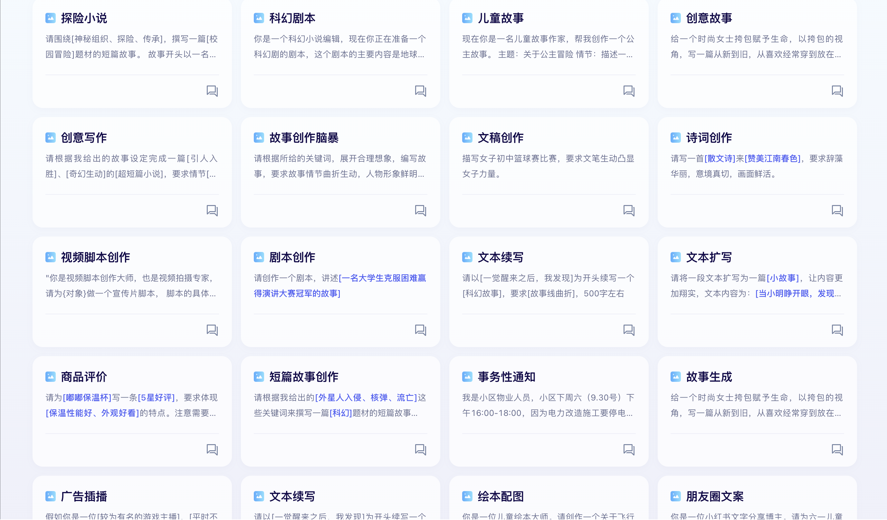
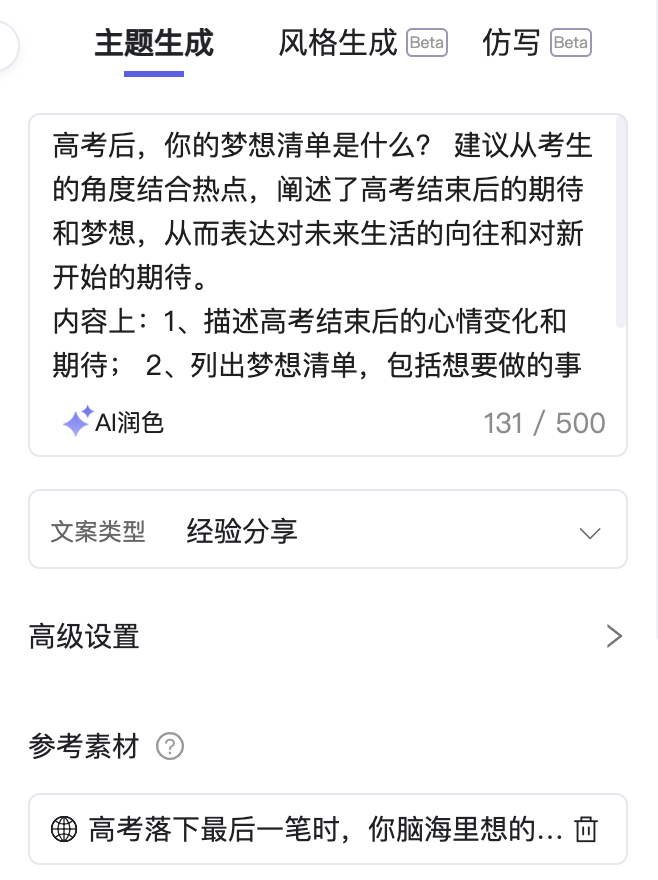

>在 AI 的时代，我们能够高效生成内容的同时，是否也会带来大量低质、观点趋同的内容？

随着 2022 年 11 月 30 日 OpenAI 发布 ChatGPT，一场 AI 革命就此拉开序幕。如今已经过去一年半，这段时间以来各路 AI 模型及应用层出不穷。底层大模型有 OpenAI 的 GPT-4o、Anthropic 的 Claude-3.5-Sonnet、Google 的 Gemini-1.5、Meta 的 Llama、字节的豆包、腾讯的混元大模型、阿里的通义千问、月之暗面 Kimi 等，应用上有基于 AI 的搜索 Perplexity、秘塔，以及大家应该都已经见到过的各类生成图文内容的应用，例如润色、扩写、总结、续写、风格模拟等等，例如像下面这样：

# 批量 AI 写作带来的问题

利用上面这些工具，只要我们稍微提供一些观点，然后告诉 AI 期望生成的内容，AI 即可在几秒钟内帮我们生成一段符合要求的文本，这大大降低了写作门槛，提高了写作的效率。但是，这样的高效是否也会带来问题？

“短时间”和“大量”的特点为批量生产内容提供了更多可能。但利用 AI 大量生产未经过深度思考和加工的内容，并将其投放到互联网上，可能会带来严重的后果：

1. **信息污染**：通过 AI 批量生产内容，这些内容可能缺乏原创性和深度，观点趋同，低质量、重复和不准确的信息充斥网络，使用户难以找到真正有价值的内容，信息的可信度和可靠性大打折扣。
2. **对信息信任度下降**：随着低质量内容的增加，大家对在线信息和媒体的信任度可能会逐渐降低。
3. **创造力和思维能力退化**：高度依赖 AI 生成内容，可能会导致写作能力和创造性思维能力退化。长期下去，社会整体的创新能力和文化创造力可能都会受到影响。
4. **传播谣言和错误信息**：由于 AI 生成内容可能包含错误或误导性信息，这些内容在大规模传播时，会加速谣言和错误信息的扩散，带来负面的社会影响。
5. **竞争加剧**：原创作品和经过深度思考的内容会在大量互联网垃圾信息中淹没，创作者和内容生产者将面临更大的压力和挑战。

# AI 写作工具如此普遍的原因分析

既然大规模的利用 AI 生产内容可能带来上面的问题，为什么会有那么多 AI 写作的工具被提供出来，几乎每一个跟文字相关的应用都提供了 AI 写作的功能？甚至很多创作平台鼓励大家使用 AI 去创作？下面我将从需求端和生产端两个方面去分析。

## 需求端：每个人都渴望表达自己

>每个人都渴望表达自己，但是并不是每个人都能够用美好的语言将自己期望表达的描述出来。这是人类最基本的心理需求。

从需求端看，AI 工具是非常有必要的，这源于人类最基本的心理需求——渴望表达自己。

人类渴望表达自己，具有深层次的根源，可以从心理学、社会学和进化论等方面来分析。

从心理学角度看：
- 自我实现需求：根据马斯洛需求层次理论，人类的需求从低到高分为五个层次：生理需求、安全需求、社交需求、尊重需求和自我实现需求。自我表达是实现自我实现需求的重要途径之一。通过表达，人们能够展示自己的能力、实现个人目标，从而获得自我满足和成就感。
- 情感和心理健康：表达自我有助于情感的释放和心理健康的维护。通过表达自己的情感和想法，人们可以减轻压力和焦虑，提升心理健康水平。此外，表达自我还能增强自信心和行动力，促进个人成长。

从社会学角度看：
- 社交需求：人类是社会性动物，表达自我有助于建立和维护社会关系。通过语言、艺术等形式的表达，人们可以与他人交流，分享经验和情感，从而建立深厚的社会联系。这种社交互动不仅满足了人类的社交需求，还能增强归属感和认同感。
- 获得认可和尊重：表达自我也是获得他人认可和尊重的重要途径。通过展示自己的观点、才能和成就，人们可以赢得他人的赞赏和尊重，从而提升自我价值感。这种认可和尊重反过来又进一步激励人们继续表达自我。

从进化论角度看：
- 生存和繁衍：从进化论的角度来看，表达自我有助于生存和繁衍。早期人类通过语言和其他形式的表达来传递信息、协调合作，从而提高了生存机率。此外，表达自我还可以吸引配偶，增加繁衍机会。
- 欲望的驱动：欲望是人类行为的重要驱动力。心理学家Sergio Salvatore认为，欲望是人类语言和行为的核心驱动力。通过表达欲望，人类能够追求和实现各种目标，从而推动个人和社会的发展。

人类表达自己的方式很多，例如：
- 语言：口头表达，书面表达；
- 艺术：视觉艺术（绘画、雕塑、摄影等），数字艺术（计算机图像、动画等）；
- 音乐：演奏和创作，歌唱等；
- 舞蹈
- 戏剧

其中表达自己门槛最低的方式就是口头表述和书面表达了。这些方式不需要特殊的工具或技能，只需要语言能力即可实现。

然而，并不是每个人都能将表达做到最好，这一点大家应该都有所体会。同样是一件美好的事物，我们自己看到后的表达，与文学艺术作品中的表达，存在着巨大的差异。文学作品能够用精美的语言将美好的事物表现出来，这正是我们喜欢文学作品的原因之一。

美的事物大家都喜欢，所以每个人也都期望自己能够像文学艺术作品那样，用优美的语言在互联网上表达自己的心情。这就需要一种转换，即将普通表达转化为精美的文字表述。而这种将一种输入转换成另一种输出正是 AI 擅长的。

## 生产端：每个人（公司）都期望乘上“AI 的春风”

从生产端看，AI 的出现让我们看到了解决现有问题，带来巨大变革的可能性。AI 生文、生图、生视频、分析复杂数据等等，这些事情的效率是人类的几十甚至几百倍。看到机会的同时也就看到了财富，每个人都期望可以乘上“AI 的春风”。

其实不只是 AI，每一次改变世界的创新的出现，都伴随着这样的盛况，铁路、电话、汽车、飞机、电视、互联网都可以说对全人类的生活产生了革命性的影响。想必这一次 AI 也将给人类带来又一次革命性的影响。而每一次新技术的出现人们都会表现出极大的热情并迅速投入其中，这种现象可以从心理学、经济因素和社会文化等多个角度来分析：

心理学因素：
- 从众效应和群体心理：根据Gartner的“炒作周期”理论，新技术通常会经历一个从“技术触发”到“期望膨胀顶峰”的过程。在这个过程中，早期采用者和媒体的宣传会引发广泛的市场兴趣，导致从众效应和群体心理的产生。**人们看到他人纷纷投入新技术，往往会跟随潮流，担心错过机会**。
- 希望和梦想：新技术常常被描绘成能够解决现有问题或带来巨大变革的工具，这种希望和梦想吸引了大量人们的关注和投资。人们希望通过新技术实现财富增长、职业发展或生活改善。

经济因素：
- 投机和投资机会：**新技术的出现通常伴随着巨大的投资机会**。早期投资者希望通过抓住新技术的“春风”获得丰厚回报，这种投机心理驱动了大量资本的涌入。例如，互联网泡沫和当前的AI热潮都展示了这种现象
- 市场竞争和商业利益：企业和个人都希望通过新技术在市场竞争中获得优势。新技术提供了新的商业模式和市场机会，企业希望通过早期采用新技术来占据市场先机，获取商业利益。

社会文化的影响：
- 媒体和宣传的方法效应：媒体和宣传在新技术的推广中起到了重要作用。媒体往往会放大新技术的潜力和成功案例，忽略其局限性和风险，从而激发公众的兴趣和投入。
- 文化和社会变革的推动力：新技术常常被视为社会变革的推动力，能够带来更高效、更便捷的生活方式。

这里额外补充一点，对于那些认为 AI 是革命性技术而去投资的人，需要记住一点的（这也是投资中多次提到的一个教训）：

>这些新行业孵育了许多新公司，但是其中只有极少数的公司生存下来并主导了整个行业。

尽管AI技术带来了革命，生成文字的应用（如OpenAI的ChatGPT）却比生成图片和视频的应用更早出现，也更早为大众熟知。因此，第一批AI工具主要是针对文字的。此外，扩写、润色、改写和风格调整等文字处理任务，只需输入一个固定的提示词（prompt），如果大模型足够优秀，就能产生非常好的效果，这便催生了AI写作工具的诞生。因此，市场上有着大量的AI写作工具。

以上便是如今 AI 写作工具如此普遍的原因，其实不只是 AI 写作工具，目前市场上有各种各样的 AI 工具，如此数量巨大，其背后的原因也是如此。
# 正确使用 AI 辅助创作

AI工具的出现既有利也有弊，那么我们应该如何正确地利用AI来帮助我们创作呢？从我个人的角度来看，与其将AI视为工具，不如将其看作创作的伙伴。想象一下，如果你在创作过程中有一个伙伴在帮助你创作，你要如何与这个伙伴合作，共同创作出优秀的内容呢？

AI 可以在创作的各个阶段提供帮助，从构思到最终发布：

构思和头脑风暴：
- 创意生成：使用 AI 工具为我们提供创意及思路；
- 创建大纲：让 AI 工具帮助我们创建文章的大纲，帮助我们理清文章的整体结构。

写作和内容的生成：
- 文本生成：在写作过程中，我们可以先将自己的想法或者说想表达的内容写下来，然后将内容给到 AI 让其润色，使其内容更加丰富；
- 词汇选择：当我们想不到合适的词汇表达自己的想法时，也可以尝试寻求 AI 的帮助。

编辑和校对：
- 语法和文字的检查：可以将我们写完后的文章给到 AI，让 AI 做一次检查，确保全文的准确性，没有病句和错别字；

发布：
- 多语言支持：如果我们期望在发布中文版的同时发布英文版，也可以尝试让 AI 帮我们将内容从中文翻译成英文，然后发布，这对 AI 来说也是非常简单的事情。

通过这些方式，我们可以更高效地利用 AI 来帮助我们创作，提升我们作品的质量和发布的效率。

# 最后

以上就是我对在 AI 时代写作的一些思考。虽然我提出了如何应用AI来辅助创作的建议，但这种辅助方式相比于直接批量生成，并不能显著地提高写作效率。毕竟，在这个讲求高效快速的时代，“时间就是金钱”。或许，真正令人感到悲哀的是，我们在追求效率和速度的过程中，渐渐失去了对深度思考和创作独特性的珍惜。

当我们越来越依赖 AI 来生成内容，是否还愿意花时间去打磨每一个细节，去倾注情感与心血？在这个快节奏的社会，也许真正缺乏的不是工具，而是耐心和对创作的热爱。或许正是在这一点上，我们需要反思：在科技飞速发展的时代，如何重新找回写作的初心，平衡效率与质感，才能真正创作出有温度和灵魂的作品。

