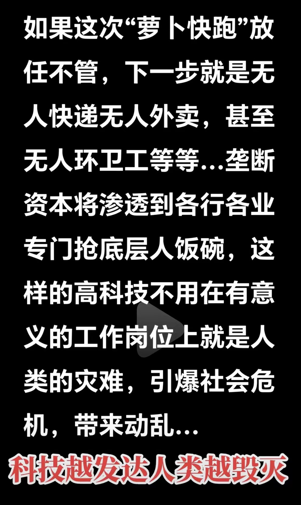
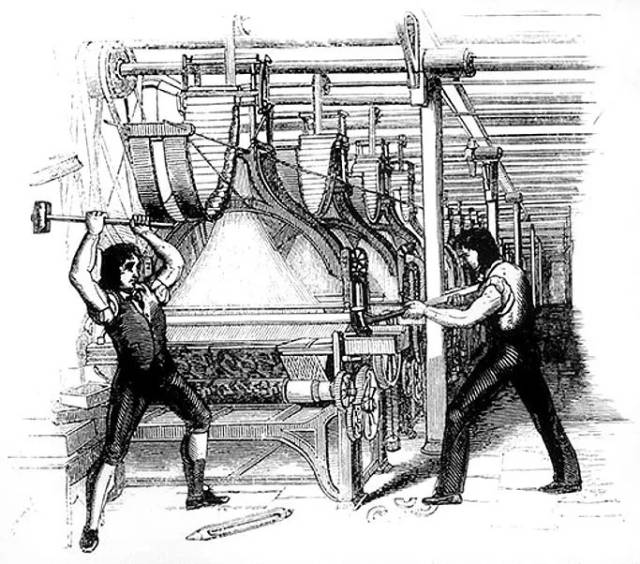
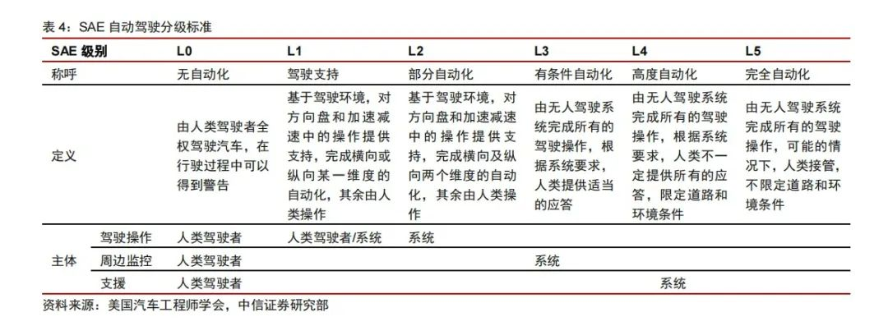

最近，百度旗下的 Robotaxi 萝卜快跑在网络上迅速走红，吸引了大量用户前来体验这项新技术。与普通网约车相比，萝卜快跑的价格极具竞争力，每公里费用不到一块钱，确实便宜了许多。然而，也有网友观察到，由于无人驾驶系统过于谨慎，在复杂的十字路口可能会出现"相互礼让"的情况，导致交通拥堵，连交警都束手无策。

随着萝卜快跑的迅速走红，人们开始思考一个更为深远的问题：在可预见的未来，无人驾驶技术是否会全面取代传统网约车服务，从而导致更多的人失业？甚至有人提出：如果这次萝卜快跑任其发展下去，那下一步无人快递、无人外卖、无人xx等都会渗透到各行各业专抢底层人饭碗，这样下去后果难以想象。

可以看出这次无人驾驶的爆火，尤其是在当前的背景下，给人们带来的相比于惊喜，更多的可能是惊吓，进而衍生出对科技（机器）的仇视。

# 似曾相识的历史

其实历史上曾经出现过类似的情况。大家都知道工业革命作为人类历史上的一个重要里程碑，在人类文明的发展进程中扮演了举足轻重的角色。它不仅彻底改变了人类的生产方式，还对社会结构、经济形态和生活方式产生了深远的影响。这场始于18世纪的变革，如同一股巨浪，席卷了整个世界，为人类社会带来了翻天覆地的变化。从蒸汽机的发明到电力的广泛应用，从手工作坊到大规模工厂生产，工业革命重塑了人类与自然、人与社会的关系，开启了一个前所未有的新时代。它不仅大幅提高了生产效率，改善了人们的物质生活，还推动了科技进步，激发了人类的创新精神，为现代文明的崛起奠定了坚实的基础。我们很难想象如果没有工业革命，我们今天的生活会是什么样？也许我们仍然生活在一个以农业和手工业为主的世界里，科技发展缓慢，医疗水平有限，交通工具仍以马车为主。城市化进程可能会停滞不前，今天我们习以为常的很多便利都不会出现。

但是，就这样一场改变人类历史进程的伟大革命，在当时却并非所有人都欣然接受。事实上，由于工业革命导致机器代替人工，甚至爆发了著名的“卢德运动”。

在工业革命时期，机器生产逐渐取代了传统的手工劳动，这一变革对社会产生了深远的影响。大批手工业者因此破产，众多工人失业，工资水平随之下跌。在这种背景下，工人们将机器视为贫困的根源，开始采取破坏机器的方式来表达对企业主的不满，并争取改善劳动条件。这场运动虽然针对机器，但明确禁止对人身施加暴力。  
这一运动被称为"卢德运动"，其名称源于一个传奇人物——内德·卢德（Ned Ludd）。据传，内德·卢德是莱斯特郡的一名织布工。在一次愤怒之下，他砸毁了两台织布机，由此成为了这场运动的象征性人物。

而最终的结果我们也知道，技术的进步并未被阻止，工业革命的成果给我们带来了巨大的便利，让我们整个社会的生产效率得到了前所未有的提升。

# AI 正在影响的领域

不管我们愿不愿意承认，AI 在过去几年中快速发展，其影响已经深入到我们的方方面面。
  
在银行、酒店和商场等公共场所，我们越来越多地看到智能机器人接待员。这些机器人不仅能够提供基本的信息咨询服务，还能进行简单的业务办理，如银行的智能柜员机可以处理存取款、转账等大部分日常业务。在酒店业，一些连锁酒店已经开始使用机器人来进行客房服务，甚至有些酒店推出了完全无人值守的智能客房系统。  
  
客服行业也正经历着 AI 带来的重大变革。许多企业已经采用 AI 驱动的聊天机器人来处理客户询问，这些虚拟助手能够 24 小时不间断工作，迅速回应客户的常见问题，大大提高了客服效率，同时也减少了人力成本。  
  
制造业也是受 AI 和自动化影响最为深远的领域之一。走进现代化工厂，我们会发现生产线上的工人数量明显减少，取而代之的是大量精密的机器人。这些工业机器人不知疲倦地工作，能够执行高精度、高重复性的任务，极大地提高了生产效率和产品质量。例如，在汽车制造业，机器人已经在焊接、喷漆、组装等多个环节取代了人工操作。  

除此之外，AI 影响的领域还包括：
- 金融和保险：AI在金融行业用于欺诈检测、算法交易、信用评估和个性化投资建议。保险行业利用AI进行风险评估、索赔处理和客户服务自动化。AI提高了金融交易的效率和准确性，减少了欺诈行为，并改善了客户体验。
- 医疗：AI用于医疗诊断、个性化治疗和预测分析。通过分析大量医疗数据，AI可以帮助医生更早地发现疾病并制定更有效的治疗方案。AI提高了诊断的准确性和治疗的效果，缩短了诊断时间，并改善了患者的整体健康结果。
- 制造业：AI在制造业中用于预测性维护、质量控制和自动化生产流程。通过实时监控设备和生产线，AI可以预测故障并优化生产过程。AI提高了生产效率，减少了停机时间和生产成本，并改善了产品质量。
- 零售：AI用于库存管理、个性化购物体验和销售预测。通过分析销售数据和客户行为，AI可以优化库存水平并提供个性化的产品推荐。AI提高了库存管理的效率，减少了浪费，并增强了客户满意度和忠诚度
- 教育：AI用于个性化学习、学生表现分析和教育资源的优化分配。AI系统可以根据学生的学习模式提供个性化的学习计划。AI改善了学生的学习效果，提高了教师的教学效率，并促进了教育公平。
- 交通运输：自动驾驶技术和智能物流系统是AI在交通运输领域的主要应用。AI可以优化路线规划、提高运输效率并减少交通事故。AI显著提高了运输效率，降低了运输成本，并改善了道路安全。
- 安全和监控：AI用于视频监控、行为分析和入侵检测。通过分析监控视频，AI可以识别异常行为并及时发出警报。AI提高了安全监控的效率和准确性，增强了公共安全。
- 建筑：AI在建筑行业用于项目管理、安全监控和施工过程优化。AI可以分析项目数据以识别潜在问题，并提供改进建议。AI提高了项目管理的效率，减少了施工事故，并优化了资源利用。
# 自动驾驶的现状

根据 SAE（国际汽车工程师学会）制定的标准，自动驾驶技术被划分为以下六个不同的等级：

目前，L2级别的部分自动化系统应用最为广泛。这一级别的自动驾驶系统能在特定条件下执行部分驾驶任务，如自动变道和自适应巡航控制。然而，它仍然需要驾驶员时刻保持警惕，监控驾驶环境，并随时准备接管车辆控制。  
  
特斯拉的 Autopilot 系统是 L2 级别自动驾驶的典型代表。它提供了自适应巡航控制和自动车道保持等功能，大大提升了驾驶体验。但即便在这些功能启用时，驾驶员仍需保持注意力集中，随时准备接管方向盘。 同样，国内电动车制造商蔚来的 NIO Pilot 系统也提供了类似的 L2 级别功能。除了自适应巡航控制，该系统还支持自动变道等更高级的操作。这些功能虽然先进，但同样要求驾驶员保持高度警觉，确保行车安全。

2024 年 3 月下旬特斯拉发布了 FSD（Full Self-Driving）v12.3 版本，该技术可以使车辆几乎可以在任何地方自动驾驶，而驾驶员干预最少，并且会不断改进。该功能还包括：
- 在自动驾驶仪上导航：主动引导您的车辆从高速公路的入口匝道到出口匝道，包括建议车道变更、导航交汇处、自动接通转向灯和正确退出。
- 自动变道：当自动转向系统启动时，协助移动到高速公路上的相邻车道。
- 自动泊车：只需轻轻一按，即可自动平行或垂直停放车辆。
- 召唤：使用移动应用程序或钥匙将您的车辆移入和移出狭窄的空间。
- 智能召唤：您的车辆将在更复杂的环境和停车位中导航，根据需要绕着物体移动，以便在停车场找到您。
- 在城市街道上自动转向
- 交通和停车标志控制：识别停车标志和交通信号灯，并在您的积极监督下自动减慢您的车辆接近停车
 
虽然该仍然被归属于 L2+ 级别。但是照目前来看，大概在今年就能达到 L4 级别。

萝卜快跑，它实现的是全自动无人驾驶，能够在特定条件下完全自主驾驶，无需驾驶员干预，因此它属于 L4 级别自动驾驶无遗。除了百度的萝卜快跑，Waymo、Cruise、Pony.ai、AutoX、滴滴、Nuro 和 WeRide 等公司也在积极推进 L4 级别的自动驾驶技术，并在多个城市和区域内进行测试和试运营。所以我相信，在未来几年，我们将看到自动驾驶走入我们的生活。

# 正确对待 AI 潮流的态度

不管我们愿不愿意承认，曾经我们想象中的未来已经到来，AI 正在颠覆我们的生活方式、工作模式和思维方式，重塑着整个社会的结构和运作机制。今天 AI 带来的绝对不亚于当年的工业革命，它的发展很可能会彻底颠覆我们现有的生产、生活方式，这是发展的必然结果，不可阻挡。在这场变革中必然会有旧的生产、生活方式被摧毁，但是与此同时，将会有新的生产、生活方式出现，进而带来新的岗位。这也许就是 AI 给我们带来的破坏性创造。

>创造性破坏
>由经济学家约瑟夫·熊彼特引入的一个概念，指的是创新和技术变革的过程，这一过程导致现有经济结构的破坏，例如产业、公司和工作岗位。这种破坏为新结构的出现铺平了道路，从而创造了长期的经济增长和进步。尽管可能存在短期的不利影响，但创造性破坏的意图是创造长期价值。

我们要做，也能做的应该是顺应时代潮流，思考如何更好的利用 AI，提升自己的个人天花板，让自己在科技的变革中有自己的一席之地，而不是被科技淘汰！例如：  
- **在日常工作中寻找 AI 应用机会**：思考工作中哪些重复性任务可以通过 AI 来优化。比如，使用自然语言处理工具来分析客户反馈，或者利用机器学习算法来预测市场趋势。
- **提升与 AI 协作的能力**：未来的工作环境很可能是人机协作的模式。学会如何有效地向 AI 提问、解释任务需求，以及解释AI 输出结果，将成为重要的职场技能。
- **关注所在行业的 AI 发展趋势**：每个行业都在以不同方式拥抱 AI 技术。定期关注行业新闻和研究报告，了解 AI 在我们所在领域的最新应用，保持竞争力。
- **发展人类独有的软技能**：随着 AI 承担更多技术性任务，人类的创造力、情感智能、批判性思维和跨学科整合能力将变得更加珍贵。投资于这些能力的培养将让您在AI时代保持不可替代性。
- **参与跨学科合作**：AI 的应用往往需要跨领域的知识。尝试与其他领域的专家合作，将我们的专业知识与 AI 技术结合，可能会产生创新的解决方案。
- **保持开放和适应的心态**：技术变革的速度可能会让人感到不安，但保持开放和积极的态度至关重要。要愿意尝试新工具，接受可能的失败，并从中学习。

记住，AI 是一种工具，而不是威胁。通过积极学习和适应，我们每个人都有机会在 AI 时代找到机会。未来人与人之间能力的差距很有可能会加上“善于利用 AI 解决问题的能力”，这一点非常重要。

永远不要低估人类的潜力。正是我们的创造力、同理心和道德判断，让我们能够引导 AI 的发展，确保技术进步服务于人类的福祉。最后，引用一段话结束：“Technology might one day create a perpetually beating heart, But AI will never have a soul!”
