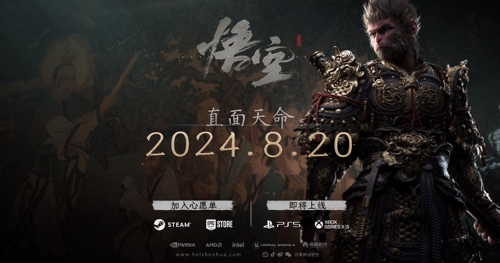
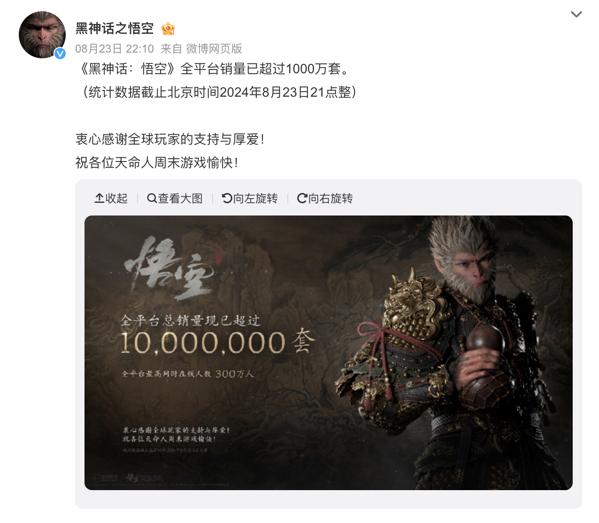
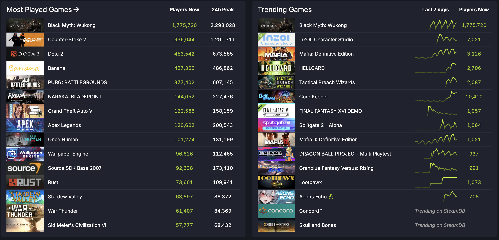
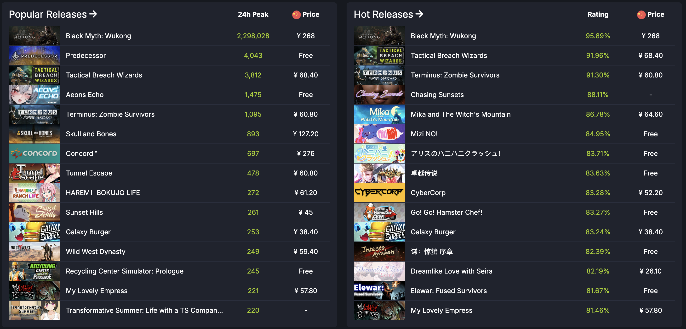
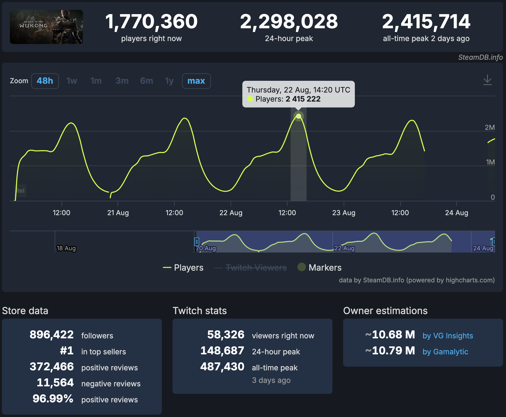
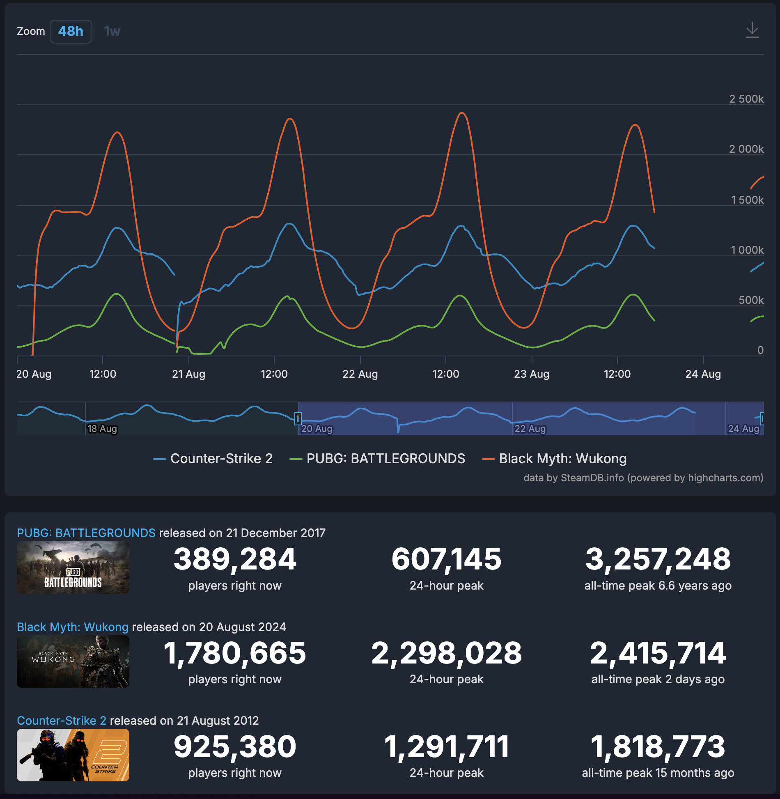
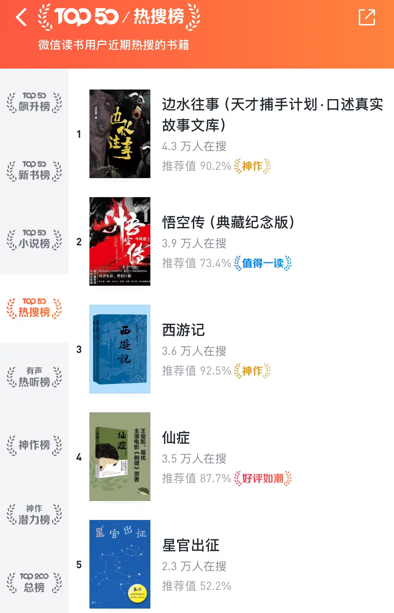
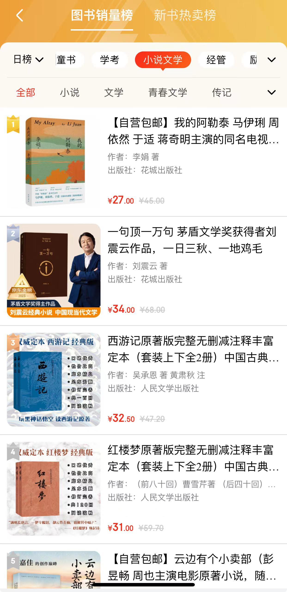

2024年8月20日，这一天必将铭记在中国游戏产业的发展史册上。因为就在这一天，由游戏科学打造的中国首款"3A级"大作《黑神话：悟空》正式上线，上线首日在 Steam 平台同时在线人数就超过 220 万，位列历史第二位，仅次于《绝地求生》（PUBG: BATTLEGROUNDS）。从上线到现在我一直在关注，感觉非常有意思，所以写这篇文章记录一下。

# 引人入胜的情节

游戏情节取材自家喻户晓的《西游记》，虽然原作为蓝本，但并非直接照搬原著内容，而是将故事设置在西天取经结束后，已封为“斗战胜佛”的孙悟空决定放弃佛位，回到花果山“退休”。天庭派二郎神率领天兵天将再临花果山，以屠戮花果山为威胁要带回悟空。悟空与二郎神再次斗法，最终落败。悟空的六根（眼、耳、鼠、舌、身、意）被分散，玩家扮演的“天命人”（猴子猴孙之一）在猪八戒的帮助下，踏上寻找”六根“，复活悟空的旅程。

玩家在一次又一次的通关中，会触发各类剧情，这些剧情非常精彩，同时也让我们重新思考《西游记》里的人物。怪不得有网友说，都能拍一部电影了。

## 八戒和紫蛛儿的意难平

游戏中最让人意难平的八戒与紫蛛儿的故事情节，展现了猪八戒性格中善良柔软的一面。

猪八戒原是天蓬元帅，因醉酒调戏嫦娥而被贬下凡界。在追逐嫦娥时，他无意中撞到一个侍女，这个侍女很有可能就是蜘蛛精紫蛛儿的前世。多年后，在西行取经的路上，猪八戒结识了紫蛛儿，两人产生了情愫。然而，由于取经的神圣使命，猪八戒陷入了内心挣扎。孙悟空命令猪八戒去毁掉盘丝洞，但他因私情而放走了紫蛛儿。后来，紫蛛儿生下一个小蜘蛛精。  
  
时光飞逝，在游戏中，天命人与猪八戒重返盘丝洞，遭到蜘蛛二姐的指责。洞中，猪八戒重逢了紫蛛儿，提醒她当年自己没有伤害过她，并看到了她的孩子，但老猪不敢相认，并且说那孩子"又小又丑"。紫蛛儿后来被师兄百眼魔君杀害，猪八戒听闻噩耗，痛心地说"你还是和那时一样笨啊......"二人的情缘就这样在悲剧中谢幕。

<iframe src="//player.bilibili.com/player.html?isOutside=true&aid=1406477139&bvid=BV1yr421K7Jh&cid=1656632900&p=1&autoplay=0" scrolling="no" border="0" frameborder="no" framespacing="0" allowfullscreen="true" style="width:100%; height:430px;"></iframe>

## 黄风岭灵吉菩萨陕北说书

第二章发生在黄风岭的故事，一开始，天命人听到了一首暗示关底BOSS黄风怪身份的陕北民谣。无头乐师化身治愈了他的伤势，剧情正式开始。途中，天命人遇到了乔装成黄袍员外的疣猪，他正在寻找失落的黄金国。原来黄金佛国因国民铸造大量金身佛像而得名，后来国王发动了灭佛运动，将国名改为斯哈哩国。当时蝜蝂为祸边境，军队不敌，黄毛貂鼠被请来助阵，平定了蝜蝂之灾，被封为国师。然而，貂鼠提议实施"敬鼠令"，导致国民逐渐变成老鼠形态。最终，蝜蝂重临，灭掉了整个国家，国民沦为沙门村的村民。

本章不仅在故事情节方面引人入胜，灵吉菩萨的陕北说书更是一大亮点，听着实让人上头。值得一提是的，考虑到这款游戏面向全球发行​，这无疑是一次有效的文化输出。通过游戏，将陕北地区独特的民间艺术呈现给全球玩家，真的是灵吉菩萨一开口，全球玩家学说书！

<iframe src="//player.bilibili.com/player.html?isOutside=true&aid=113130713651347&bvid=BV1DQtFeLExw&cid=25848121928&p=1&autoplay=0" scrolling="no" border="0" frameborder="no" framespacing="0" allowfullscreen="true" style="width:100%; height:430px;"></iframe>

除了以上情节外，还有很多有意思的情节，网络上甚至有专门解说情节的视频，将整个《黑神话：悟空》的情节串联起来，大家感兴趣可以翻翻看，非常精彩。

# 精致的画面

除了故事情节外，作为一款 3A 大作，游戏画面也是顶级水平，游戏中栩栩如生的角色模型、瑰丽震撼的魔幻场景、酷炫绚丽的技能特效，每一处细节都彰显着无与伦比的用心程度。

<iframe src="//player.bilibili.com/player.html?isOutside=true&aid=112992083511829&bvid=BV1giWHewELY&cid=500001655413226&p=1&autoplay=0" scrolling="no" border="0" frameborder="no" framespacing="0" allowfullscreen="true" style="width:100%; height:430px;"></iframe>

## 什么是 3A 游戏

说到这里，我简单介绍一下什么是 3A 游戏。3A游戏是指高成本、高品质、高推广力度的大型电子游戏作品。其中的"AAA"源自美国学术评分体系，代表最高级别。这一概念起源于90年代的美国游戏产业，用来描述规模和水准较高的游戏作品。

3A 游戏的主要特征是：

1. **高预算**: 3A游戏的开发和营销预算通常非常高，动辄数千万甚至上亿美元。
2. **高品质**: 在画面、音效、剧情和游戏机制等方面都达到较高水平。
3. **大规模推广**: 发布前会进行广泛的市场营销活动，包括广告、预告片等。
4. **开发团队庞大**: 通常由数百人组成的专业团队开发，如《荒野之息》有300人的团队，《刺客信条:起源》超过1000人参与开发。
5. **开发周期长**: 一般需要数年时间开发，如到2020年，大多数3A游戏需要长达5年的制作时间。《黑神话：悟空》开发了六年半。

代表作品：
- 《侠盗猎车手》系列
- 《刺客信条》系列
- 《上古卷轴》系列
- 《巫师3:狂猎》
- 《荒野大镖客2》
- 《艾尔登法环》

# 数据分析

官方在 23 日宣布，截止2024年8月23日21点整，全平台销售突破 1000 万套，同时在线人数超过 300 万。

从 Steam 数据看到，目前《黑神话：悟空》完全霸榜：Most Played、Trending Games、Popular Release、Hot Release 均排名第一。

## 单独数据

从具体数据统计数据可以看出，可以发现一些有意思的点：

>Steam 统计时间均使用 UTC 标准。UTC：即协调世界时（Coordinated Universal Time），是一种全球统一的时间标准，用于国际时间同步和时间计算。UTC 通过原子钟来校准，非常精确，并且是全球时间协调的基础。它不受任何时区的影响，是全球通用的参考时间。

**1.发布即火爆**

上线当日，在线峰值为 222 万，其后在 22 日达到 240 万。每日高峰期一般出现在 14:00 UTC，对应北京时间 22:00，美国东部时间 09:00。

**2.发布当天确实有人请假**

在发布当天（8月20日，周二），有一段时间（5:00 UTC 到 10:00 UTC 对应北京时间是 13:00 到 18:00）完全是横轴，说明在发布当天，确实是有人请假了，

在周一时，确实网上出现了很多周二请假的帖子，网友们连请假理由都想好了，就四个字：”直面天命“ 😂。而且有一些帖子甚至晒出一些公司准许员工休假，只要拿出购买了《黑神话：悟空》的证明即可。之前以为是段子，没想到居然是真的。

## 对比数据

将《黑神话：悟空》（Black Myth: Wukong）的数据，尝试和 Steam 上排名靠前的《反恐精英2》（Counter-Strike 2）和《绝地求生》（PUBG: BATTLEGROUNDS）对比，可以得到如下图：

将《反恐精英2》和《决定求生》作为参照，是因为这两款游戏在全球受众很广。《反恐精英2》虽然是2023年才正式发布。但它是基于经典的《反恐精英》，《反恐精英》历史可以追溯到1999年，已有20多年的历史。《绝地求生》于2017年首次发布。并在短时间内迅速获得了全球玩家的喜爱，成为了大逃杀类游戏的代表作。

对比后可以作出如下分析及推测：

**《黑神话：悟空》**

峰值时间：UTC 14:00-16:00
- 中国：22:00-00:00（晚上至凌晨）
- 北美（东部）：10:00-12:00（上午至中午）
- 欧洲（中欧）：16:00-18:00（下午）

低谷时间：UTC 22:00-00:00（与PUBG相同）
- 中国：06:00-08:00（早晨）
- 北美（东部）：18:00-20:00（傍晚）
- 欧洲（中欧）：00:00-02:00（凌晨）

玩家分布推测:
- 玩家群体极有可能主要集中在亚太地区/中国
- 峰值时间完全符合中国玩家的黄金游戏时段
- 低谷时间对应中国清晨，进一步支持了主要玩家为中国玩家的推测
- 欧洲和北美可能也有一定的玩家基础
- 游戏主题（中国神话）可能更吸引亚洲，特别是中国玩家

**《反恐精英2》**

峰值时间：UTC 13:00-15:00
- 中国：21:00-23:00（晚上）
- 北美（东部）：09:00-11:00（上午）
- 欧洲（中欧）：15:00-17:00（下午）

低谷时间：UTC 03:00-05:00
- 中国：11:00-13:00（上午至中午）
- 北美（东部）：23:00-01:00（晚上至凌晨）
- 欧洲（中欧）：05:00-07:00（凌晨）

玩家分布推测:
- 主要玩家群体可能集中在欧洲和北美地区
- 欧洲玩家可能占据主导，因为峰值时间与欧洲下午到晚上时段吻合
- 北美玩家也有相当比例，因为在北美上午时段也有明显的活跃度
- 亚洲玩家比例相对较小，但仍有一定基数

**《绝地求生》**

峰值时间：UTC 13:00-15:00
- 中国：21:00-23:00（晚上）
- 北美（东部）：09:00-11:00（上午）
- 欧洲（中欧）：15:00-17:00（下午）

低谷时间：UTC 22:00-00:00
- 中国：06:00-08:00（早晨）
- 北美（东部）：18:00-20:00（傍晚）
- 欧洲（中欧）：00:00-02:00（凌晨）

玩家分布推测:
- 玩家分布可能比《反恐精英2》更加全球化
- 欧洲和北美玩家仍占据重要比例
- 亚洲玩家比例可能高于《反恐精英2》，因为低谷时间与亚洲凌晨时段吻合
- 可能有更多来自其他时区的玩家，使得整体曲线波动相对较小

当然了，这个数据是基于在线数据的一个推测，并不是很准确。不过这个结果也可以理解，毕竟游戏除了出色的打斗场景之外，剧情同样十分精彩，要全面体会游戏剧情的内涵，理解《西游记》这部经典巨著是必须的基础。缺乏对原作的了解，自然也就无法领会剧情全貌，从而错失了一部分独特的游戏体验。正如在网上广为流传的一张热门图那样：

同时也观察到抖音直播里几乎都在直播玩儿《黑神话：悟空》，周围也有许多人买了这款游戏。

# 游戏成功带来的影响

## 带火《西游记》

游戏的成功，第一个影响就是把西游记系列带火了，自《黑神话：悟空》发布以来，微信读书上的《西游记》、《悟空传》一直在热门搜索的前五名中，而且从京东读书看，最近几天《西游记》的销量也是排在前五名。

这完全在意料之内，毕竟游戏的情节确实非常吸引人，真的让人有马上再读原著的冲动。

## 国内单机游戏市场巨大

从 Steam 在线数据及游戏销售数据可以看出，国内游戏玩家的购买力非常强，整个市场有巨大潜力。

## 或成为中国主机游戏的转折点

《黑神话：悟空》的成功必将会写入历史，因为它的成功可能带动整个中国游戏的产业。

高盛在最新的报告中指出，这对中国主机游戏行业来说是一个重大转折点，也是中国游戏走向全球的关键一步，或刺激对中国游戏行业的投资，尤其是3A游戏。

>因为这是中国开发者首次在在Steam平台上获得如此高的PCCU排名（同时在线用户数峰值），《黑神话：悟空》在Steam上的PCCU排名第三，超过了像《赛博朋克2077》和《博德之门3》这样的大型热门游戏。

高盛认为，这是中国游戏走向全球关键一步：

> 尽管我们观察到目前Steam上有超过80%的评论来自中国用户，表明了一个更本土的玩家群体，但《黑神话：悟空》作为中国经典IP首次通过3A游戏的形式走向全球，中国开发者在PC/主机上的生产能力不断提升，不仅仅再局限于移动游戏领域。
> 
> 对中国游戏行业采取更进一步的支持态度，特别是对于高质量的内容出口。我们看到迹象表明认识到该行业对出口和文化的潜在价值，尤其是在游戏发布之前，官媒对游戏科学创始人进行采访。

从这次《黑神话：悟空》的成功，我们看到一个非常积极的现象，那就是在游戏发布后，玩家们的第一反应是购买正版，而不是像过去那样想办法下载盗版。  
  
回顾过去，各种盗版游戏泛滥，单机游戏可以免费下载，虽然让玩家们感到高兴，但却严重阻碍了游戏公司的发展。想象一下，游戏公司耗费五六年的时间和大量资金，终于推出了一款精心制作的主机游戏，却在发布的第二天就在市场上遭遇盗版横行、免费下载的窘境，这对于游戏公司的心血来之不易的成果无疑是一种严重的伤害。在这种环境下，还有谁愿意继续去尝试开发新游戏呢?  

如今这种状况已经显著改善，这无疑是一个值得庆祝的积极变化。玩家们自觉购买正版游戏，不仅支持了游戏开发者，也为行业的长远发展创造了良好环境。

# 写在最后

虽然自己在毕业后很少再玩游戏了，但是看到这次《黑神话:悟空》的巨大成功还是非常开心。我期望它的成功能成为国产主机游戏产业化的一个重要起点。  

作为国内首款登上Steam同时在线人数排行榜前列的3A大作，《黑神话:悟空》无疑树立了一个新的里程碑。它证明了中国游戏开发团队完全有能力打造出顶级游戏产品。期待未来能有更多精品国产主机游戏问世，围绕中国传统文化背景，还是原创科幻奇幻题材。

