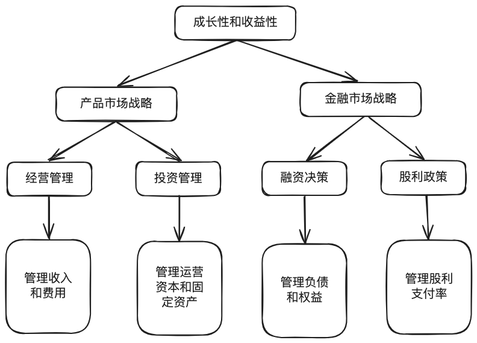
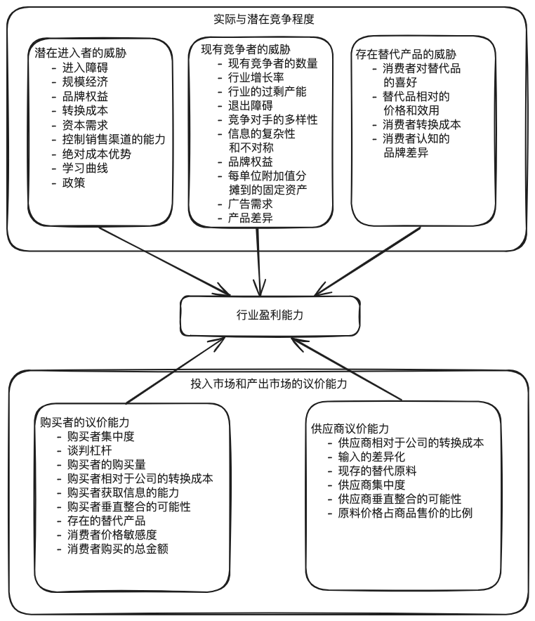
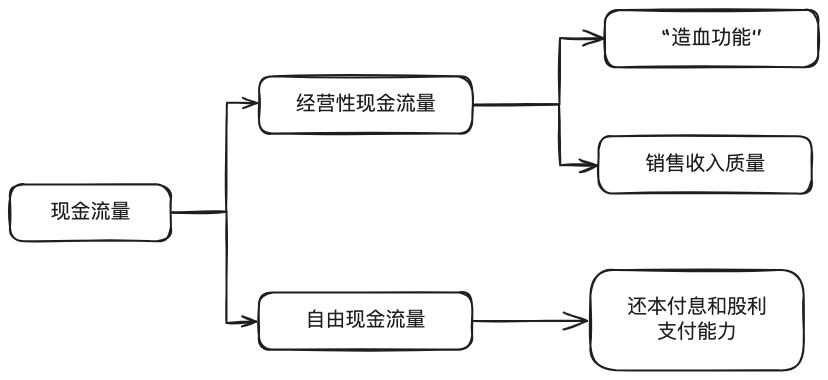

>新开专题：公司分析。本专题主要结合《财务报表分析》和《股市真规则》中的内容，旨在构建一个比之前的 [公司分析框架概述](/post/2024/company-structure-overview/) 更全面的分析框架。由于内容较多，所以拆分为多篇文章。本文为第一部分：基础分析，将深入解读财务报表的基本构成与核心财务指标，帮助读者建立对公司运作的初步认知，并为后续的投资决策提供基础支持。

# 概述

公司整体分析可以分解为以下五个方面：

1. 成长性：一家公司成长得有多快？它的成长性的来源是什么？这种成长性具有怎样的持续性？
2. 收益性：即盈利能力，公司的投资产生了怎样的回报？
3. 财务健康状况：这家公司的财务根基是否牢固？
4. 风险/负担情况：你投资中的风险是什么？即使是最好的企业也有足够的理由不去投资。确定你已经了解企业的全部情况并做了详细的调查，其中的负面因素压不过正面因素。
5. 管理：谁在主持这项业务？他们经营这家公司是为了股东的利益还是为他们自己？这是一个关键性问题。

本文将先分析前三个方面，后两个方面将在后续文章中分析。

## 成长性和收益性驱动因素

从长远来看，公司的价值取决于其成长性和收益性（盈利能力）。这两项能力又取决于其产品市场战略和资本市场战略；而产品市场战略包括公司的经营战略和投资战略，资本市场战略又包括融资战略和股利战略。

# 成长性

首先明确一点，公司是无法保证长期的高速增长的。从历史的观点看，公司盈利长期合计的增长率比经济的增长率略低，强有力的快速增长会吸引激烈的竞争，快速成长的公司可能引起其他公司的诉讼围攻。所以不能仅仅凭借着过去的连续增长率预期公司的未来。**仔细调查公司成长率的来源对评估一家企业的成长质量非常重要**。

从整体上看，一家企业从事的活动就三项：经营、投资、融资。而这三项中尤以经营活动最为重要，从长期经营活动来看，销售增长驱动盈利增长。虽然削减成本也可以让盈利增长，但削减成本是有限度的，而且很多时候的削减成本不过是把财务技巧用到极致而已。所以**重点关注的还是销售增长**。

## 成长来源

首先来看下销售增长的来源，可以从销售增长的内在来源和外部影响因素两方面进行分析。

一般来说，销售增长的内在来源有以下四个：
1. 销售更多的产品或服务
2. 提高价格
3. 销售新的产品或服务
4. 购买其他公司

外部影响因素可以从波特提出的“五大力量理论”来分析。根据该理论，**一个行业的盈利能力由以下五大力量决定**：
1. 购买者的议价能力
   - 购买者集中度
   - 谈判杠杆
   - 购买者的购买量
   - 购买者相对于公司的转换成本
   - 购买者获取信息的能力
   - 购买者垂直整合的可能性
   - 存在的替代产品
   - 消费者价格敏感度
   - 消费者购买的总金额
2. 供应商议价能力
   - 供应商相对于公司的转换成本
   - 输入的差异化
   - 现存的替代原料
   - 供应商集中度
   - 供应商垂直整合的可能性
   - 原料价格占商品售价的比例
3. 潜在进入者的威胁
   - 进入障碍
   - 规模经济
   - 品牌权益
   - 转换成本
   - 资本需求
   - 控制销售渠道的能力
   - 绝对成本优势
   - 学习曲线
   - 政策
4. 存在替代产品的威胁
   - 消费者对替代品的喜好
   - 替代品相对的价格和效用
   - 消费者转换成本
   - 消费者认知的品牌差异
5. 现有竞争者的威胁
   - 现有竞争者的数量
   - 行业增长率
   - 行业的过剩产能
   - 退出障碍
   - 竞争对手的多样性
   - 信息的复杂性和不对称
   - 品牌权益
   - 每单位附加值分摊到的固定资产
   - 广告需求
   - 产品差异

>对公司来说，成长最容易的路径就是在任何情况下你做的都比你的竞争对手好，比他们销售更多的产品，以从他们那里夺取市场份额。

成长性分析的目的在于弄清楚一家公司为什么成长，例如在公司的成长中：
- 有多少来自价格提高？
- 有多少来自销量增长？
- 有多少来自市场份额的增加？
一旦能分析清楚公司成长率的组成元素，就可以知道它的成长来自哪里以及何时可以组合利用。

### 销售增长的第四个来源：购买其他公司

对于销售增长的第四个来源：购买其他公司，需要着重说明一下。

虽然有收购可能性的企业常常备受青睐，但遗憾的是，收购的历史记录往往有好有坏，有太多收购未能给收购方的股东带来真正的利益。而且一项研究表明，即使是很小的收购，相关的业务方在收购前很好，也只有一半的成功机会。

从投资者的角度看，不管怎样，要对通过收购使企业成长的策略保持警惕，最大的理由是：**要弄懂一家公司很困难。记住，一个成功投资者的目标是购买一个好生意，而不是购买兼并机器**！

>关于收购，巴菲特致股东信 2021 中也提到：
>
>长时间以来，大型联合企业常常谋求整体收购一家企业。但这种策略带来了两个显著问题。
>
>首先，大多数真正伟大的企业没有兴趣让任何人接管它们。因此，大型联合企业只能将收购重点放在不太重要、缺乏持久竞争优势的公司上，因而，“收购池”里充斥着平庸的企业，不是一个适合钓肥鱼的池塘。
>
>然后，当企业集团想要在这个池子里捕猎的时候，往往需要支付惊人的溢价。有抱负的企业集团想出了解决方法：他们先自己制造一只价值高估的股票，然后用股票替代货币去完成高价收购。（“用我两只价值5000美元的猫买你价值10000美元的狗。”）

## 成长质量

在分析出公司的成长来源后，还需要深入分析公司的成长质量。收购是一个低质量的创造增长的路径。有很多可以达到目标的路径比收购这条路径要好，尤其是当我们**将注意力从盈利增长转移到销售增长后，因为销售增长是很难伪造的**。而对于盈利增长，则可以使用很多欺骗的方法在销售增长停滞的时候依旧让盈利增长，例如：改变税率、股份数、一次性所得（例如出售业务），疯狂削减成本等等。

>一般而言，任何一家公司盈利增长超过销售增长持续一段时间，例如 5～10 年，都需要深入挖掘这些数字背后的含义。

另外，你应当警惕一次性损益扭曲公司真实的成长性，不要把看到的连续三年或五年的成长率当作福音，还要深入研究数字背后是什么。

### 关于削减成本

相对于一个管理费用低同时效率低的公司，一家更有效率的公司可能是更好的投资选择。因为无论如何，削减成本是不可持续的盈利增长来源，而且如果看到一家公司一直在削减成本，那你应当意识到未来的某一天，它将没有多余的成本可供削减。盈利增长终将慢下来，除非销售增长加速。

>当你看到一家以降低成本来驱动盈利增长的公司，你要思考一下这些成本降低的可持续性。

### 资产管理水平

除以上，还应该关注公司的资产管理能力，良好的资产管理能力能帮助公司更有效地利用其资源，以实现更快的成长。而各类资产的周转速度是公司资产管理水平的重要体现，也是提供公司经产收益率的重要驱动因素。资产管理主要包括两个方面：

- 营运资本管理
- 长期资本管理

#### 营运资本分析

传统的营运资本被定义为公司的流动资产和流动负债之间的差额，但是传统定义并不区分营业营运资本（例如存货、应收帐款、应付账款）和融资营运资本（如现金、短期投资、应付票据）。

$$
营业营运资本=(流动资产-现金和有价证券)-(流动负债-短期投资和长期债务本年到期部分)
$$

分析时应特别关注的营业营运资本项目包括：
- 应收账款
- 存货
- 应付账款

下面这些比率对分析公司营运资本管理水平很有用：

$$营业营运资本对销售收入的比率={营业营运资本\over销售收入}$$

$$营业营运资本周转率 = {销售收入\over营业营运资本}$$

$$应收账款周转率 = {销售收入\over应收账款}$$

$$存货周转率 = {销售成本 \over 存货}$$

$$应付账款周转率 = {购货成本 \over 应付账款} = {销售成本\over 应付账款}$$

$$应收账款周转天数 = {365\over应收账款周转率}$$

$$存货周转天数 = {365\over存货周转率}$$

$$应付账款周转天数 = {365\over应付账款周转率}$$

#### 长期资本分析

长期资产净额的定义：长期资产净额 = 长期资产总额-非付息长期负债

长期资产通常包括：
- 固定资产净值
- 无形资产
- 其他资产

长期资产净额占销售收入的比率，长期资产净额周转率是衡量公司成长效率的重要指标。

$$长期资产净额占销售收入比率={长期资产净额\over销售收入}$$

$$长期资产净额周转率 = {销售收入\over长期资产净额}$$

由于固定资产是公司资产负债表中重要的长期资产。所以通过计算固定资产周转率来判断固定资产的使用率：

$$固定资产周转率 = {销售收入\over固定资产净值}$$

# 收益性

相对于投入公司额资金数量，公司产生了多少利润？这是把一家好公司从平均水平的公司中找出来的关键。

**判断公司盈利能力的最好路径是，将每股盈利与经营性现金流量对照**，因为经营性现金流量显示的是真实利润。要看经营业务要占用的资本，需要考察净利润、毛利润和经营性现金流等。除此之外，还需要考察总资产收益率（ROA）、净资产收益率（ROE）、投入资本回报率（ROIC）等。

在进行分析时候，需要注意以下问题：
1. 公司的销售毛利率与其他选择的竞争战略相符吗？一般来说，差异化战略通常比低成本战略带来更高的销售毛利率；
2. 公司销售毛利率是否发生重大波动？导致这种波动的因素可能是竞争地位的变化、投入成本的变化和期间费用管理效率的变化；
3. 公司对各项期间费用的管理效率如何？

>低成本战略和差异化战略
>- 低成本战略：企业可以通过提供有吸引力的价格，把自己置于竞争对手之前，例如沃尔玛和亚马逊。
>- 差异化战略：开发与竞争对手截然不同的独特商品或服务可以创造竞争优势。这涉及到对研究和开发的持续投资，以维持或改进关键产品或服务。

## 销售毛利率

$$ 销售毛利率 = {销售收入-销售成本\over 销售收入} $$

销售毛利率主要受两个因素的影响：
1. 产品或劳务的价格；
2. 原材料购买成本和产品生产成本；

## 期间费用对销售收入比率

$$ 期间费用率 = {期间费用项目 \over 销售收入} $$

期间费用包括销售费用、管理费用、财务费用和研发费用等。公司的费用水平及构成情况受执行其竞争战略所必须采取的经营活动的影响。
- 执行产品差异化战略的公司必须采取能够实现其产品差异的方法，因此它们可以在提高产品质量和开发新产品方面比必须有更大的投资，因而有较高的研发费用；
- 试图建立品牌形象和提供高质量服务的公司拥有较高的销售和管理费用；
- 低成本竞争战略公司往往在营业费用方面有优势。

## 实际税率

评价公司税金费用可以使用两个指标：

$$ 税金费用率 = {税金费用\over销售收入} $$

$$ 平均税率 = {税金费用 \over 税前收益} $$

## 总资产收益率（ROA）

计算公式：

$$ 销售净利率 = {净利润\over销售收入} $$
$$ 资产周转率 = {销售收入\over资产} $$
$$ 总资产收益率 = 销售净利率 \times 资产周转率 $$

- 销售净利率：告诉我们每一美元的销售收入在公司付完全部成本后，还剩多少。
- 资产周转率：大致告诉我们一家公司以怎样的效率从一美元的资产中产生收入。
- 二者相乘，就可以得到资产收益率，即告诉我们一家公司每一美元的资产能够产生多少利润。

从总资产收益率的计算公式可以看出，提高收益率的方式有两种：
1. 提高产品价格
2. 加快资产周转率

这对应了公司的两种战略：差异化战略和低成本战略。对任何一个不能对产品大幅加价的公司来说，严格的存货管理是关键，因为它降低了资本的占用数量，这些资本能给资产带来回报。换句话说，通过减少存货水平，可以减少财务资源的占用，使更多的资本可以用于其他用途中，如投资新项目、提高生产效率或者还债。

## 🌟净资产收益率（ROE）

净资产收益率是一个全面评估公司盈利能力的指标，因为它反映的是 **一家公司所有者权益的效率**。

净资产收益率的含义包括以下几个方面：
1. 盈利能力：净资产收益率反映了公司利用自有资本创造利润的能力。较高的净资产收益率表示公司能够有效地利用资本，实现更高的利润水平。
2. 资本回报：净资产收益率衡量了投资者对于投资公司股权的回报率。较高的净资产收益率意味着投资者能够获得更高的回报，者对于吸引投资和增加股东价值非常重要。
3. 经营效率：净资产收益率还反映了公司在运营过程中的效率水平。较高的净资产收益率表示公司能够有效地管理资产和负债，实现更高的利润率。
4. 比较分析：净资产收益率可以用于不同公司之间的比较。通过比较同行业或竞争对手的净资产收益率，可以评估公司在利润创造方面的相对表现，帮助投资者做出决策。

计算净资产收益率，可以用公司的财务杠杆比率乘以总资产收益率即可。

$$ 财务杠杆比率 = {总资产\over所有者权益（股东权益）} $$
$$ 净资产收益率 = 总资产收益率 \times 财务杠杆比率 $$
$$ 总资产收益率(ROA) = 销售净利率 \times 总资产周转率 $$
$$ 净资产收益率(ROE) = 销售净利率 \times 资产周转率 \times 财务杠杆比率 = 总资产收益率(ROA) \times 财务杠杆比率 $$

其中的财务杠杆比率是用来测量一家公司负债相对于所有者权益的程度。财务杠杆比率需要仔细观察。**对任何一种负债，数额适当可以推进收益，但负债太高可能会导致灾难**。

综上可以知道，有三个比率可以推进净资产收益率：
1. 销售净利率
2. 资产周转率
3. 财务杠杆比率

>评估企业净资产收益率（ROE）的粗略标准
>
>- 非金融类公司：在没有过多使用财务杠杆比率的前提下，能产生 10% 以上的净资产收益率就是值得投资的。如果你能够发现一家潜在净资产收益率稳定在 20% 以上的公司，你真的是发现了一个好机会。
>- 金融类公司：由于银行的财务杠杆比率比较高，所以净资产收益率能在 12% 以上的公司就是好公司。

当使用净资产收益率（ROE）评估一家公司时，需要注意以下两点：
1. 银行的财务杠杆比率永远是巨大的，所以如果银行机构使用看起来先对非银行机构高的财务杠杆比率时不要恐慌。因为银行的财务杠杆比率永远那么高，所以要提高金融公司的衡量标准，寻找净资产收益率稳定在 12% 以上的公司。
2. 如果净资产收益率太高，有可能不真实。净资产收益率在 40% 以上是没有意义的，因为它也许已经被公司的财务结构扭曲了，比如下面这些情况，这些常常会扭曲净资产收益率，因为在这些情况下公司权益的基础降低了。
   - 公司最近可能从母公司拆分出来
   - 公司可能回购了很多股票
   - 公司进行了大规模的加价等

>如何理解上面提到的“稳定”？
>- 时间周期：通常，连续三到五年的高ROE表现可以被认为是一种稳定的表现。这意味着公司不仅在短期内表现良好，还能在多个财年中保持较高的盈利能力。
>- 行业对比：对比同一行业内其他公司，如果目标公司的ROE持续高于行业平均水平，并且没有大幅波动，也可以视为稳定。
>- 经济周期：考虑到经济周期的影响，某些公司可能在经济繁荣期表现更好，而在经济衰退期维持较高的ROE则更具挑战性。如果公司在不同经济周期中都能保持较高的ROE，那其稳定性更为可信。

## 现金流量

现金流量是企业生存和发展的“血液”。现金流量表分为三大部分：
- 经营活动产生的现金流量：企业的“造血功能”；
- 投资活动产生的现金流量：企业的“放血功能”；
- 筹资活动产生的现金流量：企业的“输血功能”。
当“造血功能”大于“放血功能”时，企业不靠“输血”（股东注资或银行贷款）也可以高政无忧。反之，当“放血功能”大于“造血功能”时，企业只能靠“输血”才能安然无恙。

现金流量可以从经营性现金流量（Operational Cash Flow）和自由现金流量（Free Cash Flow）两个角度分析：

## 经营性现金流量

经营性现金流量（Operational Cash Flow）是指企业在特定时期内，通过日常经营活动产生的现金流入减去现金流出的净额。它主要包括以下内容：
- 销售商品、提供劳务收到的现金
- 收到的税费返还
- 支付购买商品、接受劳务的现金
- 支付给职工及各项税费的现金

其关常用指标有以下几个。

### 经营活动产生的现金流量净额

$$ 经营活动产生的现金流量净额 = 经营活动现金流入 - 经营活动现金流出 $$

经营活动现金流入 主要包括：

- 销售商品、提供劳务收到的现金
- 收到的税费返还
- 收到的其他与经营活动有关的现金（如租金收入、版税收入等）

经营活动现金流出 主要包括：

- 购买商品、接受劳务支付的现金
- 支付给职工以及为职工支付的现金（包括工资、奖金、福利等）
- 支付的各项税费（如所得税、增值税、营业税等）
- 支付的其他与经营活动有关的现金（如租金支出、广告费、维修费等）

它用于衡量企业通过日常经营活动获得的净现金流入，它直接反映了企业的经营能力。

### 现金流量充裕率（Cash Flow Adequacy Ratio）

$$
现金流量充裕率 = {经营活动产生的现金流量 \over 资本支出 + 偿还借款的现金流出 + 股利}
$$

- 现金流量充裕率 > 1：表明企业流动性风险低，经营活动产生的现金流量足以覆盖资本支出、偿还债务和发放现金股利；
- 现金流量充裕率 = 1：现金流足够，但出错空间有限；
- 现金流量充裕率 < 1：表明企业流动性风险高。

### 经营性现金流量对资本支出的比率

$$
经营性现金流量对资本支出的比率 = {经营活动产生的现金流量 \over 资本支出}
$$

该比率用于衡量企业利用经营活动产生的现金流量进行是否足够覆盖其资本支出。

### 经营性现金流量对借款偿还比率

计算公式：

$$
经营性现金流量对借款偿还的比率 = {经营活动产生的现金流量 \over 偿还银行借款的现金流量}
$$

该比率用于衡量企业利用当年经营活动产生的现金流量偿还银行借款的能力。比率越高，表明企业偿还银行借款的能力越强。

### 经营性现金流量对股利支付比率

计算公式：

$$
经营性现金流量对股利支付比率 = {经营活动产生的现金流量 \over 支付股利的现金流出}
$$

这一比率用于衡量企业利用经营活动产生的现金流量方法现金股利的能力。比率越高，说明企业发放现金股利的保障能力越高。

## 🌟自由现金流量

自由现金流有广义和狭义之分：
- 广义自由现金流：主要用于衡量企业在维持现有运营条件下的现金流可支配能力，有助于评估企业的基本财务健康状况和持续经营能力。
- 狭义自由现金流：在广义自由现金流的基础上进一步扣除了现金股利，用于评估企业在进行常规股东分红后的实际可用现金流，有助于股东和投资者评估企业的分红支付能力和投资回报潜力。

计算公式：

- 广义自由现金流：$$广义的自由现金流量 = 经营活动产生的现金流量 - 维持现有经营规模的资本性支出$$
- 狭义自由现金流：$$狭义自由现金流量 = 经营活动产生的现金流量 - (资本性支出 + 现金股利)$$

有些时候自由现金流常常被当做“所有者盈余”，它表示一家公司可以提出而又不影响公司业务的现金的数量。

>自由现金流的粗略标准
>不管怎样，对于任何公司来说，比 5% 多的销售收入转化成自由现金流量是必要的，可以做用销售收入去除自由现金流的到这个比率。

## 投入资本收益率（ROIC）

投入资本收益率是一个久经考研的分析资本收益的比率，这个比率调整了资产收益率和净资产收益率的某些特征。它相当复杂，只需要知道如何解释即可，它是一个比资产收益率和净资产收益率更全面、更好的衡量盈利能力的工具。

投入资本收益率和总资产收益率、净资产收益率的使用标准不同：
- 总资产收益率和净资产收益率使用的是净利润；
- 投入资本收益率使用的是税后的营业利润，并且是扣除财务费用之前。而且投入资本收益率的目标是除去公司不同的融资决定造成的影响——不管是使用债券融资还是所有者权益——这样公司就可以尽可能地聚焦在核心业务的盈利能力上。

投入资本收益率是衡量一家公司**真实经营业绩最好的度量指标**，它度量的是企业全部投资资本的收益率，不管资本的来源是什么。

$$
投入资本收益率(ROIC) = {税后净营业利润(NOPAT) \over 投资资本}
$$

### NOPAT 的计算

公式的分子是税后净营业利润，而且是扣除利息费用之前的，这里仅需要了解粗略计算公式即可。

**粗略**的计算公式如下：

$$
NOPAT = 营业利润 \times (1 - 税率)
$$

详细的计算公式分如下几个步骤：

**1.计算税前营业利润（EBIT）**

$$
EBIT = 营业收入 - 营业成本 - 营业费用
$$

**2.调整非营业利润和损失**

如果存在非营业利润（如投资收益、资产出售收益等），则需要从税前营业利润中减去这些非营业利润。
如果存在非营业损失（如资产减值、罚款等），则需要加上这些非营业损失。

调整后的营业利润（EBIT Adj.）计算如下：
$$
EBIT Adj. = EBIT + 非营业损失 - 非营业利润
$$

**3.计算税项**

根据公司的边际税率（即公司所得税税率），计算上述调整后的营业利润的税项。如果税率是统一的，可以直接使用该税率进行计算。如果税率因不同利润来源而异，可能需要对不同部分的利润应用不同的税率。

税项（Taxes）计算如下：
$$
Taxes = EBIT Adj. \times 税率
$$

**4.计算NOPAT**

从调整后的营业利润中减去税项，得到税后净营业利润（NOPAT）。

$$ NOPAT = EBIT Adj. - Taxes $$
或者使用以下等价公式：
$$ NOPAT = EBIT \times (1 - 税率) + 税后非营业利润或损失 $$

### 投资资本的计算

分母有些复杂，计算公式如下：

$$ 总资本 = 股东权益 + 带息负债 $$
$$ 超额现金 = 总现金及现金等价物 - 正常运营所需的现金 $$
$$ 投资资本 = 总资本 - 不附带利息的流动负债（通常是应付账款和其他流动资产）-超额现金 $$

如果商誉占资产一个很大的百分比，还要减去商誉。

# 财务健康状况

**只要负债成本低于投资收益，财务杠杆就会提高公司净资产收益率**。根据不同的负债成本，可以将公司债务分为三类：
1. 富有明确利息费用的负债：如短期借款、应付票据、长期借款等；
2. 没有利息费用的负债：如应收账款、递延税款等；
3. 附有隐含利息费用的负债：如资本租赁服务、退休金负债等；

>递延税款（Deferred Tax）是一种会计处理方法，用于反映企业因时间差异而产生的税务负担或优惠。这些时间差异可能是由于不同的会计和税务处理方法导致的，其具体含义和作用如下：
>
>含义
>
>1. 时间差异：递延税款主要是由于企业的会计利润和应税利润之间的时间差异。例如，某些收入和费用在会计账目和税务账目中的确认时间不同，从而导致递延税款的产生。
>2. 确认递延税项：
>   - 递延税资产：当预计未来会产生可抵扣的应税金额时，企业会确认递延税资产。例如，因计提了坏账准备金，但税务上尚未抵扣这些费用。
>   - 递延税负债：当预计未来需要支付更多的税款时，企业会确认递延税负债。例如，加速折旧导致会计利润大于税务利润，从而在未来缴纳更多税款。
>
>作用
>
>1. 平滑利润：通过递延税款的确认和摊销，企业可以平滑不同时期的利润，减少财务报表的波动。
>2. 税务规划：有助于企业进行税务规划，通过递延税款的管理，实现税务负担的合理分配。
>3. 符合会计准则：根据《国际财务报告准则（IFRS）》或《美国通用会计准则（GAAP）》，企业需要确认和列报递延税款，以反映真实的财务状况。

评价公司财务健康状况一般包括两个方面：
- 短期流动性水平
- 长期偿债能力

## 短期流动性分析

短期流动性是指公司支付**即将到期债务**的能力。以下比率可以用于评估短期流动性水平：

### 流动比率(Current Ratio)

$$
流动比率 = {流动资产 \over 流动负债}
$$

流动比率反映企业的短期偿债能力，即如果公司必须立马还清债务的话，公司变现出多少现金，流动比率越高，企业的短期偿债能力越强。

>粗略的衡量标准
>作为一般的惯例，流动比率在 1.5 左右或者更高一些，通常意味着公司能够应付正常的运营之需，不会遇到太大麻烦。

流动比率是使用最广泛的流动性指标，在评价流动比率时应当注意以下问题：
1. 对于流动比率的评价应结合公司所处行业的标准，不同行业其资产、负债占用情况不同，正常的流动比率标准有很大差别；
2. 注意人为因素对流动比率指标的影响，通过在期末季中偿还短期债务，下期初再举债的方式认为跳高期末流动比率；
3. 流动资产中各项目变现能力差别很大，因此相同的流动比率不代表公司的短期流动性也相同，还需要对其他指标进行补充分析。

### 速动比率(Quick Ratio)

由于一些流动资产（如存货、待摊和预付费用等）变现较为缓慢，缺乏稳定的市场价值，所以这里有一个对流动性更为保守的性能测试指标——速动比率。

$$ 速动比率 = {速动资产 \over 流动负债} $$

其中速动资产计算公式如下：

$$速动资产 = 流动资产 - 存货$$

$$速动资产 = 流动资产 - 存货 - 待摊费用 - 预付账款$$

$$速动资产 = 货币资金 + 交易性金融资产 + 应付账款 + 应收票据 + 其他应收款项$$

速动比率是假定公司在面临财务危机或清算时，在存货、预付费用及其他不确定流动性资产均假定全无价值的情况下，仅以速动资产即可支付流动负债的比率大小。因此速动比率在分析公司应付意外事件能力的高低十分有效。

>特别说明
>这个比率对 **制造业** 和 **零售业** 公司特别有用，因为这两类的公司存货占用了大量的资金。通常速动比率高于 1.0 被视为公司处于比较好的状态，但一定要看一下同行业的实际情况。

## 长期偿债能力分析

### 权益负债率(Debt to Equity Ratio)

$$
权益负债率 = {长期负债\over所有者权益}
$$

它的含义是，公司每 1 美元的权益负担多少长期负债。

### 已获利息倍数(Times Interest Earned，TIE)

又称利息保障倍数。是衡量公司偿还利息费用能力的一个财务指标。它通过公司的息税前利润（Earnings Before Interest and Taxes，简称EBIT）和利息费用（Interest Expense）的比较来计算，反映了公司在支付利息后剩余的利润水平。

计算公式如下：

$$
已获利息倍数(TIE) = {息税前利润(EBIT) \over 利息费用(Interest Expense)}
$$

其中息税前利润(EBIT)的计算公式如下：

$$ EBIT = 营业收入 - 营业成本 - 营业费用 $$
或者
$$ EBIT = 净利润 + 利息费用 + 所得税 $$

我们**一般用这个比率来衡量企业在扣除利息和所得税之前的盈利足够它偿还几次利息**。利润多的公司能更多地负担高的利息费用，而利润少的公司，如果利润出乎意料的下跌，公司可能陷入困难。

>特别说明
>可以明确地说，已获利息倍数越高越好。随着时间的推移，你最好考察一下已获利息倍数的趋势。通过计算 **过去五年的比例**，你能够看到公司已获利息倍数是否逐年下降，公司是否变得风险越来越大，或者公司的财务状况正在改善。

# 空头情形

在评估完成长性、盈利能力和财务健康状况后，下一个任务是研究你正在分析股票的空头情况。从列举全部的潜在负面因素开始，包括从最显而易见到可能性很小的所有因素。
- 你的投资出了什么问题？
- 当你想买入的时候，为什么某些人更愿意卖出？
在一家高质量公司因受外来冲击而股票价格暂时回落时，对那些想趁机买入的人而言，设想一个空头情况尤其重要，因为这种冲击有时是测量公司状况的很好的检测手段。

即便已经做出购买的决定，你设想的空头情形也将对你有很大的帮助。经过对负面因素仔细调研之后，你就有信心在暂时性的艰难时期握紧你的股票，或者认识到这个艰难的经历也许真的是情况变得更糟的转折点。

# 总结

1. 当你评估一家公司成长率时，不要被迷人的历史性增长冲昏头脑，确信你已经弄清楚成长的来源，以及经过一段时间后，这种成长性是否还具有可持续性。
2. 对依赖收购推进成长的公司保持警惕。大多数收购未能给收购方公司的股东带来正回报，而且这些收购使得评估真实的成长率变得困难。
3. 如果**盈利增长在一个很长的阶段超过销售收入的增长**，这也许是一个**人造增长**的信号。一定要钻研数据，看一看公司是怎样从停滞的销售增长挤压出更多的利润的。
4. 资产收益率可用来度量公司每 1 美元资产产生利润的数量。高资产收益率的公司在把资产转化成利润方面做的更好。（注：这里指的是总资产收益率）。
5. 净资产收益率是检测盈利能力的好指标，因为它测量的是公司怎样用股东的钱为股东赚钱利润。但是 **因为公司可以通过更多负债来推高它的净资产收益率，所以不要把这个指标当成真理**。对一家非金融类公司，在没有过度使用杠杆的前提下，至少要有 10% 的净资产收益率。
6. 自由现金流给了公司融资的弹性，因为公司可以不依赖资本市场来支持它的扩张。自由现金流为负的公司不得不去贷款，或销售另外的股票来维持公司的经营，而且如果公司遇到危机时刻，比如市场变得不稳定，这可能变成一件危险的事情。
7. **对一家有太高财务杠杆比率的公司要保持警惕。因为债务是一项固定费用，它有放大盈利的能力，同时也招致更多的风险**。
8. 买股票之前，思考所有潜在的负面因素，这能帮助你在坏消息的苗头显露出来时做出更明智的决定。
