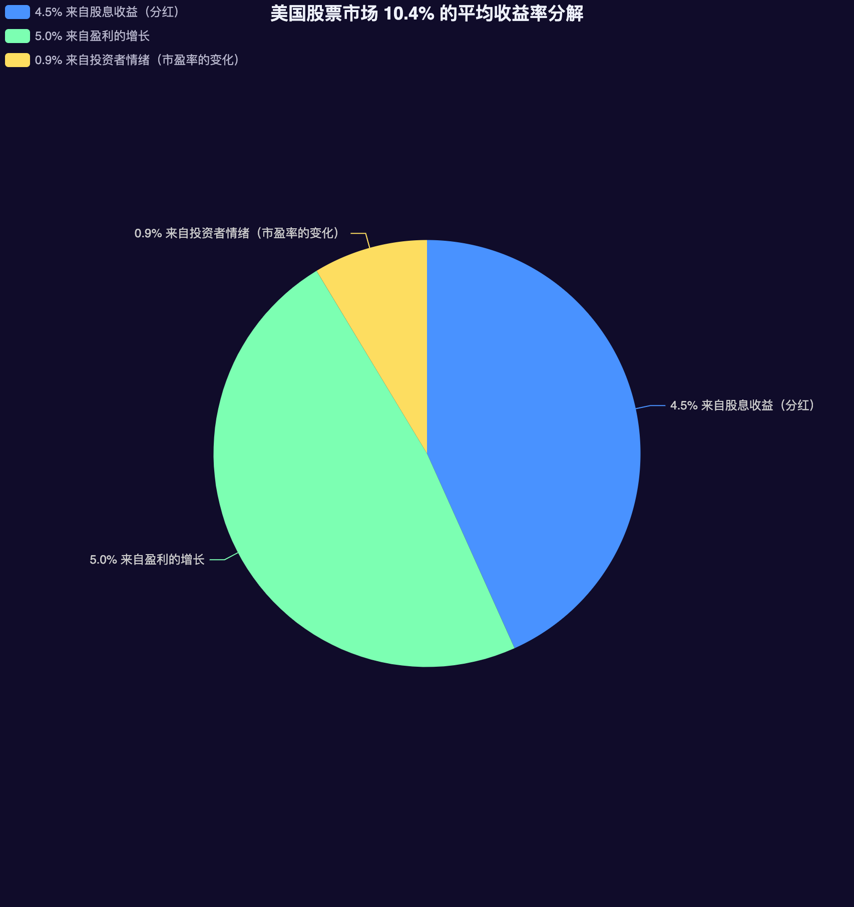

>本系列的第一篇文章 [公司分析 1：基础](/post/2024/company-structure-1) 探讨了财务报表的基本构成与核心财务指标。第二篇 [公司分析 2：管理](/post/2024/company-structure-2) 进一步分析了评估管理团队的标准。第三篇 [公司分析 3：常见的财务伪装](/post/2024/company-structure-3) 探讨了识别和解析潜在的财务伪装手法。本文为公司分析系列的第四篇，将深入探讨估值的基础方法和指标，从而更好地理解公司的内在价值和市场表现。

估值基础的三大因素——一家公司未来的现金流量、时限和风险。

本质上讲，股票市场的回报来自两个关键的部分：投资收益和投机收益。

回顾整个 20 世纪，约翰·博格尔发现美国股票市场 10.4% 的平均收益率可以分解为以下几部分：

即经历一个很长时间的跨度，投资收益的成果远远高于投机收益的成果。

这里又要谈一下那个老生常谈的比较了：投资者和投机者的区别。关于这些区别，格雷厄姆早在其著作《聪敏的投资者》中提到过，我在这里再回顾一下：

>投资者与投机者之间的区别
>
>投资者通常以低于资产估值的价格买入股票，其收益取决于这些股票的财务表现。与之形成鲜明对比的是，投机者购买股票是因为他们相信股价会上涨，并且认为总会有其他投资者愿意在某个时点以更高的价格买入。
>
>投资者的回报建立在大量准确的分析基础上，而投机者的收益则依赖于是否有其他人愿意接盘。

# 按估值全价买入很难投资成功

再次重申一个常被提及但非常重要的观点：

>买股票就是买公司

但即便是买入最好的公司的股票，如果买入的价格过高，也会是一个糟糕的投资。要投资成功就需要在**有吸引力的价位买到好公司的股票**。如果我们发现了一家好公司，认真对其做估值，然后在一个合理估值的折扣价格买入，就可以很好地避免因市场情绪波动造成的损失。

买入一家卓越的公司的股票，公司可以轻易地贡献利润，分红派息，然而，股票估值却可能因明显的负面影响而被大幅降低，即使是最稳固的投资收益，在市盈率从 20 降低到 15 的情况下，也会变得非常糟糕。**事实上，估值的下降通常伴随着基本面的恶化——低速的盈利增长和类似的退步**。

**而我们能做的就是坚持不懈地做好分析工作，识别优秀的公司，但是我们不能预测其他市场参与者将怎样给股票估值，所以我们不应该尝试去预测。**

# 常见的估值指标

## 市销率（P/S）

市销率是所有比率中最基础的比率，计算公式如下：

$$ 市销率 = {现在的股票价格 \over 每股的销售收入} $$

含义：市销率反映的销售收入比财务报表中的盈利更真实，因为公司使用的会计伎俩通常是想方设法推高利润。一般来说，市销率越低，表明公司的股票估值越低，可能具有更高的投资价值。

优势：市销率特别适用于评估尚未盈利的企业，这是它相对于市盈率 (P/E) 的一个重要优势。销售收入通常比利润更稳定，不易被操纵，因此市销率提供了一个相对可靠的估值指标。

缺陷：尽管市销率在研究一家利润变化比较大的公司时可能是有用的，因为我们可以比较当前的市销率和历史的市销率，但**它不是一个可以依赖的指标。尤其是不要比较不同行业的市销率数据，除非两个行业有水平相似的盈利能力**。

## 市净率（P/B）

另一个普遍使用的指标就是市净率（P/B）。这种投资理念认为固定的盈利或现金流是短暂的，我们真正能指望的是当前 **有形资产** 的价值。

计算公式：

$$ 市净率 = {一只股票的市场价值\over当期资产负债表的账面价值（即所有者权益或净资产）} = {每股股票价格\over 每股净资产} $$

缺陷：公司通过无形资产创造的价值，大部分不会立刻计入账面价值，即无法反映这部分的价值。

>对于服务性企业，市净率没有任何意义。

因为对于服务性企业来说，其主要价值往往不在于物理资产，而是在于其品牌、客户关系、技术、专利、人才等无形资产。这些无形资产可能不会在公司的账面上以货币形式体现，但它们对于公司的长期价值和盈利能力至关重要。因此，如果一个服务性企业的市净率较高，这并不一定意味着它被高估了，因为其账面价值可能没有充分反映其无形资产的价值。

>当使用市净率对股票估值时，另一个需要特别注意的一点是商誉，它能在某一点上抬高账面价值，从而时市净率下降。

商誉通常是在企业并购中产生的，当一家公司收购另一家公司时，目标公司的账面价值和实际购买价格之间的差价叫做商誉，商誉应该体现所有有形资产、员工的智慧、强大的客户关系、有效的内部工序等这些使目标企业值得购买的各种因素。

可惜的是，商誉常常使收购方公司在购买目标公司时铤而走险，因为收购方常常为目标公司支付得更多。**要高度怀疑那些利用商誉虚构账面价值的公司，这些公司的市净率可能很低**。

>当考察市净率的时候，要知道它与净资产收益率（ROE）有关。

市净率（P/B）与净资产收益率（ROE）和销售净利率（NPR）之间存在着密切的关系。

市净率与净资产收益率的关系：

$$ 市净率（P/B） = 市盈率（P/E） \times 净资产收益率（ROE） $$

这个公式表明，在相同的市盈率下，较高的净资产收益率（ROE）会导致较高的市净率。这是因为高 ROE 意味着公司能够更有效地利用股东权益创造利润，投资者通常愿意为此支付更高的溢价。

市净率与销售净利率的关系：

$$ 净资产收益率（ROE） = 销售净利率 \times 资产周转率 \times 财务杠杆 $$

该公式也被称为杜邦公式，可以清楚的看到销售净利率如何影响净资产收益率。

>一家相对于同行业或市场市净率低且有高净资产收益率的公司可能是一个潜在的便宜货。但这是一个初步的观点，在单独使用市净率给股票估值前，还要做某些深度挖掘工作。

深入理解：为什么说：“一家相对于同行业或市场市净率低且有高净资产收益率的公司可能是一个潜在的便宜货”？

低市净率意味着公司的市场估值相对于其账面价值较低。而高净资产收益率表示公司能够有效地利用股东权益创造利润。这样的组合可能意味着公司的内在价值被低估。但是同时也要注意到：
- 净资产收益率的持续性：高净资产收益率是否可持续很重要。
- 行业特性：不同行业的合理市净率和净资产收益率水平可能不同。
- 公司成长性：未来增长潜力也会影响投资价值。

仅关注低市净率和高净资产收益率可能会陷入价值陷阱。例如，周期性行业在周期顶部可能出现短期高净资产收益率。

>尽管市净率对于服务性公司并不十分有效，但是它在给金融性公司估值时是很好用的，因为大多数金融性公司的资产负债表上都有大量的流动资产。只要能确定公司的资产负债表上没有巨额不良贷款，市净率可能是一个筛选被低估的金融股的可靠路径。
>
>但是要记住一点：如果金融类公司股票以低于账面价值交易（即市净率低于 1.0），则意味着公司正在经历某种麻烦，所以在投资之前要仔细研究这家公司账面价值有多可靠。

## 🌟 市盈率（P/E）

对收益进行任何严肃、认真的讨论，都会涉及每股市价与每股收益的比率（price/earrings ratio），也被称为本益比（P/E ratio）、市盈率倍数（price-earnings multiple），或者简称市盈率（P/E）。**它代表了投资者愿意为 1 单位利润所支付的价格**。

计算公式如下：

$$ 市盈率（P/E） = {当前股票价格\over每股收益（EPS）} $$

这里讨论的 **每股收益（EPS）通常指的是每股基本收益，也就是每股净收益**。

市盈率可以看作是一家上市公司获得的收益可以使投资者收回最初投资成本所需的年数，当然前提是要假定公司每年收益保持不变。

优点：市盈率的优点在于对于现金流来说，会计盈利能更好地取代销售收入的会计意义，而且它是比账面价值更接近市场的数据。此外，每股盈利数据是相当容易获得的。

使用市盈率最容易的一个办法是把它和一个基准比较，例如同行业中的其他公司、整个市场或同一公司的不同时间点。一家公司以比它的同行业低的市盈率交易是值得购买的，但是记住，即使是相同行业的公司也有可能有不同的资本结构、风险水平和增长率，所有这些都会影响市盈率。**在所有因素都相同的情况下，一家成长迅速、负债较少和再投资需求较低的公司，即便是市盈率较高，也是值得购买的**。

>大体上，把一家公司的市盈率和同行业的公司或者与市场比较是有价值的，但是这些不是你可以依赖的最后决定买入或者卖出的方法。

**把一只股票的市盈率和它的历史市盈率比较是有用的，尤其对那些比较稳定的、业务没有大的变化的公司来说更是如此**。如果可以找到一家稳定的公司以大致相同的速度成长，同时和过去有大致一样的预期，但是它以一个比长期平均水平低的市盈率交易，就可以关注它了。它有可能是风险水平或业务前景有了变化，这是导致低市盈率的正当理由，也可能是市场以一个非理性的低水平给股票标价导致的低市盈率。

**风险、成长性和资本需求是决定一只股票市盈率的基础**。成长性较高的公司应该有一个较高的市盈率，高风险、有高资本需求的公司，应当有一个较低的市盈率。

>哪些公司应该有较高的市盈率？
>
>1. 现金流充沛的公司很可能再投资需求较低，这意味着这类公司合理的市盈率应当比普通公司高。
>2. 有高增长率的公司，只要这种成长不是通过冒更大风险换来的，也应当有较高的市盈率。

### 使用市盈率时要注意的点

当使用市盈率时，记住下面几条，可以让你误用市盈率的可能性减少：
1. **这家公司最近出售业务或资产了吗？** 如果这家公司出售业务或者出售了它在其他公司的投资，那么它的利润很可能是夸大的，因此有较低的市盈率。我们不应该把一家公司的估值建立在这样的基础上，**要以营业利润为基础**。
2. **公司最近发生了一大笔非经常性费用吗？** 如果公司重组或关闭工厂，利润很可能降低，这可能推高市盈率。
3. **这家公司更有周期性吗？** 公司经过繁荣和低迷周期，需要引起投资者更多的注意。尽管你认为一家很低市盈率的公司很便宜，但这正是买入周期性股票的错误时机，因为它意味着该公司的利润在最近时间里达到最高点，周期性意味着它很可能迅速下降。
4. **这家公司把产生的现金流的资产资本化还是费用话？** 把资产费用化的公司很可能有一个较低的盈利，而且在任何一个特定的年份它的市盈率都比把费用资本化的公司市盈率高。

深入理解：“把资产费用化的公司很可能有一个较低的盈利，而且在任何一个特定年份它的市盈率都比把费用资本化的公司市盈率高”

把资产费用化的公司确实可能在短期内有较低的净利润,从而导致较高的市盈率。原因如下:
1. 费用支出计入当期费用：当一家公司将费用计入当期营业成本或经营费用时,会增加当期的支出,从而减少净利润。相比之下,将费用资本化可将其分摊在未来几年的折旧或摊销中。
2. 利润缩水影响盈利指标：较高的费用支出会直接减少公司的净利润数字,使盈利能力相关指标如每股收益（EPS）下降。而市盈率等估值指标是基于盈利能力计算的,当 EPS 下降时,在相同的股价水平下,市盈率就会上升。
3. 保守核算原则影响利润：将费用计入当期是一种较为保守的会计处理方式,反映了"费用优先于收益"的会计原则。这使得利润在短期内被低估,从而可能导致市盈率暂时性提高。
4. 折旧费用递延影响长期：资产资本化后通过折旧分年摊销成本,前期虽然利润较高,但长期来看折旧费用会抵减利润,两种方式的利润在长期会趋同。
 
 因此，尽管资产费用化会在短期拉低利润,提高市盈率,但从长远来看,两种处理方式对公司的实际盈利能力影响并不显著。

### 三种市盈率的区别

市盈率有三种：静态市盈率、滚动市盈率 TTM 和预期市盈率:

1. 静态市盈率(Static P/E)：静态市盈率使用**最近一个会计年度的盈利**数据计算。公式为:  $静态市盈率 = 股价\div最近一年每股收益$
2. 滚动市盈率TTM (Trailing Twelve Months P/E)：滚动市盈率使用**最近 12 个月的盈利数据**，体现了公司最新的经营状况。公式为:  $滚动市盈率 = 股价\div最近12个月每股收益$
3. 预期市盈率 (Forward P/E)：预期市盈率使用分析师对**未来 12 个月盈利的预测**数据计算。公式为: $预期市盈率 = 股价\div未来12个月预期每股收益$

优缺点：
1. **静态市盈率**：
	- 优势：提供了基于公司过去一个完整会计年度的盈利数据的简单比较。
	- 局限性：可能无法反映公司最近的经营状况变化，特别是对于那些季度业绩波动较大的公司。
2. 滚动市盈率（TTM P/E）：
	- 优势：包含了最新的财务数据，能够更及时地反映公司的盈利能力。
	- 局限性：如果最近的季度业绩异常（如一次性费用或收益），可能会扭曲市盈率的真实水平。
 3. 预期市盈率（Forward P/E）：
	- 优势：基于对未来盈利的预测，为投资者提供了一个关于公司未来增长潜力的视角。
	- 局限性：预测的准确性依赖于分析师的估计，可能存在偏差，且未来盈利的不确定性较高。
 
 投资者通常会结合使用这三种市盈率，以获得对公司估值的全面了解：
 - 静态市盈率可以帮助了解公司历史盈利水平。
 - 滚动市盈率TTM提供了基于最近12个月数据的盈利能力评估。
 - 预期市盈率则提供了对未来盈利增长的预期。
 
 此外，投资者还需要考虑其他因素，如公司的增长前景、行业状况、宏观经济环境等，来综合评估一个公司的估值是否合理。因此，没有绝对的“更准”，而是需要根据具体情况和投资目标来选择最合适的市盈率指标。

## 每股净收益（EPS）

每股净收益（EPS）是衡量公司盈利能力的一个重要财务指标。它表示公司每一股普通股所产生的利润，它反映了公司为每位股东创造的价值。

计算公式：

$$ EPS = {(净利润 - 优先股股利) \over 发行在外的普通股加权平均数} $$

计算出公司的每股收益数据，然后跟上一年的比较，就可以得到收益增长率。

### 每股收益增长率结合市盈率的选股标准

>一个精炼有效的原则：任何一家公司的股票如果定价合理的话，市盈率（P/E）与收益增长率（EPS radio）是相等的。如果公司股票市盈率低于收益增长率，那么你可能找到了一只被低估的股票。

在考虑股息时，我们可以利用一个稍微复杂的公式对公司收益增长率和市盈率比较。我们首先找到公司收益的长期增长率（假设 A 公司收益的长期增长率 12%），然后加上股息率（假设 A 公司股息率 3%），最后找到市盈率（假设 A 公司市盈率 10），代入以下公式：

$$ R = {公司的长期收益增长率 + 股息收益率 \over 市盈率} $$

计算出的结果 R 可以代入下面的判断标准：
1. R < 1：这只股票比较差；
2. 1 < R < 1.5：那么这只股票还不错，但是不够理想；
3. 1.5 < R < 2：比较好，但还是不够理想；
4. R > 2：非常好的机会。

我们真正要找的是公司收益率相当于市盈率 2 倍或者更高的股票。

>有关增长率有一点需要说明：在其他条件完全相同的情况下，收益增长率较高的股票更值得买入，比如收益增长率为20%（市盈率为20%）的股票要优于增长率为10%（市盈率为10%）的股票。

## 市盈率相对盈利成长比率（PEG）

PEG 是市盈率的一个分支，它的计算公式如下：

就是用一家公司的市盈率除以它的每股收益增长率。

$$ PEG =  {市盈率\over 每股收益增长率} $$

当你使用 PEG 的时候，你正在假定全部的增长率是相等的，同时与增长率相伴的是同样数量的资金和同等大小的风险。如果用少量资金产生同样的增长率，这样的公司应该更有价值，它要冒的风险也相对较小。

总体来说 PEG 的值为 1 是一个判断标准：
- PEG<1：股票相对于其增长率可能被低估。
- PEG>1：股票相对于其增长率可能被高估。

## 盈利收益率

对市盈率做一个变动，用每股盈利除以每股的市价（即市盈率的倒数），这样就可以得到盈利收益率：

$$ 盈利收益率 = {每股盈利\over 每股市价} = {1\over 市盈率} $$

含义：投资者每投入 1 元所能得到的盈利回报。它反映了公司的盈利能力相对于其股票价格的水平。

作用：它盈利收益率可以被视为股票投资的预期回报率，所以可以用它和其他资产做比较，比如对比债券收益率。

>需要注意的是，虽然盈利收益率是一个有用的指标，但它不应该作为唯一的投资决策依据。
## 🌟 现金收益率

最好的一个基于收益率的估值指标是 **现金收益率**。它在许多方面比市盈率要更有用。计算现金收益率可以用自由现金流除以企业价值：

$$ 现金收益率 = \frac{自由现金流}{企业价值} $$
$$ 自由现金流 = 经营活动现金流（经营活动产生的现金流量净额） - 资本支出 $$
$$ 企业价值 = 股票的市值 + 长期负债（非流动负债） - 现金 $$

含义：现金收益率反映了企业以当前市值购买后，每年可以产生的自由现金流占企业的比例。它衡量了企业使用资本（包括股东权益和负债）产生现金流的比率。即现金收益率用来度量公司使用资本（包括股东权益和负债）产生现金流的效率。

本质上，现金收益率告诉我们一家公司产生的现金流占投资者所购买公司的全部价值（包括债务负担）的比例。**如果投资者购买了整个公司，他不只需要购买公司的全部股票市值，还要承担公司的全部债务（扣除现金）**。

完整的自由现金流（FCF）计算公式：

$$ FCF = 经营活动现金流 - 资本支出 $$
$$ FCF = 经营活动现金流 - 固定资产投资 - 现金股利 $$
$$ FCF = EBIT \times (1-税率) + 折旧和摊销 - 营运资本变动 - 资本支出 $$

当使用现金收益率时需要注意以下几点：
- 现金收益率是静态指标，需要结合企业增长前景综合分析。
- 不同行业的合理现金收益率可能不同，应进行同业比较。
- 过高的现金收益率也可能是由于企业净利润低造成的。

过高的现金收益率可能是因为：
1. 低净利润导致低市值：一家公司的净利润较低，可能导致其总市值低，在自由现金流不变的情况下，较低的企业会导致较高的现金收益率。
2. 过度压缩成本：公司可能通过大幅削减成本（如研发支出、市场营销）来提高短期现金流，但这可能损害长期盈利能力，导致净利润下降。
3. 资产变现：公司可能通过出售资产来增加现金流，但这可能不利于长期发展，并可能降低未来盈利能力。
4. 延迟投资：推迟必要的资本支出可以短期内提高现金流，但可能影响公司的长期竞争力和盈利能力。

所以高现金收益率不一定总是好事。它可能反映：
- 公司有效管理现金流的能力
- 公司所处行业的特性（如低资本支出需求）
- 公司可能处于成熟期，缺乏增长机会
- 公司可能过度压缩成本或延迟投资，影响长期发展

评估一家公司时，不能单看现金收益率，还需要考虑：
- 净利润增长趋势
- 行业竞争环境
- 公司的长期战略
- 资本支出需求
- 其他财务指标（如资产回报率、负债率等）

>虽然现金收益率是发现现金流并以合理价格进行股票交易的重要一步，但是对金融性股票和外国股票不能使用现金收益率。

### 资本支出

在实际计算的过程中，可以看到腾讯港股现金流量表部分包含以下内容：
- 已收利息
- 已收股息 
- 存款减少(增加) 处置物业、设备及器材 
- 购买物业、设备及器材、在建工程与投资物业 
- 购建无形资产及其他资产 
- 出售附属公司 
- 收购附属公司 
- 收回投资所得现金 
- 投资支付现金 
- 投资业务其他项目 
- 投资活动耗用现金流量净额

根据这些内容，可以计算资本支出：
$$
资本支出 = 购买物业、设备及器材、在建工程与投资物业 + 购建无形资产及其他资产
$$
因为

1. 定义的角度:
   资本支出是指企业为获取长期资产而发生的支出。"购买物业、设备及器材、在建工程与投资物业"和"购建无形资产及其他资产"正是企业获取长期资产的主要方式。

2. 会计准则的要求:
   根据会计准则,这两项支出符合资本化的条件,能够为企业带来长期经济利益。其他类型的支出可能不符合资本化的严格标准。

3. 现金流量表的结构:
   在现金流量表的投资活动部分,这两项是最直接反映企业长期资产投资的项目。

4. 重要性原则:
   这两项通常金额较大,对企业长期发展影响重大,因此单独列示。

5. 可比性考虑:
   不同企业间的资本支出主要体现在这两个方面,便于进行横向比较。

6. 排除其他项目的原因:
   - "已收利息"和"已收股息"属于投资收益,不是资本支出。
   - "存款减少(增加)"属于流动资金变动,不是长期资产投资。
   - "处置物业、设备及器材"是资产处置收入,不是支出。
   - "出售附属公司"和"收购附属公司"虽然可能涉及长期资产,但主要反映的是股权变动。
   - "收回投资所得现金"和"投资支付现金"可能包含短期投资,不完全属于资本支出。

7. 实务操作的便利性:
   这两项支出相对容易识别和计量,有利于提高数据的准确性和可靠性。

总之,选择这两项作为资本支出的主要组成部分,既符合会计准则和财务报告的要求,又能够准确反映企业的长期资产投资情况,便于使用者理解和分析企业的资本支出状况。

# 总结

以上就是对公司进行初步估值的分析指标，最后总结一下：

- 要对估值严格挑剔。只有买入未来盈利潜力被低估的公司并长期持有，才能取得良好的收益。
- 不要依赖任何单一的估值指标，因为没有一个比率可以全面反映公司的状况。在评估一只股票时，请应用多种不同的估值工具。
- 如果公司处于周期性行业，或其盈利历史表现不佳，请使用市销率。当市销率低于历史平均水平时，公司可能是被低估的。
- 对于金融类公司或拥有大量有形资产的公司，市净率最为有用，但对服务类公司则作用不大。此外，较高净资产收益率的公司比高市净率的公司更具价值。
- 可以将公司的市盈率与市场基准、类似公司或历史市盈率进行比较。在每种情况下，你都希望公司的市盈率低于基准值，但要意识到公司与基准之间的风险或增长率可能不同。最可靠的基准可能是公司自己的历史估值，前提是公司在此期间没有发生重大变化。
- 使用 PEG 指标时要小心，因为快速增长的公司伴随更高的风险。不要为预期但尚未实现的增长支付过高溢价。
- 低市盈率并不总是好的。高增长、低风险和低再投资需求的公司应当有较高的市盈率。比起为周期性、资本占用高的公司支付过高价格，花更多钱投资低风险且能产生大量现金流的公司要划算得多。
- 检查收益率和现金收益率，并将它们与具有可比性的债券进行比较。收益率或现金收益率高于当前债券利率可能预示着一只被低估的股票。

