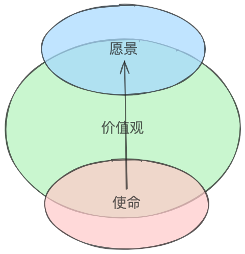

使命、愿景和价值观是商业世界中常见且至关重要的概念。它们不仅是企业文化的象征，更是引导企业发展和运营的指南针。通过为企业提供明确的方向，激发员工的动力，并塑造公司的品牌形象，它们在企业中扮演着举足轻重的角色。

对比不同企业的使命、愿景和价值观，我们可以清晰地看到它们之间的差异。例如，苹果公司和小米集团，其中的不同之处值得大家可以试着想想。

|        | 苹果公司                                                                     | 小米集团                                                                            |
| ------ | ---------------------------------------------------------------------------- | ----------------------------------------------------------------------------------- |
| 使命   | 为顾客提供通过创新的硬件、软件和服务带来的最佳用户体验。                     | 始终坚持做“感动人心、价格厚道”的好产品，让全球每个人都能享受科技带来的美好生活。    |
| 愿景   | 制造世界上最好的产品，并将世界变得更美好。                                   | 和用户交朋友，做用户心中最酷的公司。                                                |
| 价值观 | - 可访问性 - 教育 - 环保 - 包容性与多样性 - 隐私 - 供应链责任 | - 用户至上  - 追求极致  - 诚实正直  - 持续创新  - 合作共赢     |

同样地，使命、愿景和价值观对个人而言也具有深远的意义。它们不仅是个人信念的象征，更是引导个人成长和生活规划的指南针。通过为个人提供明确的方向，激发内心的动力，并塑造独特的个人形象，它们在个人发展中扮演着不可或缺的角色。

明确的使命可以让个人对自己的追求和目标更加坚定，清晰的愿景则为未来的发展描绘出一幅理想的蓝图，而核心的价值观则指导个人在复杂的抉择中保持内心的平衡和一致性。通过这些理念的引导，个人能够在职业生涯和生活中不断提升自己，实现长远的成长和成功。它们引导人们在做事情时具有更长远的眼光，并不断提醒我们在哪些方面需要多花精力、多思考、多努力。

尽管这些如此重要，但对很多人来说，可能对它们的具体定义和实际应用并不是很熟悉。那么，什么是使命？什么是愿景？什么是价值观？它们间的关系是什么？本文将尝试解答。

# 使命 (Mission)

>使命是我们前进的动力

对于使命的描述，主要应该回答一个问题：**Why go？** 即"为什么存在？" 或者说 "为什么想做这个事？" 。

使命阐述了组织存在的根本原因和意义，明确了组织的宗旨和核心追求，并在一定程度上展示了如何努力将愿景变为现实。它要求我们在资源方面作出取舍、选择，避免陷入盲目出击的陷进中。回答“Why we go？”能促使我们搞清楚自己的优势和劣势，明白自己能够在哪些竞争中赢。

## 制定有影响力的使命

打造一个能够被深刻铭记的使命并不容易。编写使命时需要认真思考和反复推敲。即使你已经定义了公司的目标和价值观，也需要时间将其精炼至核心部分。

一般来说，一个好的“使命”应具备以下特点：

- **代表公司的核心价值**：好的“使命”应代表公司的核心价值，包括其指导原则和信念。它阐明了公司的宗旨和优先事项，并展现了企业的独特身份。
- **简明、清晰且易记**：好的“使命”通常由精心挑选的几个句子组成，并且易于记忆，无需额外解释。
- **提供广泛但清晰的业务视图**：“使命”应具有激励性，但同时也应足够清晰，以传达公司的价值观，而不是专注于细节或策略。

在考虑这些要素时，保持平衡非常重要。一个过于模糊或普遍的“使命”无法提供清晰的方向或宗旨感，可能会让人混淆，并影响品牌认同。另一方面，过于狭隘可能会限制企业的发展，排斥那些本可能与公司互动的人。

>[!tip] 有效的使命应该在可能的目标与不可能的目标之间寻求一种平衡。它既要给我们一个清晰的方向，也要让人们充满壮志雄心，感觉自己在伟大事业的一部分。

“使命”的一个关键特性是真实性。如果与公司文化和价值观不一致，可能会导致客户和利益相关者产生矛盾的印象，这是不利的。虽然创造力、创新和冒险精神固然吸引人，但如果你的企业注重务实和可靠，就应该真实地传达这一点。传达公司优势要真实得多。

## 撰写使命的步骤

尽管这很具挑战性，撰写你企业的使命是建立强大品牌和为公司制定行动路线的基础。

在创建使命时，可以使用以下步骤作为指南：

- **确定你品牌的核心价值**：首先确定公司的核心价值。问问自己，公司具备哪些特征，比如社会影响力、诚信、创新或创造力。
- **明确公司的核心宗旨**：找出公司存在的**唯一目的**。这可能是企业解决客户的问题或提供独特的价值。
- **以核心受众为写作对象**：在撰写使命时，想象企业的理想客户，并专门面向他们去写。你的使命应该能引起客户的共鸣。
- **从利益相关方那里获取反馈**：在撰写过程中可能会经历几个草稿。在此期间，尽量收集利益相关方的反馈。他们可以提供有关企业宗旨和价值的不同视角，帮助确保能够传达给正确的人。
- **完善你的信息**：将企业的核心理念提炼成一个简洁易懂的信息，使客户和团队成员能够轻松记忆和理解。

请记住，撰写使命是一个反复修正的过程，不需要着急。花时间思考、写作并接受反馈，以便使其专注于公司独一无二的地方。

# 愿景 (Vision)

>美好的风景是愿景

相比于使命，愿景的描述主要回答的是：**Where to go？** 即“我们希望成为什么？”或者说“我们未来要达到什么样的状态？”

愿景描绘了企业对未来的期望和长期目标，是企业追求的理想状态。它不仅仅是一个简单的目标，而且是企业希望在未来某一特定时间内（通常为五到十年）达到的全面发展状态。

## 制定有影响力的愿景

制定一个能够深刻激励和引领企业发展的愿景并不容易。这需要企业深入思考未来的发展方向和期望，并不断精炼其核心部分，直至形成一个清晰而有力的愿景。

一个好的“愿景”应具备以下特点：
- **展示企业的长远目标**：愿景应该明确展示企业在未来希望达到的目标和状态。它应描绘出企业未来的发展方向，激励全员为之奋斗。
- **激励和引导**：愿景应该具备鼓舞人心的力量，使员工和利益相关方为实现共同的目标而努力。愿景应有助于凝聚团队，提升士气。
- **现实且具有挑战性**：愿景应在合理努力和资源支持下可以实现，同时具有一定的挑战性。它应当是一个触手可及但需要全力以赴才能实现的目标。
- **与使命和价值观一致**：愿景应与企业的使命和核心价值观保持一致，形成一个协调统一的整体。它应反映企业的长期目标，同时与当前的使命和价值观相辅相成。
- **简明、清晰且易于传播**：愿景应当简明扼要、清晰易懂，能够快速传达给员工和外部利益相关者。它应易于记忆，能够通过简单的句子表达企业的未来愿景。

我们所设想的结果——对未来的梦想，作为一家公司取得的成功——应当在愿景中体现。要注意一点，愿景不是实施解决方案的实际步骤计划。

## 撰写愿景的步骤

在撰写愿景时，可以尝试思考以下几个问题：

1. 我们希望组织走向何方？
2. 我们实际可以实现什么？
3. 组织打算解决什么问题？
4. 我们认为组织可以给个人带来哪些改变？对行业呢？
5. 如果愿景实现，事情将发生怎样的变化？
6. 哪些短语或关键词描述了我们想要的组织类型和结果？

以下是制定愿景时的步骤：

1. 展望未来五到十年。
2. 梦想远大，专注于成功。
3. 使用现在时态。
4. 使用清晰、简洁、不带行业术语。
5. 注入激情，让其具有启发性。
6. 将其与业务价值和目标保持一致。
7. 制定传达愿景给员工的计划。
8. 做好承诺时间和资源来实现你确定的愿景。

# 价值观 (Values)

>前行的方法是价值观

价值观要回答的问题是：**How to go？** 即“我们如何行动？”

价值观是一组理念，解释了公司的信仰和运营方式。它告知员工、客户和潜在客户，指导你的业务的原则是什么。 

>[!tip] 把价值观看作是 **工作场所文化的基础**。你希望员工展现出哪些核心信念和行为？什么样的准则应该指导你雇佣谁，如何成长以及做出什么决策？

## 制定有影响力的价值观

每家公司应该根据自己的使命和文化，确定对他们最重要的职业和个人价值观。一些常见的价值观包括：诚信、尊重、合作、可持续性、创新、卓越和客户服务等。

一个好的“价值观”应该符合以下特点：

- **独特性**：优秀的价值观应当凸显公司的独特之处，突出公司的优势和理念，展示为何你的组织与其他机构不同——在吸引独特人才和减少员工流失方面至关重要。
- **情感**：出色的价值观应当引起读者的情感共鸣，关注员工和客户体验，用平易近人的语言表达。
- **简洁性**：突出的价值观应当简明扼要——不超过一两句话，并且容易记忆。它应直接揭示组织的独特之处，避免空洞。
- **不使用术语**：优秀的价值观应使用简单、包容的语言，易于人理解，而非仅限于行业内通行术语。避免使用需专业知识才能理解的行话。

## 撰写价值观的步骤

每家公司都是独一无二的，因此每家公司都有其独特的核心价值观。虽然没有万能的解决方案，但可以遵循一些最佳实践，确保公司的价值观具有效力。以下是关于如何创建能吸引和激励团队的公司价值观的步骤：
### 1.确定公司立场

你的核心原则是什么？什么理念指导着你的决策？你想营造怎样的企业文化？如果不确定从何着手，可以查看公司的使命，并思考如何将其转化为一套价值观。

你公司的工作价值观应该和业务目标保持一致。这样它们便可作为北极星，引导决策者做出有助于实现业务目标的选择。例如，如果你的业务目标之一是成为行业领导者，那么像“创新”这样的公司价值就变得至关重要。另一方面，如果你的目标是提供卓越的客户服务，那么“同理心”这样的价值就更为关键。

### 2.征求团队意见

要确保价值观与业务目标一致，应将高级领导团队纳入流程中（因为他们最终负责实现业务目标）。最后，给员工分享公司价值观的建议机会。他们是日常践行这些价值观的人。举办研讨会或焦点小组，征求意见，了解他们认为最终价值清单应包含的内容。
### 3.增加可信度

在起草最终价值观时，确保它们与团队共鸣，并与他们相关。没有人愿意被无法实践的价值观所启发。价值观越相关，团队越可能接受并在日常工作中实践。此外，确保每个价值观都有明确的含义，没有歧义，每个人都清楚每个价值观的具体含义。

### 4.沟通并注入生命

一旦确定了价值观，就要清晰地向团队传达。不仅在茶水间贴出标语；要花时间解释这些价值观的重要性，以及如何融入公司更大的目标和使命。在网站和员工手册上公布，因为潜在员工和新员工可能会对其感兴趣。

接下来，付诸实际行动。制定一个行动计划，详细说明如何在组织中实现每个价值观。例如，如果“创新”是核心价值之一，可以为研发项目设定专门预算。又如，如果“同理心”是价值观，可以为所有员工提供客户服务培训。
无论你的价值观是什么，都要确保有明确计划在组织内贯彻实现每一项价值观。只有这样，它们才能真正影响团队。

### 5.倡导个人责任

让团队对自己负责意味着设立期望，要求团队成员符合或超越与价值观一致的行为标准。同时，当有人体现或违反价值观时，提供积极或消极反馈。

若希望团队认真对待组织的价值观，就要鼓励管理和领导团队做出表率。

### 6.庆祝成就

最后但同样重要的是，不要忘记在团队成员体现公司的价值观时进行庆祝。公开表彰他们的行动和选择，让他人知晓公司重视何种行为。 

创建公司的价值观对于任何企业来说都是一项重要的练习，但这只是第一步。从那里开始，你必须清晰传达它们，追踪每个人的责任，并定期进行回顾。

# 使命、愿景和价值观的互相关系

公司的使命、愿景和价值观是组织的关键元素，共同定义了其目标、方向和价值体系。

- **使命**：是公司的核心目的，解释了公司存在的原因和所做的事情。它回答了问题：“我们为什么存在？”
- **愿景**：描述公司未来的期望和抱负，提供明确的方向和设定长期目标。它回答了问题：“我我们希望成为什么？”
- **价值观**：是指导公司行为和决策的原则和信念，定义了公司的文化和道德标准。它们回答了问题：“我们如何行动？”

这种关系可以概括如下：

- **使命**是基础，详细描述了公司的现状和持续目标。
- **愿景**建立在使命之上，设定了一个与使命一致的未来目标。
- **价值观**支持使命和愿景，提供了道德指导和文化背景，引领公司运作并实现其使命和愿景。

# 一些优秀公司的使命、愿景和价值观

文章的最后，让我们感受下一些优秀企业的使命、愿景和价值观：

## 苹果（Apple）

- 使命（Mission）：为顾客提供通过创新的硬件、软件和服务带来的最佳用户体验。（To bring the best user experience to customers through innovative hardware, software, and services.）
- 愿景（Vision）：制造世界上最好的产品，并将世界变得更美好。（To make the best products on earth, and to leave the world better than we found it.）
- 价值观（Values）：
	- 无障碍（Accessibility ）
	- 教育（Education）
	- 环境（Environment）
	- 包容与多样性（Inclusion and Diversity）
	- 隐私（Privacy）
	- 供应链责任（Supplier Responsibility）

## 英伟达（NVIDIA）

- 使命（Mission）：通过加速人工智能的普及，创造计算的未来。（To create the future of computing by accelerating AI everywhere.）
- 愿景（Vision）：改变世界体验计算的方式。（To transform how the world experiences computing.）
- 价值观（Values）：
	- 创新（Innovation）：持续推动技术前沿，开发新的应用和技术​ (Discovering Paths & Travel)​。
	- 速度与敏捷性（Speed and Agility）：迅速适应和反应市场需求和技术变化​ (Mission Statement Academy)​。
	- 团队合作（One Team）：通过合作实现更高的目标​ (Discovering Paths & Travel)​。
	- 卓越（Excellence）：追求卓越，超越客户和市场的期望​（Discovering Paths & Travel）​。
	- 知识诚实（Intellectual Honesty）：保持透明和诚实的沟通，建立信任​ (Mission Statement Academy)​

## 微软（Microsoft）

- 使命（Mission）：赋予全球每个个人和组织力量，实现更多。（to empower every person and every organization on the planet to achieve more.）
- 愿景（Vision）：帮助全球的个人和企业充分发挥潜力（to help people and businesses throughout the world realize their full potential.）
- 价值观（Values）：
	- 创新（Innovation）：不断创造新的和改进的技术。
	- 可信计算（Trustworthy Computing）：确保所有产品的可靠性和安全性。
	- 多元化和包容性（Diversity and Inclusion）：促进多元化和包容性的工作环境。
	- 企业社会责任（Corporate Social Responsibility）：参与有益于社会的各种举措。
	- 慈善事业（Philanthropies）：通过各种慈善努力支持全球社区。
	- 环境保护（Environmental）：致力于可持续发展和环境保护。

## 特斯拉（Tesla）

- 使命（Mission）：加速世界向可持续能源的过渡。（To accelerate the world’s transition to sustainable energy.）
- 愿景（Vision）：创建21世纪最具吸引力的汽车公司，通过推动世界向电动汽车的过渡来实现这一目标。（To create the most compelling car company of the 21st century by driving the world’s transition to electric vehicles.）
- 价值观（Values）：
	- 做到最好 (Doing the best): 追求卓越的表现。
	- 冒险 (Taking risks): 鼓励员工在创新过程中进行有风险的尝试。
	- 尊重 (Respect): 促进各方之间的尊重和协作。
	- 持续学习 (Constant learning): 推动持续的学习和发展。
	- 环保意识 (Environmental consciousness): 强调环境保护的重要性。

## 字节跳动（Bytedance）

- 使命（Mission）：激发创造，丰富生活。（Inspire creativity, enrich life.）
- 愿景（Vision）：打造全球性的创作和互动平台。（To build global platforms of creation and interaction.）
- 价值观（Values）：
	- 始终创业（Always Day 1）
	- 多元兼容（Champion Diversity and Inclusion）
	- 坦诚清晰（Be Candid and Clear）
	- 求真务实（Truth and Be Pragmatic）
	- 敢为极致（Courageous and Aim for the Highest）
	- 共同成长（Grow Together）

## 腾讯（Tencent）

- 使命（Mission）：用户为本，科技向善。（Value for Users, Tech for Good.）
- 愿景（Vision）：成为最受尊敬的互联网企业。（To be the most respected Internet enterprise.）
- 价值观（Values）：
	- 诚信（Integrity）： 坚持诚实守信，建立用户和合作伙伴的信任。
	- 进取（Proactivity）： 积极进取，不断追求卓越。
	- 协作（Collaboration）： 强调团队合作，实现共同目标。
	- 创造（Creativity）： 鼓励创新，推动技术和业务的不断进步​。

## 美团

- 使命（Mission）：帮助每个人吃得更好，生活得更好。（To help everyone eat better and live better.）
- 愿景（Vision）：成为中国电子商务的领先品牌。（To be a leading brand of China's e-commerce.）
- 价值观（Values）：
	- 专注（Focused）