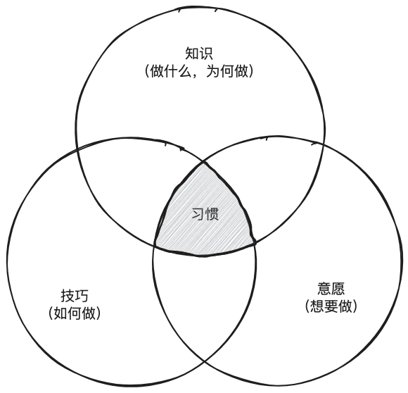
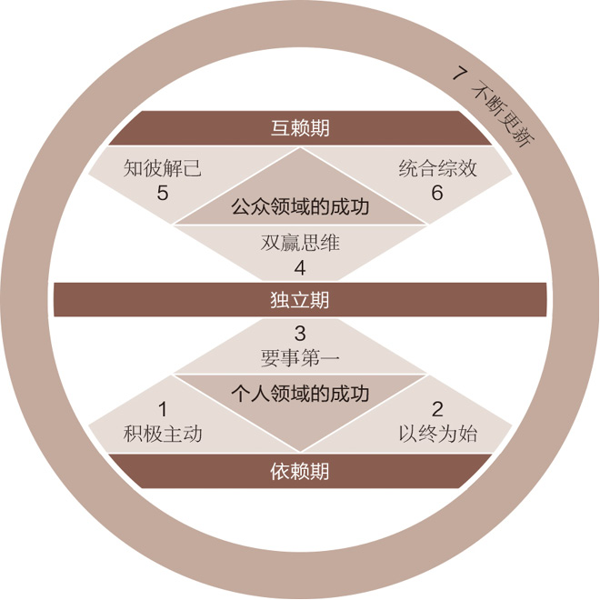
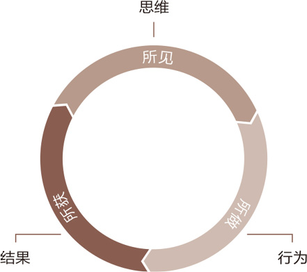
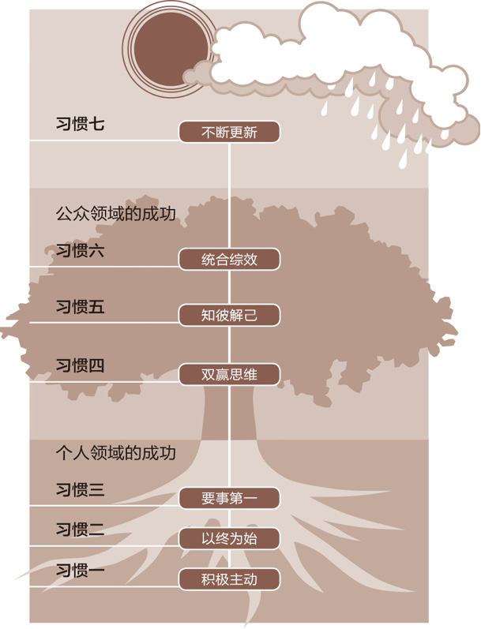
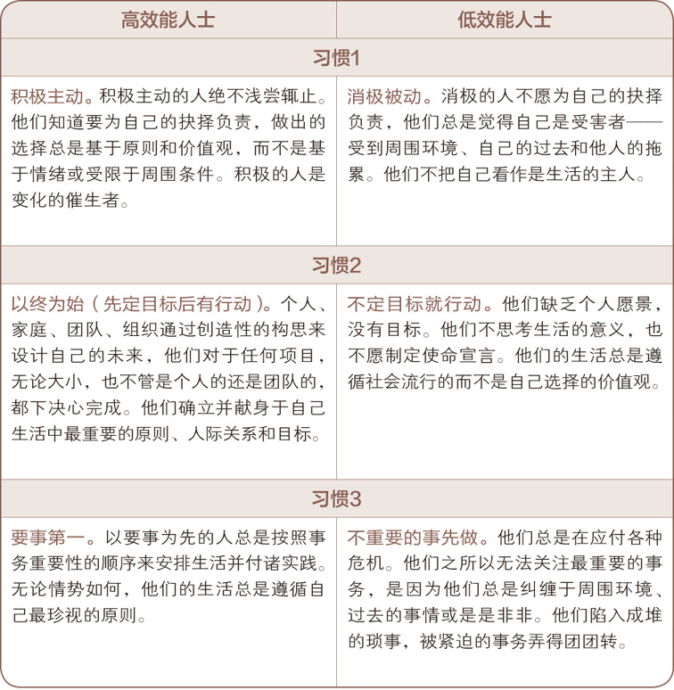
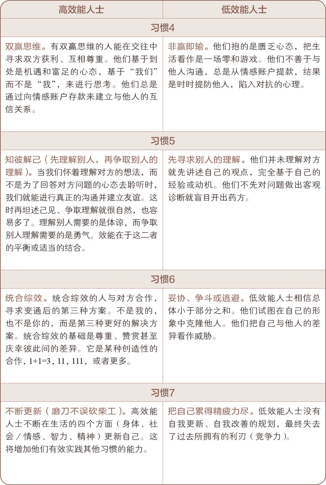

>《高效人士的七个习惯》这本书读了第二遍。时隔多年的重读，对书中的内容有了新的理解和感悟。正是这些新的体会，激发了创作这个系列文章的想法。通过写作，不仅能够将这些思考整理得更加清晰，也能将书中的精华分享给更多人。本文作为系列的开篇之作，旨在介绍这七个习惯的核心内容及其重要性。

俗话说：思想决定行动，行动决定习惯，习惯决定品德，品德决定命运。

# 习惯的定义

习惯是“知识”、“技巧”与“意愿”相互交织的结果：
- 知识是理论范畴，指点“做什么”及“为何做”；
- 技巧告知“如何做”；
- 意愿促使“想要做”。

要养成习惯，三者缺一不可。

为人和观念的改变是螺旋式向上的过程——为人改变观念，观念反过来改变人，如此反复循环，螺旋式向上成长。

# 成熟模式图

七个习惯并不是孤立、分散的心理法则。它们遵循成长的规律，提供了一种渐进、连续且高度整合的方法，帮助我们提升个人和人际效能。通过这些习惯，我们可以依次经历"成熟模式图"：从依赖到独立，再到互赖，不断实现自我进步。

“成熟模式图”即人类成长的三个阶段，分别是依赖期、独立期、互赖期：
- **依赖期（Dependence）以“你”为核心**——你照顾我；你为我的得失成败负责。
- **独立期（Independence）以“我”为核心**——我可以做到；我可以负责；我可以靠自己；我有权选择。
- **互赖期（Interdependence）以“我们”为核心**——我们可以做到；我们可以合作；我们可以融合彼此的智慧和能力，共创前程。

真正独立的品德能够让我们行事主动，摆脱对环境和他人的依赖，是值得追求的自由目标，但**仍非高效生活的终极目标。高效生活的最终目标是“互赖”**。

互赖是一个更为成熟和高级的概念。生理上互赖的人，可以自力更生，但也明白合作会比单干更有成效；情感上互赖的人，能充分认识自己的价值，但也知道爱心、关怀以及付出的必要性；智力上互赖的人懂得取人之长，补己之短。

七个习惯按照人类的成熟模式划分，其中前三个习惯，着重于如何自我约束，由依赖进步到独立。这些习惯属于“个人领域的成功”范畴，是培养品德的基础，而后才能是“公众领域的成功”​，就如同耕种与收获的次序无法颠倒一样，必须是由内而外依次实现。真正独立之后，就具备了有效互赖的基础，就可以开始致力于更为性格导向的“公众领域的成功”​，即习惯四、五、六所讲授的团结、合作与沟通。第七个习惯涵盖了其他六个习惯，谈的是自我更新——在人生的四个层面上实现平衡而有规律的更新。它是不断改进、螺旋向上的成长过程，帮助我们将自我提升到一个新的水平，在此水平上我们将会更好地理解和实践其他几个习惯。

# “效能”的定义

七个习惯建立在一种符合自然法则的思维方式之上，这就是"产出/产能平衡"（P/PC Balance）原则。伊索寓言中的这个故事恰好生动地阐释了这个常被忽视的重要原则。

>一个农夫无意间发现一只会生金蛋的鹅，不久便成了富翁。可是财富却使他变得贪婪急躁，每天一个金蛋已无法满足他，于是他异想天开地把鹅宰杀，想将鹅肚子里的金蛋全部取出。谁知打开一看，鹅肚子里并没有金蛋。鹅死了，再也生不出金蛋。

这则寓言中蕴含了一个自然法则，即效能的基本定义：

>$效能 = 产出 \times 产能$

产出（P）代表期望获得的产出，比如金蛋；  
产能（PC）代表生产该产出的资产或能力，比如下金蛋的鹅。  

要实现真正的高效能，必须平衡产出和产能两个因素:  
- 单纯追求产出（P）而忽视产能（PC），会导致产能的丧失，长期无法获得可持续的产出；
- 只重视产能（PC）而忽略产出（P），也难以体现效能的价值。

因此，提高效能的关键在于同时重视并平衡发展产出与产能，使二者相辅相成，形成良性循环。只有这样，才能在确保产能的前提下，最大化产出；也只有这样，才能在追求产出的同时，不断积累和提高产能，从而实现长期持续的高效能水平。  

简而言之，效能兼顾当下与长远，平衡眼前与根基，达成产出与产能的有机统一，这是实现可持续高效能的根本之道。

人类所拥有的资产，基本上可分为物质资产、金融资本以及人力资本三大类。其特点如下：

- **物质资产**：包括机器设备、房产车辆等有形资产。物质资产需要保养维护，才能持续发挥产能(如割草机保养)并获得产出(修整过的草坪)。忽视维护保养，将导致物质资产加速老化、失去功能。
- **金融资本**：包括现金、股票、债券等金融性资产。本金相当于产能，利息/收益相当于产出。动用本金追求眼前收益，等于透支产能，将加速耗竭金融资本。应当保护并增加本金(持续投资)，才能获得可持续的收益产出。另外，个人的赚钱能力也是最宝贵的金融资本，需要不断学习提升。
- **人力资本**：包括个人的技能、经验、人际关系等无形资产。人力资本控制着其他资产的运用，对人而言产出产能平衡尤为重要。比如感情、友谊等，如果只索取爱情(产出)而不维系感情(产能)，终将导致人际关系的破裂。

无论哪种类型的资产，均需要平衡发展产出和产能两个方面，追求眼前回报的同时也要着眼长远，持续投入维护和提升产能，只有产出与产能并重发展，资产价值才能获得最大化并可持续增长。

>产出与产能平衡的原则是效能的精髓。

# 七个习惯的简要定义

## 习惯一：积极主动（BE PROACTIVE）

积极主动即采取主动，为自己过去、现在及未来的行为负责，并依据原则及价值观，而非情绪或外在环境来下决定。积极主动的人是改变的催生者，他们摒弃被动的受害者角色，不怨天尤人，发挥了人类四项独特的禀赋——自我意识、良知、想象力和独立意志，同时以由内而外的方式来创造改变，积极面对一切。他们选择创造自己的人生，这也是每个人最基本的决定。

## 习惯二：以终为始(BEGIN WITH THE END IN MIND)

所有事物都经过两次的创造——先是在脑海里酝酿，其次才是实质的创造。个人、家庭、团队和组织在做任何计划时，均先拟出愿景和目标，并据此塑造未来，全心投入自己最重视的原则、价值观、关系及目标。对个人、家庭或组织而言，使命宣言可以说是愿景的最高形式，它是根本的决策，主宰了所有其他决定。领导工作的核心，就是基于共有的使命、愿景和价值观，创造出一个文化。

## 习惯三：要事第一(PUT FIRST THINGS FIRST)

要事第一即实质的创造，是梦想（你的目标、愿景、价值观及要事处理顺序）的组织与实践。次要的事不必摆在第一，要事也不能放在第二。无论迫切性如何，个人与组织均要更多聚焦要事，重点是，把要事放在第一位。

## 习惯四：双赢思维(THINK WIN-WIN)

双赢思维是一种基于互敬、寻求互惠的思考框架与心意，目的是分享更多的机会、财富及资源，而非敌对式竞争。双赢既非损人利己（赢输）​，亦非损己利人（输赢）​。我们的工作伙伴及家庭成员要从互赖式的角度来思考（​“我们”​，而非“我”​）​。双赢思维鼓励我们解决问题，并协助个人找到互惠的解决办法，是一种资讯、力量、认可及报酬的分享。

## 习惯五：知彼解己(SEEK FIRST TO UNDERSTAND,THEN TO BE UNDERSTOOD)

当我们不再急切回答，改以诚心去了解、聆听别人，便能开启真正的沟通，增进彼此关系。对方获得理解后，会觉得受到尊重与认可，进而卸下心理防备，坦然交谈，双方对彼此的了解也就更顺畅自然。知彼需要仁慈心，解己需要勇气，能平衡两者，则可大幅提升沟通的效率。

## 习惯六：统合综效(SYNERGIZE)

统合综效谈的是创造第三种选择，即非按照我的方式，亦非遵循你的方式，而是创造第三种更好的办法。它是互相尊重的成果——不但了解了彼此，甚至还称赞彼此的差异，欣赏对方解决问题及把握机会的手法。个人的力量是团队和家庭统合综效的基础，能使整体获得一加一大于二的成效。实践统合综效的人际关系和团队会扬弃敌对的态度(1+1＝$1\over2$)，不以妥协为目标(1+1＝$1{1\over2}$)，也不仅仅止于合作(1+1＝2)，他们要的是创造式的合作(1＋1＞2)。

## 习惯七：不断更新(SHARPEN THE SAW)

“不断更新”谈的是，如何在四个生活基本面（身体、精神、智力、社会/情感）中，不断更新自己。这个习惯提升了其他六个习惯的实施效率。对组织而言，习惯七提供了愿景、更新及不断的改善，使组织不至呈现老化及疲态，并迈向新的成长之路。对家庭而言，习惯七通过固定的个人及家庭活动，使家庭效能升级，就像建立传统，使家庭日新月异，即是一例。

# 看到 ➡️ 做到 ➡️ 收获

>你都做不到，那就没人能做到。思路决定一切。我们谈论的还不够。如果你想获得微小的进步，就改变你的行为，但是如果你想获得巨大的进步，就要改变你的思维。​

所见决定所做，所做决定所获。我们发现当个人、团队和企业仅仅看重所做，即行为，那就永远得不到想要的结果。要想获得重大成果，首先要在所见上突破，即思维。如果所见没有变化，新的行为不会持久。

有时候很难找到方向，有太多的选择和挑战。有时候很容易迷失方向，效率低下。七个习惯能够提供一种条理化的模型，或者说是一种思考方式，帮助你实现目标，更快更好地解决问题。

最后，理解七个习惯的一个好方法是看看它们的对立面，以下是高效人士与低效人士的对比：

# 总结

以上就是本系列的第一篇的全部内容，概述了《高效人士的七个习惯》的核心理念，揭示了这些习惯如何帮助人们实现个人和职业生活的持续成长。从习惯的定义到成熟模式图，再到效能的本质，这些内容构建了一个系统化的个人发展框架。这七个习惯不仅是简单的行为准则，更是一种思维方式的转变。它们引导人们从依赖走向独立，最终达到互赖的高效状态。通过平衡产出与产能，在各种资产管理中可以实现长期的可持续发展。  

这些习惯为人们提供了一个清晰的路径，有助于在生活中找到方向，提高效率，实现目标。培养这些习惯是一个持续的过程，需要时间、耐心和不断的努力。正如文中所说，"卓越不是一时的行为，而是习惯"。通过不断实践和内化这些习惯，每个人都有可能成为更高效、更平衡、更富有成效的人。    
  
本系列的下一篇文章将探讨帮助我们从依赖走向独立的三个习惯，这些习惯属于个人领域。文章将详细解析每个习惯的内涵，敬请期待。