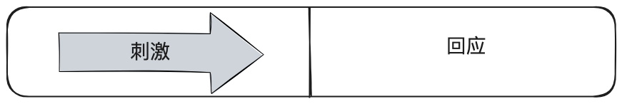
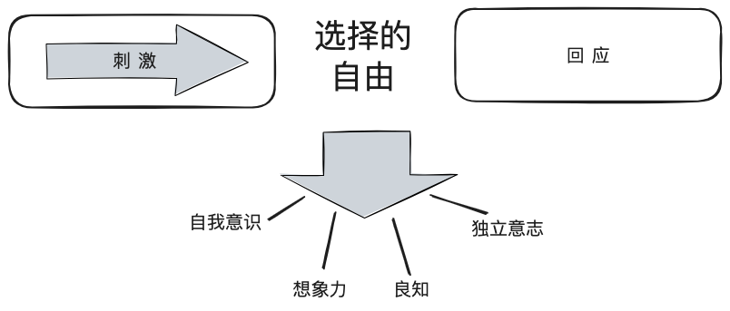
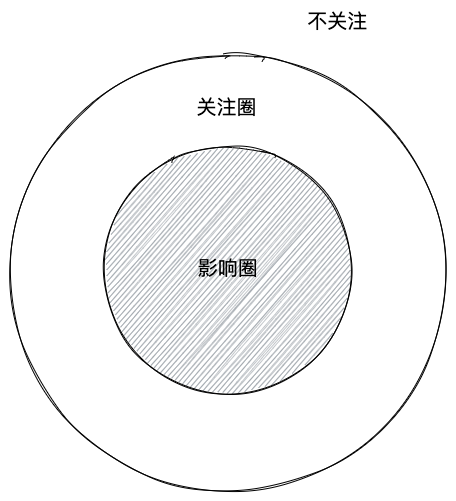
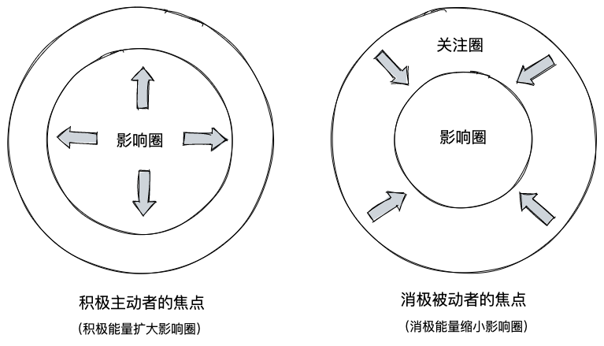
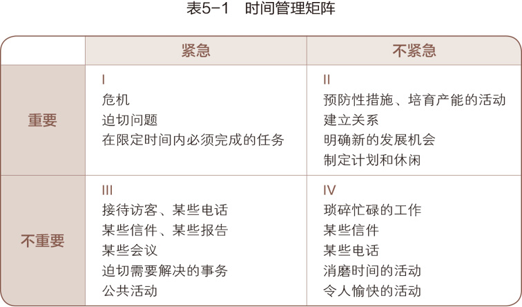

>在《高效能人士的七个习惯》系列总结中，第一篇文章 [七个习惯概述：高效的基石](/post/2024/the-7-habits-1) 探讨了这七个习惯的核心理念，阐述了它们在个人成长和职业发展中的重要性。本文为该系列的第二篇，将重点聚焦于七个习惯中的前三个，这些习惯主要涉及个人领域的自我提升。文章将详细探讨如何通过自我约束和自律，逐步从依赖他人的状态过渡到真正的独立自主。这个过程不仅是个人成长的关键阶段，也是迈向更高效能的重要一步。

# 习惯一：积极主动——个人愿景的原则

>最令人鼓舞的事实，莫过于人类确实能主动努力以提升生命价值。——亨利·戴维·梭罗(Henry David Thoreau)

## 积极主动的理论基础

>人性的根本原则在于：在刺激和回应之间，人拥有选择的自由。

如果我们仅仅通过“社会之镜”，即时下盛行的社会观点以及周围人群的意见、看法和思维方式来进行自我认知，那无异于从哈哈镜中看自己。因为这些零星的评语不一定代表真正的你，与其说是影像，不如说是投影，**反应的是说话者自身的想法或性格弱点**。

当今社会盛行的观点认为环境与条件对人有决定性作用，虽然承认其影响巨大，但并不意味着它能完全决定命运。基于这种流行看法，形成了三种解释人性的“决定论”：
- 基因决定论：认为人的本性和行为主要由祖先遗传的基因决定，例如脾气不好可能是因为祖先的DNA中存在这种特质并被传承下来。
- 心理决定论：认为个人的性格和行为主要由童年经历和父母的教育方式决定，强调早期的心灵创伤和负面经历对成年后行为模式的影响。
- 环境决定论：认为个人的性格和行为主要由外部环境因素决定，如人际关系、经济状况和政治环境等。

这三种理论都以“刺激——回应”理论为基础。很容易让人联想到俄国生理学家巴甫洛夫所做的关于狗的实验。其基本观点就是认为我们会受条件左右，以某一特定方式回应某一特定刺激。​

然而，人性的根本原则在于：在刺激和回应之间，人拥有选择的自由。

选择的自由包括人类特有的四种天赋：
- 自我意识(Self-awareness)：可以从旁观者视角审视自身的精神状态和认知过程；
- 想象力(Imagination)：即超越当前现实而在头脑中进行创造的能力；
- ​良知(Conscience)”：即明辨是非，坚持行为原则，判断思想、言行正确与否的能力；
- 独立意志(Independent Will)：即基于自我意识、不受外力影响而自行其是的能力。

因为人类拥有这四种天赋，使我们能够超越条件和环境的限制，做出自由而有选择的回应。这不仅让我们不断发展和进步，实现自身潜能，也推动我们达到更高层次的自我成长和全面发展。

## 积极主动的定义

基于在刺激与回应之间，人类拥有选择的自由，发展出了高效人士在任何环境中都应具备的、首要的，也是最基本的习惯——积极主动。积极主动是实现人生产能与产出平衡的必要条件，其他六个习惯都以积极主动为基础，并会激励你采取主动。如果甘于被动，就会受制于人，面临截然不同的发展与机遇。积极行动不同于积极思考，我们需要面对现实和未来。真正的现实是，我们有能力以积极态度应对现状和未来，逃避这一现实，就只能被动地让环境和条件决定一切。因此，积极主动是实现其他习惯和个人及职业发展的关键。

积极主动不仅指行事的态度，还意味着人一定要对自己的人生负责。个人行为取决于自身的抉择，而不是外在的环境，人类应该有营造有利的外在环境的积极性和责任感。所有积极主动的人，都不会把自己的行为归咎于环境、外界条件或他人的影响。

积极主动 vs 消极被动

| 纬度       | 积极主动                                   | 消极被动                                       |
| ---------- | ------------------------------------------ | ---------------------------------------------- |
| 自我控制   | 内在的价值观驱动，理智胜于冲动             | 外界条件驱动，冲动胜于理智                     |
| 情绪管理   | 不受外界条件影响，情绪稳定                 | 受外界条件不可控影响，情绪易波动               |
| 行为选择   | 基于深思熟虑后的价值观选定，主动选择回应   | 基于外界刺激的直接反应，被动接受外部影响       |
| 自我责任感 | 自觉承担责任，认可并内化自我价值观         | 将责任归因于外部条件及他人行为，缺乏自我责任感 |
| 外界影响   | 外界环境只能作为参考，无法决定其行为和决策 | 外界环境直接决定其行为和决策                   |
| 决策根基   | 内在原则与价值观为决策的主要依据           | 外界条件与他人意见为决策的主要依据             |
| 成长与发展 | 永无止境，通过自我反省和调整不断成长       | 受限于外界条件和集体意识，缺乏长期发展动力     |
|            |                                            |                                                |
## 🌟 关注圈 vs 影响圈

看一个人的时间和精力集中于哪些事物，也可以大致判断他是否积极主动。每个人都有格外关注的问题，这些都可以被归入“关注圈”，以区别自己没兴趣或不愿理会的事物。关注圈内有些可以被掌控，有些则超出自己的能力范围，所以在关注圈内，又有一个较小的影响圈：

积极主动的人专注于“影响圈”​，他们专心做自己力所能及的事，他们的能量是积极的，能够使影响圈不断扩大。消极被动的人则全神贯注于“关注圈”​，紧盯他人弱点、环境问题以及超出个人能力范围的事不放，结果越来越怨天尤人，一味把自己当作受害者，并不断为自己的消极行为寻找借口。错误的焦点产生了消极能量，再加上对力所能及之事的忽略，就造成了影响圈日益缩小。

在把重心由关注圈移至影响圈之前，有两件关注圈内的事值得深思，那就是自由选择的后果及错误。

- 自由选择与后果：每个人拥有选择行为和回应的自由，但必须承担由自然法则决定的后果。
- 错误与反思：错误难以避免，但积极主动的人会承认并改正错误，从中吸取教训，以此实现成长。否认或掩饰错误只会带来更大的伤害。

理解并重视这些原则，才能更加有效地将注意力转移到我们能够控制和影响的事情上。

# 习惯二：以终为始——自我领导原则

>和内在力量相比，身外之物显得微不足道——奥利佛·温德尔·霍姆斯

## 以终为始的定义

以终为始是一种生活和工作的原则，它强调**在开始任何事情之前，先明确最终的目标和期望的结果**。这个原则的核心观点包括：

1. **以人生目标为标准**：以个人最重视的期许或价值观来指导日常的言行和决策。
2. **明确方向**：在开始任何事情之前，先认清方向，避免误入歧途或白费工夫。
3. **长远考虑**：在追求成功的过程中，不仅关注眼前的利益，还要考虑长远的影响和真正重要的事物。
4. **保持专注**：时刻牢记自己想要成为什么样的人，以及当前最重要的任务是什么。
5. **注重真正的成功**：关注生命中最重要的事情，而不仅仅是表面的名利、地位或财富。
6. **终极目标导向**：以你希望在生命终结时获得的评价作为指引，来定义真正的成功。

这个原则鼓励人们在日常生活中始终保持对最终目标的关注，确保每一步行动都朝着正确的方向前进，从而成为一个高效能的人。它强调了生活的意义不仅在于当下的成就，更在于整个人生旅程中追求的价值和留下的影响。

## 两个原则基础

以终为始有两个基础原则，第一个基础原则是“任何事情都是两次创造而成”，首先是智力上的第一次创造，即在头脑中构思；其次是体力上的第二次创造，即付诸实践。

以终为始原则强调在行动前进行有意识的规划，适用于生活的方方面面。从旅行规划到人生设计，这一原则都能发挥作用。它基于“两次创造”的概念：先在头脑中构思，再付诸实践。积极运用这一原则可以扩大个人影响力，而忽视它则可能导致被动地受外界控制。有些人因自我意识薄弱，不愿主动设计人生，最终被外部环境所主导。然而，每个人都有能力通过自我意识、良知和想象力来审视并掌控自己的“第一次创造“，从而真正成为自己人生的主导者。这正是以终为始原则的核心——鼓励我们主动设计并掌控自己的人生。

第二个基础原则是“自我领导”，强调领导先于管理。领导是第一次创造，关注方向和目标设定；管理是第二次创造，侧重于执行和细节。这突出了在处理具体事务前，先明确方向和目标的重要性。

领导与管理就好比思想与行动：

- 管理关注基层，思考的是“怎样才能有效地把事情做好”；
- 领导关注高层，思考的是“我想成就的是什么样的事业”。

>管理是正确的做事，领导则是做正确的事，管理是有效地顺着成功的梯子向上爬，领导则判断这个梯子是否靠在了正确的墙上。

>再成功的管理也无法弥补领导的失败，而领导难就难在常常陷于管理的思维定式难以自拔。

## 最佳实践：个人使命宣言

实践以终为始原则的最有效方法是制定个人使命宣言。这份宣言实际上是一个人的生活哲学或核心信念的体现。它主要阐述了三个方面：你希望成为怎样的人，你想要实现什么样的事业，以及支撑这些目标的价值观和原则。换句话说，个人使命宣言是对个人使命、愿景和价值观的综合表述，尽管它并不刻意区分这些概念。如果想深入了解使命、愿景和价值观的具体内容，可以参考之前发布的文章：[[使命、愿景和价值观]]。这份宣言将成为指导你生活和决策的重要工具，帮助你始终朝着最重要的目标前进。下面是一个例子：

- 在诚信问题上决不妥协。
- 念及相关的每一个人。
- 未听取正反双方意见，不妄下断语。
- 征求他人意见。
- 诚恳但立场坚定。
- 每年掌握一种新技能。
- 今天计划明天的工作。
- 利用等待的空闲时间。
- 态度积极。
- 保持幽默感。
- 生活与工作有条不紊。
- 别怕犯错，怕的是不能吸取教训。
- 协助属下成功。多请教别人。

个人使命宣言可视为个人的“宪法”，它基于正确的原则，成为评价一切的标准和应对变化的力量源泉。这份宣言不仅指导重大抉择，也影响日常决策。 确立使命宣言后，我们能够灵活应对各种情况，避免偏见和固有观念的束缚，从而保持内心的安全感。使命感体现了积极主动的精神，提供了指导生活的愿景和价值观，帮助设立长短期目标。它还有助于制定基于正确原则的个人行为准则，指导我们高效利用时间、精力和才能。

# 习惯三：要事第一——自我管理原则

习惯三是习惯一和习惯二的具体实践。

习惯一：积极主动，其核心在于认识到“你是创造者，你掌控自己的人生”。这个习惯建立在人类独特的四大天赋之上：想象力、良知、独立意志和最重要的自我意识。它赋予了个人改变现状的能力和勇气，让人能够突破固有思维模式，寻求更有效的解决方案。  

习惯二：以终为始，聚焦于第一次创造或智力创造。它的原则基础是想象力和良知这两大天赋。想象力使我们能够超前感知潜力和创造力，而良知则帮助我们发掘个人独特性，并在道德层面上提供指引。这个习惯与我们的基本思维方式、最高期望值和核心价值观密切相关，塑造着我们对未来的构想。  

习惯三：要事第一，则关注第二次创造或体力创造，是前两个习惯的实际执行和自然延伸。它要求我们运用独立意志，努力实现既定目标。这个习惯的核心在于以原则为基础安排人生，将思想转化为行动，实现既定的目标和愿景。  

**这三个习惯形成了一个连贯的过程：从认识自己是创造者，到明确自己想要创造什么，再到实际付诸行动去创造**。它们构建了一个完整的框架，指导个人如何从理念到实践，有效地掌控和改变自己的生活。这个过程涵盖了从自我认知到目标设定，再到行动实施的全过程，体现了个人成长和成功的关键要素。

## 独立意志：有效管理的先决条件

>独立意志指的是作出决定和主动选择，并根据这些决定和选择采取具体行动的能力。

**有效管理指的就是要事第一，先做最重要的事情**。领导者首先要决定的，就是哪些事情是重要的；而作为管理者，就是要将这些重要的事物优先安排。从这个意义上说，自我管理的实质就是自律和条理，是对计划的实施。

《成功的普遍共性》一文的作者格雷的研究揭示了成功的关键在于“要事第一”的习惯，而非单纯的辛勤工作、运气或人际关系。成功者能够克服心理障碍，为理想目标而行动。这种能力源于明确的人生目标和价值观，以及强烈的内在动力。同时，成功者具备独立意志，能够坚持自己的价值观，不屈服于短暂的冲动和欲望。这种自制力不仅塑造诚信品格，也使人能够忠实于自己积极的创造力。

## 时间管理的方法

从本质上看，我们对时间的使用不外乎以下四种方式：

**时间管理的关键在于区分事务的紧急性和重要性**。高效能人士避免陷入紧急但不重要的任务陷阱，也不会浪费时间在既不紧急也不重要的事务上。相反，他们专注于重要但不紧急的第二象限事务，通过合理分配时间和精力，有效减少危机事件，提高整体效率，即以 20% 的活动取得 80% 的成果。

>重要性与目标有关，凡有价值、有利于实现个人目标的就是要事。

以第二象限事务为生活重心的日程安排需要以下几项关键步骤：
1. **确认角色**：列出个人在家庭、工作、社区等方面的各种角色，包括家庭成员、职业角色、社区参与等；定期审视和更新角色列表，以适应生活变化；
2. **选择目标**：为每个角色选定1-2个短期目标，确保包含第二象限事务，尽量与长期目标或个人使命相关联；确保目标是具体、可衡量、可实现的（SMART原则）；
3. **安排进度**：为每个目标安排具体实施时间，建议选择适当时间（如周日）进行个人思考和计划制定；考虑使用时间块技术，为不同类型的活动分配特定时间；
4. **每日调整**：基于周计划进行每日调整，根据突发事件、人际关系变化和新机会灵活调整日程；每日回顾和反思，评估完成情况，为下一天做准备；
5. **定期评估和调整**：每周或每月回顾整体进展；根据实际情况调整角色、目标和时间分配；确保计划与个人价值观和长期目标保持一致。

# 总结

以上就是七个习惯中的前三个习惯，这些习惯主要关注个人领域的自我提升，帮助个人从依赖状态过渡到独立自主：

1. **积极主动**：这是实现其他习惯的基础。积极主动的人认识到在刺激和回应之间，我们拥有选择的自由。他们专注于自己的"影响圈"，而不是"关注圈"，从而不断扩大自己的影响力。
2. **以终为始**：这个习惯强调在开始任何事情之前，先明确最终目标。它基于"两次创造"的原则和"自我领导"的概念。制定个人使命宣言是实践这一习惯的有效方法，它可以指导我们的日常决策和长期规划。
3. **要事第一**：这是前两个习惯的具体实践。它强调有效管理时间，区分事务的紧急性和重要性，专注于重要但不紧急的第二象限事务。通过确认角色、选择目标、安排进度、每日调整和定期评估，我们可以更好地实践这个习惯。

这三个习惯形成了一个连贯的过程：从认识自己是创造者，到明确自己想要创造什么，再到实际付诸行动去创造。掌握这些习惯可以帮助我们更好地管理自己，提高个人效能，为未来的成功奠定基础。通过不断实践和反思，我们可以逐步从依赖状态过渡到真正的独立自主，为实现个人目标和价值观打下坚实基础。

本系列的第三篇文章将探讨帮助我们从独立走向互赖的三个习惯，这些习惯将帮助我们在公众领域取得成功，敬请期待。