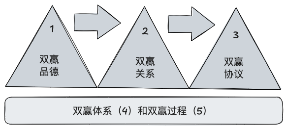
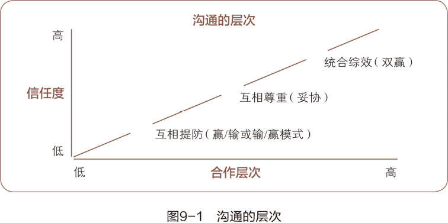

> 在《高效能人士的七个习惯》系列总结中，第一篇文章 [七个习惯概述：高效的基石](/post/2024/the-7-habits-1) 探讨了这七个习惯的核心理念，阐述了它们在个人成长和职业发展中的重要性。第二篇文章 [个人领域：从依赖到独立](/post/2024/the-7-habits-2)，聚焦于七个习惯中的前三个，探讨了如何通过自我约束和自律，逐步从依赖他人的状态过渡到真正的独立自主。本文为该系列第三篇，将聚焦于第四、第五和第六个习惯，涵盖人际交往和协作。文章将详细探讨如何通过双赢思维、移情聆听和统合综效实现高效能的人际关系，提升合作效率和团队成果。

<!-- more -->

# 习惯四：双赢思维——人际领导原则

## 人际交往的六种模式

双赢并不是技巧，而是人际交往的哲学，是六种交往模式之一：
- **利人利己（双赢）**：这种模式鼓励在交流中追求双边利益，实现共享和满意，而非此即彼的竞争；
- **损人利己（赢 / 输）**：损人利己追求 “我赢你输”，通过权势达成目的。此模式在家庭、学校及竞争中习得。尽管有时需要赢 / 输模式，但大多数情况下生活中更需要合作，损人利己反而成为障碍。
- **舍己为人（输 / 赢）**：有些人奉行输 / 赢模式，总是让步和取悦他人，缺乏自我标准，导致情感压抑和精神问题。而赢 / 输模式的人则从中获利，彼此依赖。两种模式都有人格缺陷，前者效率更高，后者处于劣势，许多人在两者间反复摇摆。
- **两败俱伤（输 / 输）**：两个损人利己的人相处，结果往往是两败俱伤，因为双方都不肯认输，并不断报复对方。这样做既不成熟，也没有意义，最终只会带来更多痛苦。
- **独善其身（赢）**：另一种常见模式是独善其身，只关心自己的得失，不在意他人。当竞争无意义时，大多数人都会选择这种方式，只关注自身利益，任由他人自保。
- **好聚好散（无交易）**

## 双赢思维的五个要领

双赢的原则是所有人际交往的基础，包括五个独立的方面：“双赢品德”是基础，接着建立起“双赢关系”，由此衍生出“双赢协议”，需要“双赢体系（结构）”作为培育环境，通过“双赢过程”来完成。



### 双赢品德

双赢品德有三个基本特征：
- **诚信**：诚信是核心价值观，通过养成习惯以保持诚信，在日常生活中按价值观安排活动并信守承诺，才能培养自我意识和独立意志。双赢的基础是诚信，缺乏诚信，双赢只是表面功夫。
- **成熟**：成熟是敢作敢为与善解人意的平衡。**成熟在于能够在表达自己情感和信念的同时，体谅他人的想法和感受**。双赢模式要求兼具温和与坚强，勇气与同理心，体贴与自信，实现真正的成熟。没有这种平衡，就无法达成双赢。
- **知足**：知足即相信资源充足，人人有份。匮乏心态使人担心资源稀缺，难以接受他人的成功，甚至希望与自己有利害关系的人遇到困难。而富足心态则基于稳固的个人价值观和安全感，认为资源充足，能够与他人分享，共同创造无限可能。公众领域的成功需要知足心态，促进所有参与者共同获利。

>成熟在于能够在表达自己情感和信念的同时，体谅他人的想法和感受。

### 双赢关系

以双赢品德为基础，我们才能建立和维护双赢关系。双赢关系的精髓是信用，即情感账户。没有信用，我们最多只能妥协，无法开诚布公，彼此学习，互相交流和发挥创造性。充足的情感账户储蓄和对双赢模式的共识是产生统合综效（习惯六）的理想途径，能为解决问题创造积极合作氛围。

双赢的实现需要真诚和投入，这不仅是对人际领导能力的考验，也是对转换式领导的理解。帮助他人认识双赢，能为双方谋福利。若对方拒绝双赢，有时选择妥协或友好分手更为适宜。

并非所有决定都要以双赢为目标，关系和情感账户至关重要。情感账户充足时，即便不同意也会支持对方的决定，否则即使表面上同意，内心也不会真正支持。没有双赢品德和关系作为后盾，协议形同虚设，真诚的感情投资才能实现双赢。

### 双赢协议

关系确立之后，就需要有协议来说明双赢的定义和方向，这种协议有时被称为“绩效协议”或“合作协议”，它让纵向交往转为水平交往，从属关系转为合作关系，上级监督转为自我监督。

在双赢协议中，要对以下五个要素有明确的规定：
- **预期结果**：确认目标和时限，方法不计；
- **指导方针**：确认实现目标的原则、方针和行为限度；
- **可用资源**：包括人力、财力、技术或组织资源；
- **任务考核**：建立业绩评估标准和时间；
- **奖惩制度**：根据任务考核确定奖惩的意义。

### 双赢体系

双赢需在健全的组织体系中实现，包括配套的培训、规划、预算、信息、薪酬等体系。提倡双赢但奖励赢 / 输模式会导致失败。成功的双赢体系应推动竞争与合作，提高效率，帮助个人和团队共同发展。

### 双赢过程

输赢的方法不可能带来双赢的结果。实现双赢的关键在于原则性谈判，即要将人同问题区分开来，要注重利益而不是立场，要创造出能够让双方都获利的方法，但不违背双方认同的一些原则或标准。

建议不同的人和机构采用以下四个步骤完成双赢过程：
- 首先，从对方角度看问题。理解对方的想法、需要和顾虑，有时甚至比对方理解的更透彻；
- 其次，人情主要问题和顾虑（而非立场）；
- 再次，确定大家都能接受的结果；
- 最后，寻找实现这样结果的各种可能路径。

习惯五和习惯六指街说明了如何处理其中的关键，后面讲详细探讨。

# 习惯五：知彼解己——移情沟通原则

>知彼解己，是进行有效人际沟通的关键。

“知彼”是交往模式的一大转变，因为我们通常把别人理解自己放在首位。大部分人在聆听时并不想理解对方，而是为了做出回应。这样的人要么说话，要么准备说话，不断用自己的模式过滤一切，用自己的经历理解别人的生活。

## 移情聆听

聆听分为五个层次：
- 充耳不闻：压根就不听别人说话；
- 装模作样：​“是的！嗯！没错！”；
- 选择性接收：只听一部分，通常学龄前儿童的喋喋不休会让我们采取这种方式；
- 聚精会神：努力听到每一个字；
- 移情聆听：聆听的最高层次。

主动型和回应型聆听是一种技巧，本质是以自我为中心，就算行为没有显露出，动机已经不言而喻，会让说话的人有受辱的感觉。回应型聆听技巧的目的不过是要做出回应，操控对方。移情聆听是指以理解为目的的聆听，要求听者站在说话者的角度理解他们的思维方式和感受。移情(Empathy)不是同情(Sympathy)。后者是一种认同和判断形式，更适合用来表达感情和做出回应，却容易养成对方的依赖性。移情聆听的本质不是要你赞同对方，而是要在情感和理智上充分而深入地理解对方。

移情聆听本身就是巨额的感情投资，它能够给人提供一种“心理空气”​，极具治疗作用。除了物质，人类最大的生存需求源自心理，即被人理解、肯定、认可和欣赏。移情聆听等于是给了对方“心理空气”​，满足了对方这个基本需求后，就可以着重于施加影响力和解决问题了。这种对“心理空气”的需求对我们生活中每一个领域的交流都有影响。

要做到先理解别人，先诊断，后开方并不容易。短期来看，直接把自己受用多年的经验别人容易得多。但是长远来看，这样会严重弱化产出和产能。如果不能准确理解对方的背景，就无法使互赖性产出最大化；如果别人感觉不到被你真正理解，你就不具备人际关系的产能，即高额情感账户。

但移情聆听是有风险的。只有当你做好了被对方影响的准备，才能深入到移情聆听的阶段，而这是需要足够的安全感的，因为这时候的你会变得很脆弱。从某种意义上说，这很矛盾，因为在影响对方之前，你必须先被影响，即真正理解对方。所以说习惯一、二和三是基础，帮你保持核心不变，即以原则为中心，从而平和而有力地应对坚实内心之外的脆弱。

## 有效沟通

我们在听别人讲话时总是会联系我们自己的经历，因此自以为是的人往往会有四种“自传式回应”的倾向：
- 价值判断：对旁人的意见只有接受或不接受；
- 追根究底：依自己的价值观探查别人的隐私；
- 好为人师：以自己的经验提供忠告；
- 自以为是：根据自己的行为与动机衡量别人的行为与动机。

这些回应方式往往阻碍有效沟通，使人无法畅所欲言。而正确的沟通方式也就是移情聆听，至少包括四个阶段：

第一阶段是复述语句，这至少能使人专心聆听。

```
子：​“上学真是无聊透了！”
父：​“你已受不了了，觉得上学太无聊。​”
```

第二阶段加入解释，完全用自己的词句表达，但仍用左脑的逻辑思维去理解。

```
父：​“你不想上学了。​”
```

第三阶段掺入个人的感觉，右脑发挥作用。此时听者所注意的已不止于言语，也开始体会对方的心情。

```
父：​“你觉得很有挫折感。​”
```

第四阶段是既加以解释，又带有感情，左右脑并用。

```
父：​“你对上学有很深的挫折感。​”
```


运用这四个阶段的方式沟通，不仅能了解对方，更能帮助对方认清自己，勇于表达。要知道，人在心情不好时，最需要善解人意的好听众，如果能适时扮演这种角色，将会惊讶于对方毫无保留的程度。但前提是，你必须真心诚意为对方着想，不存私心。

习惯五强调先理解别人，再寻求被理解，这对扩大个人影响圈非常重要。关注他人的问题和分歧会让你精疲力尽，但若专注在影响圈内，通过移情聆听深入了解对方，就能获取准确信息，建立情感账户，提供 “心理空气”，从而增强影响力。通过练习习惯五，可以理解和尊重他人，触及他们的心灵。如在家庭中，通过倾听与模拟对话，预设处理方式，能解决和预防问题。在商业领域，设立一对一交流和获取反馈系统，确保理解雇员和客户。总之，移情聆听是通往创造性解决方案和协同效应的关键，真正的理解让分歧成为进步的阶梯。

# 习惯六：统合综效——创造性合作原则

>与人合作最重要的是，重视不同个体的不同心理、情绪与智能，以及个人眼中所见到的不同世界。与所见略同的人沟通，益处不大，要有分歧才有收获。

统合综效就是整体大于部分之和，也就是说各个部分之间的关系也是整体的一个组成部分，但又不仅仅是一个组成部分，而是最具激发、分配、整合和激励作用的部分。

统合综效是人类所有活动中最高级的一种，是对所有其他习惯的真实考验和集中体现。唯有兼具人类四种特有天赋（自我意识、想象力、良知和独立意志）、辅以双赢的动机及移情沟通，才能达到统合综效的最高境界。统合综效不但可以创造奇迹，还能激发人类最大的潜能，即使面对人生再大的挑战也不足为惧。

>统合综效的精髓就是判断和尊重差异，取长补短。所谓统合综效的沟通，是指敞开胸怀，接纳一切奇怪的想法，同时也贡献自己的见地。

## 沟通的三个层次

统合综效和创造会让人热血沸腾，坦诚交流的效果令人难以置信。沟通由低到高分为三个层级：



- **低信任度沟通（赢/输或输/赢）**：低层次的沟通源于低信任度，特点是互相提防，步步为营，频繁借助法律。结果通常是赢 / 输或输 / 赢的局面，效率低下，导致产出和产能不平衡，并进一步强化自我防御和保护。
- **彼此尊重的交流（妥协）**：中层次的沟通基于彼此尊重，尽管避免了冲突，双方保持礼貌，但未必为对方设想，无法完全开诚布公。这种沟通在独立和相互依赖环境中可以立足，但缺乏创造性，常以妥协为结局，即 1+1=1½，双方都有得有失。这种沟通没有防御、愤怒和操控，而是诚实和尊重，但无法引领到真正的双赢，仅是其低级形式。
- **统合综效（双赢）**：高信任度带来的统合综效能形成更佳解决方案，每个参与者都能感受到并享受这种创造性努力。由此产生的文化氛围即使短暂，也能在当时实现产出 / 产能的平衡。即使在无法实现统合综效的情况下，用心尝试和努力仍能达成更有效的妥协。

## 统合综效提升合作效率

消极协作导致效率低下，相互依赖环境中的权术争斗与防御心态妨碍了问题的有效解决。人们与其寻求共同利益，往往回应防御，以致合作变成了耗时低效的争斗。只有跳出非此即彼的思维，才可能找到第三条道路，实现模式的重大转换。在这种环境中，解决问题和做决定常被消极无益的行为所占据，导致效率低下和资源浪费。

理解并尊重差异是实现有效合作的关键。个体差异不仅体现在能力和视角上，更体现在心理、情绪和智能上。如果能够承认各自的不足，并在交往中汲取知识和见解，就能实现真正的互补。相同毫无创造性，互补才能带来创新。统合综效的精髓在于尊重差异，这需要首先实现个人的统合综效，使自己变得开放、坦率、不惧风险。

通过移情聆听和双赢思维，可以将阻力转化为动力。高信任度带来的统合综效能促进问题的高效解决，与普遍的法律手段相比，这种方法更能减少误解和冲突。在面对阻力时，增加积极因素和使用统合综效的策略可以帮助转换阻力。移情聆听、双赢思维和统合综效需要在相互理解和尊重的基础上进行，这样不仅能解决眼前的问题，还能在长远上提升合作效率，实现整体效益最大化。

# 总结

至此就是公共领域的三个习惯了，这三个习惯阐述了从双赢思维到移情沟通，再到统合综效的过程，揭示了有效人际关系和合作的原则。
- **双赢思维**：强调在交流中追求双边利益，建立在诚信、成熟和知足的基础上。双赢关系需要建立在信用基础上，通过情感账户储蓄，促进合作和创造性解决问题。双赢协议明确目标、指导方针和评估标准，调整组织体系来支持双赢的实现。
- **知彼解己**：是通过理解他人的思维和感受来进行深入沟通的关键。聆听的层次包括充耳不闻、装模作样、选择性接收、聚精会神和移情聆听，最高层次的移情聆听能为对方提供“心理空气”。通过避免自传式回应，真正理解对方的意图和感受，可以增强情感账户，形成更加有效的互动和合作。
- **统合综效**：通过尊重差异实现整体效益的最大化，统合综效强调在相互依赖环境中的高信任度合作。在三种沟通层次中，最高层次的统合综效能创造超越个人预期的结果。通过移情聆听和双赢思维，将阻力转化为动力，实现积极的合作和解决方案。

从双赢思维到移情聆听，再到统合综效，这些习惯和原则不仅能提升个人的人际交往能力，还能促进团队的高效合作，实现全面的、长远的成功。