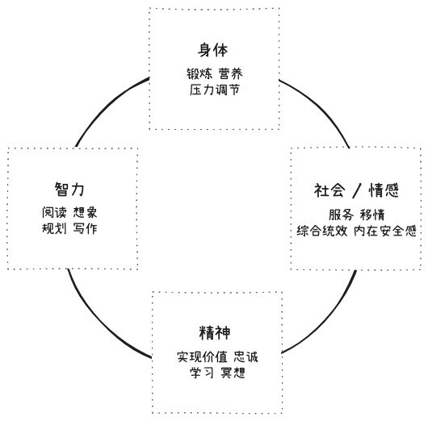
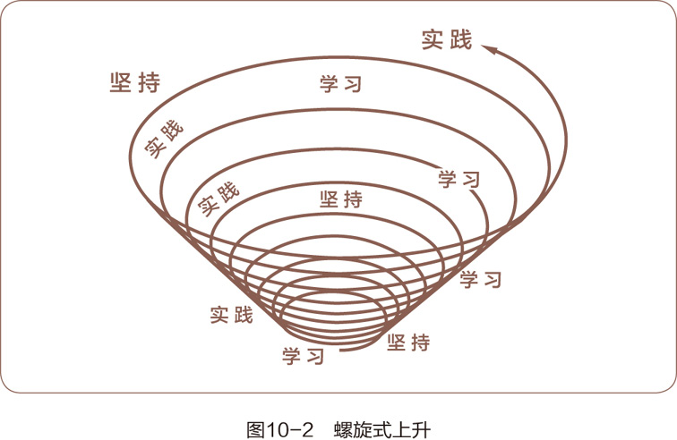

在《高效能人士的七个习惯》系列总结中，第一篇 [七个习惯概述：高效的基石](/post/2024/the-7-habits-1) 探讨了这七个习惯的核心理念，阐述了它们在个人成长和职业发展中的重要性。第二篇 [个人领域：从依赖到独立](/post/2024/the-7-habits-2) 聚焦于七个习惯中的前三个，探讨了如何通过自我约束和自律，逐步从依赖他人的状态过渡到真正的独立自主。第三篇 [公众领域：从独立到互赖](/post/2024/the-7-habits-3) 详细探讨了第四、第五和第六个习惯，涵盖了人际交往和协作，通过双赢思维、移情聆听和统合综效，实现高效能的人际关系，提升合作效率和团队成果。

本文为《高效能人士的七个习惯》系列的最后一篇，将聚焦于第七个习惯，探讨如何通过平衡的自我提升，不断更新自己的身体、精神、智力和社会 / 情感层面，从而实现持续的个人成长和全面发展。

# 习惯七：不断更新——平衡的自我提升原则

人生最值得的投资就是磨练自己，因为生活与服务人群都得靠自己，这才是最珍贵的工具。工作本身并不能带来经济上的安全感，具有良好的思考、学习、创造与适应能力，才能立于不败之地。拥有财富，并不代表经济独立，拥有创造财富的能力才真正可靠。

习惯七就是个人产能。它保护并优化你所拥有的最重要的资产——你自己。它从四个层面更新你的天性，那就是：身体、精神、智力、社会/情感。

>对自己投资，对我们用来处世和做贡献的唯一工具进行投资，是我们在一生中做出的最有效的投资。为了提高效能，我们必须认识到定期从四个层面进行提升的重要性。

## 身体层面的更新

锻炼身体是保持健康的重要因素，通过健康饮食、充足休息和定期锻炼，可以有效呵护身体。尽管锻炼属于不具紧急性的第二象限事务，但其重要性不容忽视，每周仅需3-6小时，就能带来极大的长期益处。有效的锻炼不一定需要专门器材，可以通过有氧运动提升耐力，通过伸展运动增加韧性，通过力量训练增强肌肉。锻炼虽然开始时可能不喜欢或厌恶，但持之以恒会提高身体适应力，带来更多精力和积极性，更有助于培养习惯一“积极主动”的自律精神，提升自我评价、自尊和自信。

如果你能将每分钟至少100下的心率维持30分钟，就算是基本健康。**最理想的是尝试将心率至少提高到最高脉搏频率的60％。最高脉搏频率是全身供血时心跳的最高速度，通常等于220减去你的年龄**。因此，如果你是40岁，那么就应该争取使锻炼时的心率达到108 (220－40＝180;180×0.6＝108)。通常说来，​“训练效应(Training Effect)”是指达到你最高心率的72％~87％。

## 精神层面的更新

精神层面是人的本质、核心和对价值体系的坚持，是生活中非常私人而又至关重要的领域。

精神层面的更新是指引人生方向的关键，与习惯二密切相关，通过坚持价值体系和对核心信念的反思提升个人的内在力量。人们可以通过阅读、接触自然或沉思等方式实现精神层面的更新。恒久的精神反思能带来持续的力量和坚定的信念，使人们更好地应对生活的挑战，保持内心的安宁，从而在公众领域取得成功，乐于分享和为他人造福。

## 智力层面的更新

智力层面的更新主要依赖持续的学习和自我教育，而不仅限于正规教育。许多人脱离学校后停止了读书、探索新世界和认真思考。培养定期阅读和写作的习惯，是拓展思维和提高智力的重要途径。通过有规划的学习和组织思维，提高自我教育水平，即知识和思想的更新，是确保智力不断发展的有效方式。

智力层面的更新主要靠教育，借此不断学习知识，磨砺心智，开阔视野。定期阅读优秀文学作品的习惯是拓展思维的最佳方式，这是第二象限事务，人们可以借此接触到当前或历史上最伟大的思想。磨砺心智的另一种有效方式是写作。通过不断记录自己的想法、经历、深刻见解和学习心得，我们的思路就会更加明晰、准确和连贯。

组织和规划是另外两种与习惯二和习惯三相关的磨砺心智的方式，也就是以终为始，为实现磨砺心智这一目标而运筹帷幄，运用大脑的想象力和逻辑力，事先遇见到结果和过程，即便无法预见到具体步骤，至少也能遇见到主要途径。

## 社会 / 情感层面：高效合作与沟通

身体、精神和智力层面与习惯一、二、三密切相关，围绕着个人愿景、自我领导和自我管理的原则。而社会/情感层面的重点则是习惯四、五、六，围绕着人际领导，移情交流和创造性合作的原则。

当我们在共事时意见分歧时，可以通过以下步骤解决问题：
1. 实施习惯四：先承认存在不同看法，并提议一起交流意见，找到双方满意的解决方案。
2. 实践习惯五：通过移情聆听，深入理解对方的想法，而不是立刻回应。当能够准确重述对方的观点后，再清晰阐明自己的观点，让对方也能理解。
3. 转向习惯六：利用双方的理解，共同制定出被双方认可且优于初始方案的第三种解决方案，消除分歧，实现双赢。

# 七个习惯的相互作用

人生的四个层面息息相关：身体健康有助于心智发展，精神提升有益于人际关系的完满。因此，平衡对于产生最佳的整体效果至关重要。

七个习惯在身心平衡的状态下效果最佳，因为每个习惯都密不可分：
- 习惯一积极主动：越是积极主动，就越能在生活中自我领导（习惯二）和管理（习惯三）。
- 习惯二以终为始：精神层面的更新等同于强化自我领导，它帮助我们理解个人思维和价值观，确定核心原则和使命。
- 习惯三要事第一：智力层面的更新等同于强化自我管理，帮助我们计划和优先重要活动，增加知识和选择范围，实现经济独立。
- 习惯四双赢思维：越能先理解别人（习惯五），越能找到统合综效的双赢解决方案（习惯四和习惯六）。
- 习惯五知彼解己：通过先理解别人，再让对方理解自己，找到最佳解决方案。
- 习惯六统合综效：在相互依赖的环境下发挥效能，通过合作达到更好的结果。
- 习惯七不断更新：自我更新是强化所有这些习惯的过程。身体层面的自我更新增强积极性和独立意志，精神层面的更新丰富个人生活，智力层面的更新助力高效管理生活和目标。

通过平衡这四个层面的自我更新和实践七个习惯，可以实现全面的个人发展和效能提升。

# 自我提升的螺旋式上升

自我提升和完善是一种原则，也是一个在成长和转变之间螺旋式上升的过程。为了实现稳定而卓越的进步，必须遵循良知的指引。良知帮助我们辨别是否背离正确的原则，并指引我们回归正确的方向。

当我们依照螺旋式上升的路线成长时，一定要在自我提升和完善的过程中勤勤恳恳，培养并遵从自己的良知，它会鞭策和指引我们沿着自由、安全、智慧和力量的道路前行。

要实现这个良性循环，就必须学习、坚持、实践，并沿着螺旋式上升的路线不断提高实践的层次。如果以为做到一项就已足够，那完全是在自欺欺人。为了不断进步，我们必须学习、坚持、实践——再学习、再坚持、再实践……

# 结语

以上是《高效能人士的七个习惯》系列的最后一篇。在人生旅程中，通过实践习惯七，不断从身体、精神、智力和社会/情感四个层面进行自我更新，是实现个人全面发展的关键。平衡这些层面能提升效能，保持积极状态，并为他人和社会做出贡献。七个习惯相互作用，帮助我们更好地自我领导、自我管理，理解他人并有效合作。自我提升是一个螺旋式上升的过程，遵循正确的原则和良知指引，我们将实现持续进步。通过持续学习、坚持和实践，我们能不断完善自我，迈向充实和成功的未来。

至此《高效能人士的七个习惯》系列全部结束。本系列探讨了从依赖到独立，再到高效合作，最终达到全面自我更新的全过程。七个习惯提供了一条清晰的成长路径，帮助我们在个人成长和职业发展中树立正确方向。通过积极实践这些习惯，平衡发展四个层面，我们能更加自信、有效地应对生活和工作的挑战，实现真正的成功与幸福。希望这个系列的总结为你提供实用指导，助力你在追求卓越的道路上不断前行。