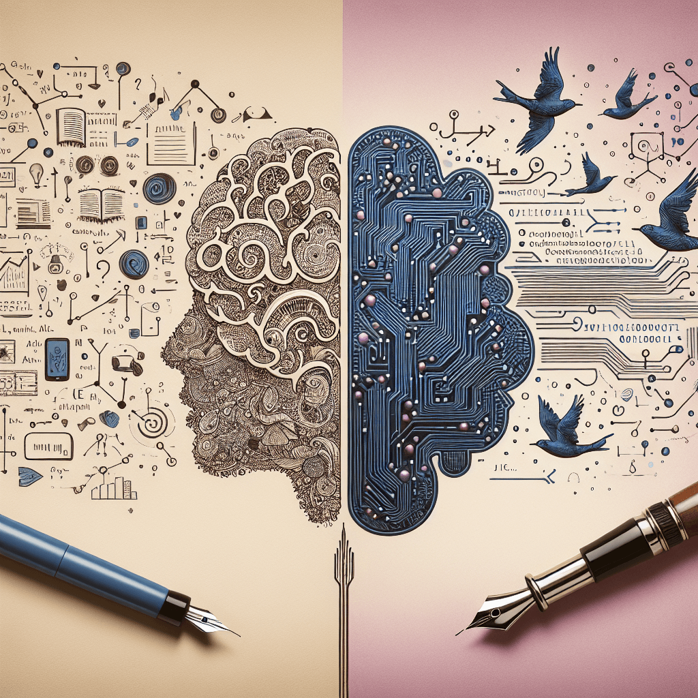

>要点：
>- 写作的本质是思维梳理和重构的过程，不是简单的文字堆砌
>- 写作压力主要来自内容创作、表达、时间和读者期待等多个方面
>- AI能有效缓解写作压力，在素材收集、内容创作和文本优化等环节提供帮助
>- AI不能完全替代写作，因为写作过程本身就是一种思考和成长
>- 合理使用AI辅助写作，既能提升效率，又不失写作带来的思维锻炼

2022年11月30日ChatGPT正式发布，它的发布标志着人工智能发展的重要转折点。它展现出前所未有的突破性能力：能够理解复杂的语言逻辑，进行多轮对话，完成从编程到创作的多样化任务，甚至能够进行跨语言交流和知识推理。这种革命性突破不仅改变了人机交互方式，更在多个领域引发深远影响。近两年AI技术更是取得了全方位的突破：从多模态理解到长文本处理，从图片生成到视频、音频创作，甚至实现了不同媒体形式之间的智能转换。这些进展充分展示了AI在各个领域的创新能力。AI的飞速发展也使得越来越多的人将AI与写作联系起来，尝试用AI来辅助写作，甚至完全用AI来写作。

我自己从2016年开始写作，2022年底ChatGPT发布以来一直在尝试使用AI来提升效率，其中当然包括写作。通过实践，我发现AI的辅助确实显著提升了我的写作效率，这让我对写作及AI有了新的思考。所以这一次，我想聊一下我眼中的写作，对写作与AI之间关系的一些思考。

# 写作的本质

说到写作，大家可能首先会想到文字，然后想到那些作家、编辑等，他们通过写作来表达自己的思想，传递信息，与读者建立连接。但实际上，写作无处不在，从工作中的文档到个人日记，都是写作的产物。

然而写作的困难，想必大家都深有体会。有时候，我们觉得自己对某个主题已经了解得很透彻，整体的来龙去脉也很清晰，但当真正开始写的时候，却发现无从下手。仿佛有太多细节还没理清楚；即使勉强写完，成文的效果往往也不尽如人意，甚至让自己都不愿再读第二遍。

这种“似乎脑海里已经清楚了，但开始写的时候却无从下手”的困境，正体现了写作的困难，同时也正反映了写作的本质：**写作不是文字的堆砌，而是一个思维梳理和重构的过程，要想写好，就必须想清楚，想清楚本身就很难**。

>写作是思维梳理和重构的过程，它有助于将模糊的想法具体化。

良好的写作需要经历归纳、分组和总结等多个环节，最终形成清晰的结论。从本质上看，写作涉及分析、综合、计划等多维度的认知活动，能够有效地将潜在的思维转化为明确的表达。

写作的过程包含预写、草稿和重写三个关键阶段。在预写阶段，需要收集和整理想法；草稿阶段则是将思路初步成文；而重写阶段则着重于优化和完善。通过这种反复打磨的过程，复杂的信息得以简化，繁杂的问题得以理顺，最终达到思维的条理化和系统化。

# 写作的压力

写作的本质本身就决定了它会带来压力。当我们需要将复杂的思维过程转化为清晰的文字时，往往会面临多重挑战：如何将自己的所想清晰表达？如何组织内容？如何让读者理解？

这些挑战通常会转化成以下几类压力：
- 内容创作的压力：选题是否恰当，论据是否充分，逻辑是否严谨，以及如何在已有资料中找到独特视角；
- 表达的压力：措辞是否恰当，语法是否正确，行文是否流畅，如何在保持个人风格的基础上确保专业性；
- 时间压力：截稿期限、创作效率，以及时间管理能力不足可能导致的焦虑；
- 读者期待的压力：内容是否够专业，观点是否够新颖，价值是否够高，创作者自身对作品质量的期待；
- 心理因素：对失败的恐惧和创作障碍等内心冲突。

这些压力会直接影响我们的写作体验和效率。即使我们学到了新知识，有了好的想法，也可能因为这些压力而迟迟无法下笔。即便最终完成写作，往往也要耗费大量时间在思考、查资料和反复修改上。相信这种体验对很多人来说都不陌生。

然而，写作在现代社会中几乎无处不在：从工作汇报到项目方案，从学术论文到日常总结，职位越高对写作能力的要求也越高。面对这些不可回避的写作任务，有些人会选择寻求代笔，甚至铤而走险采用抄袭的方式，这反映出写作压力确实已经成为一个普遍的问题。

# AI如何减轻写作压力

AI的出现为我们开启了一个崭新的时代，彻底改变了信息的获取和处理方式。通过强大的自然语言处理能力，AI能够快速生成高质量的文本，帮助作者迅速获得初稿，显著提高写作效率。AI通过理解上下文来提供针对性的建议，使得内容组织更加清晰，减少创作过程中的困惑。

通过AI我们可以很好的应对写作中的压力：
- 内容创作压力：AI可以协助选题分析和方向建议，提供相关资料和参考信息，帮助完善论据和逻辑框架；
- 表达压力：AI能够优化语言表达和措辞，检查语法和文字错误，提供多种表达方式的建议；
- 时间压力：AI可以快速生成初稿框架，自动整理和归纳资料，提高写作效率；
- 读者期待压力：AI则可以分析目标读者群体特征，提供专业术语建议，评估内容的可读性。

我自己从2023年开始在写作过程中积极尝试AI辅助，具体应用包括：
- 前期准备：素材收集和整理、主题研究；
- 创作过程：思路梳理、灵感激发、内容扩充；
- 后期优化：语言润色、逻辑检查；
- 多媒体支持：AI图片生成。

通过这些实践，我确实感受到写作效率的显著提升，同时也发现AI能在很大程度上帮助缓解写作过程中的各种压力。

# AI与写作的边界

>AI不能，也不应该完全替代写作。

既然AI有效缓解写作压力，大幅提升写作效率，那么是否可以完全依赖AI来写作？即直接用AI去生成完整的内容，从而完全摆脱写作压力？我个人的答案是：**不能**。

从目前的现状分析。AI在生成长文方面还存在明显的局限性：生成的内容往往格式固定、缺乏个性化表达，创造力有限，而且容易带有明显的“AI味”。更重要的是，AI无法真正理解和传达作者独特的思维过程和个人见解。

从写作的本质分析。前面已经提到，写作的本质就是思考，是一个思维梳理和重构的过程。写作帮助我们将模糊的想法具体化，使其变得更加清晰和可理解。**当我们把思想写下来时，我们会发现其中的逻辑漏洞和不一致之处，从而促进更深入的思考**。这个过程本身就是一种学习和成长。

正如Leslie Lamport所说：

>If you're thinking without writing, you only think you're thinking.

更值得警惕的是，过度依赖AI写作可能带来深远的负面影响。写作能力的差异最终会导致思维能力的分化，将人群划分为“会思考”和“不会思考”两类。这种分化将直接影响一个人的认知水平和创新能力。

所以无论是从AI发展现状看，还是从个人提升角度看，AI完全替代人去写作是不合适的，**AI只能作为写作的辅助工具，而不能，也不应该完全替代写作**。

# 最后

写作是一个独特的认知过程，它不仅仅是文字的堆砌，更是思维的梳理与重构。在AI时代，我们应该理性看待AI与写作的关系：AI是强大的助手，但不是替代者。合理地使用AI可以帮助我们，减轻创作压力，提高写作效率。

但同时我们应该知道，真正优秀的写作永远离不开人的思考。AI可以帮助我们更好地写作，但思考始终在我们自己。毕竟，写作的最终目的，是让我们更好地思考，更清晰地表达，更深入地理解这个世界。

