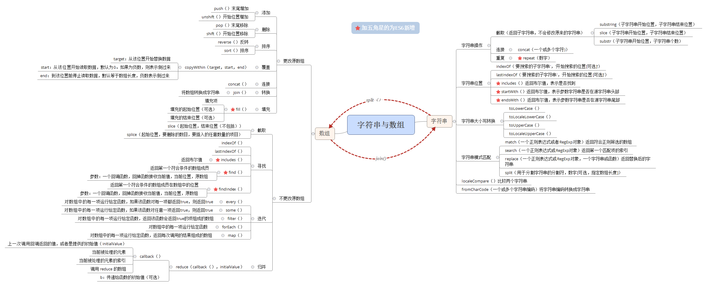

## 字符方法

### chartAt()与charCodeAt()

参数：*基于**0的字符位置***

**chartAt()**以单字符字符串的形式返回给定位置的那个字符。而**charCodeAt()**返回的是字符编码。

<!--more-->

```js
var stringValue = 'hello world';
/*chartAt()*/
console.log(stringValue.chartAt(1));    // 'e'
```

## 字符串操作方法

### concat()(数组中也有该方法)

参数：*一个或多个字符串*

将一个会多个字符串拼接起来，当然更常用的是使用 “+” 进行拼接

### substring()与slice()(数组中也有此方法)

参数：*指定子字符串的开始位置*，*子字符串到哪里结束*

作用：创建新的子字符串（可以理解为字符串截取）

### substr()

参数：*指定子字符串的开始位置*，*返回的子字符串的字符个数*

作用：创建新的子字符串（可以理解为字符串截取）

### repeat()（ES6新增）

参数：*数字（表示重复的次数）*

作用：将原字符串重复n次

如果传入负数，则报错，传入小数和`NaN`等同于传入0

**substring，slice，substr，repeat均返回子字符串，不会修改原来的字符串**

```js
var stringValue = "hello world"; 
alert(stringValue.slice(3));          //"lo world" 
alert(stringValue.substring(3));      //"lo world" 
alert(stringValue.substr(3));         //"lo world" 
alert(stringValue.slice(3, 7));       //"lo w" 
alert(stringValue.substring(3,7));    //"lo w" 
alert(stringValue.substr(3, 7));      //"lo worl" 
/*repeat()*/
var a = 'he';
var b = a.repeat(3);
console.log(`${a}---${b}`); /		  //"he---hehehe"
```

当给这三个方法传入负值的时候，三个的表现不同：
- slice()会将传入的负值与字符串的长度相加
- substr()会将**第一个**位置的**负值**参数加上字符串长度后转为正数，而**第二个**位置的**负值**将转化为0
- substring()会把所有的负参数转化为0
- repeat()会报错

## 字符串位置方法

### indexOf()和lastIndexOf()(数组中也有该方法)

参数：*要搜索的子字符串*，*开始搜索的位置（可选）*

搜索给定的子字符串，如果找到则返回位置，否则返回-1

```js
var stringValue = "hello world"; 
alert(stringValue.indexOf("o"));             //4 
alert(stringValue.lastIndexOf("o"));         //7 
```

这两个方法在搜索到第一个匹配的子字符串后就停止运行，所以如果想找到字符串中所有的
子字符串出现的位置，可以循环调用`indexOf`或`lastIndexOf`。

```js
var stringValue = "Lorem ipsum dolor sit amet, consectetur adipisicing elit"; 
var positions = new Array(); 
var pos = stringValue.indexOf("e"); 
 
while(pos > -1){ 
    positions.push(pos); 
    pos = stringValue.indexOf("e", pos + 1); 
} 
     
alert(positions);    //"3,24,32,35,52"
```

### **ES6新增**includes()、startsWith()、endsWith()

- includes()：返回布尔值，表示是否找到了参数字符串
- startsWith()：返回布尔值，表示参数字符串是否在源字符串的头部
- endsWith()：返回布尔值，表示参数字符串是否在源字符串的尾部

这三个方法的参数与`indexOf()`，`lastIndexOf()`一样

```js
var s = 'Hello world';
s.startsWith('world',6);	// true
s.endsWith('Hello',5);		// true
s.includes('Hello',6);		//false
```

**注意：**
使用第2个参数n时，`endsWith`的行为与其他两个方法有所不同。它针对**前面**n个字符，而其他两个方法针对从第n个位置开始直到字符串结束的字符。

## 去空格--trim()

ES5中新增`trim()`方法用于去除字符串的左右空格，**该方法会创建一个字符串的副本，不会改变原有的字符串**，此外，Firefox 3.5+、Safari 5+
和 Chrome 8+还支持非标准的 trimLeft()和 trimRight()方法，分别用于删除字符串开头和末尾的
空格。

其实去空格可以使用正则去匹配的去掉，这里写一个去空格函数

```js
/*trim	去掉空白
str要处理的字符串		
[type] 	类型：l 去除左边的空白	r去除右边空白	b去掉两边的空白		a去除所有空白*/
function trim (str,type) {
	var type=type||"b";
	if(type=="b"){
		return str.replace(/^\s*|\s*$/g,"");
	}else if(type=="l"){
		return str.replace(/^\s*/g,"");
	}else if(type=="r"){
		return str.replace(/\s*$/g,"");
	}else if(type=="a"){
		return str.replace(/\s*/g,"");
	}
}
```

## 字符串大小写转换

### toLowerCase()、toLocaleLowerCase()、toUpperCase()和 toLocaleUpperCase()

## 字符串的模式匹配方法

### match()

参数：*一个正则表达式或RegExp对象*

返回一个数组。在字符串上调用这个方法本质上与调用RegExp的exec()方法相同。

```js
var text = "cat, bat, sat, fat";  
var pattern = /.at/; 
 
//与 pattern.exec(text)相同 
var matches = text.match(pattern);         
alert(matches.index);             //0 
alert(matches[0]);                 //"cat" 
alert(pattern.lastIndex);          //0 
```

### search()

参数：*一个正则表达式或RegExp对象*

返回字符串中第一个匹配项的索引，如果没有找到，则返回-1

```js
var text = "cat, bat, sat, fat";  
var pos = text.search(/at/); 
alert(pos);   //1 
```

### replace()

参数：*一个RegExp对象或者一个字符串（这个字符串不会被转换成正则表达式）*，*一个字符串或一个函数*

利用`replace()`进行替换的时候，如果传入的是字符串，则只会替换第一个子字符串，要想替换所有的子字符串，则需要传入一个正则表达式，而且要指定全局（g）标志

```js
var text = 'cat , bat , sat , fat';
var result = text.replace('at','ond');
console.log(result); // =>'cont , bat , sat , fat'

result = text.replace(/at/g,'ond');
console.log(result); //=>'cont , bont , sont , font'
```
该方法并不改变调用它的字符串本身，只是返回一个新的替换后的字符串。

**当第二个参数为函数时**函数的返回值作为替换字符串。与第二个参数是字符串一样，如果第一个参数是正则表达式，并且全局匹配，则这个函数的方法将被多次调用，每次匹配都会被调用。

该函数的参数：
- match：匹配的子串
- p1,p2...：假如`replace()`方法的第一个参数是RegExp对象，则代表第n个括号匹配的字符串。
- offset：匹配到的子字符串在原字符串中的偏移量。（比如，如果原字符串是“abcd”，匹配到的子字符串时“bc”，那么这个参数是1）
- 被匹配的原字符串

```js
function replacer(match , p1 , p2 , p3 , offset , string){
	// p1 is nondigits, p2 digits, and p3 non-alphanumerics
    console.log(`${match}
				 ${p1}
				 ${p2}
				 ${p3}
				 ${offset}
				 ${string}`); 
	/* => abc12345#$*%
         abc
         12345
         #$*%
         0
         abc12345#$*%"	*/		 
    console.log([p1, p2, p3].join(' - ')); // => "abc - 12345 - #$*%"
    return [p1, p2, p3].join(' - ');
}
var newString = 'abc12345#$*%'.replace(/([^\d]*)(\d*)([^\w]*)/, replacer); // =>"abc - 12345 - #$*%"
```

### split()

参数：*用于分隔字符串的分隔符*，*数字（可选，用于指定数组的大小）*

作用：基于指定的分隔符将一个字符串分割成多个子字符串，并将结果放在一个**数组**中，分隔符可以是字符串，也可以是RegExp对象

```js
var color = 'red,blue,yellow,black';
var color1 = color.split(',');		// =>['red','blue','yellow','black']
var color2 = color.split(',',2);	// =>['red','blue']
var color3 = color.split(/[^\,]+/); // =>["", ",", ",", ",", ""] 
```
最后一个调用`split`的时候，出现了前后的两个空白，是因为通过正则表达式指定的分隔符出现在了字符串的开头和结尾。

## localeCompare()

这个方法用于比较两个字符串，并返回下列值中的一个：

- 如果字符串在字母表中应该排在字符串参数之前，则返回负数（大多情况下为-1）
- 如果相等，则返回0
- 如果排在字符串参数之前，则返回正数（大多数情况下为1）

## fromCharCode()

String构造函数的一个静态方法

参数：*一个或多个字符串编码*

作用：将接收到的一个或多个字符串编码**转换**成一个字符串，这个方法与实例方法`charCodeAt()`执行**相反**的操作。

```js
/*fromCharCode*/
String.fromCharCode(104,101,108,108,111);	// =>hello
/*charCodeAt*/
let s = 'hello';
for(let i=0;i<s.length;i++){
  console.log(`${s[i]}----${s[i].charCodeAt()}`);
}
/*
"h----104"
"e----101"
"l----108"
"l----108"
"o----111"
*/
```

最后写一个字符串与数组方法应用的一个例子，熟悉它们方法的话很简单，不熟悉就会觉得有点儿乱。

```js
let s = 'hello';
let news = s.split('').reverse().join('');
console.log(news); // => "olleh"
```
## 另附js中String和Array方法的总结图：
