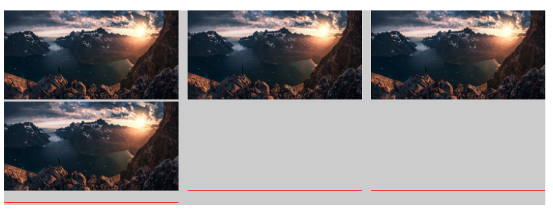
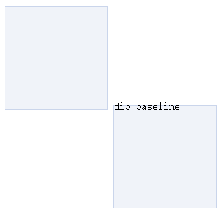
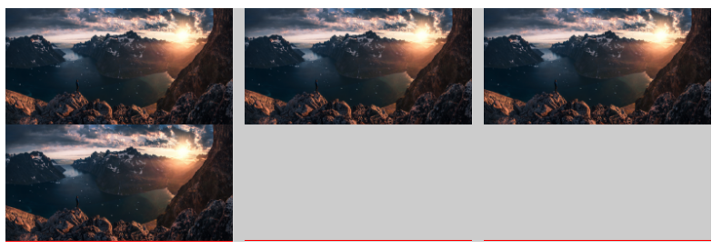

看了张鑫旭在慕课网关于vertical-align的讲解，感觉讲的挺深，所以总结了一下
vertical-align的百分比值相对于line-height计算
IE6/7下line-height不支持小数
<!--more-->
## vertical-align起作用的前提
该属性应用于inline水平或者table-cell元素
#### inline水平
inline:img,span,strong,em等
inline-block:input,button（ie8+，ie6/7会把inline-block当作inline）
#### table-cell元素
td
所以<font color='red'>默认情况下</font>支持vertical-align的有：图片，按钮，文字，单元格
### 抛出一个问题
想实现图片的垂直居中
```html
<!DOCTYPE html>
<html>
<head>
  <meta charset="utf-8">
  <meta name="viewport" content="width=device-width">
  <title>JS Bin</title>
</head>
<body>
<p>
  
</p>
</body>
</html>
```
```css
p{
  width:100%;
  height:200px;
  background-color: #ccc;
}
img{
  vertical-align:middle;
}
```
利用vertical-align：middle实现垂直居中，但是这里并没有按照我们想要的去做，解决办法：
#### 1.给父元素<p>添加line-height的值为<p>的高度（ie7+都可以实现）
```css
p{
    line-height:200px;
}
```
#### 2.给父元素<p>添加display:table-cell
table-cell元素的vertical-align只会作用于自身，里面的子元素设置不起作用
```css
p{
    display:table-cell;
    /*把img的去掉*/
     vertical-align:middle;
}
```
## vertical-align与line-height
利用text-align:justify任意数目列表两端对齐效果
```css
.justify-fix{display:inline-block;width:250px}
p{
    background:#666;
}
```
```html
 <p style="text-align: justify">
	
	
	
	
	<i class="justify-fix"></i>
	<i class="justify-fix"></i>
	<i class="justify-fix"></i>
  </p>
```



运行后红色虚线表示i标签的位置
设置容器，p的行高为0
```css
p{
    line-height:0;
}
```
则出现如下情况：


#### 为什么会出现这样的现象？
首先看一个东西
从CSS2的可视化格式模型文档中看到：
‘inline-block’的基线是正常流中最后一个line box的基线，除非，这个line box里面既没有line boxes或者本身‘overflow’属性的计算值而不是‘visible’，这种情况下基线是margin第边缘
举例说明：
```html
<style>
	.dib-baseline{
		display: inline-block;
		width: 150px;
		height: 150px;
		border: 1px solid #cad5eb;
		background-color: #f0f3f9;
		margin-top: 20px;
	}
</style>
<span class="dib-baseline"></span>
<span class="dib-baseline">dib-baseline</span>
```


文档解释了该现象，因为前面的盒子没有任何字符，此时它的基线就是它的底边缘，后面的盒子有文字，所以该盒子的基线就是文字的基线，二者基线对齐，现成如此效果。
如果把第二个盒子line-height:0，此时文字基线的位置，就是文字的垂直中心，所以：



所以，以上情况下面那些空白，是由于本身后面两个图片是没有的，所以可以当作是空白字符（空格），即后面两个`<i>`是有字符的，而第一个`<i>`是没有字符的，所以和上面的那个例子一样，默认基线对齐，所以，会导致出现小的空隙（其本质和图2一样），要消除这个空隙，需要给i都添加空白字符（&nbsp;或者直接改变对齐方式，vertical-align：top / bottom）即可，而这个line-height：0可以不添加。

要消除需要给p标签（容器）设置：
```css
p{
    line-height:0;
}
.justify-fix{
    vertical-align: bottom / top;
}
```
之后运行结果：



## vertical-align线性属性值
### 1.vertical-align:bottom（top与之差不多）
#### 定义
1. inline / inline-block元素：元素底部和整行底部对齐。
2. table-cell元素：单元格底padding边缘和表格行的底部对齐

### 2.vertical-align:middle
#### 定义
1. inline / inline-block元素：元素的垂直中心点和父元素基线上1/2 x-height处对齐
2. table - cell元素：单元格填充盒子相对于外卖的表格行居中对齐

#### 利用vertical-align：middle所实现的是<font color="red">近似</font>垂直居中
为什么是近似呢？答案就在于： inline / inline-block元素：元素的垂直中心点和父元素基线上1/2 x-height处对齐
父元素基线上1/2 x-height处其实就是用line-height撑开后字符水平中心
字符所在的水平中心线和经过line-height撑开后的水平中心线（vertical-algin：middle的水平中心线）不是一个中心线（具体演示看[4-1 vertical-align线性属性值]http://www.imooc.com/video/10403）因为字符，本身有个下沉的特性
#### 那么如何实现完全垂直居中？
给父元素设置
```css
p{font-size:0}
```
这样元素的垂直中心点和父元素基线上1/2 x-height处就完全重合了
但是这样会出现问题，如果我们在父级元素中有文字，那么设置`font-size：0`会导致文字无法显示，实现完全垂直居中的另一种方法是给图片（img）后面添加一个span,span设置为vertical-align：middle
```css
p { line-height:250px; }
img { veritcal-align:middle; }
img+span { veritcal-align:middle; } 
```
## vertical-align文本类属性值
### 定义：
1. vertical-align :text-top
盒子的顶部和父级content area的顶部对齐
2. vertical-align：text-bottom

盒子的底部和父级content area的底部对齐
### 解释：
content area就是只与父级font-size的大小有关，与行高，以及后面是否有inline-block元素的没有任何关系，但是vertical-align：middle / top / bottom都会被后面的inline-block水平元素影响。
### 用处：
一般用于表情图片（或原始尺寸背景图标）与文字的对齐效果
## 输入理解vertical-align上标下标类---sub / super
HTML中有原生的上下标标签，分别为：`<sup>` ,`<sub>`。利用原生的HTML获得的上下标文字大小是父元素75%左右。
### 定义：
1.vertical-align：super
提高盒子的基线到父级合适的上标基线位置。
2.vertical-align：sub
降低盒子的基线到父级合适的下标基线位置。
这里的‘合适的上（下）标基线位置’，哪里合适，说不清
## vertical-align前后不一的作用机制与示例
 vertical-align所有的表现只当前元素和父级有关，前后并没有直接影响
1.实现小图标和文字的对齐
使用vertical-align负值，虽然图片文字对齐可以使用浮动实现的，但是尽量少用浮动，因为会破坏布局，使用vertical-align负值可以实现居中
2.不定尺寸图片或多行文字的<font color='red'>垂直居中</font>,具体实现步骤如下：
a.大小不固定的图片垂直居中
- 主体元素inline-block化；
- 0宽度100%高度辅助元素；
- vertical-align:middle；
```html
<p><i></i></p>
```
```css
p{
     width: 500px;
     height: 200px;
     background-color: yellowgreen;
}
/*主体元素inline-block化img本身是inline，
但是里面的content为inline-block*/
img{
    width: 40%; 
    vertical-align:middle;         
}
/*宽度为0，高度100%的辅助元素*/
i {
     display: inline-block;
     height: 100%;
     vertical-align:middle;
}
/*给以上 img 和 i 元素添加 vertical-align:middle;  */
```
实现垂直居中，效果如下：


b.大小不固定的文字垂直居中：
```html
<p>
        <span>测试文字垂直居中<br/>测试文字垂直居中<br/>测试文字垂直居中<br/>测试文字垂直居中<br/>测试文字垂直居中<br/>测试文字垂直居中<br/>测试文字垂直居中<br/>测试文字垂直居中</span>
        <i></i>
 </p>
```
```css
p{
     width: 500px;
     height: 200px;
     background-color: yellowgreen;
}
span{
     display: inline-block;
     vertical-align:middle;         
}
i{
     display: inline-block;
     height: 100%;
     vertical-align:middle;
}
```
