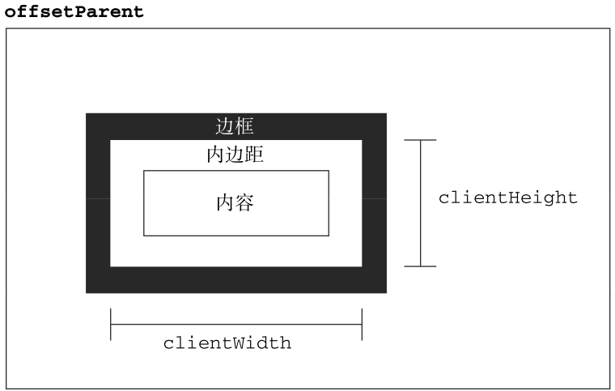

> 最近事儿比较多，一直没时间写东西，前几天又遇到关于获取元素大小的问题，每次遇到这类问题就翻书，比较费时间，所以总结一下。

<!--more-->

### 1.元素的偏移量
元素的偏移量包括元素在屏幕上占用的所有可见的空间。元素的可见大小由其高度、宽度决定，包括所有内边距、滚动条和边框大小（注意：这里并不包括外边距）。


### 2.客户区大小
元素的客户区大小指的是元素内容机器内边距占据空间的大小。




要确定浏览器可见窗口的大小，可以使用`document.documentElement`或`document.body`（IE7之前的版本中）。

从以上两个我们可以看出元素偏移量（offset）与客户区大小（client）的区别在于**有没有包含边框**，客户区大小不包含边框。
### 3.滚动大小


`scrollWidth`和`scrollHeight`主要用于确定元素内容的实际大小。所以带有垂直滚动条的页面总高度就是`document.documentElement.scrollHeight`。


### 4.窗口大小
在现代主流浏览器中提供了四个属性确定窗口的大小，分别为：`innerWidth`、`innerHeight`、`outerWidth`和`outerHeight`。
#### 4.1. outerWidth和outerHeight
返回浏览器窗口本身的尺寸（无论是从外层的window对象还是从某个框架访问）
#### 4.2. innerWidth和innerHeight
返回该容器中页面试图去的大小（减去边框宽度）

**注意：**

这里在《javascript高级程序设计》（第三版）中写道在chrome中outer与inner返回的值是一样的，这算是chrome的一个bug，我在chrome 53中已经修复，但是在QQ浏览器中（内核为chromium47）依旧是相等的，这需要注意！
`clientWidth`和`clientHeight`。

在主流浏览器中，`document.docuementElement.clientWidth`和`document.documentElement.clientHeight`中保存的是页面视口信息。返回的值与`window.innerHeight`，`window.innerWidth`一样。
但是`window.innerHeight`在IE8及以下浏览器中结果是`undefined`，而`document.documentElement.clientHeight`还有值。所以在各个浏览器下取得页面视口大小的代码如下：
```js
var pageWidth=window.innerWidth,
    pageHeight=window.innerHeight;
if(typeof pageWidth !== 'number'){
    if(document.compatMode === 'CSS1Compat'){
        pageWidth=document.documentElement.clientWidth;
        pageHeight=document.documentElement.clientHeight;
    }else{
        pageWidth=document.body.clientWidth;
        pageHeight=document.body.clientHeight;
    }
}    
```
代码中`document.compatMode`用于判断浏览器处于什么模式，它有两个值：
`BackCompat`:浏览器处于怪异模式
`CSS1Compat`:浏览器处于标准模式
不同模式下，获取浏览器的宽度的方法不同，在代码中已经做了判断。