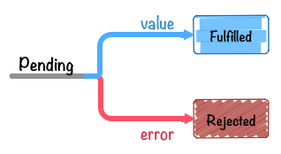

>最近一直在用空余时间研究node，当我写了一个简单的复制一个文件夹中的文件到另一个位置的时候，我看到了所谓的回调地狱，虽然只是四五个回调嵌套，但是这已经让我感到害怕，我写这么简单的一个小demo就写成这样，那稍微复杂点儿还了得？记得在看ES6的时候，里面提到过一种新的解决回调的方式－－－Promise，而且在node中也常用这个解决大量嵌套，所以这几天花了点儿时间看了看Promise，让我对Promise的认识更加清晰，所以写一些东西总结一下。

<!--more-->

## Promise状态的理解

用`new Promise`实例化的Promise对象有三个状态：

- “has-resolution” - Fulfilled

+ reslove(成功时)，调用`onFulfilled`

- "has-rejection" - Rejected

+ reject(失败时)。调用`Rejected`

- "unresolve" - Pending

+ 既不是resolve也不是reject状态，也就是Promise刚刚被创建后的初始化状态。



1. 在Chrome中输出`resolve`可以得到`Promise {[[PromiseStatus]]: "pending", [[PromiseValue]]: undefined}`，可以看出`[[PromiseStatus]]`中存储的就是Promise的状态，但是并没有公开访问`[[PromiseStatus]]`的用户API，所以暂时还无法查询其内部状态。

2. Promise中的`then`的回调只会被调用一次，因为Promise的状态只会从Pending变为Fulfilled或者Rejected，不可逆。

## Promise的使用

在使用Promise实现有序执行异步的基本格式如下：

```js
//defined Promise async function
function asyncFun(){
    return new Promise((reslove,reject)=>{
        if(reslove){
            reslove(/*reslove parameter*/);
        }else{
            reject(new Error(/*Error*/));
        }
    })
}

//use Promise&then
asyncFun().then(/*function*/).then(/*function*/)...
```

`reslove`方法的参数就是要传给回调函数的参数，即`resolve`将运行得到的结果传出来，而`then`接受该参数给回调继续执行后面的，如果这个`then`的中的函数还会返回Promise，则会重复执行该步骤直到结束。

`reject`方法的参数一般是包含了reject原因的Error对象。`reject`和`resolve`一样，也会将自己的参数传出去，接收该参数的是`then`的第二个fun或者是`catch`。其实`.catch`只是`Promise.then(onFulfilled,onRejected)`的别名而已。

## 快捷创建Promise

一般情况下我们会使用`new Promise`来创建prmise对象，除此之外我们也可以使用`Promise.reslove`和`Promise.reject`来直接创建，例如`Promise.resolve(42)`可以认为是以下代码的语法糖

```js
new Promise((reslove)=>{
    reslove(42);
});
```

这段代码可以让这个Promise对象立即进入resolve状态，并将42传递给后面then里所指定的`onFulfilled`函数。此外`Promise.resolve`还有一个作用，就是将非Promise对象转换为Promise对象。

`Promise.reject(value)`与之类似。

## Promise.then()异步调用带来的思考

```js
var promise = new Promise(function (resolve){
    console.log("inner promise"); // 1
    resolve(42);
});
promise.then(function(value){
    console.log(value); // 3
});
console.log("outer promise"); // 2

/*输出：
"inner promise"
"outer promise"
42
*/
```

从以上的这段代码我们可以看出`Promise.then()`是异步调用的，这也是Promise设计上规定的，其原因在于**同步调用和异步调用同时存在会导致混乱**。

以上那段代码如果在**调用onReady之前DOM已经载入的话**，对回调函数进行**同步**调用，如果在**调用onReady之前DOM还没有载入的话**，通过注册`DOMContentLoader`事件监听器来对回调进行**异步**调用。这会导致该代码在源文件中不同位置输出不同的结果，关于这个现象，有如下几点：

- 绝对不能对异步函数（即使在数据已经就绪）进行同步调用
- 如果对异步回调函数进行同步调用，处理顺序可能会与预期不符，带来意外的结果
- 对异步回调函数进行同步调用，还可能导致栈溢出或者异常处理错乱等问题
- 如果想在将来的某个时刻调用异步回调，可以使用`setTimeout`等异步API

所以以上代码应该使用` setTimeout(fn, 0)`进行调用。

```js
function onReady(fn) {
    var readyState = document.readyState;
    if (readyState === 'interactive' || readyState === 'complete') {
        setTimeout(fn, 0);
    } else {
        window.addEventListener('DOMContentLoaded', fn);
    }
}
onReady(function () {
    console.log('DOM fully loaded and parsed');
});
console.log('==Starting==');
```

所以在Promise中`then`是异步的。

## Promise链式调用

#### 各个Task相互独立

如果想实现Promise的链式调用，要求每次链式调用都返回Promise。所以每个异步执行都需要使用Promise包装，这里有一个<font color='red'>**误区：**</font>每个`then`，`catch`会返回也会反回一个新的Promise，但是**这仅仅实现了链式调用**，如果不将异步操作用Promise进行包装，依然不行。下面的例子就是<font color='red'>**错误的**</font>。

```js
function pro1(){
    return new Promise((reslove,reject)=>{
        if(reslove){
            setTimeout(()=>{console.log(1000)},1000);
            reslove();
        }
    })
}

function pro2(){
    setTimeout(()=>{console.log(2000)},2000);
}

function pro3(){
    setTimeout(()=>{console.log(3000)},3000);
}

pro1().then(pro2).then(pro3);

function pro1(){
    setTimeout(()=>{console.log(1000)},1000);
}

Promise.resolve().then(pro1).then(pro2).then(pro3);
```

上面的写法有两处错误：

1. 虽然在第一个函数返回了一个Promise，但是由于后面的异步操作并没有被Promise包装，所以并不会起任何作用，**正确的做法是每一个异步操作都要被Promise包装**

2. `resolve()`调用的时机不对，`resolve`需要在异步操作执行完成后调用，所以需要写在异步操作内部，如果像上面那样写在异步操作外面，则不会起作用。

所以正确写法如下：

```js
//直接返回Promise
function pro1(){
    return new Promise((resolve,reject)=>{
        setTimeout(()=>{console.log(1000);resolve();},1000);
        
    })
}
function pro2(){
    return new Promise((resolve,reject)=>{
        setTimeout(()=>{console.log(5000);resolve();},5000);
        
    });
}
function pro3(){
    return new Promise((resolve,reject)=>{
        setTimeout(()=>{console.log(500);resolve();},500);
    })
}
pro1().then(pro2).then(pro3);

//or使用Promise.reslove()

function pro1(cb){setTimeout(()=>{console.log(1000);cb()},1000)};
function pro2(cb){setTimeout(()=>{console.log(3000);cb()},3000)};
function pro3(cb){setTimeout(()=>{console.log(500);cb()},500)};


Promise.resolve()
       .then(()=>new Promise(resolve=>pro1(resolve)))
       .then(()=>new Promise(resolve=>pro2(resolve)))
       .then(()=>new Promise(resolve=>pro3(resolve)));
```

#### 各个Task需要参数的传递

在Promise的链式调用中，有可能各个task之间存在相互依赖，例如TaskA想给TaskB传递一个参数，像下面这样：

```js
/*例1.使用Promise.resolve()启动*/
let task1 = (value1)=>value1+1;
let task2 = (value2)=>value2+2;
let task3 = (value3)=>{console.log(value3+3)};

Promise.resolve(1).then(task1).then(task2).then(task3);//console => 7


/*例2.普通的返回一个Promise*/
function task1(value1){
  return new Promise((resolve,reject)=>{
    if(resolve){
      resolve(value1+1);
    }else{
      throw new Error("throw Error @ task1");
    }
  });
}

function task2(value2){
  return new Promise((resolve,reject)=>{
    if(resolve){
      resolve(value2+2);
    }else{
      throw new Error("throw Error @ task1");
    }
  });
}
function task3(value3){
  return new Promise((resolve,reject)=>{
    if(resolve){
      console.log(value3+3);
    }else{
      throw new Error("throw Error @ task1");
    }
  });
}

task1(1).then(task2).then(task3);//console => 7
```
关于`reslove`与`reject`有以下两点说明：

- `reslove`函数的作用是将Promise对象的状态从“未完成”变为“成功”（即从Pending变为Resolved），在异步操作成功时调用，并将**异步操作的结果作为参数传递出去**；

- `reject`函数的作用是将Promise对象状态从“未完成”变为“失败”（即从Pending变为Rejected），在异步操作失败时候调用，并将**异步操作报出的错误作为参数传递出去**；

所以从上面的例子和它们的用法可以看出，如果想要传递给后面task有两种方法：

- 如果使用`Promise.resolve()`启动Promise，则像例1中那样在需要传递的参数前面加`return`即可。

- 如果是利用Promise包装了任务，则把想要传递给下一个task的参数传入`resolve()`即可。

**特别说明：如果需要`resolve()`往后传递多个参数，不能直接写`resolve(a1,a2,a3)`，这样只能拿到第一个要传的参数，需要以数组或对象去传递**

```js
let obj = {a1:a1,a2:a2,a3:a3};
resolve(obj)
//or
let arr =[a1,a2,a3];
resolve(arr);
```

## `then`与`catch`返回新的Promise

在Promise中无论是`then`还是`catch`方法，都会返回返回一个新的Promise对象。


```js
var aPromise = new Promise(function (resolve) {
    resolve(100);
});
var thenPromise = aPromise.then(function (value) {
    console.log(value);
});
var catchPromise = thenPromise.catch(function (error) {
    console.error(error);
});
console.log(aPromise !== thenPromise); // => true
console.log(thenPromise !== catchPromise);// => true
```

所以像下面这样将链式调用分开写是不成功的

```js
// 1: 对同一个promise对象同时调用 `then` 方法
var aPromise = new Promise(function (resolve) {
    resolve(100);
});
aPromise.then(function (value) {
    return value * 2;
});
aPromise.then(function (value) {
    return value * 2;
});
aPromise.then(function (value) {
    console.log("1: " + value); // => 100
});
```

由于每次调用`then`方法都会返回一个新的Promise，所以导致最终输出100而不是100 * 2 * 2。

## Promise.all()的使用

有时候需要多个彼此没有关联的多个异步任务全部执行完成后再执行后面的操作，这时候就需要用到`Promise.all()`，它接收一个Promise的对象的数组作为参数，当这个数组里的所有Promise对象全部变成resolve或者reject的时候，它才会去调用后面的`.then()`。

这里需要说明一点，两个彼此无关的异步操作会同时执行，每个Promise的结果（即每个返回的Promise的resolve或reject时传递的参数）和传递给`Promise.all`的Promise数组的顺序一致。也就是说，假设有两个异步操作TaskA和TaskB，如果传入顺序为`Promise.all([TaskA,TaskB])`，则执行完成后传给`.then`的顺序为[TaskA,TaskB]。

```js
function setTime(time){
  return new Promise((resolve)=>{
    setTimeout(()=>resolve(time),time);
  })
}

let startTime = Date.now();

Promise.all([setTime(1),setTime(100),setTime(200)])
       .then((value)=>{
         console.log(value);    //[1,100,200]
         console.log(Date.now() - startTime); //203
       });
```

从上面函数的输出值可以看出`Promise.all()`里的异步操作是同时执行的而且传给`.then()`的顺序和`Promise.all()`里的顺序一样。最终执行时间约为200ms，为什么不是200ms，这里涉及到关于`setTimeout`的精准问题，不在这里讨论。

## Promise.race()的使用

`Promise.rance()`的用法与`Promise.all()`类似，不同的地方在于`Promise.all()`是在接收到的所有Promise都变为FulFilled或者Rejected状态之后才会继续进行后面的处理，而`Promise.rance()`只要有一个Promise对象进入FullFilled或者Rejected状态，就会继续进行后续处理。这相当于`Promise.rance()`进行“且”运算而`Promise.rance()`进行`或`运算。但是这里有一点需要注意一下：

```js
var taskA = new Promise(function (resolve) {
        setTimeout(function () {
            console.log('this is taskA');
            resolve('this is taskA');
        }, 4);
    });
var taskB = new Promise(function (resolve) {
        setTimeout(function () {
            console.log('this is taskB');
            resolve('this is taskB');
        }, 1000);
    });

Promise.race([winnerPromise, loserPromise]).then(function (value) {
    console.log(value);
});

/*
输出结果：
this is taskA
this is taskA
this is taskB
*/
```

从这里可以看出，在第一个Promise变为FulFiled状态运行then里的回调后，后面的Promise并没有停止运行，而是接续执行。也就是说， `Promise.race` 在第一个promise对象变为Fulfilled之后，并不会取消其他promise对象的执行。

## Promise的reject和异步操作error的理解

```js
function ReadEveryFiles(file){
    return new Promise((resolve,reject)=>{
        if(resolve){
            fs.readFile(`${__dirname}/jQuery/${file}`,(err,data)=>{
                if(err){
                    console.log(err);
                }else{
                    let obj = {data:data,file:file};
                    resolve(obj);
                }
            });
        }else{
            //promise reject error
        }
    });
}
```

这里的readFile的error和Promise的reject不一样，一个是readFile过程中导致的错误，而另一个是Promise做处理的时候导致的错误，可以这样理解，假设读取文件成功了，但是Promise还需要讲这个异步操作得到的数据拿到处理，在Promise做这些操作的时候可能出错。

## 写在最后

这几天开始用Promise写了一些东西，发现其实如果用Promise，会使得代码量加大，因为每一个异步都要被Promise封装，但是这样换来的却是更加容易的维护，所以还是值得的，当代码写完后，我们很容易就能看出代码的执行过程，相对于原来用嵌套去写要直观许多，而如果想要解决Promise的代码量过大的问题，我们可以使用Generator函数，另外，在ES7标准中推出了更加牛的异步解决方案**Async/Await**，关于它们，我将会在随后继续深入。

## 参考

[JavaScript Promise迷你书（中文版）](http://liubin.org/promises-book/#introduction)
[ECMAScript 6 入门---Promise对象](http://es6.ruanyifeng.com/#docs/promise)
