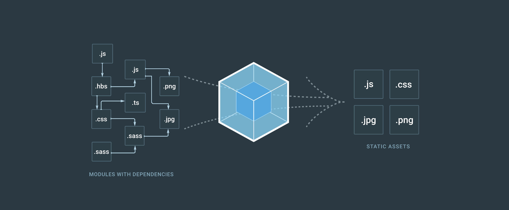

> 本篇为在学习Vue2.x的时候使用Webpack2.x的踩坑与总结，关于Vue2.x的踩坑与总结，[点击链接](http://mrzhang123.github.io/2017/02/07/vue2/)

<!--more-->

项目地址：[https://github.com/MrZhang123/Vue_project/tree/master/vue2.x](https://github.com/MrZhang123/Vue_project/tree/master/vue2.x)

# 本地安装npm包后如何在命令行运行

在npm安装包的时候，如果使用全局安装，即`npm install <packageName> -g`，则在安装完成后可以在终端运行作为命令去运行，但是如果是本地安装的包`npm install --save-dev <packageName>`，则无法这样直接运行。那么如何运行本地安装的包呢？首先进入项目目录（即package.json所在目录），然后使用以下命令即可运行：

```shell

$ node_modules/.bin/<packageName>

```

除了可以这样在命令行运行外，还可以在文件中运行

```js

//index.js

let webpack = require('webpack');

webpack();

```

```shell

$ node index.js

```

# webpack1.x升级2.x

## 1.`module.loaders`改成了`module.rules`

旧的`loaders`被新的`rules`取代，后者允许配置`loader`以及其他更多项。

```js
  module: {
-   loaders: [
+   rules: [
      {
        test: /\.css$/,
-       loaders: [
+       use: [
          {
            loader: "style-loader"
          },
          {
            loader: "css-loader",
-           query: {
+           options: {
              modules: true
            }
        ]
      },
      {
        test: /\.jsx$/,
        loader: "babel-loader", // Do not use "use" here
        options: {
          // ...
        }
      }
    ]
  }
```
以上写法中，`Rule.loader`是`Rule.use: [ { loader } ]`的简写。

## 2.链式调用loaders

在webpack1.x中loaders可以链式调用，在2.x中依旧有该特性，使用`rule.use`配置项，`use`中设置一个loaders的数组而在1.x中使用`!`连接各个loader，旧版写法只有在使用旧的`module.loaders`时有效。

```js
  module: {
-   loaders: {
+   rules: {
      test: /\.less$/,
-     loader: "style-loader!css-loader!less-loader"
+     use: [
+       "style-loader",
+       "css-loader",
+       "less-loader"
+     ]
    }
  }
```

## 3.取消在模块中自动添加`-loader`后缀

webpack2.x中不再添加`-loader`

```js
  module: {
    rules: [
      {
        use: [
-         "style",
+         "style-loader",
-         "css",
+         "css-loader",
-         "less",
+         "less-loader",
        ]
      }
    ]
  }
```

根据官方说法，做出这样更改的原因是省略`-loader`会对新手造成误解，所以去掉这个功能，如果想打开这个旧的功能，可以配置`resolveLoader.moduleExtensions`，但是并不推荐这么做，具体参阅[issues#2986](https://github.com/webpack/webpack/issues/2986)

```js
+ resolveLoader: {
+   moduleExtensions: ["-loader"]
+ }
```

## 4.使用options配置loader

在webpack1.x中可以通过webpack.config.js的自定义属性来配置loader，这在webpack2.x中无法执行

```js
module.exports = { 
  ...
  module: { 
    use: [{ 
      test: /\.tsx?$/,
      loader: 'ts-loader'
    }]
  },
  // does not work with webpack 2
  ts: { transpileOnly: false } 
}
//webpack2 use options
module.exports = { 
  ...
  module: { 
    use: [{ 
      test: /\.tsx?$/,
      loader: 'ts-loader'
      options:  { transpileOnly: false }
    }]
  }
}
```

# webpack插件的使用

## webpack-dev-server1.x升级2.x

1.在CLI使用的时候，--inline默认开启，无需在输入命令时添加

2.删除contentBase用proxy代替

3.减少控制台无用输出，在1.x中，当我们停掉服务器后，控制台会一直输出错误信息，但是在2.x中只会输出`[WDS] Disconnected!`

## extract-text-webpack-plugin

在使用webpack将vue_spa打包后，并不会出现css，因为css被打包入build.js，如果从vue组件中抽离出css，需要安装插件**extract-text-webpack-plugin**，在使用的时候需要配合v2版本的才可以使用（如果使用了webpack2，则对应的插件版本都需要用v2版本）。具体配置如下：

```js
module:{
  rules:[
    {
      test: /\.vue$/,
      loader: 'vue',
      options: {
        loaders:{
          css: extractTextPlugin.extract({
            loader: 'css-loader',
            fallbackLoader: 'vue-style-loader'
          })
        }
      }
    }
  ]
},
plugins: [
  new webpack.HotModuleReplacementPlugin(),
  new extractTextPlugin({
    filename:'/style.css',
    allChunks:true
  })
],
```
在options中：

options.loader: string | object | loader[]  (必填项) 这里的 loader(s) 用于将资源转换为css导出模块

options.fallbackLoader: string | object | loader[] 当css没有被导出的时候这里的 loader(s) 会被使用 （即当在plugins模块中设置allChunks:false的时候）

在plugins中：

filename：可以设置被导出的css文件的路径以及名字

allChunks：从所有附加块中提取（默认情况下，它只从初始块中提取）

## html-webpack-plugin

```js
plugins: [
  new htmlWwebpackPlugin({
    filename: 'assets/admin.html'
  }),
]
```

title：用于生成文档的document

filename：要注入的html文件，默认为index.html。可以自定义（例如：assets/admin.html）

inject：
true | ‘head’ | ‘body’ | false 
将资源注入所给的template或templateContent，当设置为 true 或者 ‘body’，所有的资源会被注入到body底部。而head则会将js放到headelement

favicon: 在输出的html中添加favicon

hash: true | false 如果为true，则将一个唯一的webpack编译散列附加到所有包含的脚本和CSS文件。这对缓存清除很有用。

cache: true | false 如果为true（默认），尝试仅在更改后才发出文件。

## 是否要更换preset？

webpack2.x默认支持es6的模块，所以在编译时候没有必要将它们先转换为CommonJS模块再处理，所以在github中出现了babel-preset-es2015-webpack，但是这个模块我在使用的时候出现了`Cannot remove 'babel-plugin-transform-es2015-modules-commonjs' from the plugin list.`的问题，根据babel-preset-es2015-webpack中的叙述以及[issues#14](https://github.com/gajus/babel-preset-es2015-webpack/issues/14)可知，babel-preset-es2015已经支持不转换模块中的`import`和`export`，只需要设置`.babelrc`

```json
{
    "presets": [
        [
            "es2015",
            {
                "modules": false
            }
        ]
    ]
}
```

## 使用CommonsChunkPlugin将第三方库单独打包

很多情况下我们会引入第三方库，但是默认情况下，webpack会将第三方库与我们自己写的js一起打包进生成文件中，为了让第三方库与我们自己写的js分开，webpack2.x内置一个插件CommonsChunkPlugin，它可以让webpack在打包的时候将我们自己写的js与第三方库分开，具体用法如下：

```js
entry:{
  app: './src/main.js',
  vendor: [
    'lodash',
    'axios',
    'vue',
    'vue-router'
  ]
},
output: {
  path: path.resolve(__dirname + '/dist'),
  publicPath: '/dist',
  filename: '[name].js'
},
plugins: [
    new webpack.optimize.CommonsChunkPlugin({
      name:'vendor'
    })
]
```
这里需要注意一点，这里在在输出的时候需要使用`filename: '[name].js'`，否则会报错。

# 参考：

[从 webpack v1 迁移到 webpack v2](http://www.zcfy.cc/article/migrating-from-v1-to-v2-2378.html)

[What’s new in webpack dev server 2.0](https://medium.com/webpack/whats-new-in-webpack-dev-server-2-0-a66848c3679#.b8ftvlujv)