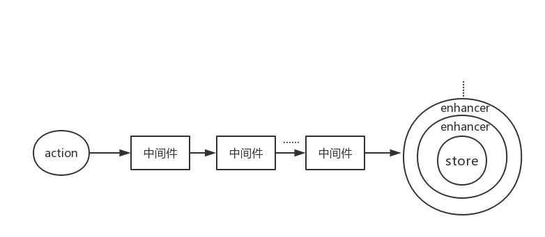

上一篇文章——[从零开始搭建 React 应用（一）——基础搭建](https://juejin.im/post/5af6857651882542682e4843)讲述了如何使用 webpack 搭建一个非常基础的 react 开发环境。本文将详细讲述搭建一个 React 应用的架构。
<!--more-->
仓库地址：[https://github.com/MrZhang123/Web_Project_Build/tree/master/react-webpack](https://github.com/MrZhang123/Web_Project_Build/tree/master/react-webpack)

## redux

在我们开发过程中，很多时候，我们需要让组件共享某些数据，虽然可以通过组件传递数据实现数据共享，但是如果组件之间不是父子关系的话，数据传递是非常麻烦的，而且容易让代码的可读性降低，这时候我们就需要一个 state（状态）管理工具。常见的状态管理工具有 redux，mobx，这里选择 redux 进行状态管理。值得注意的是 React 16.3 带来了全新的[Context API](https://doc.react-china.org/docs/context.html)，我们也可以使用新的 Context API 做状态管理。

> Redux 是 JavaScript 状态容器，提供可预测化的状态管理。可以让你构建一致化的应用，运行于不同的环境（客户端、服务器、原生应用），并且易于测试。不仅于此，它还提供非常好的开发体验，比如有一个时间旅行调试器可以编辑后实时预览。

redux 的数据流如下图所示：


redux 的三大原则：

1.  整个应用的`state`都被存储在一颗 object tree 中，并且这个 object tree 只存在于唯一的 store 中，但是这并不意味使用 redux 就需要将所有的 state 存到 redux 上。
2.  **state 是只读的**，唯一改变 state 的方式是出发`action`，`action`是一个用于描述已发生事件的普通对象。
3.  **使用纯函数来执行修改**，为了描述 action 如何改变 state tree，需要编写 reducers。

### 中间件（Redux middleware）

Redux middleware **提供位于 action 发起之后，到达 reducer 之前的扩展点**。dispatch 发起的 action 依次经过中间件，最终到达 reducer。我们可以利用 Redux middleware 来进行日志记录、创建崩溃报告、调用异步接口或者路由等等。**本质上来讲中间件只是拓展了 `store.dispatch` 方法**。

### 增强器（Store enhancer）

store enhancer 用于增强 store 的功能，一个 store enhancer 实际上就是一个高阶函数，返回一个新的强化过的 store creator。

```js
const logEnhancer = createStore => (reducer, initialState, enhancer) => {
  const store = createStore(reducer, initialState, enhancer)
  function dispatch(action) {
    console.log(`dispatch an action: ${JSON.stringify(action)}`)
    const res = store.dispatch(action)
    const newState = store.getState()
    console.log(`current state: ${JSON.stringify(newState)}`)
    return res
  }
  return { ...store, dispatch }
}
```

可以看到`logEnhancer`改变了 store 的默认行为，在每次`dispatch`前后，都会输出日志。



### react-redux

redux 本身是一个状态 JS 的状态库，可以结合 react，vue，angular 甚至是原生 JS 应用使用，为了让 redux 帮我们管理 react 应用的状态，需要把 redux 与 react 连接，官方提供了[react-redux](https://github.com/reduxjs/react-redux)库。

**react-redux 提供`Provider`组件通过 context 的方式向应用注入 store，然后组件使用`connect`高阶方法获取并监听 store，然后根据 store state 和组件自身的 props 计算得到新的 props，注入该组件，并且可以通过监听 store，比较计算出的新 props 判断是否需要更新组件。**

```js
render(
  <Provider store={store}>
    <ConnectedRouter history={history}>
      <App />
    </ConnectedRouter>
  </Provider>,
  document.getElementById('app')
)
```

### 整合 redux 到 react 应用

#### 合并 reducer

在一个 react 应用中只有一个 store，组件通过调用 action 函数，传递数据到 reducer，reducer 根据数据更改对应的 state。但是随着应用复杂度的提升，reducer 也会变得越来越大，此时可以考虑将 reducer 拆分成多个单独的函数，拆分后的每个函数负责独立管理 state 的一部分。

redux 提供`combineReducers`辅助函数，将分散的 reducer 合并成一个最终的 reducer 函数，然后在 createStore 的时候使用。

#### 整合 middleware

有时候我们需要多个 middleware 组合在一起形成 middleware 链来增强`store.dispatch`，在创建 store 时候，我们需要将 middleware 链整合到 store 中，官方提供`applyMiddleware(...middleware)`将 middleware 链在一起。

#### 整合 store enhancer

store enhancer 用于增强 store，如果我们有多个 store enhancer 时需要将多个 store enhancer 整合，这时候就会用到`compose(...functions)`。

使用`compose`合并多个函数，每个函数都接受一个参数，它的返回值将作为一个参数提供给它左边的函数以此类推，最右边的函数可以接受多个参数。`compose(funA,funB,funC)`可以理解为`compose(funA(funB(funC())))`，最终返回从右到左姐收到的函数合并后的最终函数。

#### 创建 Store

redux 通过`createStore`创建一个 Redux store 来以存放应用中所有的 `state`，`createStore`的参数形式如下：

```js
createStore(reducer, [preloadedState], enhancer)
```

所以我们创建 store 的代码如下：

```js
import thunk from 'redux-thunk'
import { createStore, applyMiddleware } from 'redux'

import reducers from '../reducers'

const initialState = {}

const store = createStore(reducers, initialState, applyMiddleware(thunk))

export default store
```

之后将创建的 store 通过`Provider`组件注入 react 应用即可将 redux 与 react 应用整合在一起。

**注：应用中应有且仅有一个 store**。

## React Router

React Router 是完整的 React 的路由解决方案，它保持 UI 与 URL 的同步。项目中我们整合最新版的 React Router v4。

在 react-router v4 中 react-router 被划分为三个包：react-router，react-router-dom 和 react-router-native，区别如下：

- react-router：提供核心路由组件和函数
- react-router-dom：供浏览器使用的 react router
- react-router-native：供 react native 使用的 react router

### redux 与 react router

React Router 与 Redux 一起使用时大部分情况下都是正常的，但是偶尔会出现路由更新但是子路由或活动导航链接没有更新。这个情况发生在：

1.  组件通过`connect()(Comp)`连接 redux。
2.  组件不是一个“路由组件”，即组件并没有像`<Route component={SomeConnectedThing} />`这样渲染。

这个问题的原因是 Redux 实现了`shouldComponentUpdate`，当路由变化时，该组件并没有接收到 props 更新。

解决这个问题的方法很简单，找到`connect`并且将它用`withRouter`包裹：

```js
// before
export default connect(mapStateToProps)(Something)

// after
import { withRouter } from 'react-router-dom'
export default withRouter(connect(mapStateToProps)(Something))
```

### 将 redux 与 react-router 深度整合

有时候我们可能希望将 redux 与 react router 进行更深度的整合，实现：

- 将 router 的数据与 store 同步，并且从 store 访问
- 通过 dispatch actions 导航
- 在 redux devtools 中支持路由改变的时间旅行调试

这些可以通过 connected-react-router 和 history 两个库将 react-router 与 redux 进行深度整合实现。

> 官方文档中提到的是 react-router-redux，并且它已经被整合到了 react-router v4 中，但是根据 react-router-redux 的文档，该仓库不再维护，推荐使用 connected-react-router。

首先安装 connected-react-router 和 history 两个库：

```shell
$ npm install --save connected-react-router
$ npm install --save history
```

然后给 store 添加如下配置：

- 创建`history`对象，因为我们的应用是浏览器端，所以使用`createBrowserHistory`创建
- 使用`connectRouter`包裹 root reducer 并且提供我们创建的`history`对象，获得新的 root reducer
- 使用`routerMiddleware(history)`实现使用 dispatch history actions，这样就可以使用`push('/path/to/somewhere')`去改变路由（这里的 push 是来自 connected-react-router 的）

```js
import thunk from 'redux-thunk'
import { createBrowserHistory } from 'history'

import { createStore, applyMiddleware } from 'redux'
import { connectRouter, routerMiddleware } from 'connected-react-router'

import reducers from '../reducers'

export const history = createBrowserHistory()
const initialState = {}

const store = createStore(
  connectRouter(history)(reducers),
  initialState,
  applyMiddleware(thunk, routerMiddleware(history))
)

export default store
```

在根组件中，我们添加如下配置：

- 使用`ConnectedRouter`包裹路由，并且将 store 中创建的`history`对象引入，作为 props 传入应用
- `ConnectedRouter`组件要作为`Provider`的子组件

```js
import React from 'react'
import { render } from 'react-dom'
import { Provider } from 'react-redux'
import { ConnectedRouter } from 'connected-react-router'

import App from './App'
import store from './redux/store'
import { history } from './redux/store'

render(
  <Provider store={store}>
    <ConnectedRouter history={history}>
      <App />
    </ConnectedRouter>
  </Provider>,
  document.getElementById('app')
)
```

这样我们就将 redux 与 react-router 整合完毕。

#### 使用dispatch切换路由

完成以上配置后，就可以使用`dispatch`切换路由了：

```js
import { push } from 'react-router-redux'
// Now you can dispatch navigation actions from anywhere!
store.dispatch(push('/about'))
```

### react-router-config

#### react-router v4 之前——静态路由

在 react-router v4 之前的版本中，我们可以直接使用静态路由来配置应用程序的路由，它允许在渲染之前对路由进行检查和匹配。

在 router.js 中一般会有这样的代码：

```js
const routes = (
  <Router>
    <Route path="/" component={App}>
      <Route path="about" component={About} />
      <Route path="users" component={Users}>
        <Route path="/user/:userId" component={User} />
      </Route>
      <Route path="*" component={NoMatch} />
    </Route>
  </Router>
)
export default routes
```

然后在初始化的时候把路由导入，然后渲染：

```js
import ReactDOM from 'react-dom'
import routes from './config/routes'

ReactDOM.render(routes, document.getElementById('app'))
```

#### react-router v4——动态路由

从 v4 版本开始，react-router 使用动态组件代替路径配置，即 **react-router 就是 react 应用的一个普通组件**，随用随写，不必像之前那样，路由跟组件分离。因此 react 应用添加 react-router，首先引入我们需要的东西。

```js
import React from 'react'
import { BrowserRouter as Router, Route, Link } from 'react-router-dom'
```

这里我们将`BrowserRouter`引入并重新命名为`Router`，**`BrowserRouter`允许 react-router 将应用的路由信息通过`context`传递给任何需要的组件**。因此要让 react-router 正常工作，需要在应用程序的根结点中渲染`BrowserRouter`。

```js
import React from 'react'
import { BrowserRouter as Router, Route, Link } from 'react-router-dom'

class App extends Component {
  render() {
    return (
      <Router>
        <div>
          <div>
            <Link to="/">Home</Link>
          </div>
          <hr />
          <Route exact path="/" component={Home} />
        </div>
      </Router>
    )
  }
}
```

以还使用了`Route`，当应用程序的 location 匹配到某个路由时，`Route`将渲染制定的 component，否则渲染`null`。

想要加入更多的路由，添加`Route`组件即可，但是这样的写法也许我们会感觉到有点儿乱，因为毕竟路由被分散到组件各处，很难像以前那样很容易的看到整个应用的路由，而且如果项目之前是用的 react-router v4 之前的版本，那么升级 v4 也是成本很大的，官方为解决该问题，提供了专门用来处理静态路由配置的库——react-router-config。

#### 添加 react-router-config 实现使用静态路由

添加了 react-router-config 之后，我们就可以写我们熟悉的静态路由了。同时，利用它，可以将路由配置分散在各个组件中，最后使用`renderRoutes`将分散的路由片段在根组件合并，渲染即可。

配置静态路由：

```js
import Home from './views/Home'
import About from './views/About'

const routes = [
  {
    path: '/',
    exact: true,
    component: Home
  },
  {
    path: '/about',
    component: About
  }
]
export default routes
```

然后在根组件中合并，渲染：

```js
import { renderRoutes } from 'react-router-config'

import HomeRoute from './views/Home/router'
import AboutRoute from './views/About/router'
// 合并路由
const routes = [...HomeRoute, ...AboutRoute]

class App extends Component {
  render() {
    return (
      <Router>
        <div className="screen">{renderRoutes(routes)}</div>
      </Router>
    )
  }
}
```

`renderRoutes`其实帮我们做了类似的事儿：

```js
const routes = (
  <Router>
    <Route path="/" component={App}>
      <Route path="about" component={About} />
      <Route path="users" component={Users}>
        <Route path="/user/:userId" component={User} />
      </Route>
      <Route path="*" component={NoMatch} />
    </Route>
  </Router>
)
```

这样就给 React 应用添加了静态路由。

## 添加模块热替换(Hot Module Replacement)

模块热替换（HMR）功能会在应用程序运行过程中替换、添加或删除模块，而无需重新加载整个页面。主要通过以下几种方式：

- 保留在完全重新加载页面时丢失的应用状态
- 只更新变更的内容以节省开发时间
- 更改样式不需要刷新页面

在开发模式中，HMR 可以替代 LiveReload，webpack-dev-server 支持`hot`模式，在试图重新加载整个页面之前，`hot`模式尝试使用 HMR 来更新。

### 启用 HMR

在 webpack 配置文件中添加 HMR 插件：

```js
plugins: [new webpack.HotModuleReplacementPlugin(), new webpack.NamedModulesPlugin()]
```

这里添加的`NamedModulesPlugin`插件，

设置 webpack-dev-server 开启`hot`模式：

```js
const server = new WebpackDevServer(compiler, {
+  hot: true,
  // noInfo: true,
  quiet: true,
  historyApiFallback: true,
  filename: config.output.filename,
  publicPath: config.output.publicPath,
  stats: {
    colors: true
  }
});
```

这样，当修改 react 代码的时候，页面会自动刷新，修改 css 文件，页面不刷新，直接呈现样式。

但是会发现一个问题，页面的自动刷新会导致我们 react 组件的状态丢失，那么能否做到更改 react 组件像更改 css 文件那样，页面不刷新（保存页面的状态），直接替换呢？答案是肯定的，可以使用 react-hot-loader。

### 添加 react-hot-loader

添加 react-hot-loader 非常简单，只需要在根组件导出的时候添加高阶方法`hot`即可：

```js
import { hot } from "react-hot-loader";

class App extends Component {
	...
}

export default hot(module)(App);
```

这样，整个应用在开发时候就可以修改 react 组件而保持状态了。

**注：**

在开发过程中，查阅了一些文章说，为了配合 redux，需要在 store.js 中添加如下代码：

```js
if (process.env.NODE_ENV === 'development') {
  if (module.hot) {
    module.hot.accept('../reducers/index.js', () => {
      // const nextReducer = combineReducers(require('../reducers'))
      // store.replaceReducer(nextReducer)
      store.replaceReducer(require('../reducers/index.js').default)
    })
  }
}
```

但是，在 react-hot-loader v4 中，是不需要的，直接添加`hot`就可以了。

## 异步加载组件（Code Splitting）

完成以上配置后，我们的主体已经搭建的差不多了，但是当打开开发者工具会发现，应用开始加载的时候直接把整个应用的 JS 全部加载进来，但是我们期望进入哪个页面加载哪个页面的代码，那么如何实现应用的 Code Splitting 呢？

其实实现 React Code Splitting 的库有很多，例如：

- [Loadable Components](https://github.com/smooth-code/loadable-components/)
- [Imported Component](https://github.com/theKashey/react-imported-component)
- [React Universal Component](https://github.com/faceyspacey/react-universal-component)
- [React-Loadable](https://github.com/jamiebuilds/react-loadable)

选用其中之一即可，我项目中选用的是 react-loadable。

之前我们已经在项目中配置了静态路由，组件是直接引入的，我们只需要对之前的直接引入的组件做处理就可以，代码如下：

```js
import loadable from 'react-loadable'
import Loading from '../../components/Loading'

export const Home = loadable({
  loader: () => import('./Home'),
  loading: Loading
})
export const About = loadable({
  loader: () => import('./About'),
  loading: Loading
})

const routes = [
  {
    path: '/',
    exact: true,
    component: Home
  },
  {
    path: '/about',
    component: About
  }
]
export default routes
```

## 异步任务流管理

### 实现异步操作的思路

大部分情况下我们的应用中都是同步操作，即 dispatch action 时，state 会被立即更新，但是有些时候我们需要做异步操作。同步操作只要发出一种 Action 即可，但是异步操作需要发出三种 Acion。

- 操作发起时的 Action
- 操作成功时的 Action
- 操作失败时的 Action

为了区分这三种 action，可能在 action 里添加一个专门的`status`字段作为标记位：

```js
{ type: 'FETCH_POSTS' }
{ type: 'FETCH_POSTS', status: 'error', error: 'Oops' }
{ type: 'FETCH_POSTS', status: 'success', response: { ... } }
```

或者为它们定义不同的 type：

```js
{ type: 'FETCH_POSTS_REQUEST' }
{ type: 'FETCH_POSTS_FAILURE', error: 'Oops' }
{ type: 'FETCH_POSTS_SUCCESS', response: { ... } }
```

所以想要实现异步操作需要做到：

- 操作开始时，发出一个 Action，触发 State 更新为“正在操作”，View 重新渲染
- 操作结束后，再发出一个 Action，触发 State 更新为“操作结束”，View 再次重新渲染

### redux-thunk

异步操作至少送出两个 Action，第一个 Action 跟同步操作一样，直接送出即可，那么如何送出第二个 Action 呢？

我们可以在送出第一个 Action 的时候送一个 Action Creator 函数，这样第二个 Action 可以在异步执行完成后自动送出。

```js
componentDidMount() {
   store.dispatch(fetchPosts())
}
```

在组件加载成功后，送出一个 Action 用来请求数据，这里的`fetchPosts`就是 Action Creator。fetchPosts 代码如下：

```js
export const SET_DEMO_DATA = createActionSet('SET_DEMO_DATA')

export const fetchPosts = () => async (dispatch, getState) => {
  store.dispatch({ type: SET_DEMO_DATA.PENDING })
  await axios
    .get('https://jsonplaceholder.typicode.com/users')
    .then(response => store.dispatch({ type: SET_DEMO_DATA.SUCCESS, payload: response }))
    .catch(err => store.dispatch({ type: SET_DEMO_DATA.ERROR, payload: err }))
}
```

`fetchPosts`是一个 Action Creator，执行返回一个函数，该函数执行时`dispatch`一个 action，表明马上要进行异步操作；异步执行完成后，根据请求结果的不同，分别`dispatch`不同的 action 将异步操作的结果返回回来。

这里需要说明几点：

1.  `fetchPosts`返回了一个函数，而普通的 Action Creator 默认返回一个对象。
2.  返回的函数的参数是`dispatch`和`getState`这两个 Redux 方法，普通的 Action Creator 的参数是 Action 的内容。
3.  在返回的函数之中，先发出一个 `store.dispatch({type: SET_DEMO_DATA.PENDING})`，表示异步操作开始。
4.  异步操作结束之后，再发出一个 `store.dispatch({ type: SET_DEMO_DATA.SUCCESS, payload: response })`，表示操作结束。

但是有一个问题，`store.dispatch`正常情况下，只能发送对象，而我们要发送函数，为了让`store.dispatch`可以发送函数，我们使用中间件——redux-thunk。

引入 redux-thunk 很简单，只需要在创建 store 的时候使用`applyMiddleware(thunk)`引入即可。

## 开发调试工具

开发过程中免不了调试，常用的调试工具有很多，例如 redux-devtools-extension，redux-devtools，storybook 等。

### redux-devtools-extension

redux-devtools-extension 是一款调试 redux 的工具，用来监测 action 非常方便。

首先根据浏览器在[Chrome Web Store](https://chrome.google.com/webstore/detail/redux-devtools/lmhkpmbekcpmknklioeibfkpmmfibljd)或者[Mozilla Add-ons](https://addons.mozilla.org/en-US/firefox/addon/remotedev/)中下载该插件。

然后在创建 store 时候，将其加入到 store enhancer 配置中即可：

```js
import thunk from "redux-thunk";
import { createBrowserHistory } from "history";

import { createStore, applyMiddleware } from "redux";
+ import { composeWithDevTools } from "redux-devtools-extension/logOnlyInProduction";
import { connectRouter, routerMiddleware } from "connected-react-router";

import reducers from "../reducers";

export const history = createBrowserHistory();
const initialState = {};

+  const composeEnhancers = composeWithDevTools({
+   // options like actionSanitizer, stateSanitizer
+ });

const store = createStore(
  connectRouter(history)(reducers),
  initialState,
+  composeEnhancers(applyMiddleware(thunk, routerMiddleware(history)))
);
```

## 写在最后

本文梳理了自己对 React 应用架构的认识以及相关库的具体配置，进一步加深了对 React 应用架构的理解，但是像数据 Immutable ，持久化，webpack 优化等这些，本文并未涉及，未来会继续研究相关的东西，力求搭建更加完善的 React 应用。

另外在搭建项目过程中升级最新的 babel 后发现@babel/preset-stage-0 即将弃用，建议使用其他代替，更多细节参考：

- [Cannot read property 'join' of undefined ( preset-stage-0 )](https://github.com/babel/babel/issues/8307)
- [关于@babel/preset-stage-0](https://github.com/babel/babel/blob/479d0b58271ae70887292b55072e5479611fc60b/packages/babel-preset-stage-0/README.md)

## 附

### 关键字：

- redux
- react-router
- react-router-config
- 异步加载（Code Splitting）
- 热更新
- 异步任务管理——redux-thunk
- react-redux
- redux-devtools-extension

### 部分用到的库

- [connected-react-router](https://github.com/supasate/connected-react-router)
- [history](https://github.com/ReactTraining/history)
- [react-hot-loader](https://github.com/gaearon/react-hot-loader)
- [react-router-config](https://github.com/ReactTraining/react-router/tree/master/packages/react-router-config)

### 参考

- [React 应用架构设计](https://mp.weixin.qq.com/s/G3lQ1yo2CL4Ce92VY_m0xg?scene=25#wechat_redirect&utm_source=mife&utm_medium=article&utm_campaign=mifeweekly&utm_term=tutorial)
- [浅析 Redux 的 store enhancer](https://juejin.im/post/5a4874096fb9a044fa1a34c7)
- [createStore](https://cn.redux.js.org/docs/api/createStore.html)
- [applyMiddleware](https://cn.redux.js.org/docs/api/applyMiddleware.html)
- [combineReducers](https://cn.redux.js.org/docs/api/combineReducers.html)
- [compose](https://cn.redux.js.org/docs/api/compose.html)
- [[译]简明 React Router v4 教程](https://juejin.im/post/5a7e9ee7f265da4e7832949c)
- [React Router 与 Redux 整合](https://github.com/ReactTraining/react-router/blob/master/packages/react-router/docs/guides/redux.md#blocked-updates)
- [模块热替换(hot module replacement)](https://webpack.docschina.org/concepts/hot-module-replacement/)
- [react-router4 基于 react-router-config 的路由拆分与按需加载](https://juejin.im/post/5a3880b56fb9a0451a767f07)
- [React Router 4 简介及其背后的路由哲学](https://juejin.im/post/5a641747518825732d7fb25f)
- [异步 Action](https://cn.redux.js.org/docs/advanced/AsyncActions.html)
- [redux 中间件之 redux-thunk](https://juejin.im/post/5ad49b595188255c637b6ecc)
- [Redux 入门教程（二）：中间件与异步操作](http://www.ruanyifeng.com/blog/2016/09/redux_tutorial_part_two_async_operations.html)
