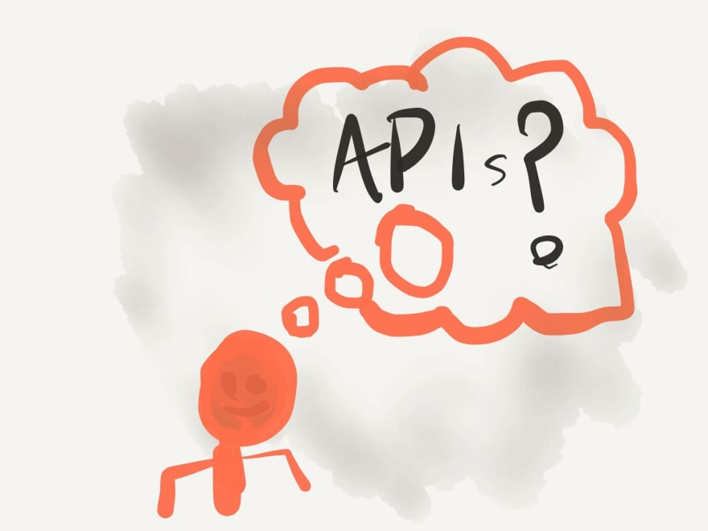

原文链接：[The 10 Component Commandments](https://dev.to/selbekk/the-10-component-commandments-2a7f)

创建被很多人用的组件是很难的。如果那些`props`作为公共API，你需要非常谨慎的考虑哪些`props`是可以接收的。

这篇文章将给你快速介绍API的最佳实践方法，同时有十条实践戒律清单，你可以在创建组件的时候使用，你的开发者将会很乐意使用它们。
<!--more-->


### 什么是API？

一个API或者说一个应用程序接口，基本上就是两段代码相遇的地方。它连接*你的代码*和剩下的世界。我们称这种连接为接口。它是你可以与之交互的一组定义的actions或者data actions。

后端与前端之间的接口称为API。你可以通过与此API交互访问给定的一组数据和功能。

类和调用该类的代码之间的接口也是API，你可以调用类里面的方法去取数据或者触发封装在其中的功能。

按照同样的思路，**你组件接收props同样也是API**。这是你的用户和你的组件的交互方式，当你决定暴露哪些公共API，会有很多同样的规则和注意事项。

### API设计中的一些最佳实践

所以在设计API的时候，有哪些适用的规则和考虑因素？我们为此做了一些研究，结果发现那里有很多很棒的资源。我们选择了两篇文章——[Josh Tauberer](https://joshdata.wordpress.com/)的[What Makes a Good API ?](https://joshdata.wordpress.com/2014/02/10/what-makes-a-good-api/)和[Ron Kurir's article with the same title](https://medium.com/@rkuris/good-apis-cd861b8b70a3)——我们提出了4个最佳实践。

#### 稳定的版本控制

当你考虑创建一个API，其中一个最重要的事情就是尽可能保证API的稳定。这意味着要最大限度减少break change。如果你必须引入一个break change，要确保写明确的升级指南，如果可能的话，提供一个代码模块，为使用者自动化升级。

如果你发布一个API，确保遵循[语义版本控制](https://semver.org/lang/zh-CN/)。这让使用者决定使用哪个版本变得很容易。

#### 描述性错误信息

每当当调用你的API发生错误，你应该尽可能解释是什么发生了错误，如何修正该错误。没有任何其他上下文的情况下使用“错误使用”响应不是一个好的用户体验。

相反，写描述性错误，帮助用户修正他们调用API时候的错误。

#### 减少开发人员的意外

开发人员是脆弱的生物，你不想在他们使用你的API时候惊吓他们。换句话说，让你的API尽可能的保持直观。你可以根据最佳实践和命名规范实现它们。

要记住的另一件事情是你记得跟你的代码保持一致。如果你在一个地方的boolean值之前加了`is`或`has`，但是在下一个地方没有加，很容让人产生困惑。

#### 最小化你的API

虽说我们说的是最小化东西——尽量减少你的API。有很多功能是非常好的，但是你的API越少，你的用户学习起来就越容易。反过来，这被认为是一个易于使用的API。

总有办法控制API的大小——其中一个方法就是从旧的API重构一个新的API。

## 十个组件的告诫


这里有4个黄金法则适用于Pascal中的REST API和旧程序，但是如何转化到现代世界的React？

就像我们前面提到的，组件有它们自己的API。我们称它们为`props` , 这就是我们如何用数据，回调函数和其他功能来提供组件。我们如何构建不违反上述规则的`props`对象？我们如何写方便其他开发人员测试的组件？

我们创建了当你创建你的组件的时候**10个需要遵循的规则**清单，希望它们对你有用。

### 1.编写文档

如果没有好的文档说明你的组件如何使用，那么根据定义，这个组件是无用的，虽然几乎所有的用户都可以查看组件的实现方式，但是这样做用户体验会很糟糕。

有几种方式来记录组件，但是这里的三种选择是我们所推荐的：

* [Storybook](https://storybook.js.org/)
* [Styleguidist](https://react-styleguidist.js.org/)
* [Docz](https://www.docz.site/)

前两个为你提供组件开发的场所，而第三个让你用[MDX](https://mdxjs.com/)编写更自由的文档。

不管你选择哪个，要保证记录API以及如何，何时使用组件。最后一部分在共享组件库中非常重要——所以人们在给定的上下文中使用争取的按钮或者布局网格。

### 2.允许上下文语意

HTML是一种用语义方式构建信息的语言。然而，我们大多数组件使用`div`标签。这个在某种程度上说是有道理的——因为通用组建无法真正的假设它应该是一个`<article />`或者`<section />`或者一个`<aside />`——但这并不理想。

我们建议你允许你的组件接受一个`as`作为props，这将始终允许你覆盖正在呈现的DOM元素。这里是如何实现的一个demo：

```js
function Grid({ as: Element, ...props }) {
  return <Element className="grid" {...props} />
}
Grid.defaultProps = {
  as: 'div',
};
```

我们重命名`as`为局部变量`Element`在JSX中使用，同时我们给`as`一个默认值，在不传递语义标签的时候使用。

当使用这个`<Grid />`组件时，你只需要传递正确的标签即可：

```js
function App() {
  return (
    <Grid as="main">
      <MoreContent />
    </Grid>
  );
}
```

注意，这对React组件同样有效。如果你想有一个`<Button />`组件，渲染为React Router的`<Link />`：

```js
<Button as={Link} to="/profile">
  Go to Profile
</Button>
```

### 3.避免使用布尔类型pops

布尔类型的props听起来很不错，你可以不实用value指定它们，所以它们看起来很优雅：

```js
<Button large>BUY NOW!</Button>
```

但是即使它们看起来很优雅，布尔属性只允许使用两个属性。on或off，显示或隐藏，1或0。

每当你开始为像大小，颜色或者任何可能不是二元选择的属性使用布尔属性，你可能会陷入麻烦。

```js
<Button large small primary disabled secondary>
  WHAT AM I??
</Button>
```

换句话说，布尔属性无法随着需求的变化而变化。使用类似字符串的枚举值作为属性可能是一个更好的选择：

```js
<Button variant="primary" size="large">
  I am primarily a large button
</Button>
```

这并不是说布尔属性没有使用的地方。`disabled`这样的属性还是应该使用布尔值——因为这里不会有介于启用和禁用的属性之间。

### 4.使用`props.children`

React有一些特殊的属性，它们的处理方式与其他属性不同。其中一个是`key`，它用于跟踪列表项顺序，另一个就是`children`。

任何放在打开和闭合的组件标签之间的东西都可以用`props.children`读取到。你应该尽可能使用它。

这样做的原因是，它比使用`content`props或者通常只接受简单值（比如文本）要简单的多。

```js
<TableCell content="some text">
// vs
<TableCell>Some text</TableCell>
```

这里有几个使用`props.children`的好处。首先它类似于常规的HTML的工作方式。其次，你可以自由的传递任何你想传递的！而不是给你的组件添加`leftIcon`和`rightIcon` props——只需要将它们作为`props.children`的一部分。

```js
<TableCell>
  <ImportantIcon /> Some text
</TableCell>
```

你总是争辩说你的组件只允许传纯文本，在一些情况下，这可能是真实的。但是至少现在，使用`props.children`可以为不断变化的需求检验你的API。

### 5.让parent hook进入内部逻辑

有时候我们创建有大量内在逻辑和状态的组件，比如自动完成下拉菜单或者交互式图标。

这些组件通常遭遇冗余的API，其中一个原因是随着时间的推移你通常需要支持覆盖量和一些特殊的用法。

如果我们只是提供一个单一，标准化的props，可以被用户控制，作出反应或者覆盖默认行为的组件呢？

Kent C. Dodds 写过关于这个概念的非常赞的文章，叫做“state reducers”。[有关概念本身的贴子](https://kentcdodds.com/blog/the-state-reducer-pattern/)，另一篇是[如何使用React hooks实现它](https://kentcdodds.com/blog/the-state-reducer-pattern-with-react-hooks)。

快速总结一下，这种传递“state reducers”函数到你组件的模式可以让组件使用者访问组件内部的所有actions。你可以改变state甚至触发副作用。这是一种非常好方式，允许高级定制，而不是所有的props。

```js
function MyCustomDropdown(props) {
  const stateReducer = (state, action) => {
    if (action.type === Dropdown.actions.CLOSE) {
      buttonRef.current.focus();
    }
  };
  return (
    <>
      <Dropdown stateReducer={stateReducer} {...props} />
      <Button ref={buttonRef}>Open</Button>
    </>
}
```

顺便说一句，你当然可以创建更简单的方式对事件作出反应。提供一个`onClose` prop 在前面的例子中可能带来更好的用户体验。保存state reducer模式，以备不时之需。

### 6.传递剩余的props

每当你创建新组建——要确保剩余的props被用于任何有意义的元素。

你不必继续在你的组件上添加props，只需要将它们传递到底层组件或者元素上就行。这样做将让你的API更加稳定，无论何时，下一个开发者需要新的监听器或者aria-tag，都无需大量的小版本的颠簸。

你可以像这样做：

```js
function ToolTip({ isVisible, ...rest }) {
  return isVisible ? <span role="tooltip" {...rest} /> : null;
}
```

每当你的组件在实现中传递props，例如一个类名或者`onClick`回调，要确保外部使用者会做同样的事情。在使用calss的时候，你可以简单使用npm 包 `classnames`或者简单的字符串连接附加props。

```js
import classNames from 'classnames';
function ToolTip(props) {
  return (
    <span 
      {...props} 
      className={classNames('tooltip', props.tooltip)} 
    />
}
```

对于点击处理和其他回调，你可以使用工具将它们组合到一个函数，就像这样：

```js
function combine(...functions) {
  return (...args) =>
    functions
      .filter(func => typeof func === 'function')
      .forEach(func => func(...args));
}
```

这里，我们创建了一个接受你的函数list并将它们组合的函数，它返回一个使用相同参数顺序调用函数list的回调。

你可以这样使用它们：

```js
function ToolTip(props) {
  const [isVisible, setVisible] = React.useState(false);
  return (
    <span 
      {...props}
      className={classNames('tooltipp', props.className)}
      onMouseIn={combine(() => setVisible(true), props.onMouseIn)}
      onMouseOut={combine(() => setVisible(false), props.onMouseOut)}
    />
  );
}
```

### 7.提供足够的默认值

只要你可以，请确保为你的props提供足够的默认值。通过这种方式，你可以使你必须传递props的数量最少——这样可以大大简化你的实现。

拿`onClick`处理函数举例。如果你的代码中没有要求，提供一个空函数作为默认值。通过这种方式，你可以调用该函数，就好像它总是被提供。

另一个例子是自定义输入。除非明确提供，否则假设输入的字符串是一个空字符串。这将让你确保你始终处理的是字符串对象，而不是`undefined`或者`null`。

### 8.不要重命名HTML的属性

HTML有着自己的props或者说属性，它本身就是HTML元素的API。为什么不继续使用这个API？

正如我们前面提到的，将API最小化和使其变得直观是优化你的组件API的很好的方式。所以与其在你的组件中使用自己创建的`screenReaderLabel`props，为什么不直接使用已经给你提供好的`aria-label`API？

所以，为了自己的“易用性”**不要重命名任何现有的HTML属性**。你甚至不应该用新的API替换现有的API，而是应该在上层添加你自己的。用户可以将`aria-label`和你定义的`screenReaderLabel`一起传递，那么最终的value应该是哪个呢？

另外，你的组件中要确保永远不覆盖HTML的属性。一个好的例子是`<button>`的`type`属性。它可以是`submit`（默认值），`button`或者`reset`。然而，很多开发者喜欢重定义这个属性的用途作为button的视觉属性（`primary`, `cta`和其他）。

通过改变这个props的用途，你必须添加其他属性去覆盖真实的`type`属性，这只会给用户带来混乱，困惑和痛苦。

相信我——我一次又一次的犯这个错误——这真是一个让人难以接受的决定。

### 9.给props添加types

没有文档会比内嵌在代码中的文档更好（译者注：言外之意是再好的文档也比不上规范的代码，毕竟一目了然）。React提供`prop-types`包去申明你的组件API。现在，开始使用它。

你可以指定你所需和可选择的props的任何类型和形式，你甚至可以使用[JSDoc comments](https://devhints.io/jsdoc)去改善它。

如果你省略所需的pros，或者传递一个无效的或不是期望得到的值，你将在控制台看到一个运行时的warning。这对开发时非常友好，在构建生产环境时可以去除。

如果你使用Typescript或者Flow写React，你可以将这种API文档作为语言特性。这样可以提供更好的工具支持和出色的用户体验。

如果你没有使用类型化JavaScript，你仍然应该考虑为那些使用者提供type定义。通过这种方式，用户在使用你的组件时将变得更容易。

### 10.为开发者设计

最后一个最重要的规则。确保你的API和“组件体验”针对将使用它的人进行优化——你的开发者。

其中一种优化开发者体验的方式是对无效的使用提供足够的错误信息，以及当有更好的方式来使用你的组件的时候的开发警告。

当写你的错误和警告，确保用链接引用你的文档或者提供简单的代码示例。使用者越快弄明白哪里出了错并且如何修复它，就，你的组件使用起来就感觉越好。

事实证明，拥有这些冗长的错误和警告并不会影响你包的最终大小。感觉死码消除的奇迹，所有的这些文字和错误码，在打包到生产环境时都会被移除。

React本身就是一个非常出色的包。每当你忘记给你的list item指定key，或者拼错生命周期，或者忘记正确的类继承或者使用不确定的方式调用hooks，你将在控制台看到错误信息。为什么使用你组件的用户应该期望的比这些少？

所以为你未来的用户设计。5周内为自己设计。为那些可怜的笨蛋设计，他们必须在你离开后维护你的代码!为开发人员设计。

## 总结

我们可以从经典的API设计中学到很多东西。通过本文提到的这些提示，技巧，规则和戒律，你应该创建 使用容易，维护简单并且在必要时非常灵活的组件。

在创建组件的这些tips中，你最喜欢哪一个呢？
