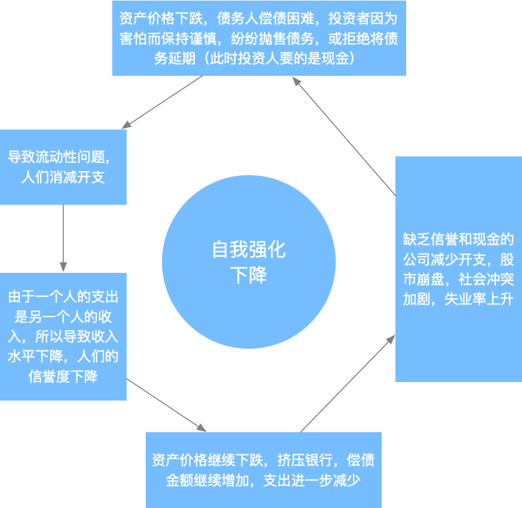

>在17年年底，因为数字货币的一轮暴涨，开始关注金融，开始关注股票，基金，学习一些跟金融知识，本文是我自写文章以来第一篇关于金融的文章，是我在阅读瑞达里欧《债务危机》的一些摘要和理解。
<!--more-->
## 信贷和债务

要了解债务危机，首先要明确两个概念：信贷和债务。

信贷和债务这两个概念在我们日常生活中经常见到，**信贷**就是给予他人购买力，例如我们使用支付宝的花呗，银行信用卡，而这些用了之后，我们会在下一个月还花呗和信用卡，这就是偿还**债务**。对我们个人来说是这样，对国家，企业的发展也是相同的，企业开始的时候，可能因为没钱，无法进行商业活动，所以可能会向银行贷款（信贷），开始自己的商业活动，等将来赚钱了，再还给银行（偿还债务）。这样一个过程中，企业得到发展，银行因为之前放贷然后到期收回，所以也赚到钱，从而促进了整个社会的发展。这是一个理想的过程。

但是这里有一个问题，如果说企业贷款很容易，那就意味着银行贷出去的钱有可能就收不回来了，毕竟将来企业到底发展成什么样，谁都无法保证。但是如果说整个社会信贷严格，那就意味着，很多企业会错失发展机会，从而导致社会发展缓慢。那我们能否找到一个刚好的信贷标准，即能保证社会发展，又能保证银行不会出现大量坏账呢？我理解应该是不能的，因为随着社会的发展，企业的发展机会也在发生变化，社会中的信贷和债务也在发生变化，所以央行要适时调整信贷标准，从而保证经济稳步发展。

## 债务危机的周期性

试想我们使用的信用卡或者花呗，我们在第一个月消费，第二个月因为要还第一个月欠的钱，所以在第二个月紧缩开支，等到发工资后还信用卡，继续这个循环，后面发生的事情，我们可以想到，跟之前一样。对于个人如此，对国家经济也是如此，一旦借款，就启动的了一系列可预测的事情。

我们知道，银行可以接受存款，又可以提供贷款。所以假设企业向银行贷款用作投资，将赚取的利润存入银行以备不时之需，同时可以赚取利息，银行因为有企业的存款，所以可以放出更多的贷款给其他企业，贷款企业都承诺将来还本付息。这其实就是现实生活中的经济运行模式。在将来，企业因为投资失败或者利润减少等原因而面临资金短缺，但是债务依旧不变，所以企业会通过一些手段（例如裁员等）减少支出。银行也将陷入困境，因为存款人对现金的需求不断增加，要从银行取出现金用于企业正常运作，偿还债务，越来越多的债务人难以按时还款。最终导致银行和债务人都破产，经济出现萎缩。

从贷款开始，会出现如下大致过程

* 自我强化——上升阶段

* 到达顶峰后转头向下
  * 债务和收入比率达到极限
  * 资金和信贷增长被遏制，或信贷标准提高，那么信贷增速会放缓，偿债问题加速涌现
  * 央行意识到信贷增长过快，已经到了危险的地步，开始收紧货币政策，遏制信贷增长，债务周期加速下滑
* 自我强化——下降

* 触底——逆转而上

贷款支撑支出和投资，进而推动收入增加，资产价格上涨。收入和资产价格上涨会导致进一步增加借贷，扩大在商品和金融资产上的支出。在这样一个一个的循环中，支出和收入会提升至超出经济生产力稳步增长所对应的水平。接近债务周期的顶峰时，人们预计以贷款维持的经济会继续以超越趋势水平的速度发展下去（这是不可能的）最终收入低于偿债成本。

泡沫形成的原因是人们不计后果的贷款和不切实际的预期带来大量无法偿还的债务，在这个阶段的典型特征是，越来越的借款被用于还债，但是泡沫不会一直持续下去，某个时间点商业银行和央行察觉出现了大量无法偿还的债务，就会进行调控，此时，泡沫开始收缩。

## 债务危机的形成与调控

一个国家之所以会爆发债务危机，是因为**债务和偿债成本的增速高于偿债所需的收入增速**。当决策者发现这个情况后，会迅速进行调控，这里理论上有两种调控方式：

* 降低债务和偿债成本的增速
* 提高收入增速

在典型的债务危机中，央行可以通过降低实际利率和名义利率（即降息）缓解危机（给市场增加流动性，提高收入降低债务和偿债成本），但是在危机缓解后，人们并不会记得之前危机时候的情况（资不抵债），相反，人们只会记得当初贷款后可以支出更多，购买更多资产，所以接着借贷（人性，人们总是愿意花钱而不愿意还钱），进而再次出现资不抵债的情况，央行继续降息，但是利率总有降到0的时候，当央行无法再继续降息的时候，就会出现严重的债务危机（萧条）。

可以看出其实严重的债务危机（萧条）是由一个一个短期债务危机引起的，在典型情况下，每个短期债务周期（即经济周期)的顶部和底部的债务与收入比率都会高于此前一个短期债务周期，**多个短期债务周期的叠加，形成长期债务周期，直到推动债务扩张的降息无法继续**，就像下图这样：

**tips：**其实这个图是霍华德马克斯《周期》中讲述经济周期的图，但是我理解多个短期债务危机叠加形成长期债务危机也是这个过程，所以在这里借用。

所以从某个角度讲，央行降息推动了债务扩张。

上面我们讲到，贷款支撑的支出和投资最终会导致收入低于偿债成本，导致债务人资不抵债，从而导致债务人债权人双双破产，后果非常严重。所以在出现债务危机后，决策者会进行调控，降低债务与收入之间的比率和偿债总额与用于偿债的现金流之间的比率，从而避免出现这样严重的情况。决策者主要的调控手段：

1. 财政紧缩（即减少支出）
2. 债务违约/重组
3. 央行印钞，购买资产（或提供担保）
4. 将资金和信贷从充足的领域专向不充足的领域

其中**央行印钞具有通胀性**，会刺激经济增长，而**财政紧缩，债务违约**具有**通缩性**，有利于减轻债务负担。

## 债务危机的分类

债务危机主要有**通缩性危机**和**通胀性危机**。

### 通缩性危机

在通缩性危机中，决策者通常会通过**降息应对最初的经济萎缩**，但是当利率降低到接近0%的时候，就需要使用其他经济刺激手段，此时**债务重组和财政紧缩政策占主导地位。**在这个阶段，收入下降速度快于债务重组速度，偿债会减少债务存量，但是为了支付更高的利息成本，许多借款人不得不承担更多债务，因此债务负担（债务和偿债总额占收入的比例）上升。通缩性危机往往出现在大多数债务是国内融资的，以本币计价的国家，因此最终的债务危机会带来抛售和违约，但是不会造成汇率和国际收支问题。

### 通胀性危机

通胀性危机经常出现在**依赖外资流动的国家**。当这些国家已经积累了大量以外币计价的债务，无法对债务进行货币化（即央行印钞购债）。当外资流动放缓，信用创造就会变成信贷紧缩。在通胀性去杠杆化进程中，资本外流导致贷款水平和流动性急剧下降，同时汇率下跌拉高通胀率。

## 结语

后扯点儿读《债务危机》和《周期》的感受，在阅读过程中，越来越觉得（其实书中也是这么说的），（金融）历史总是重复的发生着，虽然并不会完全相同的发生，但是有着固定的模式，而我们要做的，是读懂这个时代，明白我们所处在周期的哪个位置，顺应这个潮流，这样才会走向成功。

本文主要讲述债务危机的大概过程，主要是《债务危机》第一节内容的总结以及自己的一些理解，作为非专业人士可能文中有些观点不太正确，如果文中有哪些观点有问题，欢迎指正。

## 附

