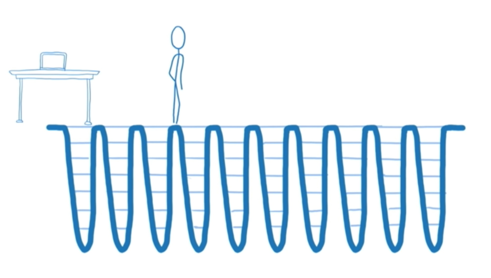
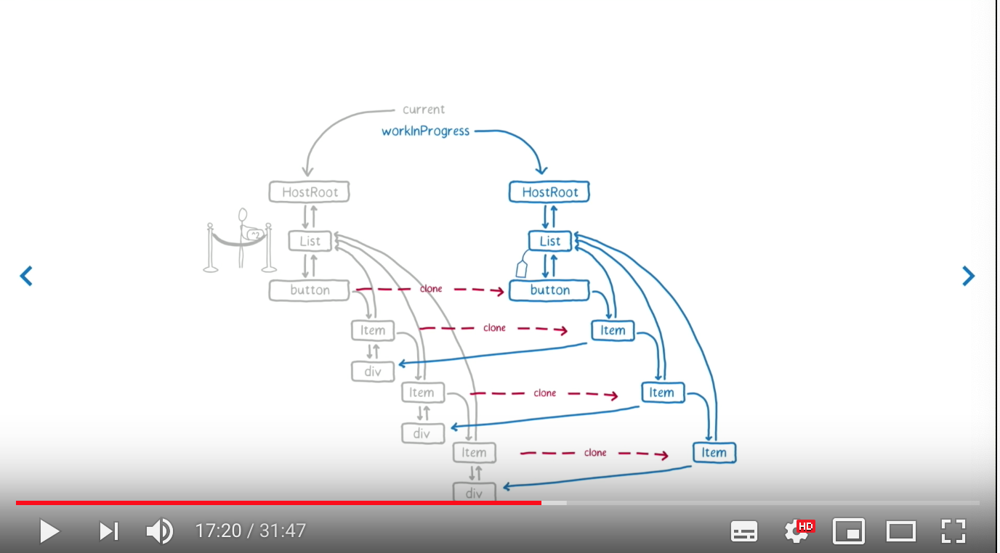
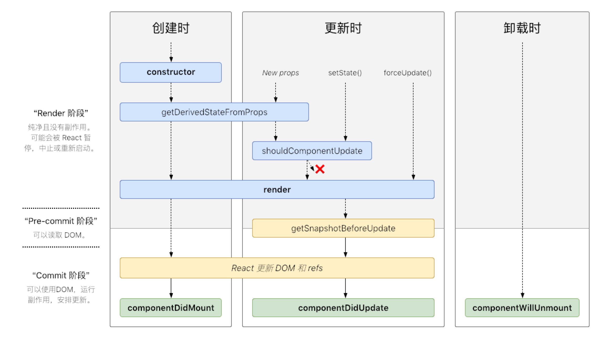
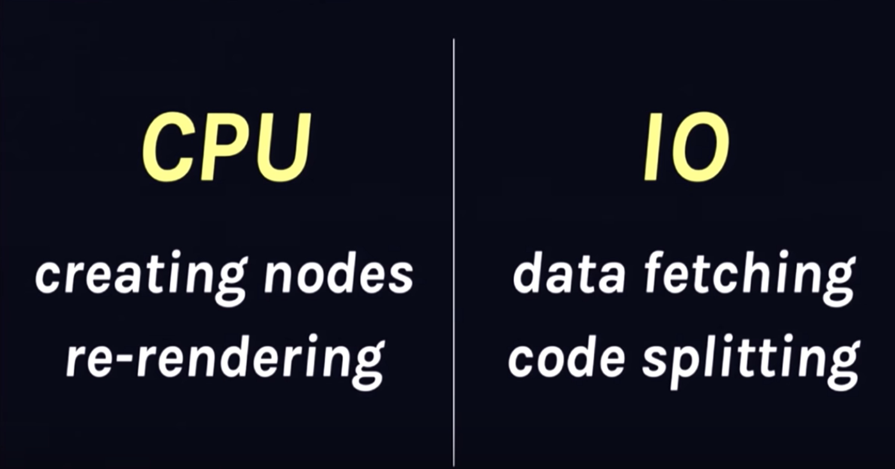

> 自 React 16 发步以来 React 一直给大家带来很多令人兴奋的新特性，本文旨在将 React 16 发布以来一些重要的特性以及未来将要实现特性串联起来。

<!--more-->

### React Fiber

<!-- React Fiber调度（Scheduling）——本质上是Virtual Stack Frama，在React v16中发布，随后react time silice(async render)会随着v17发布，则是基于fiber的实现 -->

React Fiber 的的重要特性是增量渲染：将渲染事务（work）分块并分布到多个帧去完成。

React Fiber 是 React 16 的重大更新之一，随着 React 大版本发布，旨在提高 React 的性能。基于 React Fiber，React 可以实现更多的性能上的优化。那么什么是 Fiber ？如何理解 React Fiber？

想要理解 Fiber，首先要理解几个概念。

#### 协调算法

React 的核心思想是当状态发生变化时让整个应用重新渲染，但是如果每次更新都重新渲染整个 app 会极度的浪费性能，为了将变化及时的反应到 view 层，同时保持高性能，React 使用了经过优化的 diff 算法，这就是协调算法的一部分。

协调算法基于“虚拟 DOM”实现（但是其实这个描述并不准确，因为 DOM 这个概念只是在浏览器中有，所以这里称为“虚拟树”更加准确）,当渲染一个 app 时，首先生成节点树保存在内存中，然后再渲染出来，当 app 更新时，会产生新的树，新旧树对比，找到需要更新的节点将其更新并渲染。

#### 协调器

协调算法将虚拟树的变化找到，渲染器将变化渲染出来，React 的渲染器有 React Dom，React Native 等，其中 React Native 将树渲染到原生 iOS 和 Android 视图，所以 React 协调算法是被渲染器共用的。

为了让不同的渲染器共享他们之间的代码。我们将 React 的这一部分称为“协调者”。当一个更新（例如`setState()`）被安排，协调器调用在树上组件上的`render()`，安装，更新，卸载它们。

#### 调度（Scheduling）

- 调度（Scheduling）——确定什么时候做什么事的过程
- 事务（work）——必须进行的计算，通常是更新的结果（通常是`setState`引起的）

React v16 之前的协调器（堆栈协调器，参见[Codebase Overview——Reconcilers](https://reactjs.org/docs/codebase-overview.html#reconcilers)）只是按照顺序执行，但是如果在用户界面中，每个更新都立即执行，会导致掉帧，降低用户体验。事实上不同类型的更新具有不同的优先级，如果能人为的干预执行顺序，按照优先级来进行调度，则性能就可以大大提高。

基于该想法，React 团队开始构思如何控制执行顺序——React Fiber 诞生。

#### 如何理解 Fiber

我们知道，函数有调用栈，当一个函数执行时，栈上面会添加新的堆栈结构，这个堆栈结构代表了函数执行的事务。而 React app 在执行的时候，类似于调用一个函数。

但是在处理该用户界面时，如果有太多的事务同时执行，可能会导致卡顿。可能还有一些事务是不需要的，因为它可能被最近的更新取代了。


<!--React旧的事件执行图-->

在最新的浏览器和 RN 实现了两个 API：

- `requestIdleCallback`会在浏览器空闲时一次调用函数，这就可以让开发者在主事件循环中执行后台或低优先级的任务，而不会对像对象动画和用户交互这样的会延迟触发且关键的事情产生影响。
- `requestAnimationFrame`告诉浏览器希望执行动画并请求浏览器在下一次重绘之前调用指定的函数来更新动画。

这两个函数可以让开发者操纵优先级，但是如果想要使用这些 API，就需要将渲染事务分解为增量单元的方法，如果只是依赖调用栈，调用栈将会一直执行下去，直到空。

假如可以中断调用栈，让 React 在需要更新界面的时候，及时更新界面，那么用户交互将不会再卡顿，这就是 React Fiber 的目的，React Fiber 为 React 组件实现了堆栈结构，让 React 可以在需要的时候，中断调用栈，转向更新界面或者其他，从而保证用户交互的顺畅，提高 React app 的性能。

所以 React Fiber 其实就是 **虚拟的堆栈结构（virtual stack frame）。**

使用 React Fiber 后 React 的调用情况


<!--React Fiber调用情况图-->

React 将更新分为两个时期：render/reconciliation 和 commit

##### render/reconciliation

该阶段是可打断的，React 在 workingProgressTree 上复用 current 上的 Fiber 数据结构来一步步构建新的 tree。


<!-- React workingProgress图 -->

React 16 之前在该阶段执行的生命周期：

- `componentWillMount`
- `componentWillReceiveProps`
- `shouldComponentUpdate`
- `componentWillUpdate`

##### commit

第二个阶段是 commit 阶段，在该阶段 React 将**所有的变更一次性更新到 DOM 上**，是不可被打断的。

React 16 之前在该阶段执行的生命周期：

- `componentDidMount`
- `componentDidUpdate`
- `componentWillUnmount`

在`commit`阶段，React 是可以做异步处理的，因为并不会出现像 DOM 更新这样的副作用，但是在`render/reconciliation`阶段执行的生命周期开发者可能会将更新 DOM 或者`setState`的代码放到这些生命周期中，而如果该阶段执行过程被打断，React 并不会从上一次执行中断的地方接着执行，而是会重新开始执行，这样假如 React 进行异步更新，可能会带来意想不到的后果，**所以在`render/reconciliation`阶段的钩子都不应该操作 DOM，也不要去`setState`，而在 commit 阶段则没有这个限制。**
为了强制开发者这样做，React 官方在 React v16.3 发布的时候将生命周期做了更改，而原有的生命周期加了`UNSAFE`前缀，这些生命周期将在 React v17 中彻底移除，开发者应该尽快切换。

### React v16.3 新的生命周期

React v16.3 之前，生命周期如下图：


<!-- React 15生命周期图 -->

更新 React v16.3 后生命周期的变化

#### Mount

- _constructor()_
- _~~componentWillMount()~~_
- _render()_
- _componentDidMount()_

#### Update

- _~~componentWillReceiveProps()~~ / static getDerivedStateFromProps()_
- _shouldComponentUpdate()_
- _~~componentWillUpdate()~~ / getSnapshotBeforeUpdate()_
- _render()_
- _componentDidUpdate()_

#### Unmount

- _componentWillUnmount()_

可以看到，生命周期更新后，原先在`render/reconciliation`的生命周期，除了`shouldComponentUpdate`，其他都被移除，用新的生命周期替代，前面讲到，在这个阶段，开发者可能会在生命周期中执行带有附作用的代码，从而由于该阶段的被打断而带来意想不到的后果，`shouldComponentUpdate`因不会有副作用的代码而得到保留

React v16.3 之后生命周期变成了下图这样：


<!-- React 16.3生命周期图 -->

React v16.3 到 v16.4，生命周期`getDerivedStateFromProps`触发的时机有一个变化，这是需要注意的一点。在 v16.3 中，只有父组件`setState`或者`forceUpdate`才会触发`getDerivedStateFromProps`，组件自己`setState`或者`forceUpdate`不会触发，很明显，这会造成意想不到的结果，[具体可以查看 Fiddle Demo](https://jsfiddle.net/0yne6jzp/)。所以 React 在发布 v16.4 后，修复了这个问题，无论是父组件还是自身，都可以触发`getDerivedStateFromProps`。关于更详细的描述可以查看 Dan 在 React issue[#12898](https://github.com/facebook/react/issues/12898#issuecomment-392117539)的回答。

所以 React v16.4 的生命周期变成了如下：


<!-- React 16.4生命周期图 -->

#### 新生命周期的使用

##### static getDerivedStateFromProps()

```js
static getDerivedStateFromProps(props, state)
```

该方法是一个静态方法用以替代`componentWillReceiveProps`，该方法返回一个新的对象，之后它会帮助开发者`setState`。由于它是一个静态方法，所以在该方法内拿不到实例，也就是说不能在该方法内调用实例方法或者`setState`。这样就保证了开发者不会将有副作用的代码写在这个生命周期中。

`getDerivedStateFromProps`在`render`方法之前调用，该方法应该返回一个更新 state 的对象或者不更新返回`null`，使用方式如下：

```js
static getDerivedStateFromProps(nextProps, prevState) {
  if (xxxxx) {
    return {
      ...prevState,
      loading: nextProps.loading,
    };
  }
  return null;
}
```

##### getSnapshotBeforeUpdate()

```js
getSnapshotBeforeUpdate(prevProps, prevState);
```

该方法在`render`之后执行，而执行时 DOM 元素还没有被更新，可以有机会获取 DOM 信息，计算得到一个`snapshot`，这个`snapshot`会作为`componentDidUpdate`的第三个参数传入。

```js
getSnapshotBeforeUpdate(prevProps, prevState) {
  if (prevProps.list.length < this.props.list.length) {
    const list = this.listRef.current;
    return list.scrollHeight - list.scrollTop;
  }
  return null;
}

componentDidUpdate(prevProps, prevState, snapshot) {
  if (snapshot !== null) {
    const list = this.listRef.current;
    list.scrollTop = list.scrollHeight - snapshot;
  }
}
```

##### componentDidCatch()

```javascript
componentDidCatch(error, info);
```

当一个子组件抛出错误时候调用该生命周期，它接受两个参数：

1. `error`抛出的错误
2. `info`是带有`componentStack`key 的一个对象，该对象包含哪个组件引发错误的信息

`componentDidCatch()`在`commit`阶段被调用，因此是允许包含有副作用的代码的，使用方式如下：

```js
class ErrorBoundary extends React.Component {
  constructor(props) {
    super(props);
    this.state = { hasError: false };
  }

  static getDerivedStateFromError(error) {
    return { hasError: true };
  }

  componentDidCatch(error, info) {
    logComponentStackToMyService(info.componentStack);
  }

  render() {
    if (this.state.hasError) {
      return <h1>Something went wrong.</h1>;
    }

    return this.props.children;
  }
}
```

### Time Slicing 和 Suspense

Time Slicing 和 Suspense 是 Dan 在 JSConf Iceland 2018 为大家展示的未来 React 将加入的一些特性，预计在 React v17 中发布，具体演讲可以查看——[Dan Abramov- Beyond React 16 - JSConf Iceland 2018](https://www.bilibili.com/video/av26248565?from=search&seid=3831330787181301576)。

这两个特性分别从**CPU 和 IO**来解决 React 的性能问题。


<!-- CPU & IO图 -->

#### Time Slicing

前面讲到 React Fiber 让 React 可以在 UI 渲染中更快的响应，但是同时带来了跟踪 UI 变化的挑战，这就是 Time Slicing 的用武之地。


<!-- CPU demo desc图 -->

Time Slicing 其实就是异步渲染，试想如果是同步渲染，在性能较差的 CPU 的设备上渲染会慢，用户会明显感知到卡顿。

通过 Time Slicing，React 可以在空闲回调期间将子组件的更新计算查分为块儿，并将渲染分散到多个帧上。这就让 React 可以在性能差的 CPU 设备上依旧保持流畅的渲染。而这一切对开发者而已是透明的。

#### Suspense

在 Suspense 之前，我们一直用 Redux+Saga 等解决网络 IO 的问题，Suspense 的出现意味着 React 本身将提供该问题的解决问题。

Suspense 将 React 的异步 IO 提升到一个新的高度。有了 Suspense 功能，React 可以暂停任何 state 更新直到数据就绪，这就让 React 可以和 REST APIs 或 GraphQL 等这些异步 IO 运算配合的更好。

Suspense 在 React v16.6 已经发布，可以使用`React.lazy()`和`<React.Suspense>`延迟加载组件，但是在 Fetch 数据的时候还无法使用`<React.Suspense>`，原因如下：


<!-- Dan回答React开发者为什么Suspense没有响应fech api的截图 -->

事实上想要用 Suspense 实现暂停 state 更新直到数据就绪需要使用一个叫[react-cache](https://github.com/facebook/react/tree/master/packages/react-cache)的库。

##### react-cache

> react-cache 目前处于开发阶段，API 很有可能会发生变化，官方不建议将其用于生产环境

react-cache 是一个非常小的库，API 和用法如下：

###### `unstable_createResource`

创建一个`resource`，返回一个 promise

##### `resource.read(key)`

`resource`会检查 key 和 cache

如果 cache 没有数据，会执行以下操作：

- 调用回调函数获取数据
- 抛出 promise
- 当 promise resolves，根据 key 将响应的数据存储在 cache 中
- 重复该过程

如果 cache 中成功读取到数据

- 将缓存值同步读取到 render 函数中

```js
function fetchUserProfileJSON(id) {
  return makeFakeAPICall(`/${id}/details`, userProfileJSON[id]);
}
const UserDetailsResource = unstable_createResource(fetchUserProfileJSON);
const user = UserDetailsResource.read(id);
return <div> {user} </div>;
```

Suspense 配合 react-cache 实现暂停 state 更新，直到数据就绪：

```js
function fetchUserProfileJSON(id) {
  return makeFakeAPICall(`/${id}/details`, userProfileJSON[id]);
}
const UserDetailsResource = unstable_createResource(fetchUserProfileJSON);
const user = UserDetailsResource.read(id);
return (
  <Suspense maxDuration={1000} fallback={<Spinner size="medium" />}>
    <div> {user} </div>;
  </Suspense>
);
```

关于更详细的用法可以[查看官方提供的 Suspense Demo](https://github.com/facebook/react/tree/master/fixtures/unstable-async/suspense)。

### React Hooks

在 React Conf 2018 Dan 做了题为[React Today and Tomorrow and 90% Cleaner React With Hooks](https://www.bilibili.com/video/av34757643?from=search&seid=7808662780043111688)的演讲，介绍了 React 即将发布的又一新特性——React Hooks，目前可以在 React v16.8.0-alpha.0 体验。

#### 什么是 Hooks

Hooks 是一种函数，该函数可以“钩住”React 状态和生命周期的功能，允许开发者在不写 class 的情况下使用 React。

基本的 Hooks 有以下几种：

- State Hooks
- Effect Hooks
- 自定义 Hooks

#### State Hook

我们用 React 写一个点击按钮数字自动+1 的组件，如果使用 class，写法如下：

```js
class Example extends React.Component {
  constructor(props) {
    super(props);
    this.state = {
      count: 0
    };
  }

  render() {
    return (
      <div>
        <p>You clicked {this.state.count} times</p>
        <button onClick={() => this.setState({ count: this.state.count + 1 })}>
          Click me
        </button>
      </div>
    );
  }
}
```

如果使用 React Hooks，写法如下：

```js
import { useState } from "react";

function Example() {
  const [count, setCount] = useState(0);

  return (
    <div>
      <p>You clicked {count} times</p>
      <button onClick={() => setCount(count + 1)}>Click me</button>
    </div>
  );
}
```

这里使用的`useState`就是一个 Hooks，调用方式如下：

```js
const [state, setState] = useState(initialState);
```

该函数返回一对值：state，更新该 state 的函数；在初始渲染的时候，返回的 state 就是 initialState。

#### 声明多个状态变量

```js
function ExampleWithManyStates() {
  const [age, setAge] = useState(42);
  const [fruit, setFruit] = useState('banana');
  const [todos, setTodos] = useState([{ text: 'Learn Hooks' }]);
```

#### Effect Hook

Effect Hook 允许在函数组件种执行副作用（PS：副作用一般指执行数据提取，订阅或者手动改变来自 React 组件的 DOM）。它与 React 类中的`componentDidMount`、`componentDidUpdate`、和 `componentWillUnmount` 有相同的功能，但是统一为一个 API。

当调用`useEffect`时，会通知 React 在刷新对 DOM 的更改后运行 effect 函数。Effect 在组件内声明，因此可以访问其 `props` 和 `state`。默认情况下，React 在每次渲染后运行 effect，包括第一次渲染。

默认情况下，React 在每次渲染后运行 effect，包括第一次渲染。

useEffect 还可以通过返回一个函数来指定如何清理，例如，在此组件中实现了通过 effect 订阅，并通过取消订阅来清理。

```js
import { useState, useEffect } from "react";

function FriendStatus(props) {
  const [isOnline, setIsOnline] = useState(null);

  function handleStatusChange(status) {
    setIsOnline(status.isOnline);
  }

  useEffect(() => {
    ChatAPI.subscribeToFriendStatus(props.friend.id, handleStatusChange);

    return () => {
      ChatAPI.unsubscribeFromFriendStatus(props.friend.id, handleStatusChange);
    };
  });

  if (isOnline === null) {
    return "Loading...";
  }
  return isOnline ? "Online" : "Offline";
}
```

#### 自定义 Hooks

自定义 Hook 允许将可重用的组件逻辑提取到函数中。

前面使用`useEffect`实现了订阅和取消订阅，如果想将该逻辑重用，可以将`props`换成参数，从而实现组件逻辑的复用，调用非常方便，直接传递参数即可：

```js
// 自定义Hook
import { useState, useEffect } from "react";

function useFriendStatus(friendID) {
  const [isOnline, setIsOnline] = useState(null);

  function handleStatusChange(status) {
    setIsOnline(status.isOnline);
  }

  useEffect(() => {
    ChatAPI.subscribeToFriendStatus(friendID, handleStatusChange);
    return () => {
      ChatAPI.unsubscribeFromFriendStatus(friendID, handleStatusChange);
    };
  });

  return isOnline;
}

// 调用
function FriendStatus(props) {
  const isOnline = useFriendStatus(props.friend.id);

  if (isOnline === null) {
    return "Loading...";
  }
  return isOnline ? "Online" : "Offline";
}
```

#### 为什么引入 Hooks

为什么要在 React 中引入 Hooks，React 官方给出了以下描述：

> Hooks 解决了 React 中各种看似不相关的问题，这些问题是我们在开发和维护数以万计的组件时遇到的。无论你是在学习 React，还是每天在使用它，还是选择使用具有类似组件模型的其他库，你都可能会发现这类问题。

### 总结

以上总结了自 React v16.0 发布以来，React 给开发者带来的一些令人惊叹的新的特性，可以看到 React 已经开始慢慢走向一个大而全的框架，而不是像以前那样仅仅只是做 view 层，剩下的交给社区自由发展。相信在不远的未来，React 将更加的好用，性能更高。

### 参考

- [React Fiber 是什么](https://zhuanlan.zhihu.com/p/26027085)
- [React Fiber 架构](https://swenyang.gitbooks.io/yapn/content/react-fiber/)
- [「译」React Fiber 那些事: 深入解析新的协调算法](https://segmentfault.com/a/1190000017241034)
- [React v16.3 之后的组件生命周期函数](https://zhuanlan.zhihu.com/p/38030418)
- [「译」 如何使用 React 生命周期方法](https://juejin.im/post/5b59d1c8e51d4519455846e0?utm_source=mife&utm_medium=article&utm_campaign=mifeweekly&utm_term=tutorial)
- [如何评价 React 的新功能 Time Slice 和 Suspense？](https://www.zhihu.com/question/268028123)
- [Time slice and Suspense API – What’s coming in React 17?](https://blog.pusher.com/time-slice-suspense-api-react-17/)
- [react-cache](https://github.com/sw-yx/fresh-concurrent-react/blob/master/apis/react-cache.md#important-concepts)
- [React Change log](https://github.com/facebook/react/blob/master/CHANGELOG.md)
- [React Hooks](https://reactjs.org/docs/hooks-intro.html)
