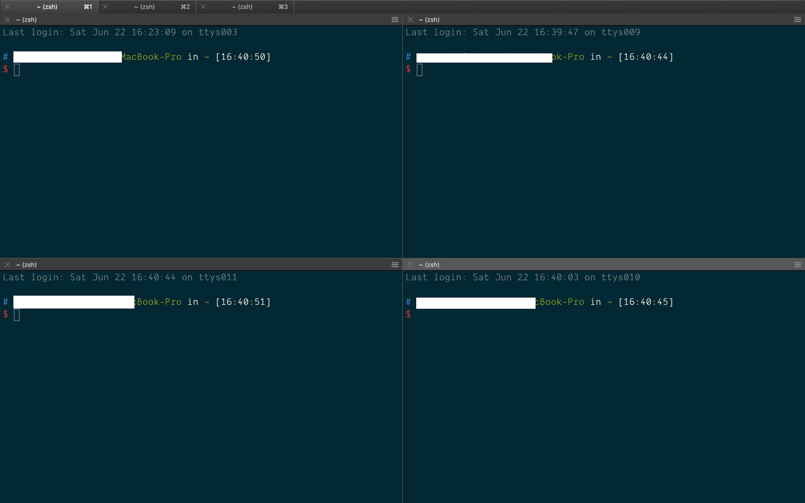
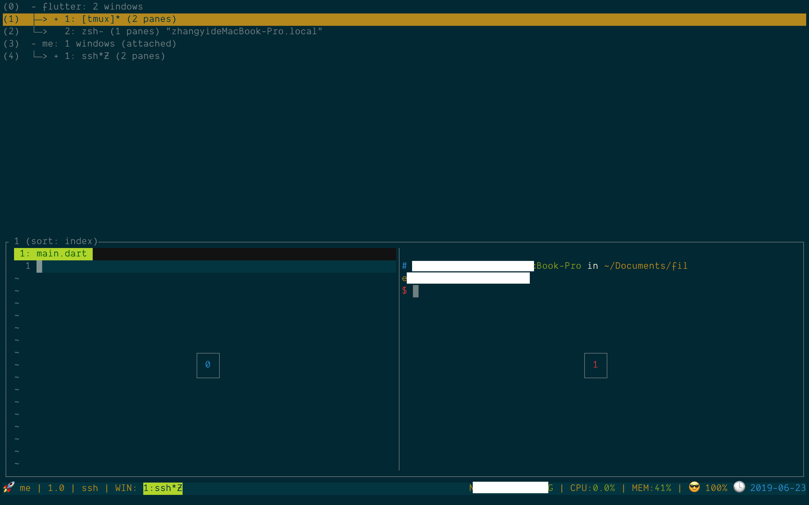

>记得第一次接触tmux是在一年前，当时是为了复用终端，不想开多个item2的tab，但是后来发现完全不会用，就一直搁在那儿，直到半年前再次拿起来，开始学习一些tmux的用法，如今半年过去了，真正的明白了为什么说tmux是神器。

<!--more-->

在用tmux之前一直都是用的[iterm2](https://www.iterm2.com/)（在mac上很好用的终端）原生的新开tab和分屏，其实也还好，界面看起来就像这样：

<!--item2原生分屏图片-->



但是分屏很多之后，可以看到很多状态栏，并不是很美观，对比tmux的分屏，看起来就要hack很多，tmux的分屏界面如下：

<!--tmux分屏图片-->


正是基于这个原因，开始学着始使用tmux。

### 安装

>tmux的仓库：https://github.com/tmux/tmux

首先安装tmux：

```sh
# mac安装
brew install tmux

# linux 安装
sudo apt-get install tmux
```

开始学习tmux之前首先要明确几个概念：

* session：概括一个任务，是一组window的集合，在任务开始前创建一个session，与此任务相关的状态都会保存在session中，通过重新连接session可以方便的继续未完成的任务。session最大的最用就是持久的保存工作状态
* window：tmux中的window其实就是我们常说的tab，在chrome中，新开一个tab就会新建一个页面，tmux也类似
* pane：单个window可以分成若干pane，就像前面使用iterm2分屏一样

简单来说就是：session包含window，window包含pane

<!--tmux名词标注-->


### session

#### 新建

安装完成后，在终端直接输入`tmux`即可进入tmux。进入之后可以看到session的名字是0，这是因为我们直接输入`tmux`会创建一个无名的会话，如果想要新建session的时候给session命名，可以使用以下命令：

```sh
tmux new -s your-session-name
```

#### 断开

如果想要断开当前session可以使用

```sh
tmux detach # 断开当前会话
```
或者使用快捷键`[prefix]+d`，其中`prefx`默认为`ctrl+b`

#### 恢复

退出session之后，想要恢复之前工作的区域，直接在终端输入：

```sh
tmux attach-session -t your-session-name

# 可以简写
tmux a -t your-session-name
```

其中`session-name`是可选的，如果不输入，默认进入第一个会话。

#### 关闭

使用完成后，要关闭，可以使用`tmux kill`命令，`kill`有以下四种：

* `kill-server`：关闭sessions，clients和server，这个命令会将tmux创建的都关闭
* `kill-session`
* `kill-window`
* `kill-pane`

```sh
# 关闭session
tmux kill-session -t your-session-name
# 关闭所有
tmux kill-server
```

#### 查看

```sh
tmux list-session
# 简写
tmux ls
```

或者使用快捷键`prefix+s`查看所有session，`prefix+w`查看所有window。

<!--tmux展示所有session和window的图-->


### tmux基础配置

tmux的配置在`~/.tmux.conf`文件中，如果没有该文件，可以先新建配置文件。

#### 配置tmux前缀

前面介绍session使用的时候，提到过一些快捷键，可以看到都是`prefix+xxx`的形式，这里的`prefix`是tmux的前缀键，默认为`ctrl+b`，只有按下`prefix`，才会激活tmux，然后再按其他键进行tmux操作，这样做的一个好处是可以有效的避免和其他应用快捷键的冲突。

但是如果经常用tmux，就会发现`ctrl`和`b`这两个键按的不是很舒服，我们是否可以修改一个更加舒服的前缀键呢？当然是可以的，只需要在tmux的配置文件中解绑原有的`prefix`并修改成我们自定义的即可。配置如下：

```sh
set -g prefix C-a

# 解绑原有的prefix
unbind C-b
bind C-a send-prefix
```

配置完成后，需要重启tmux，或者按下`ctrl+b`，然后输入`:`进入命令模式，输入：

```sh
source-file ~/.tmux.conf
```

或者我们给让配置生效添加快捷键：

```sh
bind r source-file $HOME/.tmux.conf \; display-message 'Config reloaded'
```

这样，直接输入`prefix+r`就可以让配置生效。

#### 分屏

在tmux中，水平和竖直分屏默认快捷键为`prefix+"` 和 `prefix+%`，这两个键可以说很少用而且不容易按到，我们可以自定义自己习惯的快捷键，对于对vim熟悉的用户，可以将其设置为跟vim一样的快捷键：

```sh
bind C-h splitw -v -c '#{pane_current_path}'
bind C-v splitw -h -c '#{pane_current_path}'
```

这里的`splitw`其实是`split-window`的缩写，`-c '#{pane_current_path}'`表示在打开新pane的时候，默认进入当前目录。

#### 切换pane

在iterm2中，切换标签的快捷键是`commond+option+方向键`或`commond+[`或`commond+]`，相应的在tmux中，切换pane默认快捷为`prefix+方向键`但是方向键本身和`ctrl`离的太远，操作不方便，同样的我们可以设置自己喜欢的快捷键，例如设置跟vim一样的快捷键（这里多说一句，其实在vim中最常用的控制方向的键就是hjkl，如果习惯使用vim，可以设置tmux与之相同快捷键）。

```sh
bind h select-pane -L # up
bind j select-pane -D # down
bind k select-pane -U # left
bind l select-pane -R # right
```

#### 开启鼠标支持 

在刚上手tmux的时候，总觉得各种命令很麻烦，而且不好记，如果支持鼠标就更好了，其实想要支持鼠标，只需要在配置文件中开启即可：

```sh
set-option -g mouse on
```

开启鼠标之后，切换pane可以直接点击激活，调整分屏大小可以直接拖拽实现。

**当然了，既然使用了tmux，目的就不只是界面好看而已，而是要提高效率，所以尽量少用鼠标😏**

#### 调整pane

如果想要使用快捷键调节pane大小，同样可以设置快捷键实现：

```sh
bind H resize-pane -L 10 # 向左扩展10
bind L resize-pane -R 10 # 向右扩展10
bind K resize-pane -U 5  # 向上扩展5
bind J resize-pane -D 5  # 向下扩展5
```

这样通过`prefix+HJKL`实现pane的扩展


### 附

|前缀 | 指令 | 描述 |
| --- | --- | --- |
|Ctrl+b | ? | 显示快捷键帮助文档 |
|Ctrl+b | d | 断开当前会话 |
|Ctrl+b | D | 选择要断开的会话 |
|Ctrl+b | Ctrl+z | 挂起当前会话 |
|Ctrl+b | r | 强制重载当前会话 |
|Ctrl+b |s  |显示会话列表用于选择并切换 |
|Ctrl+b |:	|进入命令行模式，此时可直接输入ls等命令 |
|Ctrl+b	| [	|进入复制模式，按q退出 |
|Ctrl+b	| ]	|粘贴复制模式中复制的文本 |
|Ctrl+b	|~	|列出提示信息缓存 |

window

|前缀|	指令|	描述|
| --- | --- | --- |
|Ctrl+b	|c	|新建窗口
|Ctrl+b	|&	|关闭当前窗口（关闭前需输入y or n确认）
|Ctrl+b	|0~9|切换到指定窗口
|Ctrl+b	|p	|切换到上一窗口
|Ctrl+b	|n	|切换到下一窗口
|Ctrl+b	|w	|打开窗口列表，用于且切换窗口
|Ctrl+b	|,	|重命名当前窗口
|Ctrl+b	|.	|修改当前窗口编号（适用于窗口重新排序）
|Ctrl+b	|f	|快速定位到窗口（输入关键字匹配窗口名称）

pane

|前缀	|指令	|描述|
| --- | --- | --- |
|Ctrl+b	|"	|当前面板上下一分为二，下侧新建面板
|Ctrl+b	|%	|当前面板左右一分为二，右侧新建面板
|Ctrl+b	|x	|关闭当前面板（关闭前需输入y or n确认）
|Ctrl+b	|z	|最大化当前面板，再重复一次按键后恢复正常（v1.8版本新增）
|Ctrl+b	|!	|将当前面板移动到新的窗口打开（原窗口中存在两个及以上面板有效）
|Ctrl+b	|;	|切换到最后一次使用的面板
|Ctrl+b	|q	|显示面板编号，在编号消失前输入对应的数字可切换到相应的面板
|Ctrl+b	|{	|向前置换当前面板
|Ctrl+b	|}	|向后置换当前面板
|Ctrl+b	|Ctrl+o	|顺时针旋转当前窗口中的所有面板
|Ctrl+b	|方向键	|移动光标切换面板
|Ctrl+b	|o	|选择下一面板
|Ctrl+b	|空格键	|在自带的面板布局中循环切换
|Ctrl+b	|Alt+方向键	|以5个单元格为单位调整当前面板边缘
|Ctrl+b	|Ctrl+方向键	|以1个单元格为单位调整当前面板边缘（Mac下被系统快捷键覆盖）
|Ctrl+b	|t	|显示时钟前缀 | 指令 | 描述 |
| --- | --- | --- |
|Ctrl+b | ? | 显示快捷键帮助文档 |
|Ctrl+b | d | 断开当前会话 |
|Ctrl+b | D | 选择要断开的会话 |
|Ctrl+b | Ctrl+z | 挂起当前会话 |
|Ctrl+b | r | 强制重载当前会话 |
|Ctrl+b |s  |显示会话列表用于选择并切换 |
|Ctrl+b |:	|进入命令行模式，此时可直接输入ls等命令 |
|Ctrl+b	|[	|进入复制模式，按q退出 |
|Ctrl+b	|]	|粘贴复制模式中复制的文本 |
|Ctrl+b	|~	|列出提示信息缓存 |


表二：窗口（window）指令。

|前缀|	指令|	描述|
| --- | --- | --- |
|Ctrl+b	|c	|新建窗口
|Ctrl+b	|&	|关闭当前窗口（关闭前需输入y or n确认）
|Ctrl+b	|0~9|切换到指定窗口
|Ctrl+b	|p	|切换到上一窗口
|Ctrl+b	|n	|切换到下一窗口
|Ctrl+b	|w	|打开窗口列表，用于且切换窗口
|Ctrl+b	|,	|重命名当前窗口
|Ctrl+b	|.	|修改当前窗口编号（适用于窗口重新排序）
|Ctrl+b	|f	|快速定位到窗口（输入关键字匹配窗口名称）

表三：面板（pane）指令。

|前缀	|指令	|描述|
| --- | --- | --- |
|Ctrl+b	|"	|当前面板上下一分为二，下侧新建面板
|Ctrl+b	|%	|当前面板左右一分为二，右侧新建面板
|Ctrl+b	|x	|关闭当前面板（关闭前需输入y or n确认）
|Ctrl+b	|z	|最大化当前面板，再重复一次按键后恢复正常（v1.8版本新增）
|Ctrl+b	|!	|将当前面板移动到新的窗口打开（原窗口中存在两个及以上面板有效）
|Ctrl+b	|;	|切换到最后一次使用的面板
|Ctrl+b	|q	|显示面板编号，在编号消失前输入对应的数字可切换到相应的面板
|Ctrl+b	|{	|向前置换当前面板
|Ctrl+b	|}	|向后置换当前面板
|Ctrl+b	|Ctrl+o	|顺时针旋转当前窗口中的所有面板
|Ctrl+b	|方向键	|移动光标切换面板
|Ctrl+b	|o	|选择下一面板
|Ctrl+b	|空格键	|在自带的面板布局中循环切换
|Ctrl+b	|Alt+方向键	|以5个单元格为单位调整当前面板边缘
|Ctrl+b	|Ctrl+方向键	|以1个单元格为单位调整当前面板边缘（Mac下被系统快捷键覆盖）
|Ctrl+b	|t	|显示时钟

### 参考

* [Tmux使用手册](http://louiszhai.github.io/2017/09/30/tmux/#Tmux%E5%BF%AB%E6%8D%B7%E6%8C%87%E4%BB%A4)
* [iTerm2 快捷键大全](https://cnbin.github.io/blog/2015/06/20/iterm2-kuai-jie-jian-da-quan/)
* [tmux shortcuts & cheatsheet](https://gist.github.com/MohamedAlaa/2961058)
* [tmux cheat sheet](https://gist.github.com/andreyvit/2921703)

