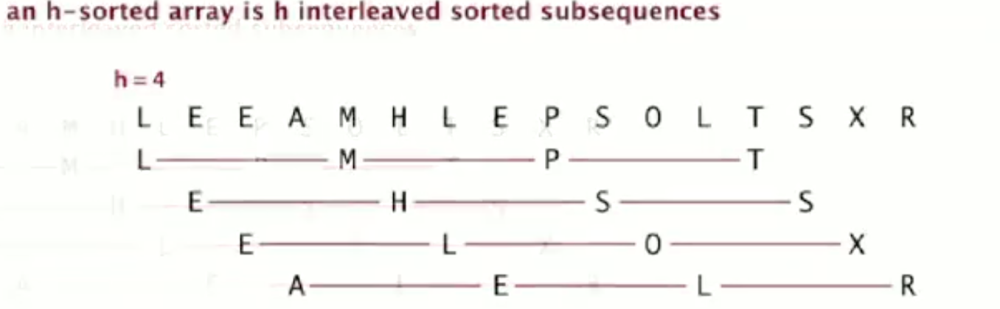
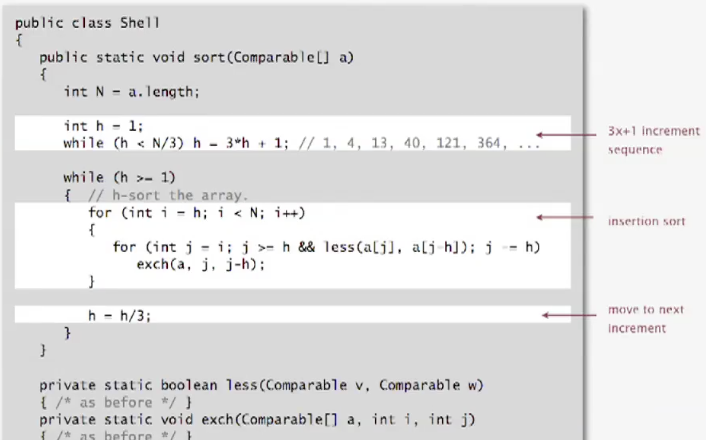
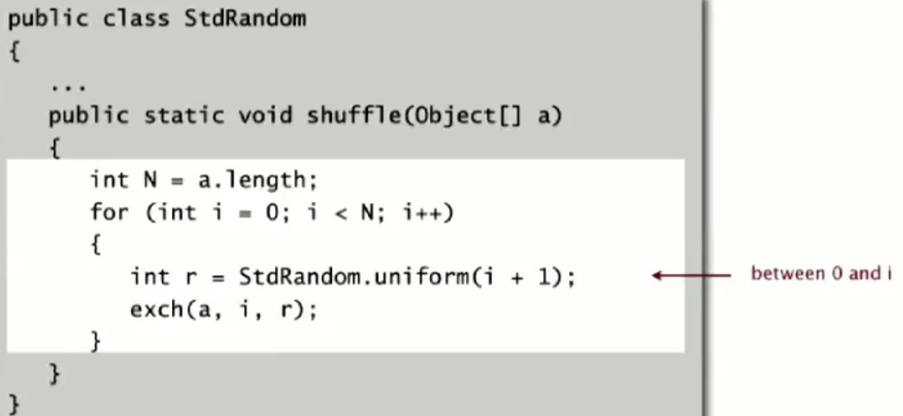

## 选择排序

> 首先找到数组中最小的那个元素，其次将它和数组第一个元素交换位置（如果第一个元素就是最小元素，那么它就和自己交换）。再次，在剩下的元素中找到最小元素，将它和数组的第二个元素交换位置。如此往复，直到将整个数组排序。这种方法叫做选择排序。
<!--more-->
**命题A**：对于长度为N的数组，选择排序需要大约$N^2 / 2$次比较和N次交换

### 特性

- 运行时间和输入无关
- 数据移动是最少的

### 代码实现


无论原数组排序是如何的，该排序方式总是需要平方时间

```go
func SelectSort(arr []int)  []int{
	arrLength := len(arr)
	for i := 0; i < arrLength; i++ {
		min := i
		for j := i+1; j < arrLength; j++ {
			if arr[j] < arr[min] {
				min = j
			}
		}
		// exchange
		arr[min], arr[i] = arr[i], arr[min]
	}
	return arr
}
```

```jsx
function exchange(arr, a, b) {
  let temp = arr[a]
  arr[a] = arr[b]
  arr[b] = temp
}

function selectSort(arr) {
  const arrLength = arr.length
  for (let i = 0; i < arrLength; i++) {
    let min = i
    for (let j = i + 1; j < arrLength; j++) {
      if(arr[j] < arr[min]) {
        min = j
      }
    }
    exchange(arr, i, min)
  }
  return arr;
}
```

## 插入排序

> 指针 i 用于遍历整个数组，指针 j 用于将右边部分数组依此跟前一个元素进行比较，如果比前一个元素小，就将元素与前一个元素交换，直到遍历完成整个数组。

与选择排序一样，当前索引左边的所有元素都是有序的，但是它的最终位置还不确定。和选择排序不同的是，**插入排序所需的时间取决于输入中元素的初始顺序**。

**命题B**：对于随机排列的长度为N且主键不重复的数组，平均情况下插入排序需要 ～$N^2 / 4$ 次比较及 ~ $N^2 / 4$ 次交换，最坏情况下插入排序需要 ～$N^2 / 2$ 次比较及 ~ $N^2 / 2$ 次交换，最好情况下需要 N-1 次比较和 0 次交换。

### 代码实现

```go
func InsertSort(arr []int) []int {
	arrLength := len(arr)
	for i := 1; i < arrLength; i++ {
		for j:=i; j > 0 && arr[j] < arr[j - 1]; j-- {
			arr[j], arr[j - 1]	= arr[j - 1], arr[j]
		}
	}
	return arr
}
```

### 部分有序

如果数组中倒置的数量小于数组大小的某个倍数，那么我们说这个数组是部分有序的。以下是几种经典的部分有序数组：

- 数组中每个元素距离它的最终位置都不远
- 一个有序的大数组接一个小数组
- 数组中只有几个元素位置不正确

**对于部分有序的数组，插入排序执行是线性的**

逆序对：逆序对是数组中乱序的关键对，例如下面的数组

```jsx
[4,5,1,3,0]
// 逆序对
5-1, 5-3, 5-0, 3-0 四个逆序对
```

事实上，当倒置数量很少时，插入排序可能比我们所知道任何基础排序算法都要快。

**命题C**：插入排序需要的交换操作和数组中倒置的数量相同，需要的比较次数大于等于倒置的数量，小于等于倒置的数量加上数组的大小再减一。

如果逆序对是线性的（部分有序数组），插入排序对这样的数组排序的时间是线性的。总的来说，插入排序对于部分有序的数组十分高效，也很适合小规模数组。

## 希尔排序（Shell sort）

> 前面的排序每次都移动一个位置，导致效率要低一些，所以希尔排序将数组每次移动若干位置，这种操作叫做对数组进行h-排序。希尔排序的思想是使数组中任意间隔为h的元素都是有序的。这样的数组被成为“h有序数组”。

h-排序包含h个不同的交叉的“有序子列”，通过递减h值的h-排序实现一种排序方法，对h-排序使用“插入排序”，之前每次获取新的项往回走一个，现在往回走h个。

**这里选择插入排序而不是选择排序的原因是插入排序对部分有序数组的排序是线性的**，而选择排序无论是什么顺序，时间都是平方级别的



希尔排序中，增量的取值

- 2n-1：1，3，5，7...
- 3n+1：1，4，13，40...

### 代码实现

实现方式，增量取3n+1



```go
func ShellSort(arr []int) []int {
	N := len(arr)
	h := 1
	for h < N/3 {
		h = 3*h + 1
	}
	for h >= 1 {
		for i := h; i < N; i++ {
			for j := i; j >= h && arr[j] < arr[j-h]; j -= h {
				arr[j], arr[j-h] = arr[j-h], arr[j]
			}
		}
		h = h / 3
	}
	return arr
}
```

```jsx
function exchange(arr, a, b) {
  let temp = arr[a]
  arr[a] = arr[b]
  arr[b] = temp
}

function shellSort(arr) {
  const N = arr.length
  let h = 1
  while (h < N / 3) {
    h = 3*h + 1
  }
  while (h >= 1) {
    for (let i = h; i < N; i++) {
      for (let j = i; j >= h && arr[j] < arr[j - h]; j -= h) {
        exchange(arr, j, j - h)
      }
    }
    h = parseInt(h / 3, 10)
  }
  return arr
}
```

已知在最坏情况下该算法的比较次数和N^(3/2)成正比

性质E：使用递增序列1，4，13，40，121，364...（即$3*h+1$）的希尔排序所需的比较次数不会超过N的若干倍乘以递增序列的长度。

# 洗牌算法（Shuffling）

要点：指针 i 遍历整个数组，将数组分为左右两个部分，从右边已经乱序的数组中随机找到元素 a[r] ，将 a[i] 与 a[r] 交换，i++

