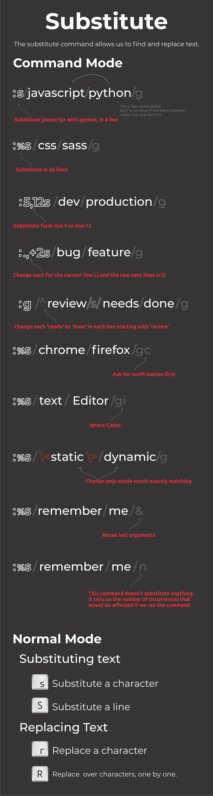

在使用编辑器的过程中，我们会经常使用到搜索 / 替换，大部分编辑器可以通过快捷键呼出搜索框来搜索 / 替换，通过选择不同的选项可以做到匹配大小写，精准匹配，模糊匹配等等。那么在vim中，这些操作该如何实现？本文将介绍在vim中常用的搜索文本，替换文本操作以及如何结合插件实现更强大的搜索。
<!--more-->
# 利用vim自带搜索

对于搜索当前打开文件，vim自带搜索功能足以应对，在Normal modal下键入`/`，即可进入搜索模式，此时输入想要搜索的单词然后回车，即可完成搜索，光标会跳到当前搜索到的第一个匹配的单词。按下`n`，光标跳到下一个匹配的单词，按下`N`（`shift+n`）光标会跳到上一个匹配的单词。

除了在Normal modal下可以键入`/`开始搜索外，还可以键入以下符号开始搜索：

* `?`：与`/`相反，键入该符号后**反向向上搜索**
* `*`：搜索当前光标所在单词，例如：如果当前光标所在单词是`set`，则相当于键入`/\<set\>`
* `#`：搜索当前光标所在单词，相当于键入`?\<set\>`

其中`\<`是单词界定符，表示只匹配单词的开头，`/>`表示只匹配单词的末尾

此外vim搜索还支持正则，例如输入`/se$`表示搜索以`se`结尾的单词，输入`/^se`表示搜索以`se`开头的单词

## 高亮搜索结果

默认情况下，搜索的结果不会高亮，只是光标会跳到搜索到的单词，如果想要高亮搜索结果，可以在Normal modal下输入`:set hlsearch`，或者在`.vimrc`文件中设置：

```sh
" search result heighligh, when enter `:noh` in command line , clean heightlight
set hlsearch
```

这样设置后，在搜索完成后，所有的匹配文本都会高亮，想要取消搜索结果的高亮可以在Normal modal下输入`:nohlsearch`或其简写`:noh`


## 搜索大小写敏感

在使用vim的搜索默认是大小写不敏感的，如果想要让vim搜索做到**大小写敏感**，可以在输入想要搜索的单词后面添加`\C`，对应的如果使用`\c`，则表示搜索大小写不敏感。

或者直接在`.vimrc`中添加设置：

```sh
" 开启大小写不敏感（默认值）
set ignorecase

" 开启智能推测
set smartcase
```

开启智能推测后，如果输入的文本带有大写字母，vim会认为你当前搜索是区分大小写的，否则不区分大小写。即开启后，如果输入`:Set`，则只能搜索到`Set`，但是如果输入`:set`，则可以搜索到`set`和`Set`。

# vim中的替换

对于替换当前打开文件中的文本，vim提供如下语法：

```sh
:{作用范围}s/{目标字符}/{替换的字符}/{替换标志}
```

作用范围：用于指定替换的范围，`1,3`表示替换第一行至第三行，`1,$`表示替换第一行到最后一行，也可以直接用`%`表示。
替换标志（可以组合使用）：
* c: confirm，每次替换前都会询问
* e：不显示error
* g: globe，不询问，整个替换
* i: ignore，即不区分大小写

具体的用法可以查看下图（摘自Reddit）：

<!--vim替换的图示-->


* `:%s/remember/me/n`命令不会替换任何东西。 只是告诉我们如果我们运行命令，受影响的行数。实际操作过程中，在vim中运行该命令，显示`89 matches on 89 lines`

* `:%s/remember/me/&`命令没看明白做什么用

# 利用插件在vim中搜索

有时候需要在整个项目中搜索文件或者文本，这类操作借助插件更方便一些。

说起vim中搜索文件，就一定会想到大名鼎鼎的[ctrlp.vim](https://github.com/kien/ctrlp.vims)，但该插件早已不再维护（最近一次提交是在2015年11月30日），那是否还有其他替代插件呢？答案是有的，可以使用[fzf.vim](https://github.com/junegunn/fzf.vim)。fzf.vim支持文件搜索，全局文本搜索，buffer搜索，git log搜索等，这里只介绍最常用的全局文本搜索和文件搜索。

首先使用[vim-plug](https://github.com/junegunn/vim-plug)安装插件：

```sh
Plug 'junegunn/fzf', { 'do': { -> fzf#install() } }
Plug 'junegunn/fzf.vim'
```

从以上安装可以看到要想使用fzf.vim，需要首先安装[fzf](https://github.com/junegunn/fzf)。

fzf是一款golang编写的命令行模糊查找器，支持文件，命令等的模糊搜索。强烈建议使用，对于经常使用终端的同学来说太方便了。

------
备注：

如果要安装fzf，在macOS直接：`brew install fzf`即可。如果通过`brew`安装过fzf，则vim-plug的配置如下：

```sh
Plug '/usr/local/opt/fzf'
Plug 'junegunn/fzf.vim'
```
------

安装完成后在`.vimrc`中添加如下配置：

```sh
" fzf
" fzf use rg search config
let g:fzf_layout = { 'down': '~70%' }
command! -bang -nargs=* Rg
      \ call fzf#vim#grep(
      \   "rg --column --line-number --no-heading --color=always --smart-case "
      \   .(len(<q-args>) > 0 ? <q-args>: '""'),
      \   1,
      \   <bang>0 ? fzf#vim#with_preview({'options': '--delimiter : --nth 4..'}, 'up:60%')
      \   : fzf#vim#with_preview({'options': '--delimiter : --nth 4..'}, 'right:50%:hidden', '?'),
      \   <bang>0)
command! -bang -nargs=? -complete=dir Files
  \ call fzf#vim#files(<q-args>, fzf#vim#with_preview(), <bang>0)

" fzf vim
nnoremap  <silent> <Leader>rg :Rg<CR>
nnoremap <leader>b :Buffers<CR>
nnoremap <C-p> :Files<CR>
```

关于fzf.vim的配置有几点说明：

* `fzf_layout`用于设置调用fzf搜索的窗口位置以及大小，可以设置`left`、`right`、`down`、`up`。
* fzf.vim内置`fzf#vim#grep`函数，支持调用第三方搜索，接收参数：`fzf#vim#grep(command, [has_column bool], [spec dict], [fullscreen bool])`
  * `command`：要运行的命令；
  * `has_column`：是否打印列号；
  * `spec`：展示预览窗口；
  * `fullscreen`：是否全屏，`<bang>0`是vim script，在vim命令中如果输入`!`则`<bang>0`转换成1，否则为0；
* 这里使用了[ripgrep](https://github.com/BurntSushi/ripgrep)（因为据说vscode内的搜索就是基于这个做的，所以选择这个）作为fzf中默认的搜索。`fzf#vim#with_preview`用于配置展示预览窗口。配置好后在vim中输入`:Rg`就可以启动在整个项目搜索文本，`:Files`在整个项目中搜索文件。 
* 在使用fzf.vim搜索文本和文件的过程中需要注意一点，**搜索是基于你当前打开文件所在的文件夹去搜索**。所以如果要在整个项目中搜索，就需要在项目根目录下打开一个文件进行搜索。这也类似于在vscode中，如果想搜索项目中特定文件夹中的文本，需要选择当前想要选择的文件夹。

以上配置就可以满足我们日常开发中的搜索/替换文本，搜索文件等常用功能了。