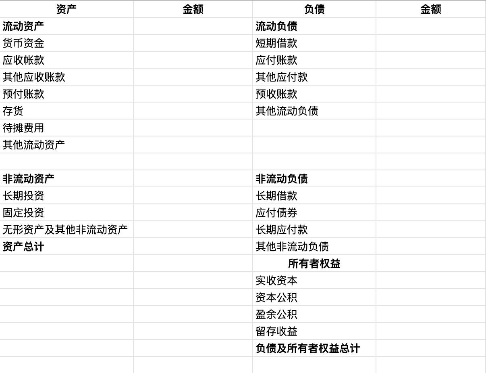

>分析上市公司，首先第一步就是阅读公司的财务报表，本系列文章旨在总结之前阅读的[《一本书读懂财务报表》](https://book.douban.com/subject/25926542/)，加深对书中概念的理解。
<!--more-->
从会计的角度看企业一直都在做的只有三件事：经营、投资和融资。要想创办一个企业首先需要我们手里有钱，然后用手里的钱去买设备，租办公地，招人，开始生产，销售等等，而在现代社会，卖掉商品并不意味着能马上拿到钱，很多时候只是拿到一个收款权利。那么如何确定我们当初的投资是赚钱了还是赔钱呢？这时候就需要一个统计，看我们当初投资的钱变成了什么，它们现在价值如何，是保持原有的价值还是贬值了呢？这个统计，就是**资产负债表**。

## 资产负债表的构成

一张完整的资产负债表如下：

>备注：具体的资产负债表可能会包含更多的项目

可以看到资产负债表主要分左右两部分，即左边的资产和右边的负债、所有者（股东）权益。

**注：**不同的上市地方（例如在港交所和纳斯达克）所披露的财报中的名词可能不同，但是含义相同，具体在实际中对应即可。

## 资产

资产按流动性分为

* 流动资产（Current Assets）：指企业可以在一年或者超过一年的**一个营业周期内**变现或运用的资产。
* 非流动资产（Non-current Assets）：流动资产以外的资产。

它们的差异点在于能否在一个循环之内将自己变为现金。

### 流动资产

资产负债表中的项目按照它们各自**转换成现金的速度**（流动性），从上到下依次是：

* 货币资金（Cash）：包括**库存现金**、**银行存款**和**其他货币资金**三种。
* 应收账款（Accounts Receivable）：核算企业因销售商品、提供劳务等**经营活动**应收取的款项。
* 其他应收账款（Other Receivables）：企业除存出保证金（如租房时交付的未来将退回的保证金、押金等）、买入反售金融资产、应收票据、应收账款、预付账款、应收利息、[应收代位追偿款](https://baike.baidu.com/item/%E5%BA%94%E6%94%B6%E4%BB%A3%E4%BD%8D%E8%BF%BD%E5%81%BF%E6%AC%BE/3711721)、[应收分保账款](https://baike.baidu.com/item/%E5%BA%94%E6%94%B6%E5%88%86%E4%BF%9D%E8%B4%A6%E6%AC%BE)、应收分保合同准备金、长期应收款等以外的其他各种应收及暂收款项。
* 预付账款（Prepaid Accounts）：企业按照合同规定预付的款项。
* 存货（Inventory）：企业在日常生活中持有以备出收的产成品或商品、处在生产过程中的在产品、在生产过程或提供劳务过程中耗用的材料和物料等。
* 待摊费用（Prepaid expenses）：**已支出**但应有**本期和以后各期分别负担**的各项费用。
* 其他流动资产：除以上流动资产外的其他流动资产。

资产和费用之间有一个很大的共同之处就是都得**花钱**。但是区别在于：

* 资产可以换来一个对**将来有用的东西**。
* 费用的钱，花完就完了。

这里重点说一下待摊费用。待摊费用的定义是：**已支出**但应有**本期和以后各期分别负担**的各项费用，该费用包括[低值易耗品摊销](https://baike.baidu.com/item/%E4%BD%8E%E5%80%BC%E6%98%93%E8%80%97%E5%93%81%E6%91%8A%E9%94%80/10097022)、一次支出数额较大的财产保险费、排污费、技术转让费、广告费、固定资产经常修理费、预付租入固定资产的租金等。

从定义可以看出，该费用的本质其实就是**提前交钱（变成资产），然后在后期享受服务（变为费用）**。例如公司花6万买入一批可以使用6个月的办公用品。初始买入后，是公司的一笔资产，随着时间的流逝，办公用品被使用，变成一笔费用，这就是待摊费用。

### 非流动资产

非流动资产包含以下几个项目：

* 长期投资（long-term Investments）：指不满足短期投资条件的投资。即**在一年或长于一年的经营周期内不准备转换为现金的投资**。长期投资按性质分为股票、债券和其他长期投资。
* 固定资产（Fixed Assets）是指同时具有以下特征的**有形资产**：
  * 为生产商品、提供劳务出租或经营管理而持有的；
  * 使用寿命超过一个[会计年度](https://baike.baidu.com/item/%E4%BC%9A%E8%AE%A1%E5%B9%B4%E5%BA%A6/7931699?fr=aladdin)。
* 无形资产（Intangible Assets and Other Assets）：指企业拥有或控制的**没有实物形态的可辨认非货币性资产**。包括专利权、非专利技术、商标权、土地使用权（中国特有）等。

关于非流动资产需要注意几点：

在使用过程中，固定资产会逐渐损耗，它的价值也会随着损耗逐渐降低。描述固定资产的损耗的量就是折旧。**固定资产的折旧（Depreciation）**是指在一定时期内为弥补固定资产损耗按照规定的固定资产折旧率提取的固定资产折旧，或按国民经济核算统一规定的折旧率虚拟计算的固定资产折旧。

在无形资产中，有一项中国特有的，即土地使用权。因为在中国企业或个人**没有土地所有权，只有土地使用权，所以该项是无形资产**。而在其他国家，企业和个人**有土地所有权，这时土地就成为了固定资产**。

### 资产计价

当我们确认一个资产的价值时，默认会想到使用当前该资产的现有价格作为它的价值，但是这样会有一个问题，如何找到当前资产现在的价格？因为很可能你持有的这个资产现在已经不再在市场上售卖，即使在市场上有售卖，价格也可能不客观（大家的报价无法达成一致），所以无法确定其准确的价值。为了准确描述资产的价值，我们用当时购买该资产的价格作为该资产的价值。这就是**历史成本**。

>历史成本/原始成本/实际成本（Historical Cost）：资产在其取得时为它所支付的现金或现金等价物的金额。负债在正常经营活动中为交换而收到的或为偿付将要支付的现金或现金等价物的金额。

按照以上定义，历史成本包含两层含义：

* 只有花了的钱采能记在账上。
* 在历史成本计价体系下，增加资产价值的唯一途径是发生一个新的交易。

那有没有这样一种资产，虽然已经买了很久，但是只要当前提出报价大家都一致认同的资产呢？答案是有的，例如股票这样的金融资产，房地产，因为金融市场非常活跃，所以它的资产价格很容易达到共识。

与历史成本相对的，用当前市场价格来计价的，被称为**公允价值**。

>公允价值/公允市价/公允价格（Fair Value）：熟悉市场情况的买卖双方在公平交易的条件下和自愿的情况下所确定的价格，或无关联的双方在公平交易的条件下一项资产可以被买卖或者一项负债可以被清偿的成交价格。

## 负债

>负债（Liability）：由于过去的交易或事项所引起的公司、企业的现有债务，这种债务需要企业在将来以转移资产或提供劳务加以清偿，从而引起未来经济利益的流出。

### 流动负债

**一年内或者超过一年的一个经营周期内**需要偿还的债务合计，包含以下内容：

* 短期借款（Short-term Borrowing）：企业用来维持正常的生产经营所需的资金或为抵偿某项债务而向银行或其他金融机构等外单位借入的，**还款期限在一年以下或者一年的一个经营周期内**的各种借款。
* 应付账款（Accounts Payable）：企业因购买材料、物资和接受劳务供应等而应该付给供货单位的账款。
* 其他应付账款（Other Payables）：企业除应付票据、应付账款、应付工资、应付利润以外的应付、暂收其他单位或个人的款项。
* 预收账款（Deposit Received）：买卖双方协议商定，由购货方预先支付一部分货款给供应方而发生的一种负债。
* 其他流动负债：为了简化资产负债表，将一些项目合并在一起，统称为“其他”。包括应付工资，应交税金等。

### 非流动负债

偿还期在**一年或超过一年的一个营业周期以上**的债务，包含以下内容：

* 长期借款（Long-term Loans Payable）：：企业从银行或其他金融机构借入的期限在一年以上（不含一年）的借款。
* 应付债券（Bond Payable）：企业为筹集资金而对外发行的期限在一年以上的长期借款性质的书面证明，约定在一定期限内还本付息的一种书面承诺。
* 长期应付款（Long-term Payable）：企业除了长期借款和应付债券以外的**长期负债**。包括应付引进设备款、应付融资租入固定资产的租赁费等。
* 其他非流动负债：除长期借款、应付债券等项目以外的其他非流动负债。

## 股东权益

>股东权益（Shareholder‘s Equity）：公司总资产中扣除债务所余下的那部分，也称净资产。股东权益反应了公司的自有资本。

股东权益包含以下几个部分：

* 股本（Capital Stock）：股东在公司中所占的权益，多用于指股票。
* 资本公积（Addition Paid-in Capital）：企业收到的投资者的**超出其在企业注册资本所占份额**，以及直接记入所有者权益的利得和损失等。资本公积包括资本溢价（股本溢价）和直接记入所有者权益的利得和损失等。
* 盈余公积（Surplus Zeserve）：企业按照规定从净利润中提取的各种积累资金。中国的公司法规定，一个公司有了盈利之后，必须留存至少**10%**作为盈余公积。该项目为中国特有，**其他国家没有这个规定**。
* 未分配利润（Retained Earnings）：企业未作分配的利润。它在以后年度可继续进行分配，**在未进行分配之前，属于所有者权益的组成部分**。

在资产负债表中实收资本/股本。区别在于实收资本对应**有限责任公司**而股本对应**股份有限公司**。

盈余公积是法律不允许分配的利润，而分配利润是企业不想分配的利润。

## 总结

总的来说，资产负债表左边是说钱被用来做什么了，右边是说企业的钱是从哪儿来的。很显然进来的钱和用掉的钱在金额上必须相等，这就意味着资产负债表的左边的资产与右边的负债和股东权益之和相等。即**资产 = 负债 + 股东权益**，这就是所谓的“会计恒等式”。也就是说**股东权益 = 资产 - 负债**。

资产负债表是一个**时间点**的概念，它提供了截止日期那天，公司的财务状况。